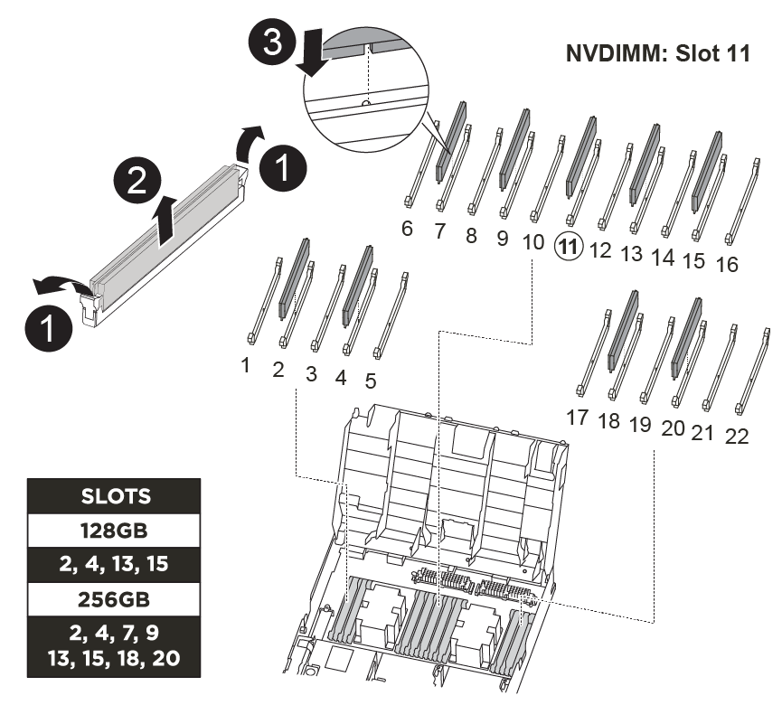

= Paso 1: Apague el controlador dañado
:allow-uri-read: 

Debe sustituir el NVDIMM en el módulo de la controladora cuando el sistema se registre de que la vida útil del flash está casi en un extremo o que el NVDIMM identificado no es correcto en general; de lo contrario, se producirá una alerta en el sistema.

Todos los demás componentes del sistema deben funcionar correctamente; si no es así, debe ponerse en contacto con el soporte técnico.

Debe sustituir el componente con errores por un componente FRU de repuesto que haya recibido de su proveedor.

== Paso 1: Apague el controlador dañado

Apague o retome el controlador dañado siguiendo el procedimiento adecuado para su configuración.

[role="tabbed-block"]
====
.Opción 1: Mayoría de las configuraciones
--
Para apagar el controlador dañado, debe determinar el estado del controlador y, si es necesario, tomar el control para que el controlador sano siga sirviendo datos del almacenamiento del controlador dañado.

.Acerca de esta tarea
* Si dispone de un sistema SAN, debe haber comprobado los mensajes de evento  `cluster kernel-service show`) para el blade SCSI de la controladora dañada.  `cluster kernel-service show`El comando (desde el modo avanzado priv) muestra el nombre del nodo, link:https://docs.netapp.com/us-en/ontap/system-admin/display-nodes-cluster-task.html["estado del quórum"] de ese nodo, el estado de disponibilidad de ese nodo y el estado operativo de ese nodo.
+
Cada proceso SCSI-blade debe quórum con los otros nodos del clúster. Todos los problemas deben resolverse antes de continuar con el reemplazo.

* Si tiene un clúster con más de dos nodos, debe estar en quórum. Si el clúster no tiene quórum o si una controladora en buen estado muestra falso según su condición, debe corregir el problema antes de apagar la controladora dañada; consulte link:https://docs.netapp.com/us-en/ontap/system-admin/synchronize-node-cluster-task.html?q=Quorum["Sincronice un nodo con el clúster"^].

.Pasos
. Si AutoSupport está habilitado, elimine la creación automática de casos invocando un mensaje de AutoSupport:
+
`system node autosupport invoke -node * -type all -message MAINT=<# of hours>h`

+
El siguiente mensaje de AutoSupport suprime la creación automática de casos durante dos horas:

+
`cluster1:> system node autosupport invoke -node * -type all -message MAINT=2h`

. Desactivar devolución automática:
+
.. Ingrese el siguiente comando desde la consola del controlador en buen estado:
+
`storage failover modify -node local -auto-giveback false`

.. Ingresar `y` cuando vea el mensaje "¿Desea desactivar la devolución automática?"

. Lleve la controladora dañada al aviso DEL CARGADOR:
+
[cols="1,2"]
|===
| Si el controlador dañado está mostrando... | Realice lo siguiente... 

 a| 
El aviso del CARGADOR
 a| 
Vaya al paso siguiente.

 a| 
Esperando devolución...
 a| 
Pulse Ctrl-C y, a continuación, responda `y` cuando se le solicite.

 a| 
Solicitud del sistema o solicitud de contraseña
 a| 
Retome o detenga el controlador dañado del controlador en buen estado:

`storage failover takeover -ofnode _impaired_node_name_ -halt _true_`

El parámetro _-halt true_ lleva al símbolo del sistema de Loader.

|===

--
.Opción 2: La controladora está en un MetroCluster de dos nodos
--
Para apagar el controlador dañado, debe determinar el estado del controlador y, si es necesario, cambiar el controlador para que el controlador correcto siga sirviendo datos del almacenamiento del controlador dañado.

.Acerca de esta tarea
* Debe dejar las fuentes de alimentación encendidas al final de este procedimiento para proporcionar alimentación a la controladora en buen estado.

.Pasos
. Compruebe el estado de MetroCluster para determinar si el controlador dañado ha cambiado automáticamente al controlador en buen estado: `metrocluster show`
. En función de si se ha producido una conmutación automática, proceda según la siguiente tabla:
+
[cols="1,2"]
|===
| Si el controlador está dañado... | Realice lo siguiente... 

 a| 
Se ha cambiado automáticamente
 a| 
Continúe con el próximo paso.

 a| 
No se ha cambiado automáticamente
 a| 
Realice una operación de conmutación de sitios planificada desde el controlador en buen estado: `metrocluster switchover`

 a| 
No se ha cambiado automáticamente, ha intentado efectuar una conmutación con el `metrocluster switchover` y se vetó la conmutación
 a| 
Revise los mensajes de veto y, si es posible, resuelva el problema e inténtelo de nuevo. Si no puede resolver el problema, póngase en contacto con el soporte técnico.

|===
. Resincronice los agregados de datos ejecutando el `metrocluster heal -phase aggregates` comando del clúster superviviente.
+
[listing]
----
controller_A_1::> metrocluster heal -phase aggregates
[Job 130] Job succeeded: Heal Aggregates is successful.
----
+
Si la curación es vetada, usted tiene la opción de reemitir el `metrocluster heal` con el `-override-vetoes` parámetro. Si utiliza este parámetro opcional, el sistema anula cualquier vetoo suave que impida la operación de reparación.

. Compruebe que se ha completado la operación con el comando MetroCluster operation show.
+
[listing]
----
controller_A_1::> metrocluster operation show
    Operation: heal-aggregates
      State: successful
Start Time: 7/25/2016 18:45:55
   End Time: 7/25/2016 18:45:56
     Errors: -
----
. Compruebe el estado de los agregados mediante `storage aggregate show` comando.
+
[listing]
----
controller_A_1::> storage aggregate show
Aggregate     Size Available Used% State   #Vols  Nodes            RAID Status
--------- -------- --------- ----- ------- ------ ---------------- ------------
...
aggr_b2    227.1GB   227.1GB    0% online       0 mcc1-a2          raid_dp, mirrored, normal...
----
. Repare los agregados raíz mediante el `metrocluster heal -phase root-aggregates` comando.
+
[listing]
----
mcc1A::> metrocluster heal -phase root-aggregates
[Job 137] Job succeeded: Heal Root Aggregates is successful
----
+
Si la curación es vetada, usted tiene la opción de reemitir el `metrocluster heal` comando con el parámetro -override-vetoes. Si utiliza este parámetro opcional, el sistema anula cualquier vetoo suave que impida la operación de reparación.

. Compruebe que la operación reparar se ha completado mediante el `metrocluster operation show` comando en el clúster de destino:
+
[listing]
----

mcc1A::> metrocluster operation show
  Operation: heal-root-aggregates
      State: successful
 Start Time: 7/29/2016 20:54:41
   End Time: 7/29/2016 20:54:42
     Errors: -
----
. En el módulo del controlador dañado, desconecte las fuentes de alimentación.

--
====

== Paso 2: Extraiga el módulo del controlador

Para acceder a los componentes internos del módulo de controlador, debe extraer el módulo de controlador del chasis.

Puede utilizar las siguientes animaciones, ilustraciones o los pasos escritos para quitar el módulo de la controladora del chasis.

.Animación: Extraiga el módulo del controlador
video::ca74d345-e213-4390-a599-aae10019ec82[panopto]
image::../media/drw_A400_Remove_controller.png[Liberación del módulo del controlador]

[cols="10a,90a"]
|===

 a| 
image:../media/icon_round_1.png["Número de llamada 1"]
 a| 
Pestillos de bloqueo

 a| 
image:../media/icon_round_2.png["Número de llamada 2"]
 a| 
La controladora se mueve ligeramente fuera del chasis

|===
. Si usted no está ya conectado a tierra, correctamente tierra usted mismo.
. Suelte los retenes del cable de alimentación y, a continuación, desenchufe los cables de las fuentes de alimentación.
. Afloje el gancho y la correa de bucle que sujetan los cables al dispositivo de administración de cables y, a continuación, desconecte los cables del sistema y los SFP (si fuera necesario) del módulo del controlador, manteniendo un seguimiento del lugar en el que estaban conectados los cables.
+
Deje los cables en el dispositivo de administración de cables de manera que cuando vuelva a instalar el dispositivo de administración de cables, los cables estén organizados.

. Retire el dispositivo de administración de cables del módulo del controlador y colóquelo aparte.
. Presione los dos pestillos de bloqueo hacia abajo y, a continuación, gire ambos pestillos hacia abajo al mismo tiempo.
+
El módulo de la controladora se mueve ligeramente fuera del chasis.

. Deslice el módulo de la controladora para sacarlo del chasis.
+
Asegúrese de que admite la parte inferior del módulo de la controladora cuando la deslice para sacarlo del chasis.

. Coloque el módulo del controlador sobre una superficie plana y estable.

== Paso 3: Sustituya el NVDIMM

Para sustituir el NVDIMM, debe localizarlo en el módulo de controlador mediante el mapa FRU situado en la parte superior del conducto de aire o el mapa FRU situado en la parte superior del elevador de ranura 1.

* El LED NVDIMM parpadea mientras se separa el contenido cuando se detiene el sistema. Una vez finalizado el destete, el LED se apaga.
* Aunque el contenido del NVDIMM está cifrado, se recomienda borrar el contenido del NVDIMM antes de reemplazarlo. Para obtener más información, consulte https://mysupport.netapp.com/info/web/ECMP1132988.html["Declaración de volatilidad"] En el sitio de soporte de NetApp.
+

NOTE: Debe iniciar sesión en el sitio de soporte de NetApp para mostrar el _Statement of volatile_ de su sistema.

Puede utilizar la animación, la ilustración o los pasos escritos siguientes para sustituir el NVDIMM.

NOTE: La animación muestra ranuras vacías para zócalos sin DIMM. Estos zócalos vacíos se rellenan con espacios en blanco.

.Animación - sustituya el NVDIMM
video::2d407c98-e925-4099-a222-afcf01683d4d[panopto]

[cols="10,90"]
|===

 a| 
image:../media/icon_round_1.png["Número de llamada 1"]
 a| 
Lengüetas de bloqueo DIMM

 a| 
image:../media/icon_round_2.png["Número de llamada 2"]
 a| 
DIMM

 a| 
image:../media/icon_round_3.png["Número de llamada 3"]
 a| 
Toma DIMM

|===
. Abra el conducto de aire y, a continuación, localice el NVDIMM en la ranura 11 del módulo del controlador.
+

NOTE: El NVDIMM tiene un aspecto muy diferente al de los DIMM del sistema.

. Extraiga el NVDIMM de su ranura empujando lentamente las dos lengüetas expulsoras NVDIMM de cada lado del NVDIMM y, a continuación, extraiga el NVDIMM de la toma y colóquelo a un lado.
+

NOTE: Sujete con cuidado el NVDIMM por los bordes para evitar la presión en los componentes de la placa de circuitos NVDIMM.

. Retire el NVDIMM de repuesto de la bolsa de transporte antiestática, sujete el NVDIMM por las esquinas y, a continuación, alinéelo con la ranura.
+
La muesca entre las patillas del NVDIMM debe alinearse con la lengüeta del zócalo.

. Localice la ranura en la que va a instalar el NVDIMM.
. Inserte el NVDIMM directamente en la ranura.
+
El NVDIMM encaja firmemente en la ranura, pero debe entrar fácilmente. Si no es así, realinee el NVDIMM con la ranura y vuelva a insertarlo.

+

NOTE: Inspeccione visualmente el NVDIMM para comprobar que está alineado de forma uniforme y completamente insertado en la ranura.

. Empuje con cuidado, pero firmemente, en el borde superior del NVDIMM hasta que las lengüetas expulsoras encajen en su lugar sobre las muescas de los extremos del NVDIMM.
. Cierre el conducto de aire.

== Paso 4: Instale el módulo del controlador

Después de sustituir el componente en el módulo del controlador, debe volver a instalar el módulo del controlador en el chasis y, a continuación, reiniciarlo en el modo de mantenimiento.

. Si aún no lo ha hecho, cierre el conducto de aire.
. Alinee el extremo del módulo del controlador con la abertura del chasis y, a continuación, empuje suavemente el módulo del controlador hasta la mitad del sistema.
+

NOTE: No inserte completamente el módulo de la controladora en el chasis hasta que se le indique hacerlo.

. Cablee los puertos de gestión y consola de manera que pueda acceder al sistema para realizar las tareas en las secciones siguientes.
+

NOTE: Conectará el resto de los cables al módulo del controlador más adelante en este procedimiento.

. Complete la instalación del módulo del controlador:
+
.. Con los pestillos de bloqueo, empuje firmemente el módulo del controlador en el chasis hasta que los pestillos de bloqueo empiecen a elevarse.
+

NOTE: No ejerza una fuerza excesiva al deslizar el módulo del controlador hacia el chasis para evitar dañar los conectores.

.. Coloque completamente el módulo del controlador en el chasis girando los pestillos de bloqueo hacia arriba, inclinándolos de manera que borren los pasadores de bloqueo, empuje suavemente el controlador hasta que encaje y, a continuación, baje los pestillos de bloqueo a la posición de bloqueo.
.. Conecte los cables de alimentación a las fuentes de alimentación, vuelva a instalar el collar de bloqueo del cable de alimentación y, a continuación, conecte las fuentes de alimentación a la fuente de alimentación.
+
El módulo del controlador comienza a arrancar tan pronto como se restaura la alimentación. Esté preparado para interrumpir el proceso de arranque.

.. Si aún no lo ha hecho, vuelva a instalar el dispositivo de administración de cables.
.. Interrumpa el proceso de arranque normal y arranque en EL CARGADOR pulsando `Ctrl-C`.
+

NOTE: Si el sistema se detiene en el menú de inicio, seleccione la opción para arrancar EN EL CARGADOR.

.. En el aviso del CARGADOR, introduzca `bye` Para reiniciar las tarjetas PCIe y otros componentes.

== Paso 5: Restaure el módulo de la controladora a su funcionamiento

Debe volver a conectar el sistema, devolver el módulo de controladora y, a continuación, volver a habilitar el retorno del control automático.

. Recuperar el sistema, según sea necesario.
+
Si ha quitado los convertidores de medios (QSFP o SFP), recuerde volver a instalarlos si está utilizando cables de fibra óptica.

. Devuelva el funcionamiento normal de la controladora y devuelva su almacenamiento: `storage failover giveback -ofnode _impaired_node_name_`
. Si la devolución automática está desactivada, vuelva a habilitarla: `storage failover modify -node local -auto-giveback true`

== Paso 6: Vuelva a cambiar los agregados en una configuración MetroCluster de dos nodos

Una vez que haya completado el reemplazo de FRU en una configuración de MetroCluster de dos nodos, podrá llevar a cabo la operación de conmutación de estado de MetroCluster. De este modo, la configuración vuelve a su estado operativo normal, con las máquinas virtuales de almacenamiento (SVM) sincronizada en el sitio anteriormente afectado que ahora están activas y sirviendo datos de los pools de discos locales.

Esta tarea solo se aplica a configuraciones MetroCluster de dos nodos.

.Pasos
. Compruebe que todos los nodos estén en el `enabled` provincia: `metrocluster node show`
+
[listing]
----
cluster_B::>  metrocluster node show

DR                           Configuration  DR
Group Cluster Node           State          Mirroring Mode
----- ------- -------------- -------------- --------- --------------------
1     cluster_A
              controller_A_1 configured     enabled   heal roots completed
      cluster_B
              controller_B_1 configured     enabled   waiting for switchback recovery
2 entries were displayed.
----
. Compruebe que la resincronización se haya completado en todas las SVM: `metrocluster vserver show`
. Compruebe que las migraciones LIF automáticas que realizan las operaciones de reparación se han completado correctamente: `metrocluster check lif show`
. Lleve a cabo la conmutación de estado mediante el `metrocluster switchback` comando desde cualquier nodo del clúster superviviente.
. Compruebe que la operación de conmutación de estado ha finalizado: `metrocluster show`
+
La operación de conmutación de estado ya está en ejecución cuando un clúster está en el `waiting-for-switchback` provincia:

+
[listing]
----
cluster_B::> metrocluster show
Cluster              Configuration State    Mode
--------------------	------------------- 	---------
 Local: cluster_B configured       	switchover
Remote: cluster_A configured       	waiting-for-switchback
----
+
La operación de conmutación de estado se completa cuando los clústeres están en el `normal` estado:

+
[listing]
----
cluster_B::> metrocluster show
Cluster              Configuration State    Mode
--------------------	------------------- 	---------
 Local: cluster_B configured      		normal
Remote: cluster_A configured      		normal
----
+
Si una conmutación de regreso tarda mucho tiempo en terminar, puede comprobar el estado de las líneas base en curso utilizando el `metrocluster config-replication resync-status show` comando.

. Restablecer cualquier configuración de SnapMirror o SnapVault.

== Paso 7: Devuelva la pieza que falló a NetApp

Devuelva la pieza que ha fallado a NetApp, como se describe en las instrucciones de RMA que se suministran con el kit. Consulte https://mysupport.netapp.com/site/info/rma["Devolución de piezas y sustituciones"] la página para obtener más información.
