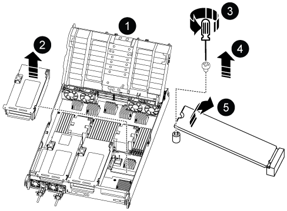

= 
:allow-uri-read: 

El medio de arranque se encuentra dentro del módulo del controlador, debajo del conducto de aire, y se accede a él quitando el módulo del controlador del sistema.

. Si usted no está ya conectado a tierra, correctamente tierra usted mismo.
. Asegúrese de que todas las unidades del chasis estén firmemente asentadas contra el plano medio con los pulgares para empujar cada unidad hasta que sienta una parada positiva.
+
image::../media/drw_a800_drive_seated_IEOPS-960.svg[Unidades de disco de asiento]

. Desconecte las fuentes de alimentación del módulo del controlador de la fuente.
. Suelte los retenes del cable de alimentación y, a continuación, desenchufe los cables de las fuentes de alimentación.
. Afloje el gancho y la correa de bucle que sujetan los cables al dispositivo de administración de cables y, a continuación, desconecte los cables del sistema y los módulos SFP y QSFP (si es necesario) del módulo de controlador, manteniendo un seguimiento del lugar en el que se conectan los cables.
+
Deje los cables en el dispositivo de administración de cables de manera que cuando vuelva a instalar el dispositivo de administración de cables, los cables estén organizados.

. Retire el dispositivo de administración de cables del módulo del controlador y colóquelo aparte.
. Presione los dos pestillos de bloqueo hacia abajo y, a continuación, gire ambos pestillos hacia abajo al mismo tiempo.
+
El módulo de la controladora se mueve ligeramente fuera del chasis.

+
image::../media/drw_a800_pcm_remove.png[Liberación del módulo del controlador]

+
[cols="1,4"]
|===

 a| 
image:../media/icon_round_1.png["Número de llamada 1"]
 a| 
Pestillo de bloqueo

 a| 
image:../media/icon_round_2.png["Número de llamada 2"]
 a| 
Pasador de bloqueo

|===
. Deslice el módulo de la controladora para sacarlo del chasis.
+
Asegúrese de que admite la parte inferior del módulo de la controladora cuando la deslice para sacarlo del chasis.

. Coloque el módulo del controlador sobre una superficie plana y estable y, a continuación, abra el conducto de aire:
+
.. Presione las lengüetas de bloqueo de los lados del conducto de aire hacia el centro del módulo del controlador.
.. Deslice el conducto de aire hacia los módulos del ventilador y gírelo hacia arriba hasta su posición completamente abierta.
+
image::../media/drw_a800_open_air_duct.png[Apertura del conducto de aire]

+
[cols="1,4"]
|===

 a| 
image:../media/icon_round_1.png["Número de llamada 1"]
 a| 
Lengüetas de bloqueo del conducto de aire

 a| 
image:../media/icon_round_2.png["Número de llamada 2"]
 a| 
Deslizar el conducto de aire hacia los módulos de ventilador

 a| 
image:../media/icon_round_3.png["Número de llamada 3"]
 a| 
Girar el conducto de aire hacia los módulos del ventilador

|===

. Ubique el medio de arranque en el módulo del controlador y reemplácelo:
+

+
[cols="1,4"]
|===

 a| 
image:../media/icon_round_1.png["Número de llamada 1"]
 a| 
Conducto de aire

 a| 
image:../media/icon_round_2.png["Número de llamada 2"]
 a| 
Elevador 3

 a| 
image:../media/icon_round_3.png["Número de llamada 3"]
 a| 
Destornillador Phillips número 1

 a| 
image:../media/icon_round_4.png["Número de llamada 4"]
 a| 
Tornillo del soporte del maletero

 a| 
image:../media/icon_round_5.png["Número de llamada 5"]
 a| 
Soporte de arranque

|===
+
.. Con un destornillador Phillips del número 1, retire el tornillo que sujeta el soporte del maletero y coloque el tornillo a un lado en un lugar seguro.
.. Sujetando los lados del soporte de arranque, gire suavemente el soporte de arranque hacia arriba, y luego tire del soporte de arranque directamente del zócalo y colóquelo a un lado.

. Instale el soporte de arranque de repuesto en el módulo del controlador:
+
.. Alinee los bordes del soporte del maletero con el alojamiento del zócalo y, a continuación, empújelo suavemente en el zócalo.
.. Gire el soporte de arranque hacia abajo hacia la placa base.
.. Fije el soporte de arranque a la placa base mediante el tornillo de soporte de arranque.
+
No apriete en exceso el tornillo o podría dañar el soporte del maletero.

. Vuelva a instalar la tarjeta vertical en el módulo de la controladora.
. Cierre el conducto de aire:
+
.. Gire el conducto de aire hacia abajo.
.. Deslice el conducto de aire hacia los elevadores hasta que encaje en su sitio.

. Instale el módulo del controlador:
+
.. Alinee el extremo del módulo del controlador con la abertura en el chasis y luego empuje suavemente el módulo del controlador hasta la mitad dentro del sistema.
.. Vuelva a cablear el módulo del controlador, presione firmemente la manija de la leva para terminar de asentar el módulo del controlador, empuje la manija de la leva a la posición cerrada y luego apriete el tornillo de mariposa.
+
El módulo controlador comienza a arrancar y se detiene en el indicador LOADER.

