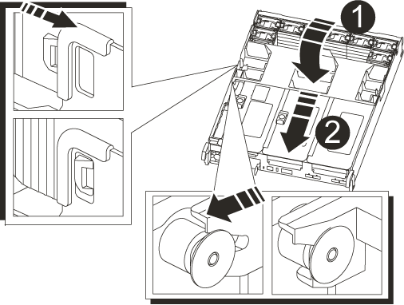

= Paso 1: Apague el controlador dañado
:allow-uri-read: 

Debe sustituir el NVDIMM en el módulo de la controladora cuando el sistema se registre de que la vida útil del flash está casi en un extremo o que el NVDIMM identificado no es correcto en general; de lo contrario, se producirá una alerta en el sistema.

Todos los demás componentes del sistema deben funcionar correctamente; si no es así, debe ponerse en contacto con el soporte técnico.

Debe sustituir el componente con errores por un componente FRU de repuesto que haya recibido de su proveedor.

== Paso 1: Apague el controlador dañado

Para apagar el controlador dañado, debe determinar el estado del controlador y, si es necesario, tomar el control para que el controlador sano siga sirviendo datos del almacenamiento del controlador dañado.

.Acerca de esta tarea
* Si dispone de un sistema SAN, debe haber comprobado los mensajes de evento  `cluster kernel-service show`) para el blade SCSI de la controladora dañada.  `cluster kernel-service show`El comando (desde el modo avanzado priv) muestra el nombre del nodo, el estado del quórum de ese nodo, el estado de disponibilidad de ese nodo y el estado operativo de ese nodo.
+
Cada proceso SCSI-blade debe quórum con los otros nodos del clúster. Todos los problemas deben resolverse antes de continuar con el reemplazo.

* Si tiene un clúster con más de dos nodos, debe estar en quórum. Si el clúster no tiene quórum o si una controladora en buen estado muestra falso según su condición, debe corregir el problema antes de apagar la controladora dañada; consulte link:https://docs.netapp.com/us-en/ontap/system-admin/synchronize-node-cluster-task.html?q=Quorum["Sincronice un nodo con el clúster"^].

.Pasos
. Si AutoSupport está habilitado, suprima la creación automática de casos invocando un mensaje de AutoSupport: `system node autosupport invoke -node * -type all -message MAINT=<# of hours>h`
+
El siguiente mensaje de AutoSupport suprime la creación automática de casos durante dos horas: `cluster1:> system node autosupport invoke -node * -type all -message MAINT=2h`

. Deshabilite la devolución automática de la consola de la controladora en buen estado: `storage failover modify –node local -auto-giveback false`
+

NOTE: Cuando vea _do desea desactivar la devolución automática?_, introduzca `y`.

. Lleve la controladora dañada al aviso DEL CARGADOR:
+
[cols="1,2"]
|===
| Si el controlador dañado está mostrando... | Realice lo siguiente... 

 a| 
El aviso del CARGADOR
 a| 
Vaya al paso siguiente.

 a| 
Esperando devolución...
 a| 
Pulse Ctrl-C y, a continuación, responda `y` cuando se le solicite.

 a| 
Solicitud del sistema o solicitud de contraseña
 a| 
Retome o detenga el controlador dañado del controlador en buen estado: `storage failover takeover -ofnode _impaired_node_name_`

Cuando el controlador dañado muestre esperando devolución..., pulse Ctrl-C y, a continuación, responda `y`.

|===

== Paso 2: Extraiga el módulo del controlador

Debe quitar el módulo de la controladora del chasis cuando sustituya el módulo de la controladora o sustituya un componente dentro del módulo de la controladora.

. Si usted no está ya conectado a tierra, correctamente tierra usted mismo.
. Desconecte las fuentes de alimentación del módulo del controlador de la fuente.
. Suelte los retenes del cable de alimentación y, a continuación, desenchufe los cables de las fuentes de alimentación.
. Afloje el gancho y la correa de bucle que sujetan los cables al dispositivo de administración de cables y, a continuación, desconecte los cables del sistema y los módulos SFP y QSFP (si es necesario) del módulo de controlador, manteniendo un seguimiento del lugar en el que se conectan los cables.
+
Deje los cables en el dispositivo de administración de cables de manera que cuando vuelva a instalar el dispositivo de administración de cables, los cables estén organizados.

. Retire el dispositivo de administración de cables del módulo del controlador y colóquelo aparte.
. Presione los dos pestillos de bloqueo hacia abajo y, a continuación, gire ambos pestillos hacia abajo al mismo tiempo.
+
El módulo de la controladora se mueve ligeramente fuera del chasis.

+
image::../media/drw_a800_pcm_remove.png[Suelte el módulo del controlador]

+
[cols="1,4"]
|===

 a| 
image:../media/legend_icon_01.png["Número de llamada 1"]
 a| 
Pestillo de bloqueo

 a| 
image:../media/legend_icon_02.png["Número de llamada 2"]
 a| 
Pasador de bloqueo

|===
. Deslice el módulo de la controladora para sacarlo del chasis.
+
Asegúrese de que admite la parte inferior del módulo de la controladora cuando la deslice para sacarlo del chasis.

. Coloque el módulo del controlador sobre una superficie plana y estable y, a continuación, abra el conducto de aire:
+
.. Presione las lengüetas de bloqueo de los lados del conducto de aire hacia el centro del módulo del controlador.
.. Deslice el conducto de aire hacia los módulos del ventilador y gírelo hacia arriba hasta su posición completamente abierta.
+
image::../media/drw_a800_open_air_duct.png[Apertura del conducto de aire]

+
[cols="1,4"]
|===

 a| 
image:../media/legend_icon_01.png["Número de llamada 1"]
 a| 
Lengüetas de bloqueo del conducto de aire

 a| 
image:../media/legend_icon_02.png["Número de llamada 2"]
 a| 
Deslizar el conducto de aire hacia los módulos de ventilador

 a| 
image:../media/legend_icon_03.png["Número de llamada 3"]
 a| 
Girar el conducto de aire hacia los módulos del ventilador

|===

== Paso 3: Sustituya el NVDIMM

Para sustituir el NVDIMM, debe localizarlo en el módulo del controlador mediante la etiqueta de mapa de NVDIMM situada en la parte superior del conducto de aire y, a continuación, sustituirlo siguiendo la secuencia específica de pasos.

. Si va a extraer o mover un NVDIMM, desbloquee el pestillo de bloqueo de la tarjeta vertical y, a continuación, extraiga la tarjeta vertical correspondiente.
+
image::../media/drw_A800_nvdimm_replace_ieops-1953.svg[Sustituya un NVDIMM]

+
[cols="1,4"]
|===

 a| 
image:../media/legend_icon_01.png["Número de llamada 1"]
 a| 
Tapa del conducto de aire

 a| 
image:../media/legend_icon_02.png["Número de llamada 2"]
 a| 
Tarjeta vertical 2

 a| 
image:../media/legend_icon_03.png["Número de llamada 3"]
 a| 
NVDIMM en las ranuras 11 y 23

|===
. Tenga en cuenta la orientación del NVDIMM en el zócalo para que pueda insertar el NVDIMM en el módulo de la controladora de repuesto en la orientación adecuada.
. Extraiga el NVDIMM de su ranura empujando lentamente las dos lengüetas expulsoras NVDIMM de cada lado del NVDIMM y, a continuación, extraiga el NVDIMM de la toma y colóquelo a un lado.
+

NOTE: Sujete con cuidado el NVDIMM por los bordes para evitar la presión en los componentes de la placa de circuitos NVDIMM.

. Retire el NVDIMM de repuesto de la bolsa de transporte antiestática, sujete el NVDIMM por las esquinas y, a continuación, alinéelo con la ranura.
+
La muesca entre las patillas del NVDIMM debe alinearse con la lengüeta del zócalo.

. Localice la ranura en la que va a instalar el NVDIMM.
. Inserte el NVDIMM directamente en la ranura.
+
El NVDIMM encaja firmemente en la ranura, pero debe entrar fácilmente. Si no es así, realinee el NVDIMM con la ranura y vuelva a insertarlo.

+

NOTE: Inspeccione visualmente el NVDIMM para comprobar que está alineado de forma uniforme y completamente insertado en la ranura.

. Empuje con cuidado, pero firmemente, en el borde superior del NVDIMM hasta que las lengüetas expulsoras encajen en su lugar sobre las muescas de los extremos del NVDIMM.
. Vuelva a instalar los elevadores que haya extraído del módulo del controlador.
. Cierre el conducto de aire.

== Paso 4: Vuelva a instalar el módulo del controlador e inicie el sistema

Después de sustituir una FRU en el módulo de la controladora, debe volver a instalar el módulo de la controladora y reiniciarlo.

. Si aún no lo ha hecho, cierre el conducto de aire:
+
.. Gire el conducto de aire hacia abajo hasta el módulo del controlador.
.. Deslice el conducto de aire hacia los elevadores hasta que las lengüetas de bloqueo encajen en su lugar.
.. Inspeccione el conducto de aire para asegurarse de que está correctamente asentado y bloqueado en su lugar.
+

+
[cols="1,4"]
|===

 a| 
image:../media/legend_icon_01.png["Número de llamada 1"]
 a| 
Lengüetas de bloqueo

 a| 
image:../media/legend_icon_02.png["Número de llamada 2"]
 a| 
Deslice el émbolo

|===

. Alinee el extremo del módulo del controlador con la abertura del chasis y, a continuación, empuje suavemente el módulo del controlador hasta la mitad del sistema.
+

NOTE: No inserte completamente el módulo de la controladora en el chasis hasta que se le indique hacerlo.

. Recuperar el sistema, según sea necesario.
+
Si ha quitado los convertidores de medios (QSFP o SFP), recuerde volver a instalarlos si está utilizando cables de fibra óptica.

. Conecte el cable de alimentación a la fuente de alimentación, vuelva a instalar el collar de bloqueo del cable de alimentación y, a continuación, conecte la fuente de alimentación.
. Complete la reinstalación del módulo del controlador:
+
.. Empuje firmemente el módulo de la controladora en el chasis hasta que se ajuste al plano medio y esté totalmente asentado.
+
Los pestillos de bloqueo se elevan cuando el módulo del controlador está completamente asentado.

+

NOTE: No ejerza una fuerza excesiva al deslizar el módulo del controlador hacia el chasis para evitar dañar los conectores.

+
El módulo de la controladora comienza a arrancar tan pronto como se asienta completamente en el chasis.

.. Gire los pestillos de bloqueo hacia arriba, inclinándolos para que los pasadores de bloqueo se puedan separar y, a continuación, bajarlos hasta la posición de bloqueo.
.. Si aún no lo ha hecho, vuelva a instalar el dispositivo de administración de cables.

== Paso 4: Devuelva la pieza que falló a NetApp

Devuelva la pieza que ha fallado a NetApp, como se describe en las instrucciones de RMA que se suministran con el kit. Consulte https://mysupport.netapp.com/site/info/rma["Retorno de artículo  sustituciones"] para obtener más información.
