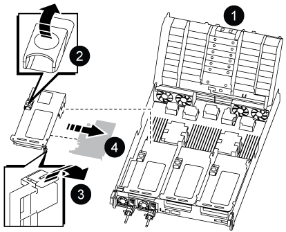
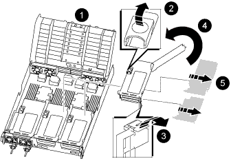

= 
:allow-uri-read: 

.Pasos
. Determine si la tarjeta que está reemplazando es de la tarjeta vertical 1 o si es de la tarjeta vertical 2 ó 3.
+
** Si va a sustituir la tarjeta PCIe 100GbE en la tarjeta vertical 1, utilice los pasos 2 - 3 y 6 - 7.
** Si va a sustituir una tarjeta PCIe de la tarjeta vertical 2 o 3, utilice los pasos 4 a 7.

. Extraiga la tarjeta vertical 1 del módulo del controlador:
+
.. Quite los módulos QSFP que pueden estar en la tarjeta PCIe.
.. Gire el pestillo de bloqueo de la tarjeta vertical en el lado izquierdo de la tarjeta vertical hacia arriba y hacia los módulos de ventilador.
+
La tarjeta vertical se eleva ligeramente del módulo del controlador.

.. Levante la tarjeta vertical, colóquela hacia los ventiladores de forma que el borde de chapa metálica de la tarjeta vertical salga del borde del módulo de la controladora, levante la tarjeta vertical para extraerla del módulo de la controladora y, a continuación, colóquela en una superficie plana y estable.
+

+
[cols="1,4"]
|===

 a| 
image:../media/icon_round_1.png["Número de llamada 1"]
 a| 
Conducto de aire

 a| 
image:../media/icon_round_2.png["Número de llamada 2"]
 a| 
Pestillo de bloqueo de la tarjeta vertical

 a| 
image:../media/icon_round_3.png["Número de llamada 3"]
 a| 
Soporte de bloqueo de la tarjeta

 a| 
image:../media/icon_round_4.png["Número de llamada 4"]
 a| 
Tarjeta «riser» 1 (izquierda) con tarjeta PCIe de 100 GbE en la ranura 1.

|===

. Extraiga la tarjeta PCIe de la tarjeta vertical 1:
+
.. Gire la tarjeta vertical de forma que pueda acceder a la tarjeta PCIe.
.. Presione el soporte de bloqueo del lateral de la tarjeta vertical PCIe y gírelo a la posición abierta.
.. Extraiga la tarjeta PCIe de la tarjeta vertical.

. Extraiga la tarjeta vertical PCIe del módulo de la controladora:
+
.. Quite todos los módulos SFP o QSFP que puedan estar en las tarjetas PCIe.
.. Gire el pestillo de bloqueo de la tarjeta vertical en el lado izquierdo de la tarjeta vertical hacia arriba y hacia los módulos de ventilador.
+
La tarjeta vertical se eleva ligeramente del módulo del controlador.

.. Levante la tarjeta vertical, colóquela hacia los ventiladores de forma que el borde de chapa metálica de la tarjeta vertical salga del borde del módulo de la controladora, levante la tarjeta vertical para extraerla del módulo de la controladora y, a continuación, colóquela en una superficie plana y estable.
+

+
[cols="1,4"]
|===

 a| 
image:../media/icon_round_1.png["Número de llamada 1"]
 a| 
Conducto de aire

 a| 
image:../media/icon_round_2.png["Número de llamada 2"]
 a| 
Pestillo de bloqueo de la tarjeta vertical 2 (tarjeta vertical media) o 3 (tarjeta vertical derecha)

 a| 
image:../media/icon_round_3.png["Número de llamada 3"]
 a| 
Soporte de bloqueo de la tarjeta

 a| 
image:../media/icon_round_4.png["Número de llamada 4"]
 a| 
Panel lateral de la tarjeta vertical 2 ó 3

 a| 
image:../media/icon_round_5.png["Número de llamada 5"]
 a| 
Tarjetas PCIe en tarjeta «riser» 2 o 3

|===

. Extraiga la tarjeta PCIe de la tarjeta vertical:
+
.. Gire la tarjeta vertical de forma que pueda acceder a las tarjetas PCIe.
.. Presione el soporte de bloqueo del lateral de la tarjeta vertical PCIe y gírelo a la posición abierta.
.. Extraiga el panel lateral de la tarjeta vertical.
.. Extraiga la tarjeta PCIe de la tarjeta vertical.

. Instale la tarjeta PCIe en la misma ranura de la tarjeta vertical:
+
.. Alinee la tarjeta con la toma de la tarjeta vertical y, a continuación, deslícela directamente en la toma de la tarjeta vertical.
+

NOTE: Asegúrese de que la tarjeta está completamente asentada en la toma de la tarjeta vertical.

.. Para la tarjeta vertical 2 ó 3, cierre el panel lateral.
.. Gire el pestillo de bloqueo hasta que encaje en la posición de bloqueo.

. Instale la tarjeta vertical en el módulo de la controladora:
+
.. Alinee el reborde de la tarjeta vertical con la parte inferior de la chapa metálica del módulo del controlador.
.. Guíe la tarjeta vertical a lo largo de las patillas del módulo de la controladora y, a continuación, baje la tarjeta vertical al módulo de la controladora.
.. Gire el pestillo de bloqueo hacia abajo y haga clic en él hasta la posición de bloqueo.
+
Cuando está bloqueado, el pestillo de bloqueo está alineado con la parte superior de la tarjeta vertical y la tarjeta vertical se asienta directamente en el módulo del controlador.

.. Vuelva a insertar todos los módulos SFP que se hayan extraído de las tarjetas PCIe.

