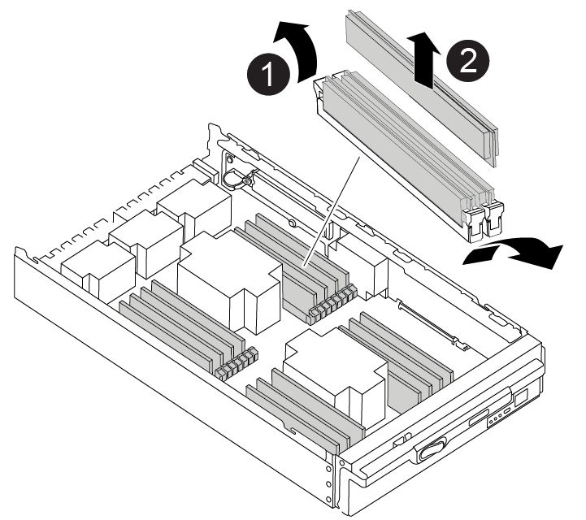

= Paso 1: Extraiga el módulo del controlador
:allow-uri-read: 

Para sustituir el hardware del módulo de la controladora, debe retirar la controladora dañada, mover los componentes de FRU al módulo de la controladora de reemplazo, instalar el módulo de la controladora de reemplazo en el chasis y, a continuación, arrancar el sistema en modo de mantenimiento.

La siguiente animación muestra todo el proceso de movimiento de componentes desde el controlador dañado al controlador de recambio.

.Animación: Mueva los componentes al controlador de sustitución
video::30337552-b10f-4146-9bdb-adf2000df5bd[panopto]

== Paso 1: Extraiga el módulo del controlador

Para acceder a los componentes del interior del controlador, primero debe extraer el módulo del controlador del sistema y, a continuación, retirar la cubierta del módulo del controlador.

. Si usted no está ya conectado a tierra, correctamente tierra usted mismo.
. Desenchufe los cables del módulo del controlador dañado y haga un seguimiento de dónde se conectaron los cables.
. Deslice el botón terra cotta del asa de la leva hacia abajo hasta que se desbloquee.
+
.Animación: Retire el controlador
video::256721fd-4c2e-40b3-841a-adf2000df5fa[panopto]
+
image::../media/drw_a900_remove_PCM.png[Suelte el controlador]

+
[cols="1,4"]
|===

 a| 
image:../media/legend_icon_01.png["Número de llamada 1"]
 a| 
Botón de liberación de la palanca de leva

 a| 
image:../media/legend_icon_02.png["Número de llamada 2"]
 a| 
Mango de leva

|===
. Gire el asa de leva para que desacople completamente el módulo del controlador del chasis y, a continuación, deslice el módulo del controlador para sacarlo del chasis.
+
Asegúrese de que admite la parte inferior del módulo de la controladora cuando la deslice para sacarlo del chasis.

. Coloque el lado de la tapa del módulo del controlador hacia arriba sobre una superficie plana y estable, pulse el botón azul de la cubierta, deslice la cubierta hacia la parte posterior del módulo del controlador y, a continuación, gire la cubierta hacia arriba y levántela fuera del módulo del controlador.
+
image::../media/drw_a900_PCM_open.png[Levante la cubierta del módulo del controlador]

[cols="1,4"]
|===

 a| 
image:../media/legend_icon_01.png["Número de llamada 1"]
 a| 
Botón de bloqueo de la cubierta del módulo del controlador

|===

== Paso 2: Mueva el soporte de arranque

Debe localizar el medio de arranque y seguir las instrucciones para quitarlo de la controladora anterior e insertarlo en la nueva controladora.

. Localice el medio de arranque con la siguiente ilustración o el mapa de FRU en el módulo de la controladora:
+
image::../media/drw_a900_remove_boot_dev.png[Retire el soporte de arranque]

+
[cols="1,4"]
|===

 a| 
image:../media/legend_icon_01.png["Número de llamada 1"]
 a| 
Presione la lengüeta de liberación

 a| 
image:../media/legend_icon_02.png["Número de llamada 2"]
 a| 
Soporte de arranque

|===
. Pulse el botón azul de la carcasa del soporte de arranque para liberar el soporte de arranque de su carcasa y, a continuación, tire suavemente de él hacia fuera del zócalo del soporte de arranque.
+

NOTE: No gire ni tire del soporte de arranque en línea recta, ya que podría dañar la toma o el soporte de arranque.

. Mueva el soporte del maletero al nuevo módulo del controlador, alinee los bordes del soporte del maletero con el alojamiento del zócalo y, a continuación, empújelo suavemente en el zócalo.
. Compruebe el soporte del maletero para asegurarse de que está asentado completamente en la toma.
+
Si es necesario, extraiga el soporte de arranque y vuelva a colocarlo en la toma.

. Empuje el soporte del maletero hacia abajo para activar el botón de bloqueo en la carcasa del soporte del maletero.

== Paso 3: Mueva los DIMM del sistema

Para mover los DIMM, búsquelos y muévalos de la controladora antigua a la controladora de reemplazo y siga la secuencia específica de pasos.

NOTE: El controlador ver2 tiene menos sockets DIMM. No hay reducción en el número de módulos DIMM admitidos ni cambio en la numeración del socket DIMM. Al mover los módulos DIMM al nuevo módulo del controlador, instale los módulos DIMM en el mismo número/ubicación de socket que el módulo del controlador dañado.  Consulte el diagrama de asignación de FRU en el módulo de la controladora ver2 para ver la ubicación de los sockets DIMM.

. Si usted no está ya conectado a tierra, correctamente tierra usted mismo.
. Localice los DIMM en el módulo del controlador.
. Tenga en cuenta la orientación del DIMM en el socket para poder insertar el DIMM en el módulo de controlador de reemplazo en la orientación adecuada.
. Extraiga el DIMM de su ranura empujando lentamente las dos lengüetas expulsoras del DIMM a ambos lados del DIMM y, a continuación, extraiga el DIMM de la ranura.
+

IMPORTANT: Sujete con cuidado el módulo DIMM por los bordes para evitar la presión sobre los componentes de la placa de circuitos DIMM.

+

+
[cols="1,4"]
|===

 a| 
image:../media/legend_icon_01.png["Número de llamada 1"]
 a| 
Lengüetas del expulsor de DIMM

 a| 
image:../media/legend_icon_02.png["Número de llamada 2"]
 a| 
DIMM

|===
. Localice la ranura en la que está instalando el DIMM.
. Asegúrese de que las lengüetas del expulsor DIMM del conector están en posición abierta y, a continuación, inserte el DIMM directamente en la ranura.
+
El módulo DIMM encaja firmemente en la ranura, pero debe entrar fácilmente. Si no es así, realinee el DIMM con la ranura y vuelva a insertarlo.

+

IMPORTANT: Inspeccione visualmente el módulo DIMM para comprobar que está alineado de forma uniforme y completamente insertado en la ranura.

. Inserte el módulo DIMM directamente en la ranura.
+
El módulo DIMM encaja firmemente en la ranura, pero debe entrar fácilmente. Si no es así, realinee el DIMM con la ranura y vuelva a insertarlo.

+

IMPORTANT: Inspeccione visualmente el módulo DIMM para comprobar que está alineado de forma uniforme y completamente insertado en la ranura.

. Empuje con cuidado, pero firmemente, en el borde superior del DIMM hasta que las lengüetas expulsoras encajen en su lugar sobre las muescas de los extremos del DIMM.
. Repita estos pasos para los módulos DIMM restantes.

== Paso 4: Instale la controladora

Después de instalar los componentes en el módulo de controlador de repuesto, debe instalar el módulo de controlador de repuesto en el chasis del sistema e iniciar el sistema operativo.

Para los pares de alta disponibilidad con dos módulos de controladora en el mismo chasis, la secuencia en la que se instala el módulo de controladora es especialmente importante porque intenta reiniciarse tan pronto como lo coloca por completo en el chasis.

NOTE: El sistema puede actualizar el firmware del sistema cuando arranca. No cancele este proceso. El procedimiento le obliga a interrumpir el proceso de arranque, que normalmente puede hacer en cualquier momento después de que se le solicite que lo haga. Sin embargo, si el sistema actualiza el firmware del sistema cuando arranca, debe esperar hasta que se haya completado la actualización antes de interrumpir el proceso de arranque.

. Si usted no está ya conectado a tierra, correctamente tierra usted mismo.
. Si aún no lo ha hecho, vuelva a colocar la cubierta del módulo del controlador.
. Alinee el extremo del módulo del controlador con la abertura del chasis y, a continuación, empuje suavemente el módulo del controlador hasta la mitad del sistema.
+
.Animación: Instalar el controlador
video::099237f3-d7f2-4749-86e2-adf2000df53c[panopto]
+
image::../media/drw_a900_remove_PCM.png[Suelte el controlador]

+
[cols="1,4"]
|===

 a| 
image:../media/legend_icon_01.png["Número de llamada 1"]
 a| 
Botón de liberación de la palanca de leva

 a| 
image:../media/legend_icon_02.png["Número de llamada 2"]
 a| 
Mango de leva

|===
+

NOTE: No inserte completamente el módulo de la controladora en el chasis hasta que se le indique hacerlo.

. Cablee los puertos de gestión y consola de manera que pueda acceder al sistema para realizar las tareas en las secciones siguientes.
+

NOTE: Conectará el resto de los cables al módulo del controlador más adelante en este procedimiento.

. Complete la reinstalación del módulo del controlador:
+
.. Si aún no lo ha hecho, vuelva a instalar el dispositivo de administración de cables.
.. Empuje firmemente el módulo de la controladora en el chasis hasta que se ajuste al plano medio y esté totalmente asentado.
+

IMPORTANT: No ejerza una fuerza excesiva al deslizar el módulo del controlador hacia el chasis para evitar dañar los conectores.

+
El módulo de la controladora comienza a arrancar tan pronto como se asienta completamente en el chasis. Esté preparado para interrumpir el proceso de arranque.

.. Gire la palanca de leva del módulo del controlador a la posición de bloqueo.
.. Para interrumpir el proceso de arranque, pulse `Ctrl-C` Cuando vea Pulse Ctrl-C para el menú de inicio.
.. Seleccione la opción para arrancar EN EL CARGADOR.

