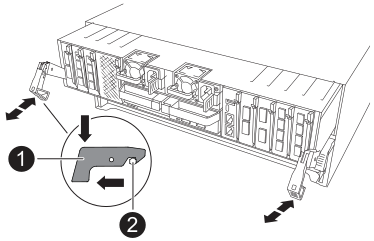

= Paso 1: Apague el controlador dañado
:allow-uri-read: 

.Antes de empezar
* Todos los demás componentes del sistema deben funcionar correctamente; si no es así, debe ponerse en contacto con el soporte técnico.
* Debe sustituir el componente con errores por un componente FRU de repuesto que haya recibido de su proveedor.

== Paso 1: Apague el controlador dañado

Apague o tome el control de la controladora dañada.

Para apagar el controlador dañado, debe determinar el estado del controlador y, si es necesario, tomar el control para que el controlador sano siga sirviendo datos del almacenamiento del controlador dañado.

.Acerca de esta tarea
* Si dispone de un sistema SAN, debe haber comprobado los mensajes de evento  `cluster kernel-service show`) para el blade SCSI de la controladora dañada.  `cluster kernel-service show`El comando (desde el modo avanzado priv) muestra el nombre del nodo, link:https://docs.netapp.com/us-en/ontap/system-admin/display-nodes-cluster-task.html["estado del quórum"] de ese nodo, el estado de disponibilidad de ese nodo y el estado operativo de ese nodo.
+
Cada proceso SCSI-blade debe quórum con los otros nodos del clúster. Todos los problemas deben resolverse antes de continuar con el reemplazo.

* Si tiene un clúster con más de dos nodos, debe estar en quórum. Si el clúster no tiene quórum o si una controladora en buen estado muestra falso según su condición, debe corregir el problema antes de apagar la controladora dañada; consulte link:https://docs.netapp.com/us-en/ontap/system-admin/synchronize-node-cluster-task.html?q=Quorum["Sincronice un nodo con el clúster"^].

.Pasos
. Si AutoSupport está habilitado, elimine la creación automática de casos invocando un mensaje de AutoSupport:
+
`system node autosupport invoke -node * -type all -message MAINT=<# of hours>h`

+
El siguiente mensaje de AutoSupport suprime la creación automática de casos durante dos horas:

+
`cluster1:> system node autosupport invoke -node * -type all -message MAINT=2h`

. Deshabilite la devolución automática de la consola de la controladora en buen estado:
+
`storage failover modify -node local -auto-giveback false`

+

NOTE: Cuando vea _do desea desactivar la devolución automática?_, introduzca `y`.

. Lleve la controladora dañada al aviso DEL CARGADOR:
+
[cols="1,2"]
|===
| Si el controlador dañado está mostrando... | Realice lo siguiente... 

 a| 
El aviso del CARGADOR
 a| 
Vaya al paso siguiente.

 a| 
Esperando devolución...
 a| 
Pulse Ctrl-C y, a continuación, responda `y` cuando se le solicite.

 a| 
Solicitud del sistema o solicitud de contraseña
 a| 
Retome o detenga el controlador dañado del controlador en buen estado:

`storage failover takeover -ofnode _impaired_node_name_ -halt _true_`

El parámetro _-halt true_ lleva al símbolo del sistema de Loader.

|===

== Paso 2: Extraiga el módulo del controlador

Debe quitar el módulo de la controladora del chasis cuando sustituya el módulo de la controladora o sustituya un componente dentro del módulo de la controladora.

. Asegúrese de que todas las unidades del chasis estén firmemente asentadas contra el plano medio con los pulgares para empujar cada unidad hasta que sienta una parada positiva.
+
image::../media/drw_a800_drive_seated_IEOPS-960.svg[Unidades de disco de asiento]

. Compruebe que el LED de estado situado en la ranura 4/5 de la parte posterior del módulo del controlador defectuoso está apagado. Busque el icono de NV.
+
image::../media/drw_a1K-70-90_nvram-led_ieops-1463.svg[Gráfico de ubicación del LED de estado y atención de NVRAM]

+
[cols="1,4"]
|===

 a| 
image:../media/icon_round_1.png["Número de llamada 1"]
 a| 
LED de estado de NVRAM

 a| 
image:../media/icon_round_2.png["Número de llamada 2"]
 a| 
LED de alerta de NVRAM

|===
+
** Si el LED NV está apagado, vaya al siguiente paso.
** Si el LED NV parpadea, espere a que el parpadeo se detenga. Si el parpadeo continúa durante más de 5 minutos, póngase en contacto con el servicio de asistencia técnica para obtener ayuda.

. Si usted no está ya conectado a tierra, correctamente tierra usted mismo.
. Desconecte los cables de la fuente de alimentación del módulo del controlador de las fuentes de alimentación (PSU) del módulo del controlador.
+

NOTE: Si el sistema tiene alimentación de CC, desconecte el bloque de alimentación de las PSU.

. Desconecte los cables del sistema y los módulos SFP y QSFP (si es necesario) del módulo del controlador, realizando un seguimiento de dónde se conectaron los cables.
+
Deje los cables en el dispositivo de administración de cables de manera que cuando vuelva a instalar el dispositivo de administración de cables, los cables estén organizados.

. Retire el dispositivo de gestión de cables del módulo del controlador.
. Presione los dos pestillos de bloqueo hacia abajo y, a continuación, gire ambos pestillos hacia abajo al mismo tiempo.
+
El módulo de la controladora se mueve ligeramente fuera del chasis.

+

+
[cols="1,4"]
|===

 a| 
image:../media/icon_round_1.png["Número de llamada 1"]
 a| 
Pestillo de bloqueo

 a| 
image:../media/icon_round_2.png["Número de llamada 2"]
 a| 
Pasador de bloqueo

|===
. Deslice el módulo del controlador fuera del chasis y colóquelo sobre una superficie plana y estable.
+
Asegúrese de que admite la parte inferior del módulo de la controladora cuando la deslice para sacarlo del chasis.

== Paso 3: Sustituya un DIMM

Para sustituir los DIMM, búsquelos dentro del controlador y siga la secuencia específica de pasos.

. Si usted no está ya conectado a tierra, correctamente tierra usted mismo.
. Abra el conducto de aire del controlador en la parte superior del controlador.
+
.. Inserte los dedos en los huecos de los extremos del conducto de aire.
.. Levante el conducto de aire y gírelo hacia arriba hasta el tope.

. Localice los DIMM en el módulo del controlador e identifique el DIMM de destino.
+
Utilice la asignación de FRU en el conducto de aire de la controladora para localizar la ranura DIMM.

. Extraiga el DIMM de su ranura empujando lentamente las dos lengüetas expulsoras del DIMM a ambos lados del DIMM y, a continuación, extraiga el DIMM de la ranura.
+

IMPORTANT: Sujete con cuidado el módulo DIMM por los bordes para evitar la presión sobre los componentes de la placa de circuitos DIMM.

+
image::../media/drw_a70_90_dimm_ieops-1513.svg[Sustitución de DIMM]

+
[cols="1,4"]
|===

 a| 
image:../media/icon_round_1.png["Número de llamada 1"]
 a| 
Lengüetas del expulsor de DIMM y DIMM

|===
. Retire el módulo DIMM de repuesto de la bolsa de transporte antiestática, sujete el módulo DIMM por las esquinas y alinéelo con la ranura.
+
La muesca entre las patillas del DIMM debe alinearse con la lengüeta del zócalo.

. Asegúrese de que las lengüetas del expulsor DIMM del conector están en posición abierta y, a continuación, inserte el DIMM directamente en la ranura.
+
El módulo DIMM encaja firmemente en la ranura, pero debe entrar fácilmente. Si no es así, realinee el DIMM con la ranura y vuelva a insertarlo.

+

IMPORTANT: Inspeccione visualmente el módulo DIMM para comprobar que está alineado de forma uniforme y completamente insertado en la ranura.

. Empuje con cuidado, pero firmemente, en el borde superior del DIMM hasta que las lengüetas expulsoras encajen en su lugar sobre las muescas de los extremos del DIMM.
. Cierre el conducto de aire del controlador.

== Paso 4: Vuelva a instalar el módulo del controlador

Vuelva a instalar el módulo del controlador y reinícielo.

. Asegúrese de que el conducto de aire esté completamente cerrado girándolo hacia abajo hasta el tope.
+
Debe quedar a ras de la chapa metálica del módulo del controlador.

. Alinee el extremo del módulo del controlador con la abertura del chasis y, a continuación, empuje suavemente el módulo del controlador hasta la mitad del sistema.
+

NOTE: No inserte completamente el módulo de la controladora en el chasis hasta que se le indique hacerlo.

. Vuelva a conectar el sistema de almacenamiento, según sea necesario.
+
Si ha quitado los transceptores (QSFP o SFP), recuerde reinstalarlos si utiliza cables de fibra óptica.

+

NOTE: Asegúrese de que el cable de la consola está conectado al módulo del controlador reparado para que reciba mensajes de la consola cuando se reinicie. La controladora reparada recibe alimentación de la controladora en buen estado y comienza a reiniciarse tan pronto como se coloca completamente en el chasis.

. Complete la reinstalación del módulo del controlador:
+
.. Empuje firmemente el módulo de la controladora en el chasis hasta que se ajuste al plano medio y esté totalmente asentado.
+
Los pestillos de bloqueo se elevan cuando el módulo del controlador está completamente asentado.

+

NOTE: No ejerza una fuerza excesiva al deslizar el módulo del controlador hacia el chasis para evitar dañar los conectores.

.. Gire los pestillos de bloqueo hacia arriba hasta la posición de bloqueo.

+

NOTE: Si la controladora arranca en el símbolo del SISTEMA DE Loader, reiníciela con `boot_ontap` el comando.

. Conecte los cables de alimentación en las fuentes de alimentación.
+

NOTE: Si dispone de fuentes de alimentación de CC, vuelva a conectar el bloque de alimentación a las fuentes de alimentación después de que el módulo del controlador esté completamente asentado en el chasis.

. Devuelva el controlador deteriorado al funcionamiento normal devolviendo su almacenamiento: `storage failover giveback -ofnode _impaired_node_name_`.
. Si se ha desactivado la devolución automática, vuelva a activarla `storage failover modify -node local -auto-giveback true`: .
. Si AutoSupport está activado, restaurar/desactivar la supresión de la creación automática de casos `system node autosupport invoke -node * -type all -message MAINT=END`: .

== Paso 5: Devuelva la pieza que falló a NetApp

Devuelva la pieza que ha fallado a NetApp, como se describe en las instrucciones de RMA que se suministran con el kit. Consulte https://mysupport.netapp.com/site/info/rma["Devolución de piezas y sustituciones"] la página para obtener más información.
