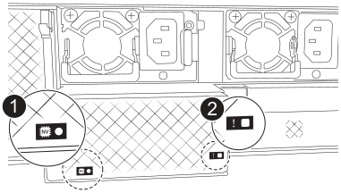
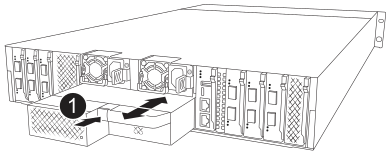

= Paso 1: Apague el controlador dañado
:allow-uri-read: 

El módulo NVRAM12-EX está compuesto por el hardware NVRAM12 y DIMMs sustituibles en campo. Puedes reemplazar un módulo NVRAM12-EX defectuoso, los DIMMs o la batería NVRAM que está dentro del módulo NVRAM12-EX.

.Antes de empezar
* Asegúrese de tener la pieza de repuesto disponible. Debe sustituir el componente con errores con un componente de reemplazo que haya recibido de NetApp.
* Asegúrese de que el resto de los componentes del sistema de almacenamiento funcionan correctamente; de lo contrario, póngase en contacto con https://support.netapp.com["Soporte de NetApp"].
+

NOTE: Antes de sustituir el módulo NVRAM12-EX, asegúrate de apagar el controlador defectuoso antes de proceder con la sustitución.

== Paso 1: Apague el controlador dañado

Apague o tome el control de la controladora dañada.

Toma el control y detén el controlador dañado para que el controlador sano continúe sirviendo datos desde el almacenamiento del controlador dañado. Para hacer esto, suprimes la creación automática de casos en AutoSupport, deshabilitas la devolución automática y llevas el controlador dañado al prompt LOADER. El prompt LOADER es el estado detenido seguro desde el cual puedes reemplazar la FRU.

.Acerca de esta tarea
* Si tiene un clúster con más de cuatro nodos, debe estar en quórum.  Para ver información del clúster sobre sus nodos, utilice el `cluster show` dominio.  Para obtener más información sobre el `cluster show` comando, verlink:https://docs.netapp.com/us-en/ontap/system-admin/display-nodes-cluster-task.html["Ver detalles a nivel de nodo en un clúster ONTAP"^] .
* Si el clúster no está en quórum o si el estado o la elegibilidad de cualquier controlador (excepto el controlador dañado) se muestra como falso, debe corregir el problema antes de apagar el controlador dañado. Ver link:https://docs.netapp.com/us-en/ontap/system-admin/synchronize-node-cluster-task.html?q=Quorum["Sincronice un nodo con el clúster"^] .

.Pasos
. Si AutoSupport está habilitado, elimine la creación automática de casos invocando un mensaje de AutoSupport:
+
`system node autosupport invoke -node * -type all -message MAINT=<# of hours>h`

+
El siguiente mensaje de AutoSupport suprime la creación automática de casos durante dos horas:

+
`cluster1:> system node autosupport invoke -node * -type all -message MAINT=2h`

. Deshabilitar la devolución automática desde la consola del controlador dañado:
+
`storage failover modify -node impaired-node -auto-giveback-of false`

+

NOTE: Cuando veas _¿Quieres desactivar la devolución automática?_, escribe `y` .

. Lleve la controladora dañada al aviso DEL CARGADOR:
+
[cols="1,2"]
|===
| Si el controlador dañado está mostrando... | Realice lo siguiente... 

 a| 
El aviso del CARGADOR
 a| 
Vaya al paso siguiente.

 a| 
Solicitud del sistema o solicitud de contraseña
 a| 
Tomar el control o detener el controlador dañado desde el controlador sano:
`storage failover takeover -ofnode _impaired_node_name_ -halt _true_`

El parámetro _-halt true_ lleva el nodo dañado al indicador LOADER.

|===

== Paso 2: Sustituye el módulo NVRAM12-EX, el DIMM de NVRAM o la batería de NVRAM

Reemplaza el módulo NVRAM12-EX, los DIMM de NVRAM o la batería de NVRAM usando las siguientes opciones.

Cuando sustituya el módulo de controlador o sustituya uno de los componentes del módulo de controlador, debe quitar el módulo de controlador del compartimento.

[role="tabbed-block"]
====
.Opción 1: reemplazar el módulo NVRAM12-EX
--
Para sustituir el módulo NVRAM12-EX, localízalo en la ranura 6/7 de la carcasa y sigue la secuencia específica de pasos.

. Comprueba el LED de estado de la NVRAM situado en la ranura 4/5 y el de la NVRAM12-EX en la ranura 6/7 del sistema. También hay un LED de la NVRAM en el panel frontal del módulo controlador. Busca el icono NV:
+
image::../media/drw_a1K-70-90_nvram-led_ieops-1463.svg[Gráfico de ubicación del LED de estado y atención de NVRAM]

+
[cols="1,4"]
|===

2+| *NVRAM* 

 a| 
image:../media/icon_round_1.png["Número de llamada 1"]
 a| 
LED de estado de NVRAM

 a| 
image:../media/icon_round_2.png["Número de llamada 2"]
 a| 
LED de alerta de NVRAM

|===
+

+
[cols="1,4"]
|===

2+| *NVRAM12-EX* 

 a| 
image:../media/icon_round_1.png["Número de llamada 1"]
 a| 
LED de estado de NVRAM12-EX

 a| 
image:../media/icon_round_2.png["Número de llamada 2"]
 a| 
LED de atención de NVRAM12-EX

|===
+
** Si el LED NV está apagado, vaya al siguiente paso.
** Si el LED NV parpadea, espere a que el parpadeo se detenga. Si el parpadeo continúa durante más de 5 minutos, póngase en contacto con el servicio de asistencia técnica para obtener ayuda.

. Si usted no está ya conectado a tierra, correctamente tierra usted mismo.
. Desconecte los cables de alimentación de las fuentes de alimentación del controlador.
. Gire la bandeja de gestión de cables hacia abajo tirando suavemente de las clavijas de los extremos de la bandeja y girando la bandeja hacia abajo.
. Retira el módulo NVRAM12-EX defectuoso de la carcasa:
+
.. Pulsa el botón de la leva de bloqueo.
.. Retira el módulo NVRAM12-EX defectuoso de la carcasa tirando del módulo hacia fuera de la carcasa.
+

+
[cols="1,4"]
|===

 a| 
image:../media/icon_round_1.png["Número de llamada 1"]
| Botón de bloqueo de leva 
|===

. Coloca el módulo NVRAM12-EX sobre una superficie estable.
. Abre la tapa del módulo NVRAM12-EX usando los dedos o un destornillador para aflojar el único tornillo de mariposa de la tapa y luego levanta la tapa para retirarla del módulo.
+
image::../media/drw_afx_emr_nv12l_remove_cover_ieops-2929.svg[Retira la tapa del NVRAM12-EX]

+
[cols="1,4"]
|===

 a| 
image:../media/icon_round_1.png["Número de llamada 1"]
| Tornillo de mariposa para la tapa de NVRAM12-EX 
|===
. Retira los DIMM, uno por uno, del módulo NVRAM12-EX defectuoso e instálalos en el módulo NVRAM12-EX de recambio.
+
image::../media/drw_afx_emr_nv12l_remove_dimms_ieops-2883.svg[Retira los módulos DIMM NVRAM12-EX]

+
[cols="1,4"]
|===

 a| 
image:../media/icon_round_1.png["Número de llamada 1"]
| Lengüetas de bloqueo DIMM 
|===
. Desconecta la batería del módulo NVRAM12-EX:
+
.. Aprieta el clip en la parte frontal del conector de la batería para soltar el conector de la toma.
.. Desconecte el cable de la batería de la toma.

. Retira la batería desconectada levantándola para sacarla del módulo.
+
image::../media/drw_afx_emr_nv12l_remove_battery_ieops-2919.svg[Retira la batería NVRAM12-EX]

+
[cols="1,4"]
|===

 a| 
image:../media/icon_round_1.png["Número de llamada 1"]
| Clip de conexión de batería NVRAM12-EX 
|===
. Instala la batería en el módulo de recambio NVRAM12-EX:
+
.. Enchufa el conector de la batería en la toma y asegúrate de que el enchufe quede bien encajado.
.. Inserte la batería en la ranura y presione firmemente la batería para asegurarse de que está bloqueada en su lugar.

. Instala la tapa del módulo NVRAM12-EX alineando la tapa con el orificio del tornillo y asegurando la tapa con el tornillo de mariposa.
. Instala el módulo NVRAM12-EX de recambio en la carcasa:
+
.. Alinea el módulo con los bordes de la abertura de la carcasa en la ranura 6/7.
.. Desliza con cuidado el módulo en la ranura hasta el fondo para fijarlo en su sitio.

. Gire la bandeja de gestión de cables hasta la posición cerrada.

--
.Opción 2: Sustituya el módulo DIMM de NVRAM
--
Para sustituir los módulos DIMM de NVRAM en el módulo NVRAM12-EX, debes extraer el módulo NVRAM12-EX y luego sustituir el DIMM en cuestión.

. Comprueba el LED de estado de la NVRAM situado en la ranura 4/5 y el de la NVRAM12-EX en la ranura 6/7 del sistema. También hay un LED de la NVRAM en el panel frontal del módulo controlador. Busca el icono NV:
+
image::../media/drw_a1K-70-90_nvram-led_ieops-1463.svg[Gráfico de ubicación del LED de estado y atención de NVRAM]

+
[cols="1,4"]
|===

2+| *NVRAM* 

 a| 
image:../media/icon_round_1.png["Número de llamada 1"]
 a| 
LED de estado de NVRAM

 a| 
image:../media/icon_round_2.png["Número de llamada 2"]
 a| 
LED de alerta de NVRAM

|===
+

+
[cols="1,4"]
|===

2+| *NVRAM12-EX* 

 a| 
image:../media/icon_round_1.png["Número de llamada 1"]
 a| 
LED de estado de NVRAM12-EX

 a| 
image:../media/icon_round_2.png["Número de llamada 2"]
 a| 
LED de atención de NVRAM12-EX

|===
+
** Si el LED NV está apagado, vaya al siguiente paso.
** Si el LED NV parpadea, espere a que el parpadeo se detenga. Si el parpadeo continúa durante más de 5 minutos, póngase en contacto con el servicio de asistencia técnica para obtener ayuda.

. Si usted no está ya conectado a tierra, correctamente tierra usted mismo.
. Desconecte los cables de alimentación de las fuentes de alimentación.
. Gire la bandeja de gestión de cables hacia abajo tirando suavemente de las clavijas de los extremos de la bandeja y girando la bandeja hacia abajo.
. Retira el módulo NVRAM12-EX de la carcasa:
+
.. Pulsa el botón de la leva de bloqueo.
.. Retira el módulo NVRAM12-EX defectuoso de la carcasa tirando del módulo hacia fuera de la carcasa.
+

+
[cols="1,4"]
|===

 a| 
image:../media/icon_round_1.png["Número de llamada 1"]
| Botón de bloqueo de leva 
|===

. Coloca el módulo NVRAM12-EX sobre una superficie estable.
. Abre la tapa del módulo NVRAM12-EX usando los dedos o un destornillador para aflojar el único tornillo de mariposa de la tapa y luego levanta la tapa para retirarla del módulo.
+
image::../media/drw_afx_emr_nv12l_remove_cover_ieops-2929.svg[Retira la tapa del NVRAM12-EX]

+
[cols="1,4"]
|===

 a| 
image:../media/icon_round_1.png["Número de llamada 1"]
| Tornillo de mariposa para la tapa de NVRAM12-EX 
|===
. Localiza el DIMM que hay que sustituir dentro del módulo NVRAM12-EX.
+

NOTE: Consulta la etiqueta del mapa FRU en el lateral del módulo NVRAM12-EX para determinar la ubicación de las ranuras DIMM 1 y 2.

. Retire el módulo DIMM presionando hacia abajo las lengüetas de bloqueo del módulo DIMM y levantando el módulo DIMM para extraerlo del conector.
+
image::../media/drw_afx_emr_nv12l_remove_dimms_ieops-2883.svg[Retira los módulos DIMM NVRAM12-EX]

+
[cols="1,4"]
|===

 a| 
image:../media/icon_round_1.png["Número de llamada 1"]
| Lengüetas de bloqueo DIMM 
|===
. Instale el módulo DIMM de repuesto alineando el módulo DIMM con el zócalo e empuje suavemente el módulo DIMM hacia el zócalo hasta que las lengüetas de bloqueo queden trabadas en su lugar.
. Instala la tapa del módulo NVRAM12-EX alineando la tapa con el orificio del tornillo y asegurando la tapa con el tornillo de mariposa.
. Instala el módulo NVRAM12-EX en la carcasa:
+
.. Desliza con cuidado el módulo en la ranura hasta el fondo para que encaje en su sitio.

. Gire la bandeja de gestión de cables hasta la posición cerrada.

--
.Opción 3: Cambiar la batería de la NVRAM
--
Para sustituir los módulos DIMM de NVRAM del módulo NVRAM12-EX, debes extraer el módulo NVRAM12-EX y luego reemplazar la batería.

. Comprueba el LED de estado de la NVRAM situado en la ranura 4/5 y el de la NVRAM12-EX en la ranura 6/7 del sistema. También hay un LED de la NVRAM en el panel frontal del módulo controlador. Busca el icono NV:
+
image::../media/drw_a1K-70-90_nvram-led_ieops-1463.svg[Gráfico de ubicación del LED de estado y atención de NVRAM]

+
[cols="1,4"]
|===

2+| *NVRAM* 

 a| 
image:../media/icon_round_1.png["Número de llamada 1"]
 a| 
LED de estado de NVRAM

 a| 
image:../media/icon_round_2.png["Número de llamada 2"]
 a| 
LED de alerta de NVRAM

|===
+

+
[cols="1,4"]
|===

2+| *NVRAM12-EX* 

 a| 
image:../media/icon_round_1.png["Número de llamada 1"]
 a| 
LED de estado de NVRAM12-EX

 a| 
image:../media/icon_round_2.png["Número de llamada 2"]
 a| 
LED de atención de NVRAM12-EX

|===
+
** Si el LED NV está apagado, vaya al siguiente paso.
** Si el LED NV parpadea, espere a que el parpadeo se detenga. Si el parpadeo continúa durante más de 5 minutos, póngase en contacto con el servicio de asistencia técnica para obtener ayuda.

. Si usted no está ya conectado a tierra, correctamente tierra usted mismo.
. Desconecte los cables de alimentación de las fuentes de alimentación.
. Gire la bandeja de gestión de cables hacia abajo tirando suavemente de las clavijas de los extremos de la bandeja y girando la bandeja hacia abajo.
. Retira el módulo NVRAM12-EX de la carcasa:
+
.. Pulsa el botón de la leva de bloqueo.
.. Retira el módulo NVRAM12-EX defectuoso de la carcasa tirando del módulo hacia fuera de la carcasa.
+

+
[cols="1,4"]
|===

 a| 
image:../media/icon_round_1.png["Número de llamada 1"]
| Botón de bloqueo de leva 
|===

. Coloca el módulo NVRAM12-EX sobre una superficie estable.
. Abre la tapa del módulo NVRAM12-EX usando los dedos o un destornillador para aflojar el único tornillo de mariposa de la tapa y luego levanta la tapa para retirarla del módulo.
+
image::../media/drw_afx_emr_nv12l_remove_cover_ieops-2929.svg[Retira la tapa del NVRAM12-EX]

+
[cols="1,4"]
|===

 a| 
image:../media/icon_round_1.png["Número de llamada 1"]
| Tornillo de mariposa para la tapa de NVRAM12-EX 
|===
. Desconecta la batería del módulo NVRAM12-EX:
+
.. Aprieta el clip en la parte frontal del conector de la batería para soltar el conector de la toma.
.. Desconecte el cable de la batería de la toma.

. Retira la batería desconectada levantándola para sacarla del módulo.
+
image::../media/drw_afx_emr_nv12l_remove_battery_ieops-2919.svg[Retira la batería NVRAM12-EX]

+
[cols="1,4"]
|===

 a| 
image:../media/icon_round_1.png["Número de llamada 1"]
| Clip de conexión de batería NVRAM12-EX 
|===
. Extraiga la batería de repuesto de su paquete.
. Instala la batería de recambio en el módulo NVRAM12-EX:
+
.. Enchufa el conector de la batería en la toma y asegúrate de que el enchufe quede bien encajado.
.. Inserte la batería en la ranura y presione firmemente la batería para asegurarse de que está bloqueada en su lugar.

. Instala la tapa del módulo NVRAM12-EX alineando la tapa con el orificio del tornillo y asegurando la tapa con el tornillo de mariposa.
. Instala el módulo NVRAM12-EX en la carcasa:
+
.. Desliza con cuidado el módulo en la ranura hasta el fondo para que encaje en su sitio.

. Gire la bandeja de gestión de cables hasta la posición cerrada.

--
====

== Paso 3: Reinicie el controlador

Después de sustituir el FRU, debe reiniciar el módulo de la controladora.

. Vuelva a enchufar los cables de alimentación a la fuente de alimentación.
+
El sistema comenzará a reiniciarse, normalmente en el aviso del CARGADOR.

. Ingresar `bye` en el indicador LOADER.

== Paso 4: Completa la sustitución de la NVRAM12-EX

Sigue estos pasos para completar la sustitución de la NVRAM12-EX.

.Pasos
. Desde el controlador en buen estado, verifique que el nuevo ID del sistema asociado se haya asignado automáticamente:
`_storage failover show_`
+
En la salida del comando, deberías ver un mensaje que muestre el estado actual de la sustitución del almacenamiento. En el siguiente ejemplo, `node2` ha sido sustituido y muestra el estado actual como `In takeover`.

+
[listing]
----
node1:> storage failover show
                                    Takeover
Node              Partner           Possible     State Description
------------      ------------      --------     -------------------------------------
node1             node2             false        In takeover
node2             node1             -            Waiting for giveback
----
. Devolver la controladora:
+
.. Desde el controlador que funciona correctamente, devuelve el almacenamiento del controlador sustituido: `_storage failover giveback -ofnode impaired_node_name_`
+
La controladora recupera su almacenamiento y completa el arranque.

+

NOTE: Si el retorno se vetó, puede considerar la sustitución de los vetos.

+
Para obtener más información, consulte https://docs.netapp.com/us-en/ontap/high-availability/ha_manual_giveback.html#if-giveback-is-interrupted["Comandos de devolución manual"^] tema para anular el veto.

.. Una vez completada la devolución, confirme que la pareja de alta disponibilidad esté en buen estado y que la toma de control sea posible: _Storage failover show_
+
La salida de `storage failover show` El comando no debe incluir el ID del sistema cambiado en el mensaje del partner.

. Verifique que los volúmenes esperados estén presentes para cada controlador:
+
`vol show -node node-name`

. Pulse <enter> cuando se detengan los mensajes de la consola.
+
** Si ve el mensaje _login_, vaya al siguiente paso.
** Si no ve el mensaje de inicio de sesión, inicie sesión en el nodo asociado.

. Espere 5 minutos una vez que finalice el informe de devolución y compruebe el estado de conmutación por error y el estado de restauración:
+
`storage failover show`y `storage failover show-giveback`

+

NOTE: El siguiente comando solo está disponible en el nivel de privilegio del modo Diagnóstico.

. Si la devolución automática está desactivada, vuelva a habilitarla:
+
`storage failover modify -node local -auto-giveback-of true`

. Si AutoSupport está habilitado, restaure o desactive la creación automática de casos:
+
`system node autosupport invoke -node * -type all -message MAINT=END`

== Paso 5: Devuelva la pieza que falló a NetApp

Devuelva la pieza que ha fallado a NetApp, como se describe en las instrucciones de RMA que se suministran con el kit. Consulte https://mysupport.netapp.com/site/info/rma["Devolución de piezas y sustituciones"] la página para obtener más información.
