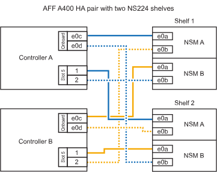

= 
:allow-uri-read: 

.Antes de empezar
* Debe haber revisado el link:requirements-hot-add-shelf.html["requisitos de incorporación en caliente y prácticas recomendadas"].
* Debe haber completado los procedimientos aplicables en link:prepare-hot-add-shelf.html["Prepárese para agregar en caliente una bandeja"].
* Debe haber instalado las bandejas, encenderlas y definir los ID de bandeja tal como se describe en link:prepare-hot-add-shelf.html["Instale una bandeja para una incorporación en caliente"].

* Estante de cable a un par AFF A400 HA*

Para una pareja de alta disponibilidad AFF A400, puede agregar en caliente hasta dos bandejas y utilizar los puertos integrados e0c/e0d y los puertos en la ranura 5 según sea necesario.

.Pasos
. Si va a añadir en caliente una bandeja con un conjunto de puertos compatibles con RoCE (puertos integrados compatibles con RoCE) en cada controladora, y esta es la única bandeja NS224 de la pareja de alta disponibilidad, complete los siguientes pasos secundarios.
+
De lo contrario, vaya al paso siguiente.

+
.. Conecte el cable de la bandeja NSM De Un puerto e0a al puerto e0c de la controladora A.
.. Cable de la bandeja NSM Del puerto e0b al puerto e0d de la controladora B.
.. Cable del puerto NSM B e0a al puerto e0c de la controladora B.
.. Conecte el cable del puerto e0b NSM B al puerto e0d de la controladora A.
+
En la siguiente ilustración, se muestra el cableado para una bandeja añadida en caliente mediante un conjunto de puertos compatibles con RoCE de cada controladora:

+
image::../media/drw_ns224_a400_1shelf.png[Cableado para un AFF/ASA A400 con una bandeja NS224 y un conjunto de puertos internos]

. Si va a añadir en caliente una o dos bandejas mediante dos conjuntos de puertos compatibles con RoCE (integrados y de tarjeta PCIe compatibles con RoCE) en cada controladora, complete los siguientes pasos secundarios.
+
[cols="1,3"]
|===
| Bandejas | Cableado 

 a| 
Bandeja 1
 a| 
.. Conecte El cable NSM de Un puerto e0a al puerto e0c de la controladora A.
.. Conecte el cable del puerto a e0b a la ranura 2 de la controladora B 5 (e5b).
.. Conecte el cable del puerto NSM B e0a al puerto e0c de la controladora B.
.. Conecte el cable del puerto e0b NSM B al puerto 2 de la ranura 5 de la controladora A (e5b).
.. Si va a añadir una segunda estantería en caliente, complete los subpasos "Shelf 2"; en caso contrario, vaya al paso 3.

 a| 
Estante 2
 a| 
.. Conecte El cable NSM de Un puerto e0a al puerto 1 de la ranura 5 De la controladora A (e5a).
.. Conecte el cable NSM del puerto e0b al puerto e0d de la controladora B.
.. Conecte el cable del puerto NSM B e0a al puerto 1 de la ranura de la controladora B 5 (e5a).
.. Conecte el cable del puerto e0b NSM B al puerto e0d de la controladora A.
.. Vaya al paso 3.

|===
+
En la siguiente ilustración, se muestra el cableado de dos bandejas añadidas en caliente:

+

. Compruebe que la bandeja añadida en caliente se ha cableado correctamente https://mysupport.netapp.com/site/tools/tool-eula/activeiq-configadvisor["Active IQ Config Advisor"^]mediante .
+
Si se genera algún error de cableado, siga las acciones correctivas proporcionadas.

. Si se deshabilitó la asignación automática de unidades como parte de la preparación para este procedimiento, debe asignar manualmente la propiedad de la unidad y volver a habilitar la asignación automática de unidades, si es necesario. Consulte link:complete-hot-add-shelf.html["Complete el hot-add"].
+
De lo contrario, ha finalizado este procedimiento.

* Estante de cable a un par AFF C400 HA*

Para un par de alta disponibilidad AFF C400, puede agregar en caliente hasta dos bandejas y utilizar puertos en la ranura 4 y 5 según sea necesario.

.Pasos
. Si va a agregar en caliente una bandeja con un conjunto de puertos compatibles con RoCE en cada controladora, y esta es la única bandeja NS224 de la pareja de alta disponibilidad, complete los siguientes pasos secundarios.
+
De lo contrario, vaya al paso siguiente.

+
.. Bandeja de cables NSM de un puerto e0a a a la ranura de la controladora A 4, puerto 1 (e4a).
.. Cable de la bandeja NSM Del puerto e0b a a la ranura de la controladora B, puerto 4 (e4b).
.. Puerto NSM B de la bandeja de cables e0a a a la ranura del controlador B, puerto 4 (e4a).
.. Cable de la bandeja NSM B del puerto e0b a la ranura de la controladora A 4, puerto 2 (e4b).
+
En la siguiente ilustración, se muestra el cableado para una bandeja añadida en caliente mediante un conjunto de puertos compatibles con RoCE de cada controladora:

+
image::../media/drw_ns224_c400_1shelf_IEOPS-985.svg[Cableado para un AFF/ASA C400 con una bandeja NS224 y un conjunto de puertos de tarjeta PCIe]

. Si va a añadir en caliente una o dos bandejas mediante dos conjuntos de puertos compatibles con RoCE en cada controladora, complete los siguientes pasos secundarios.
+
[cols="1,3"]
|===
| Bandejas | Cableado 

 a| 
Bandeja 1
 a| 
.. Conecte el cable NSM del puerto e0a al puerto 1 de la ranura 4 Del controlador A (e4a).
.. Conecte el cable del puerto a e0b a la ranura 2 de la controladora B 5 (e5b).
.. Conecte el cable del puerto NSM B e0a al puerto de la controladora B, puerto 4 1 (e4a).
.. Conecte el cable del puerto e0b NSM B al puerto 2 de la ranura 5 de la controladora A (e5b).
.. Si va a añadir una segunda estantería en caliente, complete los subpasos "Shelf 2"; en caso contrario, vaya al paso 3.

 a| 
Estante 2
 a| 
.. Conecte El cable NSM de Un puerto e0a al puerto 1 de la ranura 5 De la controladora A (e5a).
.. Conecte el cable NSM del puerto e0b a la ranura del controlador B, puerto 4 (e4b).
.. Conecte el cable del puerto NSM B e0a al puerto 1 de la ranura de la controladora B 5 (e5a).
.. Conecte el cable del puerto e0b NSM B al puerto 2 de la ranura 4 de la controladora A (e4b).
.. Vaya al paso 3.

|===
+
En la siguiente ilustración, se muestra el cableado de dos bandejas añadidas en caliente:

+
image::../media/drw_ns224_c400_2shelves_IEOPS-984.svg[Cableado para un AFF/ASA C400 con dos bandejas NS224 y dos conjuntos de puertos de tarjeta PCIe]

. Compruebe que la bandeja añadida en caliente se ha cableado correctamente https://mysupport.netapp.com/site/tools/tool-eula/activeiq-configadvisor["Active IQ Config Advisor"^]mediante .
+
Si se genera algún error de cableado, siga las acciones correctivas proporcionadas.

.El futuro
Si se deshabilitó la asignación automática de unidades como parte de la preparación para este procedimiento, debe asignar manualmente la propiedad de la unidad y, después, volver a habilitar la asignación automática de unidades, si es necesario. Vaya a link:complete-hot-add-shelf.html["Complete el hot-add"].

De lo contrario, finalizó el procedimiento de bandeja con adición en caliente.
