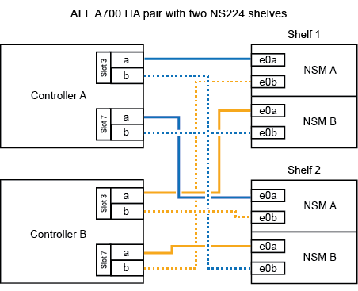

= 
:allow-uri-read: 

.Antes de empezar
Si va a añadir en caliente la bandeja NS224 inicial (no existe bandeja NS224 en el par de alta disponibilidad), debe instalar un módulo de volcado principal (X9170A, NVMe 1TB SSD) en cada controladora para admitir volcados de memoria (almacenar archivos centrales).

+ Ver link:../fas9000/caching-module-and-core-dump-module-replace.html["Sustituya el módulo de almacenamiento en caché o añada/sustituya un módulo de volcado de memoria: A700 y FAS9000 de AFF"^].

.Acerca de esta tarea
La forma de conectar por cable una bandeja NS224 a un par de alta disponibilidad AFF A700 depende del número de bandejas que añada en caliente y del número de conjuntos de puertos compatibles con RoCE (uno o dos) que se utilizan en las controladoras.

.Pasos
. Si va a añadir en caliente una bandeja con un conjunto de puertos compatibles con RoCE (un módulo de I/O compatible con RoCE) en cada controladora, y esta es la única bandeja NS224 de la pareja de alta disponibilidad, complete los siguientes pasos secundarios.
+
De lo contrario, vaya al paso siguiente.

+

NOTE: En este paso se supone que se instaló el módulo de I/O compatible con RoCE en la ranura 3, en lugar de en la ranura 7, en cada controladora.

+
.. Conecte El cable de la bandeja NSM de Un puerto e0a a a la controladora de una ranura 3 puerto a.
.. Cable de la bandeja NSM De un puerto e0b a la ranura de la controladora B 3, puerto b.
.. Conecte el puerto NSM B del puerto e0a al puerto de la ranura de la controladora B 3 a.
.. Cable de la bandeja NSM B del puerto e0b a la controladora a, ranura 3, puerto b.
+
En la siguiente ilustración, se muestra el cableado para una bandeja añadida en caliente usando un módulo I/O compatible con RoCE en cada controladora:

+
image::../media/drw_ns224_a700_1shelf.png[Cableado para un AFF A700 con una bandeja NS224 y un conjunto de puertos de módulo I/O.]

. Si va a añadir en caliente una o dos bandejas mediante dos conjuntos de puertos compatibles con RoCE (dos módulos de I/O compatibles con RoCE) en cada controladora, complete los subpasos correspondientes.
+
[cols="1,3"]
|===
| Bandejas | Cableado 

 a| 
Bandeja 1
 a| 

NOTE: Estos subpasos suponen que se está comenzando el cableado por el cableado del puerto de la bandeja e0a al módulo de I/o compatible con roce en la ranura 3, en lugar de la ranura 7.

.. Conecte El cable NSM de Un puerto e0a al 3 puerto a. de La ranura A de la controladora
.. Conecte el cable NSM de un puerto e0b a la ranura de la controladora B 7, puerto b.
.. Conecte el cable del puerto NSM B e0a al puerto de la ranura de la controladora B 3 a.
.. Conecte el puerto e0b NSM B al puerto e0b de la controladora A la ranura 7, puerto b.
.. Si va a agregar un segundo estante en caliente, complete los pasos secundarios "Estante 2"; de lo contrario, vaya al siguiente paso.

 a| 
Estante 2
 a| 

NOTE: Estos subpasos suponen que se está comenzando el cableado por el cableado del puerto de la bandeja e0a al módulo I/o compatible con roce en la ranura 7, en lugar de la ranura 3 (que se correlaciona con los subpasos de cableado de la bandeja 1).

.. Conecte El cable NSM de Un puerto e0a al 7 puerto a. de La ranura A de la controladora
.. Conecte el cable NSM de un puerto e0b a la ranura de la controladora B 3, puerto b.
.. Conecte el cable del puerto NSM B e0a al puerto de la ranura de la controladora B 7 a.
.. Conecte el puerto e0b NSM B al puerto e0b de la controladora A la ranura 3, puerto b.
.. Vaya al paso siguiente.

|===
+
En la siguiente ilustración, se muestra el cableado de la primera y segunda bandejas añadidas en caliente:

+

. Compruebe que la bandeja añadida en caliente se ha cableado correctamente https://mysupport.netapp.com/site/tools/tool-eula/activeiq-configadvisor["Active IQ Config Advisor"^]mediante .
+
Si se genera algún error de cableado, siga las acciones correctivas proporcionadas.

