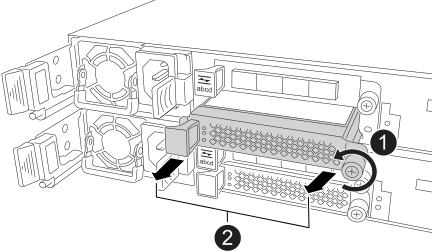

= Opción 1: Agregue módulos de I/O a un sistema de almacenamiento con ranuras disponibles
:allow-uri-read: 

Puede añadir módulos de I/O al sistema de almacenamiento agregándolos a ranuras disponibles o sustituyendo los módulos de I/O por módulos nuevos en un sistema de almacenamiento completamente completo.

.Antes de empezar
* Compruebe la https://hwu.netapp.com/["Hardware Universe de NetApp"^] para asegurarse de que el nuevo módulo de I/O es compatible con su sistema de almacenamiento y la versión de ONTAP que ejecuta.
* Si hay varias ranuras disponibles, compruebe las prioridades de las ranuras en https://hwu.netapp.com/["Hardware Universe de NetApp"^] y utilice la mejor disponible para su módulo de E/S.
* El resto de componentes del sistema de almacenamiento deben funcionar correctamente. De lo contrario, debe ponerse en contacto https://mysupport.netapp.com/site/global/dashboard["Soporte de NetApp"] antes de continuar con este procedimiento.

.Acerca de esta tarea
* Al añadir módulos I/O, se añade el mismo tipo de módulo en cada controladora. Este procedimiento le permite agregarlos de uno en uno repitiendo los pasos.
* El controlador en el que se agrega un módulo de E/S se conoce como controlador _afectado_.
* Si es necesario, puede encender los LED de ubicación del sistema de almacenamiento (azul) para ayudar a localizar físicamente el sistema de almacenamiento afectado. Inicie sesión en BMC mediante SSH e introduzca `system location-led _on_` el comando.
+
Un sistema de almacenamiento tiene tres LED de ubicación: Uno en el panel de visualización del operador y otro en cada controlador. Los LED de ubicación permanecen encendidos durante 30 minutos.

+
Puede desactivarlos introduciendo `system location-led _off_` el comando. Si no está seguro de si los LED están encendidos o apagados, puede comprobar su estado introduciendo `system location-led show` el comando.

== Opción 1: Agregue módulos de I/O a un sistema de almacenamiento con ranuras disponibles

Puede agregar un módulo de E/S a una ranura disponible en cada controladora.

=== Paso 1: Apague el controlador dañado

Apague o tome el control de la controladora dañada.

Para apagar el controlador dañado, debe determinar el estado del controlador y, si es necesario, tomar el control para que el controlador sano siga sirviendo datos del almacenamiento del controlador dañado.

.Antes de empezar
Si tiene un clúster con más de dos nodos, debe estar en quórum. Si el clúster no tiene quórum o si una controladora en buen estado muestra falso según su condición, debe corregir el problema antes de apagar la controladora dañada; consulte link:https://docs.netapp.com/us-en/ontap/system-admin/synchronize-node-cluster-task.html?q=Quorum["Sincronice un nodo con el clúster"^].

.Pasos
. Si AutoSupport está habilitado, suprima la creación automática de casos invocando un comando de mensaje de AutoSupport: `system node autosupport invoke -node * -type all -message MAINT=number_of_hours_downh`
+
El siguiente comando de la AutoSupport suprime la creación automática de casos durante dos horas: `cluster1:*> system node autosupport invoke -node * -type all -message MAINT=2h`

. Deshabilite la devolución automática de la consola de la controladora en buen estado: `storage failover modify –node local -auto-giveback false`
. Lleve la controladora dañada al aviso DEL CARGADOR:
+
[cols="1,2"]
|===
| Si el controlador dañado está mostrando... | Realice lo siguiente... 

 a| 
El aviso del CARGADOR
 a| 
Vaya al paso siguiente.

 a| 
`Waiting for giveback...`
 a| 
Pulse Ctrl-C y, a continuación, responda `y` cuando se le solicite.

 a| 
Solicitud del sistema o solicitud de contraseña (introduzca la contraseña del sistema)
 a| 
Detenga o tome el control del controlador dañado del controlador en buen estado: `storage failover takeover -ofnode _impaired_node_name_`

Cuando el controlador dañado muestre esperando devolución..., pulse Ctrl-C y, a continuación, responda `y`.

|===

=== Paso 2: Añada módulos I/O a las ranuras disponibles

. Si usted no está ya conectado a tierra, correctamente tierra usted mismo.
. En el controlador deteriorado, retire el módulo de supresión de E/S de la ranura de destino.
+
Las ranuras de E/S no utilizadas deben tener instalado un módulo de borrado para evitar posibles problemas térmicos.

+

+
[cols="1,4"]
|===

 a| 
image:../media/icon_round_1.png["Número de llamada 1"]
 a| 
En el módulo de supresión de E/S, gire el tornillo de mariposa hacia la izquierda para aflojarlo.

 a| 
image:../media/icon_round_2.png["Número de llamada 2"]
 a| 
Extraiga el módulo de supresión de E/S del controlador con la lengüeta de la izquierda y el tornillo de mariposa.

|===
. Instale el nuevo módulo de E/S:
+
.. Alinee el módulo de E/S con los bordes de la abertura de la ranura del controlador.
.. Empuje suavemente el módulo de E/S completamente en la ranura, asegurándose de que el módulo se asienta correctamente en el conector.
+
Puede utilizar la lengüeta de la izquierda y el tornillo de mariposa para insertar el módulo de E/S.

.. Gire el tornillo de mariposa hacia la derecha para apretarlo.

. Conecte el módulo de E/S a los dispositivos designados.
+
Si instaló un módulo de I/O de almacenamiento, instale las bandejas NS224 y conecte los cables de las mismas, tal como se describe en https://docs.netapp.com/us-en/ontap-systems/ns224/hot-add-shelf-overview.html["Flujo de trabajo de incorporación en caliente"^].

. Reinicie la controladora deteriorada desde el aviso de Loader: `bye`
+
De esta forma, se reinicializan los dispositivos PCIe y otros componentes y se reinicia el nodo.

. Devuelva la controladora afectada desde la controladora asociada: `storage failover giveback -ofnode _impaired_node_name_`
. Repita estos pasos para agregar un módulo de E/S a la otra controladora.
. Restaure la devolución automática del control desde la consola de la controladora en buen estado: `storage failover modify -node local -auto-giveback _true_`
. Si AutoSupport está habilitado, restaure (desactive la supresión) la creación automática de casos: `system node autosupport invoke -node * -type all -message MAINT=END`

== Opción 2: Agregue módulos de I/O en un sistema de almacenamiento con ranuras no disponibles

Puede añadir módulos I/O a un sistema de almacenamiento completo eliminando los módulos de I/O existentes y sustituyéndolos por módulos de I/O diferentes.

. Si está:
+
[cols="1,2"]
|===
| Sustituyendo a... | Realice lo siguiente... 

 a| 
Módulo de E/S de NIC con el mismo número de puertos
 a| 
Las LIF migran automáticamente cuando su controladora está apagada.

 a| 
Módulo de E/S NIC con menos puertos
 a| 
Reasignar permanentemente los LIF afectados a un puerto raíz diferente. Consulte https://docs.netapp.com/ontap-9/topic/com.netapp.doc.onc-sm-help-960/GUID-208BB0B8-3F84-466D-9F4F-6E1542A2BE7D.html["Migrar una LIF"^] para obtener información sobre el uso de System Manager para mover las LIF de forma permanente.

 a| 
Módulo de E/S de NIC con un módulo de E/S de almacenamiento
 a| 
Utilice System Manager para migrar de forma permanente las LIF a distintos puertos principales, como se describe en https://docs.netapp.com/ontap-9/topic/com.netapp.doc.onc-sm-help-960/GUID-208BB0B8-3F84-466D-9F4F-6E1542A2BE7D.html["Migrar una LIF"^].

|===

=== Paso 1: Apague el controlador dañado

Apague o tome el control de la controladora dañada.

Para apagar el controlador dañado, debe determinar el estado del controlador y, si es necesario, tomar el control para que el controlador sano siga sirviendo datos del almacenamiento del controlador dañado.

.Antes de empezar
Si tiene un clúster con más de dos nodos, debe estar en quórum. Si el clúster no tiene quórum o si una controladora en buen estado muestra falso según su condición, debe corregir el problema antes de apagar la controladora dañada; consulte link:https://docs.netapp.com/us-en/ontap/system-admin/synchronize-node-cluster-task.html?q=Quorum["Sincronice un nodo con el clúster"^].

.Pasos
. Si AutoSupport está habilitado, suprima la creación automática de casos invocando un comando de mensaje de AutoSupport: `system node autosupport invoke -node * -type all -message MAINT=number_of_hours_downh`
+
El siguiente comando de la AutoSupport suprime la creación automática de casos durante dos horas: `cluster1:*> system node autosupport invoke -node * -type all -message MAINT=2h`

. Deshabilite la devolución automática de la consola de la controladora en buen estado: `storage failover modify –node local -auto-giveback false`
. Lleve la controladora dañada al aviso DEL CARGADOR:
+
[cols="1,2"]
|===
| Si el controlador dañado está mostrando... | Realice lo siguiente... 

 a| 
El aviso del CARGADOR
 a| 
Vaya al paso siguiente.

 a| 
`Waiting for giveback...`
 a| 
Pulse Ctrl-C y, a continuación, responda `y` cuando se le solicite.

 a| 
Solicitud del sistema o solicitud de contraseña (introduzca la contraseña del sistema)
 a| 
Detenga o tome el control del controlador dañado del controlador en buen estado: `storage failover takeover -ofnode _impaired_node_name_`

Cuando el controlador dañado muestre esperando devolución..., pulse Ctrl-C y, a continuación, responda `y`.

|===

=== Paso 2: Añada módulos I/O a las ranuras no disponibles

. Si usted no está ya conectado a tierra, correctamente tierra usted mismo.
. En el controlador deteriorado, desconecte los cables del módulo de E/S de destino.
. Retire el módulo de E/S de destino del controlador:
+
image::../media/drw_g_io_module_replace_ieops-1900.svg[Retire un módulo de E/S.]

+
[cols="1,4"]
|===

 a| 
image:../media/icon_round_1.png["Número de llamada 1"]
 a| 
Gire el tornillo de apriete manual del módulo de E/S hacia la izquierda para aflojarlo.

 a| 
image:../media/icon_round_2.png["Número de llamada 2"]
 a| 
Extraiga el módulo de E/S de la controladora utilizando la pestaña de etiqueta de puerto de la izquierda y el tornillo de mariposa.

|===
. Instale el nuevo módulo de E/S en la ranura de destino:
+
.. Alinee el módulo de E/S con los bordes de la ranura.
.. Empuje suavemente el módulo de E/S completamente en la ranura, asegurándose de que el módulo se asienta correctamente en el conector.
+
Puede utilizar la lengüeta de la izquierda y el tornillo de mariposa para insertar el módulo de E/S.

.. Gire el tornillo de mariposa hacia la derecha para apretarlo.

. Conecte el módulo de E/S a los dispositivos designados.
+
Si instaló un módulo de I/O de almacenamiento, instale las bandejas NS224 y conecte los cables de las mismas, tal como se describe en https://docs.netapp.com/us-en/ontap-systems/ns224/hot-add-shelf-overview.html["Flujo de trabajo de incorporación en caliente"^].

. Repita los pasos de extracción e instalación del módulo de E/S para agregar módulos de E/S adicionales en el controlador.
. Reinicie la controladora dañada: `bye`
+
De esta forma, se reinicializan los dispositivos PCIe y otros componentes y se reinicia el nodo.

. Devuelva la controladora afectada desde la controladora asociada: `storage failover giveback -ofnode _impaired_node_name_`
. Restaure la devolución automática del control desde la consola de la controladora en buen estado: `storage failover modify -node local -auto-giveback _true_`
. Si AutoSupport está habilitado, restaure (anule la supresión) la creación automática de casos: System node AutoSupport invoke -node * -type all -message MAINT=END
. Si instaló un módulo NIC, especifique el modo de uso para cada puerto como _network_: `storage port modify -node *_<node name>_ -port *_<port name>_ -mode network`
. Repita estos pasos para la otra controladora.

