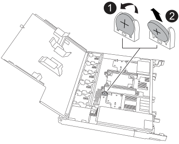

= 
:allow-uri-read: 

Retire la batería RTC defectuosa e instale la batería RTC de repuesto.

Debe utilizar una batería RTC aprobada.

CAUTION: Lleva siempre una muñequera con toma de tierra conectada a un punto de tierra verificado durante los procedimientos de instalación y mantenimiento. No seguir las precauciones ESD adecuadas puede causar daños permanentes a los nodos controladores, las estanterías de almacenamiento y los switches de red.

.Pasos
. Localice la batería RTC.
. Retire la batería del RTC:
+

+
[cols="1,4"]
|===

 a| 
image::../media/icon_round_1.png[Número de llamada 1]
 a| 
Gire suavemente la batería del RTC en un ángulo alejado de su soporte.

 a| 
image::../media/icon_round_2.png[Número de llamada 2]
 a| 
Saque la batería del RTC de su soporte.

|===
. Instale la batería RTC de repuesto:
+
.. Retire la batería de repuesto de la bolsa de transporte antiestática.
.. Coloque la batería de forma que el signo más de la batería quede orientado hacia fuera para que coincida con el signo más de la placa base.
.. Inserte la batería en el soporte en ángulo y, a continuación, empújela en posición vertical para que quede completamente asentada en el soporte.
.. Inspeccione visualmente la batería para asegurarse de que está completamente asentada en su soporte y de que la polaridad es correcta.

