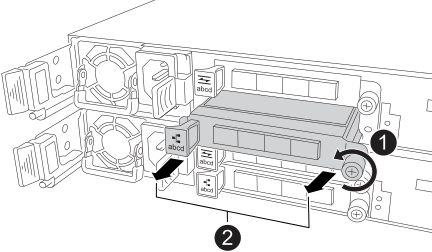

= Sustituya la controladora: AFF A20, AFF A30 y AFF A50
:allow-uri-read: 
:icons: font
:imagesdir: ../media/

[role="lead"]
Para sustituir la controladora, debe retirar la controladora deteriorada, mover los componentes FRU de la controladora dañada a la de sustitución, instalar la controladora de reemplazo en el chasis, establecer la hora y la fecha, y volver a conectar la controladora de reemplazo.

== Paso 1: Quite la controladora

Es necesario quitar la controladora del chasis cuando se sustituye la controladora o se sustituye uno dentro de la controladora.

.Antes de empezar
El resto de componentes del sistema de almacenamiento deben funcionar correctamente. De lo contrario, debe ponerse en contacto https://mysupport.netapp.com/site/global/dashboard["Soporte de NetApp"] antes de continuar con este procedimiento.

.Pasos
. En el controlador deteriorado, asegúrese de que el LED NV está apagado.
+
Cuando el LED NV está apagado, la separación se completa y es seguro retirar el controlador defectuoso.

+

NOTE: Si el LED NV parpadea (verde), la separación está en curso. Debe esperar a que se apague el LED NV. Sin embargo, si el parpadeo continúa durante más de cinco minutos, póngase en contacto con https://mysupport.netapp.com/site/global/dashboard["Soporte de NetApp"] antes de continuar con este procedimiento.

+
El LED NV se encuentra junto al icono de NV de la controladora.

+
image::../media/drw_g_nvmem_led_ieops-1839.svg[Ubicación del LED de estado de NV]

[cols="1,4"]
|===

 a| 
image::../media/icon_round_1.png[Número de llamada 1]
 a| 
Icono de NV y LED en el controlador

|===
. Si usted no está ya conectado a tierra, correctamente tierra usted mismo.
. Desconecte la alimentación del controlador dañado:
+

NOTE: Las fuentes de alimentación (PSU) no tienen un interruptor de alimentación.

+
[cols="1,2"]
|===
| Si va a desconectar un... | Realice lo siguiente... 

 a| 
PSU DE CA
 a| 
.. Abra el retén del cable de alimentación.
.. Desconecte el cable de alimentación de la fuente de alimentación y déjelo a un lado.

 a| 
FUENTE DE ALIMENTACIÓN DE CC
 a| 
.. Desenrosque los dos tornillos de mariposa del conector del cable de alimentación de CC D-SUB.
.. Desconecte el cable de alimentación de la fuente de alimentación y déjelo a un lado.

|===
. Desconecte todos los cables del controlador dañado.
+
Mantenga un registro de dónde se conectaron los cables.

. Retire el controlador deteriorado:
+
En la siguiente ilustración, se muestra el funcionamiento de las asas de la controladora (desde el lado izquierdo de la controladora) al quitar una controladora:

+
image::../media/drw_g_and_t_handles_remove_ieops-1837.svg[asa la operación de la controladora para quitar una controladora]

+
[cols="1,4"]
|===

 a| 
image::../media/icon_round_1.png[Número de llamada 1]
 a| 
En ambos extremos del controlador, empuje las lengüetas de bloqueo verticales hacia afuera para liberar las asas.

 a| 
image::../media/icon_round_2.png[Número de llamada 2]
 a| 
** Tire de las asas hacia usted para desalojar el controlador del plano medio.
+
A medida que tira, las asas se extienden hacia fuera del controlador y luego siente algo de resistencia, siga tirando.

** Deslice el controlador para sacarlo del chasis mientras sostiene la parte inferior del controlador y colóquelo en una superficie plana y estable.

 a| 
image::../media/icon_round_3.png[Número de llamada 3]
 a| 
Si es necesario, gire las asas hacia arriba (junto a las pestañas) para alejarlas.

|===
. Abra la cubierta del controlador girando el tornillo de mariposa hacia la izquierda para aflojarla y, a continuación, abra la cubierta.

== Paso 2: Mueva la fuente de alimentación

Mueva el suministro de alimentación (PSU) a la controladora de reemplazo.

. Mueva la PSU de la controladora dañada:
+
Asegúrese de que la manija del controlador del lado izquierdo está en posición vertical para permitir el acceso a la fuente de alimentación.

[role="tabbed-block"]
====
.Opción 1: Mover una fuente de alimentación de CA
--
Para mover una fuente de alimentación de CA, realice los siguientes pasos.

.Pasos
. Retire la fuente de alimentación de CA del controlador defectuoso:
+
image::../media/drw_g_t_psu_replace_ieops-1899.svg[Sustituya la fuente de alimentación de CA]

+
[cols="1,4"]
|===

 a| 
image::../media/icon_round_1.png[Número de llamada 1]
 a| 
Gire el asa de la fuente de alimentación hacia arriba hasta su posición horizontal y, a continuación, sujétela.

 a| 
image::../media/icon_round_2.png[Número de llamada 2]
 a| 
Con el pulgar, presione la pestaña azul para liberar la PSU del controlador.

 a| 
image::../media/icon_round_3.png[Número de llamada 3]
 a| 
Saque la PSU de la controladora mientras usa la otra mano para sostener su peso.

CAUTION: La fuente de alimentación es corta. Utilice siempre dos manos para sostenerlo cuando lo retire del controlador, de modo que no se salga repentinamente del controlador y le dañe.

|===
. Inserte la PSU en la controladora de sustitución:
+
.. Con ambas manos, apoye y alinee los bordes de la PSU con la abertura del controlador.
.. Empuje suavemente la PSU dentro del controlador hasta que la lengüeta de bloqueo encaje en su lugar.
+
Una fuente de alimentación sólo se acoplará correctamente con el conector interno y se bloqueará de una manera.

+

NOTE: Para evitar dañar el conector interno, no ejerza demasiada fuerza al deslizar la PSU en el controlador.

.. Gire el asa hacia abajo, de manera que quede fuera del camino de las operaciones normales.

--
.Opción 2: Mover una fuente de alimentación de CC
--
Para mover una fuente de alimentación de CC, realice los siguientes pasos.

.Pasos
. Retire la fuente de alimentación de CC del controlador dañado:
+
.. Gire el asa hacia arriba, a su posición horizontal y, a continuación, sujételo.
.. Con el pulgar, presione la lengüeta de terracota para liberar el mecanismo de bloqueo.
.. Saque la PSU de la controladora mientras usa la otra mano para sostener su peso.
+

NOTE: La fuente de alimentación es corta. Utilice siempre dos manos para apoyarlo al retirarlo del controlador de modo que no se salga del controlador y le dañe.

+
image::../media/drw_dcpsu_remove-replace-generic_IEOPS-788.svg[Retire una fuente de alimentación de CC]

+
[cols="1,4"]
|===

 a| 
image::../media/icon_round_1.png[Número de llamada 1]
 a| 
Tornillos de mariposa

 a| 
image::../media/icon_round_2.png[Número de llamada 2]
 a| 
Conector del cable de alimentación de CC D-SUB

 a| 
image::../media/icon_round_3.png[Número de llamada 3]
 a| 
Asa de la fuente de alimentación

 a| 
image::../media/icon_round_4.png[Número de llamada 4]
 a| 
Lengüeta de bloqueo de PSU de terracota

|===
. Inserte la PSU en la controladora de sustitución:
+
.. Con ambas manos, apoye y alinee los bordes de la PSU con la abertura del controlador.
.. Deslice suavemente la PSU en la controladora hasta que la lengüeta de bloqueo haga clic en su lugar.
+
Una fuente de alimentación debe acoplarse correctamente con el conector interno y el mecanismo de bloqueo. Repita este paso si considera que la fuente de alimentación no está correctamente colocada.

+

NOTE: Para evitar dañar el conector interno, no ejerza demasiada fuerza al deslizar la PSU en el controlador.

.. Gire el asa hacia abajo, de manera que quede fuera del camino de las operaciones normales.

--
====

== Paso 3: Mueva los ventiladores

Mueva los ventiladores a la controladora de reemplazo.

. Retire uno de los ventiladores de la controladora afectada:
+
image::../media/drw_g_fan_replace_ieops-1903.svg[Sustitución del ventilador]

+
[cols="1,4"]
|===

 a| 
image::../media/icon_round_1.png[Número de llamada 1]
| Sujete ambos lados del ventilador en los puntos de contacto azules. 

 a| 
image::../media/icon_round_2.png[Número de llamada 2]
| Tire del ventilador hacia arriba y sáquelo. 
|===
. Inserte el ventilador en el controlador de reemplazo alineándolo dentro de las guías y, a continuación, empuje hacia abajo hasta que el conector del ventilador esté completamente asentado en el zócalo.
. Repita estos pasos para los ventiladores restantes.

== Paso 4: Mueva la batería de NV

Mueva la batería NV al controlador de reemplazo.

. Retire la batería NV del controlador deteriorado:
+
image::../media/drw_g_nv_battery_replace_ieops-1864.svg[Sustituya la batería NV]

+
[cols="1,4"]
|===

 a| 
image::../media/icon_round_1.png[Número de llamada 1]
 a| 
Levante la batería NV y sáquela de su compartimento.

 a| 
image::../media/icon_round_2.png[Número de llamada 2]
 a| 
Retire el mazo de cables de su retén.

 a| 
image::../media/icon_round_3.png[Número de llamada 3]
 a| 
.. Presione y mantenga presionada la lengüeta del conector.
.. Tire del conector hacia arriba y extráigalo de la toma.
+
A medida que se levanta, balancee suavemente el conector de extremo a extremo (a lo largo) para desasentarlo.

|===
. Instale la batería NV en el controlador de reemplazo:
+
.. Enchufe el conector de cableado en su toma.
.. Dirija el cableado a lo largo del lado de la fuente de alimentación, hacia su retén y, a continuación, a través del canal situado delante del compartimento de la batería NV.
.. Coloque la batería NV en el compartimento.
+
La batería NV debe colocarse a ras en su compartimento.

== Paso 5: Mover los DIMM del sistema

Mueva los DIMM a la controladora de reemplazo.

Si dispone de espacios DIMM en blanco, no es necesario moverlos, la controladora de reemplazo debe venir con ellos instalados.

. Retire uno de los DIMM de la controladora afectada:
+
image::../media/drw_g_dimm_ieops-1873.svg[Sustitución de DIMM]

+
[cols="1,4"]
|===

 a| 
image::../media/icon_round_1.png[Número de llamada 1]
 a| 
Numeración y posiciones de las ranuras DIMM.

NOTE: Según el modelo del sistema de almacenamiento, tendrá dos o cuatro DIMM.

 a| 
image::../media/icon_round_2.png[Número de llamada 1]
 a| 
** Observe la orientación del módulo DIMM en el zócalo para poder insertar el módulo DIMM en el controlador de sustitución con la orientación adecuada.
** Expulse el módulo DIMM separando lentamente las dos lengüetas del expulsor DIMM en ambos extremos de la ranura DIMM.

IMPORTANT: Sujete con cuidado el DIMM por las esquinas o bordes para evitar la presión en los componentes de la placa de circuitos DIMM.

 a| 
image::../media/icon_round_3.png[Número de llamada 3]
 a| 
Levante el módulo DIMM y sáquelo de la ranura.

Las lengüetas del expulsor permanecen en la posición abierta.

|===
. Instale el DIMM en la controladora de reemplazo:
+
.. Asegúrese de que las lengüetas del expulsor DIMM del conector están en la posición abierta.
.. Sujete el módulo DIMM por las esquinas y, a continuación, inserte el módulo DIMM de forma cuadrada en la ranura.
+
La muesca de la parte inferior del DIMM, entre los pasadores, debe alinearse con la lengüeta de la ranura.

+
Cuando se inserta correctamente, el módulo DIMM entra fácilmente pero encaja firmemente en la ranura. De lo contrario, vuelva a insertar el DIMM.

.. Compruebe visualmente el módulo DIMM para asegurarse de que está alineado uniformemente y completamente insertado en la ranura.
.. Empuje hacia abajo con cuidado, pero firmemente, en el borde superior del DIMM hasta que las lengüetas expulsoras encajen en su lugar sobre las muescas de ambos extremos del DIMM.

. Repita estos pasos para los módulos DIMM restantes.

== Paso 6: Mueva el soporte de arranque

Mueva el soporte de arranque a la controladora de reemplazo.

. Retire el soporte de arranque de la controladora afectada:
+
image::../media/drw_g_boot_media_replace_ieops-1872.svg[Gráfico de sustitución de soporte de arranque]

+
[cols="1,4"]
|===

 a| 
image::../media/icon_round_1.png[Número de llamada 1]
 a| 
Ubicación del soporte de arranque

 a| 
image::../media/icon_round_2.png[Número de llamada 2]
 a| 
Presione la pestaña azul hacia abajo para soltar el extremo derecho del soporte de arranque.

 a| 
image::../media/icon_round_3.png[Número de llamada 3]
 a| 
Levante el extremo derecho del soporte de arranque en un ángulo ligero para conseguir un buen agarre a lo largo de los laterales del soporte de arranque.

 a| 
image::../media/icon_round_4.png[Número de llamada 4]
 a| 
Tire suavemente del extremo izquierdo del soporte de arranque para extraerlo de su toma.

|===
. Instale el soporte de arranque en la controladora de sustitución:
+
.. Deslice el extremo de la toma del soporte de arranque en su toma.
.. En el extremo opuesto del soporte de arranque, presione y mantenga presionada la lengüeta azul (en la posición abierta), presione suavemente hacia abajo ese extremo del soporte de arranque hasta que se detenga, y luego suelte la pestaña para bloquear el soporte de arranque en su lugar.

== Paso 7: Mueva los módulos de E/S.

Mueva los módulos de E/S y los módulos de supresión de E/S a la controladora de sustitución.

. Desconecte el cableado de uno de los módulos de E/S.
+
Asegúrese de etiquetar los cables para saber de dónde vienen.

. Retire el módulo de E/S del controlador defectuoso:
+
Asegúrese de realizar un seguimiento de la ranura en la que se encontraba el módulo de E/S.

+
Si va a extraer el módulo de E/S de la ranura 4, asegúrese de que el asa del controlador del lado derecho está en posición vertical para poder acceder al módulo de E/S.

+

+
[cols="1,4"]
|===

 a| 
image::../media/icon_round_1.png[Número de llamada 1]
 a| 
Gire el tornillo de apriete manual del módulo de E/S hacia la izquierda para aflojarlo.

 a| 
image::../media/icon_round_2.png[Número de llamada 2]
 a| 
Extraiga el módulo de E/S de la controladora utilizando la pestaña de etiqueta de puerto de la izquierda y el tornillo de mariposa.

|===
. Instale el módulo de E/S en el controlador de sustitución:
+
.. Alinee el módulo de E/S con los bordes de la ranura.
.. Empuje suavemente el módulo de E/S completamente en la ranura, asegurándose de que el módulo se asienta correctamente en el conector.
+
Puede utilizar la lengüeta de la izquierda y el tornillo de mariposa para insertar el módulo de E/S.

.. Gire el tornillo de mariposa hacia la derecha para apretarlo.

. Repita estos pasos para mover los módulos de E/S restantes y todos los módulos de supresión de E/S a la controladora de sustitución.

== Paso 8: Instale el controlador

Vuelva a instalar la controladora en el chasis y reiníciela.

.Acerca de esta tarea
La siguiente ilustración muestra el funcionamiento de las asas de la controladora (desde el lado izquierdo de una controladora) al reinstalar la controladora y se puede utilizar como referencia para el resto de los pasos de reinstalación de la controladora.

image::../media/drw_g_and_t_handles_reinstall_ieops-1838.svg[operación de manija del controlador para instalar un controlador]

[cols="1,4"]
|===

 a| 
image::../media/icon_round_1.png[Número de llamada 1]
 a| 
Si giró las asas del controlador en posición vertical (junto a las pestañas) para alejarlas mientras realizaba el mantenimiento del controlador, gírelas hacia abajo hasta la posición horizontal.

 a| 
image::../media/icon_round_2.png[Número de llamada 2]
 a| 
Empuje las asas para volver a insertar el controlador en el chasis hasta la mitad y, a continuación, cuando se le indique, empuje hasta que el controlador esté completamente asentado.

 a| 
image::../media/icon_round_3.png[Número de llamada 3]
 a| 
Gire las asas hasta la posición vertical y bloquéelas en su lugar con las lengüetas de bloqueo.

|===
.Pasos
. Cierre la cubierta del controlador y gire el tornillo de mariposa hacia la derecha hasta que se apriete.
. Inserte la controladora a la mitad en el chasis.
+
Alinee la parte posterior de la controladora con la apertura del chasis y empuje suavemente la controladora con las asas.

+

NOTE: No inserte por completo la controladora en el chasis hasta que se le indique hacerlo.

. Conecte el cable de la consola al puerto de la consola del controlador y al portátil para que el portátil reciba los mensajes de la consola cuando se reinicie el controlador.
. Coloque completamente la controladora en el chasis:
+
.. Empuje firmemente las asas hasta que el controlador se encuentre con el plano medio y quede completamente asentado.
+

NOTE: No ejerza demasiada fuerza al deslizar el controlador en el chasis, ya que podría dañar los conectores.

.. Gire las asas del controlador hacia arriba y bloquéelas en su lugar con las lengüetas.
+

NOTE: El controlador comienza a arrancar tan pronto como está completamente asentado en el chasis.

. Lleve el controlador al símbolo del SISTEMA de Loader pulsando CTRL-C para cancelar EL ARRANQUE AUTOMÁTICO.
. Establezca la hora y la fecha en la controladora:
+
Asegúrese de que se encuentra en el aviso de Loader DE la controladora.

+
.. Muestre la fecha y la hora del controlador:
+
`show date`

+

NOTE: La hora y la fecha por defecto están en GMT. Tiene la opción de mostrar en la hora local y en el modo 24hr.

.. Establezca la hora actual en GMT:
+
`set time hh:mm:ss`

+
Puede obtener el GMT actual del nodo Healthy:

+
`date -u`

.. Establezca la fecha actual en GMT:
+
`set date mm/dd/yyyy`

+
Puede obtener el GMT actual del nodo Healthy: +
`date -u`

. Vuelva a conectar el controlador según sea necesario.
. Vuelva a conectar el cable de alimentación a la fuente de alimentación (PSU).
+
Una vez restaurada la alimentación de la fuente de alimentación, el LED de estado debería ser verde.

+
[cols="1,2"]
|===
| Si va a volver a conectar un... | Realice lo siguiente... 

 a| 
PSU DE CA
 a| 
.. Conecte el cable de alimentación a la fuente de alimentación.
.. Fije el cable de alimentación con el retén del cable de alimentación.

 a| 
FUENTE DE ALIMENTACIÓN DE CC
 a| 
.. Conecte el conector del cable de alimentación de CC D-SUB a la PSU.
.. Apriete los dos tornillos de mariposa para fijar el conector del cable de alimentación de CC D-SUB a la PSU.

|===

