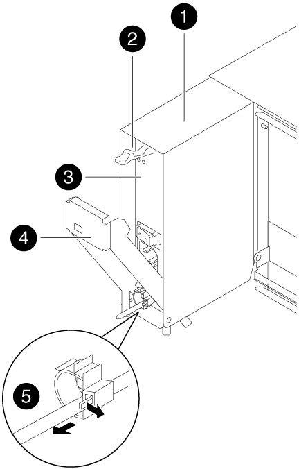
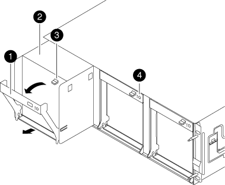

= Sustituir hardware: AFF A300
:allow-uri-read: 
:icons: font
:imagesdir: ../media/

[role="lead"]
Mueva las fuentes de alimentación, los ventiladores y los módulos de controladora del chasis dañado al nuevo chasis, y cambie el chasis dañado del rack del equipo o del armario del sistema con el nuevo chasis del mismo modelo que el chasis dañado.

== Paso 1: Mueva una fuente de alimentación

Para desconectar una fuente de alimentación cuando se sustituye un chasis, es necesario apagar, desconectar y quitar la fuente de alimentación del chasis antiguo, así como instalarla y conectarla al chasis de reemplazo.

. Si usted no está ya conectado a tierra, correctamente tierra usted mismo.
. Apague la fuente de alimentación y desconecte los cables de alimentación:
+
.. Apague el interruptor de alimentación de la fuente de alimentación.
.. Abra el retenedor del cable de alimentación y, a continuación, desconecte el cable de alimentación de la fuente de alimentación.
.. Desconecte el cable de alimentación de la fuente de alimentación.

. Presione hacia abajo el pestillo de liberación del tirador de la leva de la fuente de alimentación y, a continuación, baje el asa de la leva hasta la posición completamente abierta para liberar la fuente de alimentación del plano medio.
+

+
|===

 a| 
image:../media/icon_round_1.png["Número de llamada 1"]
| Suministro de alimentación 

 a| 
image:../media/icon_round_2.png["Número de llamada 2"]
 a| 
Pestillo de liberación de la palanca de leva

 a| 
image:../media/icon_round_3.png["Número de llamada 3"]
 a| 
LED de alimentación y fallo

 a| 
image:../media/icon_round_4.png["Número de llamada 4"]
 a| 
Mango de leva

 a| 
image:../media/icon_round_5.png["Número de llamada 5"]
 a| 
Mecanismo de bloqueo del cable de alimentación

|===
. Utilice el asa de leva para extraer la fuente de alimentación del sistema.
+

CAUTION: Al extraer una fuente de alimentación, utilice siempre dos manos para soportar su peso.

. Repita los pasos anteriores con todos los suministros de alimentación restantes.
. Con ambas manos, sujete y alinee los bordes de la fuente de alimentación con la abertura del chasis del sistema y, a continuación, empuje suavemente la fuente de alimentación hacia el chasis con el asa de leva.
+
Las fuentes de alimentación están codificadas y sólo se pueden instalar de una manera.

+

NOTE: No ejerza demasiada fuerza al deslizar la fuente de alimentación en el sistema. Puede dañar el conector.

. Empuje firmemente el asa de la leva de la fuente de alimentación para colocarlo completamente en el chasis y, a continuación, empuje el asa de leva hasta la posición cerrada, asegurándose de que el pestillo de liberación de la palanca de leva encaje en su posición de bloqueo.
. Vuelva a conectar el cable de alimentación y fíjelo a la fuente de alimentación mediante el mecanismo de bloqueo del cable de alimentación.
+

NOTE: Conecte sólo el cable de alimentación a la fuente de alimentación. No conecte el cable de alimentación a una fuente de alimentación en este momento.

== Paso 2: Mover un ventilador

Extraer un módulo de ventiladores al sustituir el chasis implica una secuencia específica de tareas.

. Retire el bisel (si es necesario) con dos manos, sujetando las aberturas de cada lado del bisel y tirando de él hacia usted hasta que el bisel se suelte de los espárragos de bolas del bastidor del chasis.
. Presione hacia abajo el pestillo de liberación en la palanca de leva del módulo del ventilador y luego tire de la palanca de leva hacia abajo.
+
El módulo del ventilador se mueve un poco lejos del chasis.

+

+
|===

 a| 
image:../media/icon_round_1.png["Número de llamada 1"]
| Mango de leva 

 a| 
image:../media/icon_round_2.png["Número de llamada 2"]
 a| 
Módulo de ventilador

 a| 
image:../media/icon_round_3.png["Número de llamada 3"]
 a| 
Pestillo de liberación de la palanca de leva

 a| 
image:../media/icon_round_4.png["Número de llamada 4"]
 a| 
LED de alerta del módulo de ventilador

|===
. Tire del módulo del ventilador hacia fuera del chasis, asegurándose de que lo apoya con la mano libre para que no se balancee del chasis.
+

CAUTION: Los módulos del ventilador son cortos. Apoye siempre la parte inferior del módulo de ventilador con la mano libre para que no se caiga repentinamente del chasis y le haga daño.

. Apartar el módulo de ventilador.
. Repita los pasos anteriores con los módulos de ventilador restantes.
. Inserte el módulo de ventilador en el chasis de repuesto alineándolo con la abertura y, a continuación, deslizándolo en el chasis.
. Empuje firmemente el asa de leva del módulo del ventilador de modo que quede asentado completamente en el chasis.
+
El asa de leva se eleva ligeramente cuando el módulo del ventilador está completamente asentado.

. Gire el asa de leva hasta su posición cerrada, asegurándose de que el pestillo de liberación de la palanca de leva haga clic en la posición bloqueada.
+
El LED del ventilador debe estar verde después de que el ventilador esté asentado y haya girado hasta la velocidad de funcionamiento.

. Repita estos pasos para los módulos de ventilador restantes.
. Alinee el bisel con los espárragos de bola y, a continuación, empuje suavemente el bisel hacia los espárragos de bola.

== Paso 3: Extraiga el módulo del controlador

Para sustituir el chasis, debe extraer el módulo o los módulos de la controladora del chasis antiguo.

. Si usted no está ya conectado a tierra, correctamente tierra usted mismo.
. Afloje el gancho y la correa de bucle que sujetan los cables al dispositivo de administración de cables y, a continuación, desconecte los cables del sistema y los SFP (si fuera necesario) del módulo del controlador, manteniendo un seguimiento del lugar en el que estaban conectados los cables.
+
Deje los cables en el dispositivo de administración de cables de manera que cuando vuelva a instalar el dispositivo de administración de cables, los cables estén organizados.

. Retire y retire los dispositivos de administración de cables de los lados izquierdo y derecho del módulo del controlador.
+
image::../media/drw_32xx_cbl_mgmt_arm.png[Extracción de los brazos organizadores de cables][]

. Afloje el tornillo de ajuste manual del asa de leva del módulo del controlador.
+
image::../media/drw_8020_cam_handle_thumbscrew.png[Aflojar el tornillo de mariposa para abrir el mango de la leva]

+
|===

 a| 
image:../media/icon_round_1.png["Número de llamada 1"]
| Tornillo de apriete manual 

 a| 
image:../media/icon_round_2.png["Número de llamada 2"]
 a| 
Mango de leva

|===
. Tire del asa de leva hacia abajo y comience a sacar el módulo del controlador del chasis.
+
Asegúrese de que admite la parte inferior del módulo de la controladora cuando la deslice para sacarlo del chasis.

. Coloque el módulo de la controladora a un lado en un lugar seguro y repita estos pasos si tiene otro módulo de controladora en el chasis.

== Paso 4: Sustituya un chasis desde el bastidor del equipo o el armario del sistema

Debe quitar el chasis existente del rack del equipo o armario del sistema antes de poder instalar el chasis de reemplazo.

. Quite los tornillos de los puntos de montaje del chasis.
+

NOTE: Si el sistema está en un armario del sistema, es posible que tenga que extraer el soporte de amarre trasero.

. Con la ayuda de dos o tres personas, deslice el chasis antiguo fuera de los rieles del bastidor en un armario del sistema o soportes _L_ en un bastidor del equipo y, a continuación, colóquelo a un lado.
. Si usted no está ya conectado a tierra, correctamente tierra usted mismo.
. Con dos o tres personas, instale el chasis de repuesto en el bastidor del equipo o el armario del sistema guiando el chasis en los rieles del bastidor en un armario del sistema o los soportes _L_ en un bastidor del equipo.
. Deslice el chasis completamente en el bastidor del equipo o en el armario del sistema.
. Fije la parte frontal del chasis al rack del equipo o al armario del sistema con los tornillos que quitó del chasis antiguo.
. Si todavía no lo ha hecho, instale el panel frontal.

== Paso 5: Instale la controladora

Después de instalar el módulo del controlador y cualquier otro componente en el nuevo chasis, debe arrancar el sistema.

Para los pares de alta disponibilidad con dos módulos de controladora en el mismo chasis, la secuencia en la que se instala el módulo de controladora es especialmente importante porque intenta reiniciarse tan pronto como lo coloca por completo en el chasis.

. Si usted no está ya conectado a tierra, correctamente tierra usted mismo.
. Alinee el extremo del módulo del controlador con la abertura del chasis y, a continuación, empuje suavemente el módulo del controlador hasta la mitad del sistema.
+

NOTE: No inserte completamente el módulo de la controladora en el chasis hasta que se le indique hacerlo.

. Vuelva a conectar la consola al módulo del controlador y, a continuación, vuelva a conectar el puerto de administración.
. Repita los pasos anteriores si hay una segunda controladora que se va a instalar en el nuevo chasis.
. Complete la instalación del módulo del controlador:
+
[cols="1,2"]
|===
| Si el sistema está en... | Realice estos pasos... 

 a| 
Un par de alta disponibilidad
 a| 
.. Con la palanca de leva en la posición abierta, empuje firmemente el módulo del controlador hasta que se ajuste al plano medio y esté completamente asentado y, a continuación, cierre la palanca de leva a la posición de bloqueo. Apriete el tornillo de mano de la palanca de leva en la parte posterior del módulo del controlador.
+

NOTE: No ejerza una fuerza excesiva al deslizar el módulo del controlador hacia el chasis para evitar dañar los conectores.

.. Si aún no lo ha hecho, vuelva a instalar el dispositivo de administración de cables.
.. Conecte los cables al dispositivo de gestión de cables con la correa de gancho y lazo.
.. Repita los pasos anteriores para el segundo módulo de controladora del nuevo chasis.

 a| 
Una configuración independiente
 a| 
.. Con la palanca de leva en la posición abierta, empuje firmemente el módulo del controlador hasta que se ajuste al plano medio y esté completamente asentado y, a continuación, cierre la palanca de leva a la posición de bloqueo. Apriete el tornillo de mano de la palanca de leva en la parte posterior del módulo del controlador.
+

NOTE: No ejerza una fuerza excesiva al deslizar el módulo del controlador hacia el chasis para evitar dañar los conectores.

.. Si aún no lo ha hecho, vuelva a instalar el dispositivo de administración de cables.
.. Conecte los cables al dispositivo de gestión de cables con la correa de gancho y lazo.
.. Vuelva a instalar el panel de relleno y vaya al paso siguiente.

|===
. Conecte las fuentes de alimentación a distintas fuentes de alimentación y, a continuación, enciéndalas.
. Arranque cada controladora en modo de mantenimiento:
+
.. A medida que cada controlador inicia el arranque, pulse `Ctrl-C` para interrumpir el proceso de arranque cuando vea el mensaje `Press Ctrl-C for Boot Menu`.
+

NOTE: Si se pierde el aviso y los módulos de la controladora se inician en ONTAP, introduzca `halt`, Y luego en el aviso del CARGADOR entrar `boot_ontap`, pulse `Ctrl-C` cuando se le solicite y repita este paso.

.. En el menú de inicio, seleccione la opción modo de mantenimiento.

