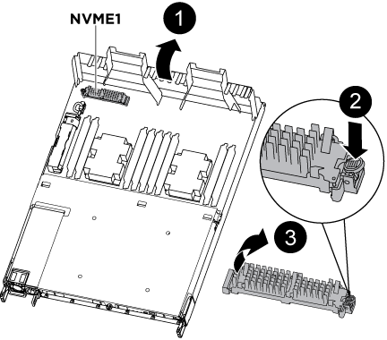

= Reemplace el soporte de arranque - AFF A320
:allow-uri-read: 
:icons: font
:imagesdir: ../media/

Para sustituir el soporte de arranque, debe retirar el módulo del controlador dañado, instalar el soporte de arranque de repuesto y transferir la imagen de inicio a una unidad flash USB.

== Paso 1: Extraiga el módulo del controlador

[role="lead"]
Para acceder a los componentes internos del módulo de controlador, debe extraer el módulo de controlador del chasis.

. Si usted no está ya conectado a tierra, correctamente tierra usted mismo.
. Desconecte la fuente de alimentación del módulo del controlador de la fuente de alimentación.
. Afloje el gancho y la correa de bucle que sujetan los cables al dispositivo de administración de cables y, a continuación, desconecte los cables del sistema y los SFP (si fuera necesario) del módulo del controlador, manteniendo un seguimiento del lugar en el que estaban conectados los cables.
+
image::../media/drw_a320_controller_cable_unplug_animated_gif.png[Extracción del dispositivo de gestión de cables]

+
Deje los cables en el dispositivo de administración de cables de manera que cuando vuelva a instalar el dispositivo de administración de cables, los cables estén organizados.

. Retire y retire los dispositivos de administración de cables de los lados izquierdo y derecho del módulo del controlador.
. Extraiga el módulo de la controladora del chasis:
+
image::../media/drw_a320_controller_remove_animated_gif.png[Quitar la controladora]

+
.. Inserte el índice en el mecanismo de bloqueo a ambos lados del módulo del controlador.
.. Presione hacia abajo la lengüeta naranja de la parte superior del mecanismo de bloqueo hasta que se separe el pasador de bloqueo del chasis.
+
El gancho del mecanismo de bloqueo debe estar casi en vertical y debe estar alejado del pasador del chasis.

.. Tire suavemente del módulo del controlador unas pulgadas hacia usted para que pueda agarrar los lados del módulo del controlador.
.. Con ambas manos, tire suavemente del módulo del controlador para sacarlo del chasis y configúrelo en una superficie plana y estable.

== Paso 2: Sustituya el soporte de arranque

Debe localizar el medio de arranque en el módulo de la controladora y, a continuación, seguir las instrucciones para reemplazarlo.

. Abra el conducto de aire y localice el soporte de arranque con la siguiente ilustración o el mapa de FRU en el módulo del controlador:
. Localice y retire el soporte de arranque del módulo de la controladora:
+

+
.. Pulse el botón azul al final del soporte de arranque hasta que el labio del soporte de arranque desaparezca el botón azul.
.. Gire el soporte del maletero hacia arriba y tire con cuidado del soporte del maletero para sacarlo del zócalo.
+
... Compruebe el soporte del maletero para asegurarse de que está asentado completamente en la toma.

+
Si es necesario, extraiga el soporte de arranque y vuelva a colocarlo en la toma.

. Bloquee el soporte de arranque en su sitio:
+
.. Gire el soporte de arranque hacia abajo hacia la placa base.
.. Con el botón azul, coloque un dedo en el extremo del soporte de arranque y presione el extremo del soporte de inicio para activar el botón azul de bloqueo.
.. Mientras presiona el soporte del maletero, levante el botón de bloqueo azul para bloquear el soporte del maletero en su sitio.

. Cierre el conducto de aire.

== Paso 3: Transfiera la imagen de inicio al soporte de arranque mediante una unidad flash USB

El soporte de arranque de repuesto que ha instalado no tiene una imagen de arranque, por lo que debe transferir una imagen de arranque mediante una unidad flash USB.

* Debe tener una unidad flash USB, formateada a MBR/FAT32, con una capacidad mínima de 4 GB
* Una copia de la misma versión de imagen de ONTAP que la controladora dañada en funcionamiento. Puede descargar la imagen adecuada en la sección Descargas del sitio de soporte de NetApp
+
** Si NVE está habilitado, descargue la imagen con el cifrado de volúmenes de NetApp, como se indica en el botón de descarga.
** Si el cifrado de volúmenes de NetApp no está habilitado, descargue la imagen sin el cifrado de volúmenes de NetApp, como se indica en el botón de descarga.

* Si el sistema es un par de alta disponibilidad, debe tener una conexión de red.
* Si el sistema es independiente, no necesita una conexión de red, pero debe realizar un reinicio adicional al restaurar el sistema de archivos var.
+
.. Descargue y copie la imagen del servicio adecuada del sitio de soporte de NetApp en la unidad flash USB.
+
... Descargue la imagen de servicio en su espacio de trabajo en su portátil.
... Descomprima la imagen de servicio.
+

NOTE: Si va a extraer el contenido mediante Windows, no utilice winzip para extraer la imagen netboot. Utilice otra herramienta de extracción, como 7-Zip o WinRAR.

+
Hay dos carpetas en el archivo de imagen del servicio descomprimido:

+
**** arranque
**** efi

... Copie la carpeta efi en el directorio superior de la unidad flash USB.
+
La unidad flash USB debe tener la carpeta efi y la misma versión de la imagen de servicio (BIOS) de la que se ejecuta el controlador dañado.

... Extraiga la unidad flash USB del ordenador portátil.

.. Si aún no lo ha hecho, cierre el conducto de aire.
.. Alinee el extremo del módulo del controlador con la abertura del chasis y, a continuación, empuje suavemente el módulo del controlador hasta la mitad del sistema.
.. Vuelva a instalar el dispositivo de administración de cables y vuelva a instalar el sistema, según sea necesario.
+
Al realizar la copia, recuerde volver a instalar los convertidores de medios (SFP o QSFP) si se retiraron.

.. Enchufe el cable de alimentación en la fuente de alimentación y vuelva a instalar el retenedor del cable de alimentación.
.. Inserte la unidad flash USB en la ranura USB del módulo de controlador.
+
Asegúrese de instalar la unidad flash USB en la ranura indicada para dispositivos USB, y no en el puerto de consola USB.

.. Complete la reinstalación del módulo del controlador:
+
... Asegúrese de que los brazos del pestillo están bloqueados en la posición extendida.
... Con los brazos del pestillo, empuje el módulo del controlador hacia el compartimiento del chasis hasta que se detenga.
+

NOTE: No empuje hacia abajo el mecanismo de bloqueo en la parte superior de los brazos del pestillo. Si lo hace, levante el mecanismo de bloqueo y prohíba deslizar el módulo del controlador en el chasis.

... Presione y sostenga las lengüetas naranjas en la parte superior del mecanismo de bloqueo.
... Empuje suavemente el módulo de la controladora en el compartimento del chasis hasta que quede alineado con los bordes del chasis.
+

NOTE: Los brazos del mecanismo de bloqueo se deslizan en el chasis.

+
El módulo de la controladora comienza a arrancar tan pronto como se asienta completamente en el chasis.

... Suelte los pestillos para bloquear el módulo del controlador en su lugar.
... Si aún no lo ha hecho, vuelva a instalar el dispositivo de administración de cables.

.. Interrumpa el proceso de arranque pulsando Ctrl-C para detenerse en el símbolo del sistema DEL CARGADOR.
+
Si pierde este mensaje, pulse Ctrl-C, seleccione la opción de arrancar en modo de mantenimiento y, a continuación, detenga el nodo para arrancar en EL CARGADOR.

.. Desde el símbolo DEL SISTEMA DEL CARGADOR, arranque la imagen de recuperación desde la unidad flash USB: `boot_recovery`
+
La imagen se descarga desde la unidad flash USB.

.. Cuando se le solicite, introduzca el nombre de la imagen o acepte la imagen predeterminada que se muestra dentro de los corchetes de la pantalla.
.. Después de instalar la imagen, inicie el proceso de restauración:
+
... Registre la dirección IP del nodo dañado que se muestra en la pantalla.
... Pulse `y` cuando se le solicite que restaure la configuración de copia de seguridad.
... Pulse `y` cuando se le solicite sobrescribir /etc/ssh/ssh_host_dsa_key.

.. En el nodo asociado en el nivel de privilegio avanzado, inicie la sincronización de configuración con la dirección IP registrada en el paso anterior: `system node restore-backup -node local -target-address _impaired_node_IP_address_`
.. Si la restauración se realiza correctamente, pulse `y` en el nodo dañado cuando se le solicite que utilice la copia restaurada?.
.. Pulse `y` cuando vea que el procedimiento de confirmación de copia de seguridad se ha realizado correctamente y, a continuación, pulse `y` cuando se le solicite reiniciar el nodo.
.. Compruebe que las variables de entorno están establecidas de la forma esperada.
+
... Lleve el nodo al aviso DEL CARGADOR.
+
En el símbolo del sistema de ONTAP, puede emitir el comando system node halt -Skip-lif-migration-before-shutdown true -ignore-quorum-warnings true -inhibition-takeover true.

... Compruebe la configuración de la variable de entorno con el `printenv` comando.
... Si una variable de entorno no está establecida como se espera, modifíquela con el `setenv __environment-variable-name__ __changed-value__` comando.
... Guarde los cambios mediante `savenv` comando.
... Reiniciar el nodo.

.. Con el nodo reiniciado dañado, se muestra el `Waiting for giveback...` mensaje, realice una devolución del nodo en buen estado:
+
[cols="1,2"]
|===
| Si el sistema está en... | Realice lo siguiente... 

 a| 
Un par de alta disponibilidad
 a| 
Después de que el nodo dañado muestre el `Waiting for giveback...` mensaje, realice una devolución del nodo en buen estado:

... Desde el nodo en buen estado: `storage failover giveback -ofnode partner_node_name`
+
El nodo dañado vuelve a tomar su almacenamiento, termina de arrancarse y, a continuación, se reinicia y el nodo vuelve a tomar el control en buen estado.

+

NOTE: Si el retorno se vetó, puede considerar la sustitución de los vetos.

+
https://docs.netapp.com/us-en/ontap/high-availability/index.html["Gestión de parejas de HA"^]

... Supervise el progreso de la operación de devolución mediante el `storage failover show-giveback` comando.
... Una vez completada la operación de devolución, confirme que el par de alta disponibilidad esté en buen estado y que la toma de control sea posible gracias al uso de `storage failover show` comando.
... Restaure la devolución automática si la deshabilitó con el comando Storage Failover modify.

|===
.. Salga del nivel de privilegio avanzado en el nodo en buen estado.

