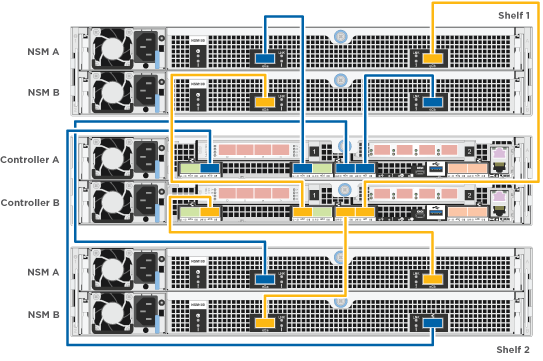

= Guía detallada - AFF A320
:allow-uri-read: 
:icons: font
:imagesdir: ../media/

[role="lead"]
Esta guía ofrece instrucciones detalladas paso a paso para la instalación de un sistema típico de NetApp. Utilice esta guía si desea instrucciones de instalación más detalladas.

== Preparación de la instalación

Para instalar su sistema AFF A320, tendrá que crear una cuenta, registrar el sistema y obtener claves de licencia. También es necesario realizar el inventario del número y tipo de cables adecuados para el sistema y recopilar información específica de la red.

Es necesario tener acceso a Hardware Universe para obtener información sobre los requisitos del sitio, así como información adicional sobre el sistema configurado. También es posible que desee tener acceso a las notas de la versión de ONTAP para obtener más información sobre este sistema.

https://["Hardware Universe de NetApp"]

http://["Busque las notas de la versión de ONTAP 9"]

Debe proporcionar lo siguiente en el sitio:

* Espacio en rack para el sistema de almacenamiento
* Destornillador Phillips número 2
* Cables de red adicionales para conectar el sistema al conmutador de red y al portátil o a la consola con un navegador Web
* Un portátil o consola con una conexión RJ-45 y acceso a un explorador Web
+
.. Extraiga el contenido de todas las cajas.
.. Registre el número de serie del sistema de las controladoras.
+
image::../media/drw_ssn_label.png[etiqueta ssn drw]

.. Configure su cuenta:
+
... Inicie sesión en su cuenta existente o cree una cuenta.
... Registre su sistema.
+
https://["Registro de productos de NetApp"]

.. Realice un inventario y anote el número y los tipos de cables recibidos.
+
En la siguiente tabla se identifican los tipos de cables que pueden recibir. Si recibe un cable no enumerado en la tabla, consulte la Hardware Universe para localizar el cable e identificar su uso.

+
https://["Hardware Universe de NetApp"]

+
[cols="1,2,1,2"]
|===
| Tipo de cable... | Número de pieza y longitud | Tipo de conector | Durante... 

 a| 
Cable de 100 GbE (QSF(28)
 a| 
X66211A-05 (112-00595), 0,5 m

X66211A-1 (112-00573), 1 m.

X66211A-2 (112-00574), 2 m

X66211A-5 (112-00574), 5 m
 a| 
image:../media/oie_cable100_gbe_qsfp28.png[""]
 a| 
Datos de almacenamiento, interconexión del clúster/alta disponibilidad y Ethernet (dependiendo del pedido)

 a| 
Cable de 40 GbE
 a| 
X66211A-1 (112-00573), 1 m;

X66211A-3 (112-00543), 3 m;

X66211A-5 (112-00576), 5 m
 a| 
image:../media/oie_cable_sfp_gbe_copper.png[""]
 a| 
Datos de almacenamiento, interconexión del clúster/alta disponibilidad y Ethernet (dependiendo del pedido)

 a| 
Cable Ethernet - MPO
 a| 
X66200-2 (112-00326), 2 m

X66250-5 (112-00328), 5 m

X66250-30 (112-00331), 30 m.
 a| 
image:../media/oie_cable_etherned_mpo.png[""]
 a| 
Cable Ethernet (depende del pedido)

 a| 
Cables ópticos
 a| 
SR:

X6553-R6 (112-00188), 2 m

X6554-R6 (112-00189), 15 m.

X6537-R6 (112-00091), 30 m.

LR:

X66250-3 (112-00342), 2 m

X66260-5 (112-00344), 5 m

X66260-30 (112-00354), 30 m.
 a| 
image:../media/oie_cable_fiber_lc_connector.png[""]
 a| 
Configuraciones de FC (según pedido)

 a| 
RJ-45 (dependiente del pedido)
 a| 
X6585-R6 (112-00291), 3 m

X6562-R6 (112-00196), 5 m
 a| 
image:../media/oie_cable_rj45.png[""]
 a| 
Red de gestión

 a| 
Cable de consola Micro-USB
 a| 
No aplicable
 a| 
image:../media/oie_cable_micro_usb.png[""]
 a| 
Conexión de consola utilizada durante la configuración del software si el portátil o la consola no admite el descubrimiento de red.

 a| 
Cables de alimentación
 a| 
No aplicable
 a| 
image:../media/oie_cable_power.png[""]
 a| 
Encendido del sistema

|===
.. Descargue y rellene la _Cluster Configuration Worksheet_.
+
https://["Hoja de datos para la configuración del clúster"]

== Instale el hardware

Debe instalar el sistema en un rack de 4 parantes o armario del sistema de NetApp, según corresponda.

. Instale los kits de raíles, según sea necesario.
. Instale y asegure el sistema siguiendo las instrucciones incluidas con el kit de raíl.
+

NOTE: Debe ser consciente de los problemas de seguridad asociados con el peso del sistema.

+
image::../media/drw_a320_weight_label.png[etiqueta de peso drw a320]

. Conecte los dispositivos de administración de cables (como se muestra).
+
image::../media/drw_a320_cable_management_arms.png[brazos de gestión de cables drw a320]

. Coloque el panel frontal en la parte delantera del sistema.

== Conecte los controladores a la red

Puede conectar las controladoras a la red mediante el método de clúster sin switch de dos nodos o mediante la red de interconexión de clúster.

=== Opción 1: Conecte el cable de un clúster sin switch de dos nodos

Los puertos de datos opcionales, las tarjetas NIC opcionales y los puertos de gestión de los módulos de la controladora se conectan a los switches. Los puertos de interconexión de clúster/alta disponibilidad se cablean en ambos módulos de controladoras.

Debe haberse puesto en contacto con el administrador de red para obtener información sobre la conexión del sistema a los switches.

Asegúrese de comprobar que la flecha de la ilustración tenga la orientación correcta de la lengüeta de extracción del conector del cable.

image::../media/oie_cable_pull_tab_up.png[lengüeta para tirar del cable de la oie]

NOTE: Al insertar el conector, debería sentir que hace clic en su lugar; si no cree que hace clic, quítelo, gírelo y vuelva a intentarlo.

. Se puede usar la ilustración o las instrucciones paso a paso para completar el cableado entre las controladoras y los switches:
+
image::../media/drw_a320_tnsc_network_cabling_composite_animated_gif.png[gif animados de cableado de red drw a320 tnsc compuesto]

+
[cols="1,2"]
|===
| Paso | Lleve a cabo cada módulo de la controladora 

 a| 
image:../media/oie_legend_icon_1_lg.png[""]
 a| 
Conecte los cables de los puertos de clúster/alta disponibilidad entre sí mediante el cable de 100 GbE (QSFP28):

** e0a a e0a
** e0d a e0dimage:../media/drw_a320_tnsc_cluster_ha_connection_step1a.png[""]

 a| 
image:../media/oie_legend_icon_2_o.png[""]
 a| 
Si va a utilizar los puertos incorporados para una conexión de red de datos, conecte los cables de 100 GbE o 40 GbE a los switches de red de datos adecuados:

** e0g y e0himage:../media/drw_a320_onboard_data_connection_step2.png[""]

 a| 
image:../media/oie_legend_icon_3_dr.png[""]
 a| 
Si está utilizando las tarjetas NIC para las conexiones Ethernet o FC, conecte las tarjetas NIC a los conmutadores correspondientes:

image::../media/drw_a320_nic_connections_step3.png[conexiones nic drw a320 paso 3]

 a| 

 a| 
Conecte los puertos e0M a los switches de red de gestión mediante los cables RJ45.

image:../media/drw_a320_management_port_connection_step4.png[""]

 a| 
image:../media/oie_legend_icon_attn_symbol.png[""]
 a| 
NO enchufe los cables de alimentación en este momento.

|===
. Conecte los cables de almacenamiento: <<Conecte los controladores a las bandejas de unidades>>

=== Opción 2: Cableado de un clúster de switches

Los puertos de datos opcionales, las tarjetas NIC opcionales y los puertos de gestión de los módulos de la controladora se conectan a los switches. Los puertos de interconexión de clúster/alta disponibilidad se cablean al switch cluster/ha.

Debe haberse puesto en contacto con el administrador de red para obtener información sobre la conexión del sistema a los switches.

Asegúrese de comprobar que la flecha de la ilustración tenga la orientación correcta de la lengüeta de extracción del conector del cable.

image::../media/oie_cable_pull_tab_up.png[lengüeta para tirar del cable de la oie]

NOTE: Al insertar el conector, debería sentir que hace clic en su lugar; si no cree que hace clic, quítelo, gírelo y vuelva a intentarlo.

. Se puede usar la ilustración o las instrucciones paso a paso para completar el cableado entre las controladoras y los switches:
+
image::../media/drw_a320_switched_network_cabling_composite_animated_GIF.png[Cableado de red conmutada drw a320 compuesto GIF animado]

+
[cols="1,3"]
|===
| Paso | Lleve a cabo cada módulo de la controladora 

 a| 
image:../media/oie_legend_icon_1_lg.png[""]
 a| 
Conecte los puertos del clúster/ha al switch del clúster/ha con el cable 100 GbE (QSFP28):

** E0a en ambas controladoras en el switch de clúster/alta disponibilidad
** E0d en ambas controladoras en el switch de clúster/alta disponibilidadimage:../media/drw_a320_switched_cluster_ha_connection_step1b.png[""]

 a| 
image:../media/oie_legend_icon_2_o.png[""]
 a| 
Si va a utilizar los puertos incorporados para una conexión de red de datos, conecte los cables de 100 GbE o 40 GbE a los switches de red de datos adecuados:

** e0g y e0himage:../media/drw_a320_onboard_data_connection_step2.png[""]

 a| 
image:../media/oie_legend_icon_3_dr.png[""]
 a| 
Si está utilizando las tarjetas NIC para las conexiones Ethernet o FC, conecte las tarjetas NIC a los conmutadores correspondientes:

image::../media/drw_a320_nic_connections_step3.png[conexiones nic drw a320 paso 3]

 a| 

 a| 
Conecte los puertos e0M a los switches de red de gestión mediante los cables RJ45.

image:../media/drw_a320_management_port_connection_step4.png[""]

 a| 
image:../media/oie_legend_icon_attn_symbol.png[""]
 a| 
NO enchufe los cables de alimentación en este momento.

|===
. Conecte los cables de almacenamiento: <<Conecte los controladores a las bandejas de unidades>>

== Conecte los controladores a las bandejas de unidades

Debe cablear las controladoras a las bandejas con los puertos de almacenamiento internos.

=== Opción 1: Conecte las controladoras a una bandeja de unidades única

Debe cablear cada controladora a los módulos NSM de la bandeja de unidades NS224.

Asegúrese de comprobar que la flecha de la ilustración tenga la orientación correcta de la lengüeta de extracción del conector del cable.

image::../media/oie_cable_pull_tab_up.png[lengüeta para tirar del cable de la oie]

NOTE: Al insertar el conector, debería sentir que hace clic en su lugar; si no cree que hace clic, quítelo, gírelo y vuelva a intentarlo.

. Puede usar la ilustración o las instrucciones paso a paso para cablear las controladoras a una sola bandeja.
+
image::../media/drw_a320_single_shelf_connections_animated_gif.png[gif animados de conexiones de una sola bandeja drw a320]

+
[cols="1,3"]
|===
| Paso | Lleve a cabo cada módulo de la controladora 

 a| 
image:../media/oie_legend_icon_1_mb.png[""]
 a| 
Conecte la controladora A a la bandeja image:../media/drw_a320_storage_cabling_controller_a_single_shelf.png[""]

 a| 
image:../media/oie_legend_icon_2_lo.png[""]
 a| 
Conecte la controladora B a la bandeja: image:../media/drw_a320_storage_cabling_controller_b_single_shelf.png[""]

|===
. Para completar la configuración del sistema, consulte <<Completar la configuración y los ajustes del sistema>>

=== Opción 2: Conecte las controladoras a dos bandejas de unidades

Debe cablear cada controladora a los módulos NSM de ambas bandejas de unidades NS224.

Asegúrese de comprobar que la flecha de la ilustración tenga la orientación correcta de la lengüeta de extracción del conector del cable.

image::../media/oie_cable_pull_tab_up.png[lengüeta para tirar del cable de la oie]

NOTE: Al insertar el conector, debería sentir que hace clic en su lugar; si no cree que hace clic, quítelo, gírelo y vuelva a intentarlo.

. Puede usar la siguiente ilustración o los pasos escritos para conectar las controladoras a dos bandejas de unidades.
+

+
[cols="1-3"]
|===
| Paso | Lleve a cabo cada módulo de la controladora 

 a| 
image:../media/oie_legend_icon_1_mb.png[""]
 a| 
Conecte la controladora A a las bandejas: image:../media/drw_a320_2_shelves_cabling_controller_a.png[""]

 a| 
image:../media/oie_legend_icon_2_lo.png[""]
 a| 
Conecte la controladora B a las bandejas: image:../media/drw_a320_2_shelves_cabling_controller_b.png[""]

|===
. Para completar la configuración del sistema, consulte <<Completar la configuración y los ajustes del sistema>>

== Completar la configuración y los ajustes del sistema

Puede completar la instalación y configuración del sistema mediante la detección de clústeres mediante una sola conexión al switch y el portátil, o bien conectarse directamente a una controladora del sistema y luego conectarse al switch de gestión.

=== Opción 1: Completar la configuración y la configuración del sistema si la detección de redes está activada

Si tiene la detección de red habilitada en el portátil, puede completar la configuración y la instalación del sistema mediante la detección automática del clúster.

. Enchufe los cables de alimentación a las fuentes de alimentación de la controladora y luego conéctelos a fuentes de alimentación de diferentes circuitos.
+
El sistema comienza a iniciarse. El arranque inicial puede tardar hasta ocho minutos

. Asegúrese de que el ordenador portátil tiene activado el descubrimiento de red.
+
Consulte la ayuda en línea de su portátil para obtener más información.

. Utilice la siguiente animación para conectar el portátil al conmutador de administración.
+
.Animación: Conecte el portátil al conmutador de administración
video::d61f983e-f911-4b76-8b3a-ab1b0066909b[panopto]
. Seleccione un icono de ONTAP que aparece para detectar:
+
image::../media/drw_autodiscovery_controler_select.png[selección del controlador de detección automática drw]

+
.. Abra el Explorador de archivos.
.. Haga clic en red en el panel izquierdo.
.. Haga clic con el botón derecho del ratón y seleccione Actualizar.
.. Haga doble clic en el icono de ONTAP y acepte los certificados que aparecen en la pantalla.
+

NOTE: XXXXX es el número de serie del sistema para el nodo de destino.

+
Se abrirá System Manager.

. Utilice la configuración guiada de System Manager para configurar el sistema con los datos recogidos en la _Guía de configuración de ONTAP_ de NetApp.
+
https://["Guía de configuración de ONTAP"]

. Compruebe el estado del sistema ejecutando Config Advisor.
. Después de completar la configuración inicial, vaya a la https://["Recursos de documentación de ONTAP  ONTAP System Manager"] Página para obtener información sobre cómo configurar las funciones adicionales en ONTAP.

=== Opción 2: Completar la configuración y la configuración del sistema si la detección de red no está activada

Si el descubrimiento de red no está activado en el portátil, debe completar la configuración y la configuración mediante esta tarea.

. Conecte y configure el portátil o la consola:
+
.. Ajuste el puerto de la consola del portátil o de la consola en 115,200 baudios con N-8-1.
+

NOTE: Consulte la ayuda en línea del portátil o de la consola para saber cómo configurar el puerto de la consola.

.. Conecte el cable de consola al portátil o a la consola mediante el cable de consola incluido con el sistema y, a continuación, conecte el portátil al conmutador de administración de la subred de administración.
+
image::../media/drw_a320_laptop_to_switch_and_controller.png[portátil drw a320 para cambiar y controlador]

.. Asigne una dirección TCP/IP al portátil o consola, utilizando una que esté en la subred de gestión.

. Utilice la animación siguiente para establecer uno o varios ID de bandeja de unidades:
+
.Animación: Configure los identificadores de las bandejas de unidades
video::c600f366-4d30-481a-89d9-ab1b0066589b[panopto]
. Enchufe los cables de alimentación a las fuentes de alimentación de la controladora y luego conéctelos a fuentes de alimentación de diferentes circuitos.
+
El sistema comienza a iniciarse. El arranque inicial puede tardar hasta ocho minutos

. Asigne una dirección IP de gestión de nodos inicial a uno de los nodos.
+
[cols="1,3"]
|===
| Si la red de gestión tiene DHCP... | Realice lo siguiente... 

 a| 
Configurado
 a| 
Registre la dirección IP asignada a las nuevas controladoras.

 a| 
No configurado
 a| 
.. Abra una sesión de consola mediante PuTTY, un servidor terminal o el equivalente para su entorno.
+

NOTE: Si no sabe cómo configurar PuTTY, compruebe la ayuda en línea del ordenador portátil o de la consola.

.. Introduzca la dirección IP de administración cuando se lo solicite el script.

|===
. Mediante System Manager en el portátil o la consola, configure su clúster:
+
.. Dirija su navegador a la dirección IP de gestión de nodos.
+

NOTE: El formato de la dirección es +https://x.x.x.x+.

.. Configure el sistema con los datos recogidos en la _Guía de configuración de ONTAP_ de NetApp.
+
https://["Guía de configuración de ONTAP"]

. Compruebe el estado del sistema ejecutando Config Advisor.
. Después de completar la configuración inicial, vaya a la https://["Recursos de documentación de ONTAP  ONTAP System Manager"] Página para obtener información sobre cómo configurar las funciones adicionales en ONTAP.

