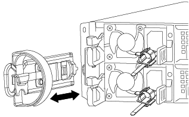

= Sustituya la batería NVDIMM - AFF A320
:allow-uri-read: 
:icons: font
:imagesdir: ../media/

[role="lead"]
Para sustituir la batería NVDIMM, debe extraer el módulo de controlador, extraer la batería, sustituir la batería y, a continuación, volver a instalar el módulo de controlador.

Todos los demás componentes del sistema deben funcionar correctamente; si no es así, debe ponerse en contacto con el soporte técnico.

== Paso 1: Apague el controlador

Para apagar el controlador dañado, debe determinar el estado del controlador y, si es necesario, tomar el control para que el controlador sano siga sirviendo datos del almacenamiento del controlador dañado.

.Acerca de esta tarea
* Si utiliza el cifrado de almacenamiento de NetApp, debe haber restablecido el MSID mediante las instrucciones de link:https://docs.netapp.com/us-en/ontap/encryption-at-rest/return-seds-unprotected-mode-task.html["Volviendo al modo SED a no protegido"].
* Si dispone de un sistema SAN, debe haber comprobado los mensajes de eventos  `cluster kernel-service show`) Para el blade SCSI del controlador dañado. La `cluster kernel-service show` comando muestra el nombre del nodo, el estado de quórum de ese nodo, el estado de disponibilidad de ese nodo y el estado operativo de ese nodo.
+
Cada proceso SCSI-blade debe quórum con los otros nodos del clúster. Todos los problemas deben resolverse antes de continuar con el reemplazo.

* Si tiene un clúster con más de dos nodos, debe estar en quórum. Si el clúster no tiene quórum o si una controladora en buen estado muestra falso según su condición, debe corregir el problema antes de apagar la controladora dañada; consulte link:https://docs.netapp.com/us-en/ontap/system-admin/synchronize-node-cluster-task.html?q=Quorum["Sincronice un nodo con el clúster"^].

.Pasos
. Si AutoSupport está habilitado, elimine la creación automática de casos invocando un mensaje de AutoSupport: `system node autosupport invoke -node * -type all -message MAINT=number_of_hours_downh`
+
El siguiente mensaje de AutoSupport suprime la creación automática de casos durante dos horas: `cluster1:> system node autosupport invoke -node * -type all -message MAINT=2h`

. Deshabilite la devolución automática de la consola de la controladora en buen estado: `storage failover modify –node local -auto-giveback false`
+

NOTE: Cuando vea _do desea desactivar la devolución automática?_, introduzca `y`.

. Lleve la controladora dañada al aviso DEL CARGADOR:
+
[cols="1,2"]
|===
| Si el controlador dañado está mostrando... | Realice lo siguiente... 

 a| 
El aviso del CARGADOR
 a| 
Vaya a Quitar módulo de controlador.

 a| 
Esperando devolución...
 a| 
Pulse Ctrl-C y, a continuación, responda `y` cuando se le solicite.

 a| 
Solicitud del sistema o solicitud de contraseña
 a| 
Retome o detenga el controlador dañado del controlador en buen estado: `storage failover takeover -ofnode _impaired_node_name_`

Cuando el controlador dañado muestre esperando devolución..., pulse Ctrl-C y, a continuación, responda `y`.

|===

== Paso 2: Extraiga el módulo del controlador

Para acceder a los componentes internos del módulo de controlador, debe extraer el módulo de controlador del chasis.

. Si usted no está ya conectado a tierra, correctamente tierra usted mismo.
. Desconecte la fuente de alimentación del módulo del controlador de la fuente de alimentación.
. Afloje el gancho y la correa de bucle que sujetan los cables al dispositivo de administración de cables y, a continuación, desconecte los cables del sistema y los SFP (si fuera necesario) del módulo del controlador, manteniendo un seguimiento del lugar en el que estaban conectados los cables.
+

+
Deje los cables en el dispositivo de administración de cables de manera que cuando vuelva a instalar el dispositivo de administración de cables, los cables estén organizados.

. Retire y retire los dispositivos de administración de cables de los lados izquierdo y derecho del módulo del controlador.
. Extraiga el módulo de la controladora del chasis:
+
image::../media/drw_a320_controller_remove_animated_gif.png[controlador drw a320 retire el gif animado]

+
.. Inserte el índice en el mecanismo de bloqueo a ambos lados del módulo del controlador.
.. Presione hacia abajo la lengüeta naranja de la parte superior del mecanismo de bloqueo hasta que se separe el pasador de bloqueo del chasis.

+
El gancho del mecanismo de bloqueo debe estar casi en vertical y debe estar alejado del pasador del chasis.

+
.. Tire suavemente del módulo del controlador unas pulgadas hacia usted para que pueda agarrar los lados del módulo del controlador.
.. Con ambas manos, tire suavemente del módulo del controlador para sacarlo del chasis y configúrelo en una superficie plana y estable.

== Paso 3: Sustituya la batería NVDIMM

Para sustituir la batería NVDIMM, debe extraer la batería con errores del módulo de la controladora e instalar la batería de repuesto en el módulo de la controladora.

image::../media/drw_a320_nvbat_move_animated_gif.png[gif animados de movimiento en nvbat de drw a320]

. Abra el conducto de aire y localice la batería NVDIMM.
. Localice el enchufe de la batería y apriete el clip en la parte frontal del enchufe de la batería para liberar el enchufe de la toma y, a continuación, desenchufe el cable de la batería de la toma.
. Sujete la batería, presione LA lengüeta de bloqueo azul marcada Y, a continuación, levante la batería para sacarla del soporte y del módulo del controlador.
. Extraiga la batería de repuesto de su paquete.
. Alinee el módulo de la batería con la abertura de la batería y, a continuación, empuje suavemente la batería hasta que encaje en su sitio.
. Vuelva a enchufar el enchufe de la batería al módulo del controlador y, a continuación, cierre el conducto de aire.

== Paso 4: Instale el módulo del controlador

Después de reemplazar el componente en el módulo de controlador, debe reinstalar el módulo de controlador en el chasis y, a continuación, arrancarlo.

. Si aún no lo ha hecho, cierre el conducto de aire de la parte posterior del módulo del controlador y vuelva a instalar la cubierta sobre las tarjetas PCIe.
. Alinee el extremo del módulo del controlador con la abertura del chasis y, a continuación, empuje suavemente el módulo del controlador hasta la mitad del sistema.
+
image::../media/drw_a320_controller_install_animated_gif.png[el controlador drw a320 instala el gif animado]

+

NOTE: No inserte completamente el módulo de la controladora en el chasis hasta que se le indique hacerlo.

. Cablee los puertos de gestión y consola de manera que pueda acceder al sistema para realizar las tareas en las secciones siguientes.
+

NOTE: Conectará el resto de los cables al módulo del controlador más adelante en este procedimiento.

. Complete la reinstalación del módulo del controlador:
+
.. Asegúrese de que los brazos del pestillo están bloqueados en la posición extendida.
.. Con los brazos del pestillo, empuje el módulo del controlador hacia el compartimiento del chasis hasta que se detenga.
.. Presione y sostenga las lengüetas naranjas en la parte superior del mecanismo de bloqueo.
.. Empuje suavemente el módulo de la controladora en el compartimento del chasis hasta que quede alineado con los bordes del chasis.
+

NOTE: Los brazos del mecanismo de bloqueo se deslizan en el chasis.

+
El módulo de la controladora comienza a arrancar tan pronto como se asienta completamente en el chasis.

.. Suelte los pestillos para bloquear el módulo del controlador en su lugar.
.. Recuperar la fuente de alimentación.
.. Si aún no lo ha hecho, vuelva a instalar el dispositivo de administración de cables.

== Paso 5: Restaure el módulo de la controladora a su funcionamiento

Debe volver a conectar el sistema, devolver el módulo de controladora y, a continuación, volver a habilitar el retorno del control automático.

. Recuperar el sistema, según sea necesario.
+
Si ha quitado los convertidores de medios (QSFP o SFP), recuerde volver a instalarlos si está utilizando cables de fibra óptica.

. Devuelva el funcionamiento normal de la controladora y devuelva su almacenamiento: `storage failover giveback -ofnode _impaired_node_name_`
. Si la devolución automática está desactivada, vuelva a habilitarla: `storage failover modify -node local -auto-giveback true`

== Paso 6: Devuelva la pieza que falló a NetApp

Devuelva la pieza que ha fallado a NetApp, como se describe en las instrucciones de RMA que se suministran con el kit. Consulte https://mysupport.netapp.com/site/info/rma["Retorno de artículo  sustituciones"] para obtener más información.
