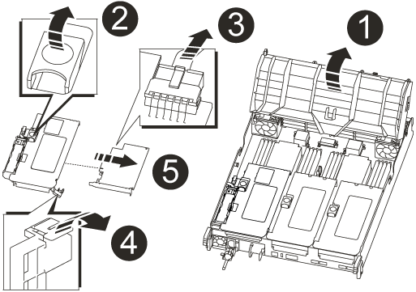

= Sustituya el hardware del módulo de la controladora - AFF A700s
:allow-uri-read: 
:icons: font
:imagesdir: ../media/

[role="lead"]
Para sustituir el hardware del módulo de la controladora, debe retirar la controladora dañada, mover los componentes de FRU al módulo de la controladora de reemplazo, instalar el módulo de la controladora de reemplazo en el chasis y, a continuación, arrancar el sistema en modo de mantenimiento.

== Paso 1: Extraiga el módulo del controlador

Debe quitar el módulo de la controladora del chasis cuando sustituya el módulo de la controladora o sustituya un componente dentro del módulo de la controladora.

. Si usted no está ya conectado a tierra, correctamente tierra usted mismo.
. Afloje el gancho y la correa de bucle que sujetan los cables al dispositivo de administración de cables y, a continuación, desconecte los cables del sistema y los SFP (si fuera necesario) del módulo del controlador, manteniendo un seguimiento del lugar en el que estaban conectados los cables.
+
Deje los cables en el dispositivo de administración de cables de manera que cuando vuelva a instalar el dispositivo de administración de cables, los cables estén organizados.

. Desenchufe la fuente de alimentación del módulo del controlador y, a continuación, desconecte el cable de la fuente de alimentación.
. Retire el dispositivo de administración de cables del módulo del controlador y colóquelo aparte.
. Presione los dos pestillos de bloqueo hacia abajo y, a continuación, gire ambos pestillos hacia abajo al mismo tiempo.
+
El módulo de la controladora se mueve ligeramente fuera del chasis.

+
image::../media/drw_a700s_pcm_remove.png[drw a700s pcm quitar]

+
[cols="1,4"]
|===

 a| 
image:../media/legend_icon_01.png[""]
| Pestillo de bloqueo 

 a| 
image:../media/legend_icon_02.png[""]
 a| 
Pasador de bloqueo

|===
. Deslice el módulo de la controladora para sacarlo del chasis.
+
Asegúrese de que admite la parte inferior del módulo de la controladora cuando la deslice para sacarlo del chasis.

. Coloque el módulo del controlador sobre una superficie plana y estable y, a continuación, abra el conducto de aire:
+
.. Presione las lengüetas de bloqueo de los lados del conducto de aire hacia el centro del módulo del controlador.
.. Deslice el conducto de aire hacia los módulos del ventilador y gírelo hacia arriba hasta su posición completamente abierta.
+
image::../media/drw_a700s_open_air_duct.png[conducto de aire abierto drw a700s]

+
[cols="1,4"]
|===

 a| 
image:../media/legend_icon_01.png[""]
| Lengüetas de bloqueo del conducto de aire 

 a| 
image:../media/legend_icon_02.png[""]
 a| 
Elevadores

 a| 
image:../media/legend_icon_03.png[""]
 a| 
Conducto de aire

|===

== Paso 2: Mover la tarjeta NVRAM

Como parte del proceso de sustitución del controlador, debe extraer la tarjeta NVRAM de la tarjeta vertical 1 del módulo del controlador dañado e instalar la tarjeta en la tarjeta vertical 1 del módulo del controlador de sustitución. Sólo debe volver a instalar la tarjeta vertical 1 en el módulo del controlador de sustitución después de haber movido los módulos DIMM del módulo del controlador defectuoso al módulo del controlador de reemplazo.

. Extraiga la tarjeta vertical NVRAM, la tarjeta vertical 1, del módulo de la controladora:
+
.. Gire el pestillo de bloqueo de la tarjeta vertical en el lado izquierdo de la tarjeta vertical hacia arriba y hacia los ventiladores.
+
La tarjeta vertical NVRAM se eleva ligeramente del módulo de la controladora.

.. Levante la tarjeta vertical NVRAM, levántela hacia los ventiladores de modo que el borde de chapa metálica de la tarjeta vertical salga del borde del módulo de la controladora y levante la tarjeta vertical hacia arriba para extraerla del módulo de la controladora, Y, a continuación, colóquela en una superficie plana y estable para que pueda acceder a la tarjeta NVRAM.
+

+
[cols="1,4"]
|===

 a| 
image:../media/legend_icon_01.png[""]
| Conducto de aire 

 a| 
image:../media/legend_icon_02.png[""]
 a| 
Pestillo de bloqueo de la tarjeta vertical 1

 a| 
image:../media/legend_icon_03.png[""]
 a| 
Enchufe del cable de la batería NVRAM que se conecta a la tarjeta NVRAM

 a| 
image:../media/legend_icon_04.png[""]
 a| 
Soporte de bloqueo de la tarjeta

 a| 
image:../media/legend_icon_05.png[""]
 a| 
Tarjeta NVRAM

|===

. Extraiga la tarjeta NVRAM del módulo de la tarjeta vertical:
+
.. Gire el módulo de la tarjeta vertical de forma que pueda acceder a la tarjeta NVRAM.
.. Desconecte el cable de la batería NVRAM que está conectado a la tarjeta NVRAM.
.. Presione el soporte de bloqueo del lateral de la tarjeta vertical NVRAM y gírelo a la posición abierta.
.. Extraiga la tarjeta NVRAM del módulo de la tarjeta vertical.

. Extraiga la tarjeta vertical NVRAM del módulo de la controladora de reemplazo.
. Instale la tarjeta NVRAM en la tarjeta vertical NVRAM:
+
.. Alinee la tarjeta con la guía de la tarjeta del módulo vertical y la toma de la tarjeta vertical.
.. Deslice la tarjeta directamente en la toma de la tarjeta.
+

NOTE: Asegúrese de que la tarjeta está completamente asentada en la toma de la tarjeta vertical.

.. Conecte el cable de la batería a la toma de la tarjeta NVRAM.
.. Gire el pestillo de bloqueo a la posición bloqueada y asegúrese de que se bloquea en su lugar.

== Paso 3: Mover tarjetas PCIe

Como parte del proceso de reemplazo del controlador, debe quitar ambos módulos de elevador PCIe, Riser 2 (el elevador intermedio) y Riser 3 (elevador en el extremo derecho) del módulo de controlador dañado, quitar las tarjetas PCIe de los módulos elevadores, e instale las tarjetas en los mismos módulos elevadores en el módulo de controlador de reemplazo. Una vez que se hayan movido los DIMM al módulo de la controladora de reemplazo, instalará los módulos de la tarjeta vertical.

IMPORTANT: No instale los elevadores del módulo del controlador defectuoso en el módulo del controlador de repuesto.

. Extraiga la tarjeta vertical PCIe del módulo de la controladora:
+
.. Quite todos los módulos SFP que puedan estar en las tarjetas PCIe.
.. Gire el pestillo de bloqueo del módulo en el lado izquierdo del elevador hacia arriba y hacia los módulos de ventilador.
+
La tarjeta vertical PCIe se eleva ligeramente del módulo de la controladora.

.. Levante la tarjeta vertical PCIe, colóquela hacia arriba hacia los ventiladores de modo que el borde de chapa metálica de la tarjeta vertical salga del borde del módulo de la controladora, extraiga la tarjeta vertical del módulo de la controladora y, a continuación, colóquela en una superficie plana y estable.
+
image::../media/drw_a700s_pcie_replace.png[drw a700s pcie sustituir]

+
[cols="1,4"]
|===

 a| 
image:../media/legend_icon_01.png[""]
| Conducto de aire 

 a| 
image:../media/legend_icon_02.png[""]
 a| 
Pestillo de bloqueo de la tarjeta vertical

 a| 
image:../media/legend_icon_03.png[""]
 a| 
Soporte de bloqueo de la tarjeta

 a| 
image:../media/legend_icon_04.png[""]
 a| 
Tarjeta vertical 2 (tarjeta vertical media) y tarjetas PCI en las ranuras de la tarjeta vertical 2 y 3.

|===

. Extraiga la tarjeta PCIe de la tarjeta vertical:
+
.. Gire la tarjeta vertical de forma que pueda acceder a la tarjeta PCIe.
.. Presione el soporte de bloqueo del lateral de la tarjeta vertical PCIe y gírelo a la posición abierta.
.. Extraiga la tarjeta PCIe de la tarjeta vertical.

. Extraiga la tarjeta vertical correspondiente del módulo de la controladora de sustitución.
. Instale la tarjeta PCIe en el elevador desde el controlador de reemplazo y vuelva a instalar el elevador en el controlador de reemplazo:
+
.. Alinee la tarjeta con la guía de la tarjeta vertical y la toma de la tarjeta vertical y, a continuación, deslícela directamente en la toma de la tarjeta vertical.
+
Asegúrese de que la tarjeta está completamente asentada en la toma de la tarjeta vertical.

.. Vuelva a instalar el elevador en el módulo de controlador de repuesto.
.. Gire el pestillo de bloqueo hasta que encaje en la posición de bloqueo.

. Repita los pasos anteriores para las tarjetas Riser 3 y PCIe en las ranuras 4 y 5 del módulo de controlador dañado.

== Paso 4: Mueva el soporte de arranque

AFF A700s tiene dos dispositivos multimedia de arranque, un medio de arranque primario y secundario o backup. Debe moverlos del controlador dañado al controlador _regrel_ e instalarlos en sus respectivas ranuras en el controlador _regrel_.

El soporte de arranque se encuentra debajo de la tarjeta vertical 2, el módulo de tarjeta vertical PCIe central. Este módulo PCIe debe retirarse para tener acceso al soporte de arranque.

. Busque el soporte de arranque:
+
.. Abra el conducto de aire, si es necesario.
.. Si es necesario, extraiga la tarjeta vertical 2, el módulo PCIe central, desbloqueando el pestillo de bloqueo y extrayendo la tarjeta vertical del módulo de la controladora.
+
image::../media/drw_a700s_boot_media_replace.png[reemplazo del soporte de arranque drw a700s]

+
[cols="1,4"]
|===

 a| 
image:../media/legend_icon_01.png[""]
| Conducto de aire 

 a| 
image:../media/legend_icon_02.png[""]
 a| 
Tarjeta «riser» 2 (módulo PCIe medio)

 a| 
image:../media/legend_icon_03.png[""]
 a| 
Tornillo del soporte del maletero

 a| 
image:../media/legend_icon_04.png[""]
 a| 
Soporte de arranque

|===
. Extraiga el soporte de arranque del módulo del controlador:
+
.. Con un destornillador Phillips del número 1, retire el tornillo que sujeta el soporte del maletero y coloque el tornillo a un lado en un lugar seguro.
.. Sujetando los lados del soporte de arranque, gire suavemente el soporte de arranque hacia arriba, y luego tire del soporte de arranque directamente del zócalo y colóquelo a un lado.

. Mueva el soporte de arranque al nuevo módulo de la controladora e instálelo:
+

NOTE: Instale el soporte de arranque en el mismo socket del módulo de la controladora de reemplazo que se instaló en el módulo de la controladora con deficiencias; el socket de medios de arranque primario (ranura 1) al socket de medios de arranque principal y el socket de medios de arranque secundario (ranura 2) al socket de medios de arranque secundario.

+
.. Alinee los bordes del soporte del maletero con el alojamiento del zócalo y, a continuación, empújelo suavemente en el zócalo.
.. Gire el soporte de arranque hacia abajo hacia la placa base.
.. Fije el soporte de arranque a la placa base mediante el tornillo de soporte de arranque.
+
No apriete en exceso el tornillo o podría dañar el soporte del maletero.

== Paso 5: Mueva los ventiladores

Debe mover los ventiladores del módulo de la controladora dañada al módulo de sustitución cuando sustituya un módulo de la controladora con fallos.

. Retire el módulo del ventilador pinzando las lengüetas de bloqueo del lado del módulo del ventilador y, a continuación, levante el módulo del ventilador para extraerlo del módulo del controlador.
+
image::../media/drw_a700s_replace_fan.png[drw a700s, sustituya el ventilador]

+
[cols="1,4"]
|===

 a| 
image:../media/legend_icon_01.png[""]
| Lengüetas de bloqueo del ventilador 

 a| 
image:../media/legend_icon_02.png[""]
 a| 
Módulo de ventilador

|===
. Mueva el módulo de ventilador al módulo de controlador de repuesto y, a continuación, instale el módulo de ventilador alineando sus bordes con la abertura del módulo de controlador y, a continuación, deslice el módulo de ventilador hacia el módulo de controlador hasta que los pestillos de bloqueo encajen en su lugar.
. Repita estos pasos para los módulos de ventilador restantes.

== Paso 6: Mover los DIMM del sistema

Para mover los módulos DIMM, búsquelos y muévalos del controlador dañado al controlador de recambio y siga la secuencia específica de pasos.

. Localice los DIMM en el módulo del controlador.
+
image::../media/drw_a700s_dimm_replace.png[drw a700s dimm sustituir]

+
[cols="1,4"]
|===

 a| 
image:../media/legend_icon_01.png[""]
| Conducto de aire 

 a| 
image:../media/legend_icon_02.png[""]
 a| 
Tarjeta vertical 1 y banco DIMM 1-4

 a| 
image:../media/legend_icon_03.png[""]
 a| 
Tarjetas verticales 2 y bancos DIMM 5-8 y 9-12

 a| 
image:../media/legend_icon_04.png[""]
 a| 
Tarjeta vertical 3 y módulo DIMM 13-16

|===
. Tenga en cuenta la orientación del DIMM en el socket para poder insertar el DIMM en el módulo de controlador de reemplazo en la orientación adecuada.
. Extraiga el DIMM de su ranura empujando lentamente las dos lengüetas expulsoras del DIMM a ambos lados del DIMM y, a continuación, extraiga el DIMM de la ranura.
+

NOTE: Sujete con cuidado el módulo DIMM por los bordes para evitar la presión sobre los componentes de la placa de circuitos DIMM.

. Localice la ranura en la que está instalando el DIMM.
. Asegúrese de que las lengüetas del expulsor DIMM del conector están en posición abierta y, a continuación, inserte el DIMM directamente en la ranura.
+
El módulo DIMM encaja firmemente en la ranura, pero debe entrar fácilmente. Si no es así, realinee el DIMM con la ranura y vuelva a insertarlo.

+

NOTE: Inspeccione visualmente el módulo DIMM para comprobar que está alineado de forma uniforme y completamente insertado en la ranura.

. Empuje con cuidado, pero firmemente, en el borde superior del DIMM hasta que las lengüetas expulsoras encajen en su lugar sobre las muescas de los extremos del DIMM.
. Repita estos pasos para los módulos DIMM restantes.

== Paso 7: Instale el módulo NVRAM

Para instalar el módulo NVRAM, debe seguir la secuencia específica de pasos.

. Instale la tarjeta vertical en el módulo de la controladora:
+
.. Alinee el reborde de la tarjeta vertical con la parte inferior de la chapa metálica del módulo del controlador.
.. Guíe la tarjeta vertical a lo largo de las patillas del módulo de la controladora y, a continuación, baje la tarjeta vertical al módulo de la controladora.
.. Gire el pestillo de bloqueo hacia abajo y haga clic en él hasta la posición de bloqueo.
+
Cuando está bloqueado, el pestillo de bloqueo está alineado con la parte superior de la tarjeta vertical y la tarjeta vertical se asienta directamente en el módulo del controlador.

.. Vuelva a insertar todos los módulos SFP que se hayan extraído de las tarjetas PCIe.

== Paso 8: Mueva la batería NVRAM

Al sustituir el módulo de controlador, debe mover la batería NVRAM del módulo de controlador dañado al módulo de controlador de reemplazo

. Localice la batería NVRAM en el lado izquierdo del módulo vertical, Riser 1.
+
image::../media/drw_a700s_nvme_battery_replace.png[reemplazo de la batería drw a700s nvme]

+
[cols="1,4"]
|===

 a| 
image:../media/legend_icon_01.png[""]
| Enchufe de la batería NVRAM 

 a| 
image:../media/legend_icon_02.png[""]
 a| 
Lengüeta azul de bloqueo de la batería NVRAM

|===
. Localice el enchufe de la batería y apriete el clip en la parte frontal del enchufe de la batería para liberar el enchufe de la toma y, a continuación, desenchufe el cable de la batería de la toma.
. Sujete la batería, presione LA lengüeta de bloqueo azul marcada Y, a continuación, levante la batería para sacarla del soporte y del módulo del controlador.
. Mueva la batería al módulo de la controladora de reemplazo y, a continuación, instálela en la tarjeta vertical NVRAM:
+
.. Deslice la batería hacia abajo a lo largo de la pared lateral de chapa metálica hasta que las lengüetas de soporte del gancho lateral de la pared entren en las ranuras de la batería y el pestillo de la batería se acople y se bloquee en su lugar.
.. Presione firmemente la batería para asegurarse de que está bloqueada en su lugar.
.. Enchufe la clavija de la batería a la toma de la tarjeta vertical y asegúrese de que el enchufe se bloquea en su lugar.

== Paso 9: Instale una tarjeta «riser» PCIe

Para instalar una tarjeta «riser» PCIe, debe seguir una secuencia específica de pasos.

. Si usted no está ya conectado a tierra, correctamente tierra usted mismo.
. Instale la tarjeta vertical en el módulo de la controladora:
+
.. Alinee el reborde de la tarjeta vertical con la parte inferior de la chapa metálica del módulo del controlador.
.. Guíe la tarjeta vertical a lo largo de las patillas del módulo de la controladora y, a continuación, baje la tarjeta vertical al módulo de la controladora.
.. Gire el pestillo de bloqueo hacia abajo y haga clic en él hasta la posición de bloqueo.
+
Cuando está bloqueado, el pestillo de bloqueo está alineado con la parte superior de la tarjeta vertical y la tarjeta vertical se asienta directamente en el módulo del controlador.

.. Vuelva a insertar todos los módulos SFP que se hayan extraído de las tarjetas PCIe.

. Repita los pasos anteriores para las tarjetas Riser 3 y PCIe en las ranuras 4 y 5 del módulo de controlador dañado.

== Paso 10: Mueva la fuente de alimentación

Cuando reemplace un módulo de controlador, debe mover la fuente de alimentación y la fuente de alimentación del módulo de controlador dañado al módulo de controlador de reemplazo.

. Si usted no está ya conectado a tierra, correctamente tierra usted mismo.
. Gire el mango de la leva de forma que pueda utilizarse para extraer la fuente de alimentación del módulo del controlador mientras presiona la lengüeta de bloqueo.
+

CAUTION: El suministro de alimentación es corto. Utilice siempre dos manos para apoyarlo cuando lo extraiga del módulo del controlador de modo que no se mueva repentinamente del módulo del controlador y le herir.

+
image::../media/drw_a700s_replace_psu.gif[drw a700s reemplaza la fuente de alimentación]

+
|===

 a| 
image:../media/legend_icon_01.png[""]
| Lengüeta azul de bloqueo de la fuente de alimentación 

 a| 
image:../media/legend_icon_02.png[""]
 a| 
Suministro de alimentación

|===
. Mueva la fuente de alimentación al nuevo módulo de controlador y, a continuación, instálela.
. Con ambas manos, sujete y alinee los bordes de la fuente de alimentación con la abertura del módulo del controlador y, a continuación, empuje suavemente la fuente de alimentación en el módulo del controlador hasta que la lengüeta de bloqueo encaje en su sitio.
+
Las fuentes de alimentación sólo se acoplarán correctamente al conector interno y se bloquearán de una manera.

+

NOTE: Para evitar dañar el conector interno, no ejerza demasiada fuerza al deslizar la fuente de alimentación hacia el sistema.

. Retire el panel de relleno de la PSU del módulo del controlador dañado y, a continuación, instálelo en el módulo del controlador de sustitución.

== Paso 11: Instale el módulo del controlador

Una vez que todos los componentes se han movido del módulo de controlador dañado al módulo de controlador de repuesto, debe instalar el módulo de controlador de repuesto en el chasis y luego arrancar en modo de mantenimiento.

. Si usted no está ya conectado a tierra, correctamente tierra usted mismo.
. Si aún no lo ha hecho, cierre el conducto de aire:
+
.. Gire el conducto de aire hacia abajo hasta el módulo del controlador.
.. Deslice el conducto de aire hacia los elevadores hasta que las lengüetas de bloqueo encajen en su lugar.
.. Inspeccione el conducto de aire para asegurarse de que está correctamente asentado y bloqueado en su lugar.
+
image::../media/drw_a700s_close_air_duct.png[drw a700s cierra el conducto de aire]

+
|===

 a| 
image:../media/legend_icon_01.png[""]
| Lengüetas de bloqueo 

 a| 
image:../media/legend_icon_02.png[""]
 a| 
Deslice el émbolo

|===
. Alinee el extremo del módulo del controlador con la abertura del chasis y, a continuación, empuje suavemente el módulo del controlador hasta la mitad del sistema.
+

NOTE: No inserte completamente el módulo de la controladora en el chasis hasta que se le indique hacerlo.

. Cablee los puertos de gestión y consola de manera que pueda acceder al sistema para realizar las tareas en las secciones siguientes.
+

NOTE: Conectará el resto de los cables al módulo del controlador más adelante en este procedimiento.

. Complete la reinstalación del módulo del controlador:
+
.. Empuje firmemente el módulo de la controladora en el chasis hasta que se ajuste al plano medio y esté totalmente asentado.
+
Los pestillos de bloqueo se elevan cuando el módulo del controlador está completamente asentado.

+

NOTE: No ejerza una fuerza excesiva al deslizar el módulo del controlador hacia el chasis para evitar dañar los conectores.

+
El módulo de la controladora comienza a arrancar tan pronto como se asienta completamente en el chasis. Esté preparado para interrumpir el proceso de arranque.

.. Gire los pestillos de bloqueo hacia arriba, inclinándolos para que los pasadores de bloqueo se puedan separar y, a continuación, bajarlos hasta la posición de bloqueo.
.. Para interrumpir el proceso de arranque, pulse `Ctrl-C`.

. Conecte los cables del sistema y los módulos del transceptor al módulo del controlador y vuelva a instalar el dispositivo de administración de cables.
. Enchufe los cables de alimentación en las fuentes de alimentación y vuelva a instalar los retenes del cable de alimentación.
. Si el sistema está configurado para admitir conexiones de clúster de 10 GbE y conexiones de datos en NIC de 40 GbE o puertos internos, convierta estos puertos a conexiones de 10 GbE mediante el comando nicadmin convert del modo de mantenimiento.
+

NOTE: Asegúrese de salir del modo de mantenimiento después de completar la conversión.

