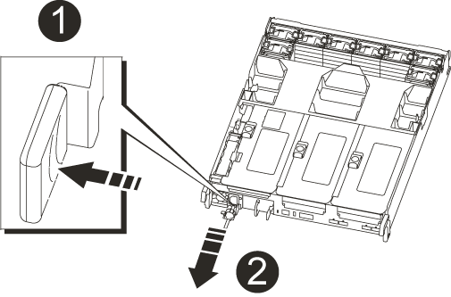

= Intercambio en caliente de una fuente de alimentación - AFF A700s
:allow-uri-read: 
:icons: font
:imagesdir: ../media/

[role="lead"]
El intercambio de una fuente de alimentación implicaba desconectar el suministro de alimentación (PSU) objetivo de la fuente de alimentación, desconectar el cable de alimentación, quitar el PSU antiguo e instalar el PSU de reemplazo y, a continuación, volver a conectarlo a la fuente de alimentación.

* Los sistemas de alimentación son redundantes y intercambiables en caliente.
* Este procedimiento se escribe para sustituir una fuente de alimentación a la vez.
+

NOTE: Se recomienda sustituir el suministro de alimentación en un plazo de dos minutos tras retirarlo del chasis. El sistema sigue funcionando, pero ONTAP envía mensajes a la consola acerca del suministro de alimentación degradado hasta que se reemplaza el suministro de alimentación.

* El número de suministros de alimentación en el sistema depende del modelo.
* Las fuentes de alimentación están de alcance automático.

.Pasos
. Si usted no está ya conectado a tierra, correctamente tierra usted mismo.
. Identifique la fuente de alimentación que desea reemplazar, basándose en mensajes de error de la consola o a través de los LED de las fuentes de alimentación.
. Desconecte la fuente de alimentación:
+
.. Abra el retenedor del cable de alimentación y, a continuación, desconecte el cable de alimentación de la fuente de alimentación.
.. Desconecte el cable de alimentación de la fuente de alimentación.

. Gire el mango de la leva de forma que pueda utilizarse para extraer la fuente de alimentación del módulo del controlador mientras presiona la lengüeta de bloqueo.
+

CAUTION: El suministro de alimentación es corto. Utilice siempre dos manos para apoyarlo cuando lo extraiga del módulo del controlador de modo que no se mueva repentinamente del módulo del controlador y le herir.

+

+
[cols="1,4"]
|===

 a| 
image:../media/icon_round_1.png["Número de llamada 1"]
 a| 
Lengüeta azul de bloqueo de la fuente de alimentación

 a| 
image:../media/icon_round_2.png["Número de llamada 2"]
 a| 
Suministro de alimentación

|===
. Con ambas manos, sujete y alinee los bordes de la fuente de alimentación con la abertura del módulo del controlador y, a continuación, empuje suavemente la fuente de alimentación en el módulo del controlador hasta que la lengüeta de bloqueo encaje en su sitio.
+
Las fuentes de alimentación sólo se acoplarán correctamente al conector interno y se bloquearán de una manera.

+

NOTE: Para evitar dañar el conector interno, no ejerza demasiada fuerza al deslizar la fuente de alimentación hacia el sistema.

. Cierre el mango de la leva balanceándolo hasta que vaya.
. Vuelva a conectar el cableado de la fuente de alimentación:
+
.. Vuelva a conectar el cable de alimentación a la fuente de alimentación y a la fuente de alimentación.
.. Fije el cable de alimentación a la fuente de alimentación con el retenedor del cable de alimentación.

+
Una vez restaurada la alimentación de la fuente de alimentación, el LED de estado debería ser verde.

. Devuelva la pieza que ha fallado a NetApp, como se describe en las instrucciones de RMA que se suministran con el kit. Consulte https://mysupport.netapp.com/site/info/rma["Devolución de piezas y sustituciones"^] la página para obtener más información.

