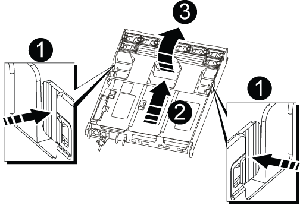

= Sustituya la batería del reloj en tiempo real AFF A700s
:allow-uri-read: 
:icons: font
:imagesdir: ../media/

[role="lead"]
Puede sustituir la batería del reloj en tiempo real (RTC) en el módulo del controlador de manera que los servicios y aplicaciones del sistema que dependen de la sincronización precisa del tiempo sigan funcionando.

* Puede utilizar este procedimiento con todas las versiones de ONTAP admitidas por el sistema
* Todos los demás componentes del sistema deben funcionar correctamente; si no es así, debe ponerse en contacto con el soporte técnico.

== Paso 1: Apague el controlador dañado

Para apagar el controlador dañado, debe determinar el estado del controlador y, si es necesario, tomar el control para que el controlador sano siga sirviendo datos del almacenamiento del controlador dañado.

Si tiene un clúster con más de dos nodos, debe estar en quórum. Si el clúster no tiene quórum o si una controladora en buen estado muestra falso según su condición, debe corregir el problema antes de apagar la controladora dañada; consulte link:https://docs.netapp.com/us-en/ontap/system-admin/synchronize-node-cluster-task.html?q=Quorum["Sincronice un nodo con el clúster"^].

.Pasos
. Si AutoSupport está habilitado, elimine la creación automática de casos invocando un mensaje de AutoSupport: `system node autosupport invoke -node * -type all -message MAINT=_number_of_hours_down_h`
+
El siguiente mensaje de AutoSupport suprime la creación automática de casos durante dos horas: `cluster1:*> system node autosupport invoke -node * -type all -message MAINT=2h`

. Si la controladora dañada forma parte de un par de alta disponibilidad, deshabilite la devolución automática de la consola de la controladora en buen estado: `storage failover modify -node local -auto-giveback false`
. Lleve la controladora dañada al aviso DEL CARGADOR:
+
[cols="1,2"]
|===
| Si el controlador dañado está mostrando... | Realice lo siguiente... 

 a| 
El aviso del CARGADOR
 a| 
Vaya a Quitar módulo de controlador.

 a| 
Esperando devolución...
 a| 
Pulse Ctrl-C y, a continuación, responda `y`.

 a| 
Solicitud del sistema o solicitud de contraseña (introduzca la contraseña del sistema)
 a| 
Retome o detenga el controlador dañado del controlador en buen estado: `storage failover takeover -ofnode _impaired_node_name_`

Cuando el controlador dañado muestre esperando devolución..., pulse Ctrl-C y, a continuación, responda `y`.

|===

== Paso 2: Extraiga el módulo del controlador

Debe quitar el módulo de la controladora del chasis cuando sustituya el módulo de la controladora o sustituya un componente dentro del módulo de la controladora.

. Si usted no está ya conectado a tierra, correctamente tierra usted mismo.
. Afloje el gancho y la correa de bucle que sujetan los cables al dispositivo de administración de cables y, a continuación, desconecte los cables del sistema y los SFP (si fuera necesario) del módulo del controlador, manteniendo un seguimiento del lugar en el que estaban conectados los cables.
+
Deje los cables en el dispositivo de administración de cables de manera que cuando vuelva a instalar el dispositivo de administración de cables, los cables estén organizados.

. Desenchufe la fuente de alimentación del módulo del controlador y, a continuación, desconecte el cable de la fuente de alimentación.
. Retire el dispositivo de administración de cables del módulo del controlador y colóquelo aparte.
. Presione los dos pestillos de bloqueo hacia abajo y, a continuación, gire ambos pestillos hacia abajo al mismo tiempo.
+
El módulo de la controladora se mueve ligeramente fuera del chasis.

+
image::../media/drw_a700s_pcm_remove.png[Liberación del módulo del controlador]

+
|===

 a| 
image:../media/legend_icon_01.png["Número de llamada 1"]
 a| 
Pestillo de bloqueo

 a| 
image:../media/legend_icon_02.png["Número de llamada 2"]
 a| 
Pasador de bloqueo

|===
. Deslice el módulo de la controladora para sacarlo del chasis.
+
Asegúrese de que admite la parte inferior del módulo de la controladora cuando la deslice para sacarlo del chasis.

. Coloque el módulo del controlador sobre una superficie plana y estable y, a continuación, abra el conducto de aire:
+
.. Presione las lengüetas de bloqueo de los lados del conducto de aire hacia el centro del módulo del controlador.
.. Deslice el conducto de aire hacia los módulos del ventilador y gírelo hacia arriba hasta su posición completamente abierta.
+

+
[cols="1,3"]
|===

 a| 
image:../media/legend_icon_01.png["Número de llamada 1"]
 a| 
Lengüetas de bloqueo del conducto de aire

 a| 
image:../media/legend_icon_02.png["Número de llamada 2"]
 a| 
Elevadores

 a| 
image:../media/legend_icon_03.png["Número de llamada 3"]
 a| 
Conducto de aire

|===

== Paso 3: Sustituya la batería RTC

Para sustituir la batería RTC, búsquela dentro del controlador y siga la secuencia específica de pasos.

. Si usted no está ya conectado a tierra, correctamente tierra usted mismo.
. Localice la batería RTC.
+
image::../media/drw_a700s_rtc_battery_replace.png[reemplazo de la batería drw a700s rtc]

+
[cols="1,3"]
|===

 a| 
image:../media/legend_icon_01.png["Número de llamada 1"]
 a| 
Conducto de aire

 a| 
image:../media/legend_icon_02.png["Número de llamada 2"]
 a| 
Batería RTC y carcasa

|===
. Tire suavemente de la batería para separarla del soporte, gírela del soporte y, a continuación, levántela para sacarla del soporte.
+

NOTE: Tenga en cuenta la polaridad de la batería mientras la retira del soporte. La batería está marcada con un signo más y debe colocarse en el soporte correctamente. Un signo más cerca del soporte le indica cómo debe colocarse la batería.

. Retire la batería de repuesto de la bolsa de transporte antiestática.
. Observe la polaridad de la batería RTC y, a continuación, insértela en el soporte inclinando la batería en un ángulo y empujando hacia abajo.
. Inspeccione visualmente la batería para asegurarse de que está completamente instalada en el soporte y de que la polaridad es correcta.

== Paso 4: Vuelva a instalar el módulo del controlador y ajuste la fecha y hora después de la sustitución de la batería RTC

Después de sustituir un componente dentro del módulo del controlador, debe volver a instalar el módulo del controlador en el chasis del sistema, restablecer la fecha y la hora en el controlador y, a continuación, reiniciarlo.

. Si aún no lo ha hecho, cierre la cubierta del conducto de aire o del módulo del controlador.
. Alinee el extremo del módulo del controlador con la abertura del chasis y, a continuación, empuje suavemente el módulo del controlador hasta la mitad del sistema.
+
No inserte completamente el módulo de la controladora en el chasis hasta que se le indique hacerlo.

. Recuperar el sistema, según sea necesario.
+
Si ha quitado los convertidores de medios (QSFP o SFP), recuerde volver a instalarlos si está utilizando cables de fibra óptica.

. Si las fuentes de alimentación estaban desenchufadas, enchúfelas de nuevo y vuelva a instalar los retenedores del cable de alimentación.
. Complete la reinstalación del módulo del controlador:
+
.. Empuje firmemente el módulo de la controladora en el chasis hasta que se ajuste al plano medio y esté totalmente asentado.
+
Los pestillos de bloqueo se elevan cuando el módulo del controlador está completamente asentado.

+

NOTE: No ejerza una fuerza excesiva al deslizar el módulo del controlador hacia el chasis para evitar dañar los conectores.

+
El módulo de la controladora comienza a arrancar tan pronto como se asienta completamente en el chasis.

.. Gire los pestillos de bloqueo hacia arriba, inclinándolos para que los pasadores de bloqueo se puedan separar y, a continuación, bajarlos hasta la posición de bloqueo.
.. Si aún no lo ha hecho, vuelva a instalar el dispositivo de administración de cables.
.. Detenga la controladora en el aviso del CARGADOR.

. Restablezca la hora y la fecha en la controladora:
+
.. Compruebe la fecha y la hora en el controlador en buen estado con el `show date` comando.
.. En el aviso DEL CARGADOR en la controladora de destino, compruebe la hora y la fecha.
.. Si es necesario, modifique la fecha con el `set date mm/dd/yyyy` comando.
.. Si es necesario, ajuste la hora en GMT utilizando `set time hh:mm:ss` comando.
.. Confirme la fecha y la hora en la controladora de destino.

. En el aviso del CARGADOR, introduzca `bye` Para reiniciar las tarjetas PCIe y otros componentes y dejar que se reinicie la controladora.
. Devuelva el funcionamiento normal de la controladora y devuelva su almacenamiento: `storage failover giveback -ofnode _impaired_node_name_`
. Si la devolución automática está desactivada, vuelva a habilitarla: `storage failover modify -node local -auto-giveback true`

== Paso 5: Devuelva la pieza que falló a NetApp

Devuelva la pieza que ha fallado a NetApp, como se describe en las instrucciones de RMA que se suministran con el kit. Consulte https://mysupport.netapp.com/site/info/rma["Retorno de artículo  sustituciones"] para obtener más información.
