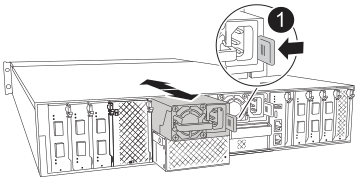
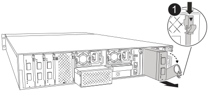
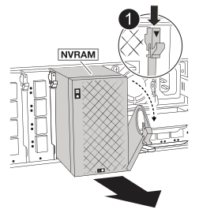
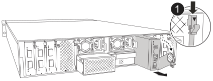

= Sustituir el chasis - AFX 2K
:allow-uri-read: 
:icons: font
:imagesdir: ../media/

[role="lead"]
Sustituye el chasis de tu sistema de almacenamiento AFX 2K cuando un fallo de hardware lo requiera. El proceso de sustitución implica retirar el controlador, las tarjetas de E/S, el módulo NVRAM12, el módulo de administración de sistemas y las unidades de alimentación (PSUs), instalar el chasis de repuesto y volver a instalar los componentes del chasis.

== Paso 1: Retire las PSU y los cables

Debes quitar las dos unidades de fuente de alimentación (PSU) antes de quitar el controlador.

.Pasos
. Retire las fuentes de alimentación:
+
.. Si usted no está ya conectado a tierra, correctamente tierra usted mismo.
.. Desconecte los cables de alimentación de las fuentes de alimentación.
.. Retire las dos fuentes de alimentación de la parte trasera del chasis girando la manija de la fuente de alimentación hacia arriba para poder sacar la fuente de alimentación, presione la pestaña de bloqueo de la fuente de alimentación y luego saque la fuente de alimentación del chasis.
+

CAUTION: La fuente de alimentación es corta. Utilice siempre dos manos para apoyarlo cuando lo extraiga del módulo del controlador de modo que no se mueva repentinamente del módulo del controlador y le herir.

+

+
[cols="1,4"]
|===

 a| 
image:../media/icon_round_1.png["Número de llamada 1"]
 a| 
Lengüeta de bloqueo de PSU de terracota

|===
.. Repita estos pasos para la segunda fuente de alimentación.

. Retire los cables:
+
.. Desconecte los cables del sistema y los módulos SFP y QSFP (si es necesario) del módulo del controlador, pero déjelos en el dispositivo de administración de cables para mantenerlos organizados.
+

NOTE: Los cables deben haber sido etiquetados al principio de este procedimiento.

.. Retire el dispositivo de gestión de cables del chasis y déjelo a un lado.

== Paso 2: retira las tarjetas de E/S, NVRAM12, NVRAM12-EX y el módulo de administración de sistemas

. Extraiga el módulo de I/o de destino del chasis:
+

+
[cols="1,4"]
|===

 a| 
image:../media/icon_round_1.png["Número de llamada 1"]
 a| 
Bloqueo de leva de E/S.

|===
+
.. Pulse el botón de leva del módulo de destino.
.. Gire el pestillo de leva hacia fuera del módulo hasta el tope.
.. Retire el módulo del chasis enganchando el dedo en la abertura de la palanca de leva y tirando del módulo hacia afuera del chasis.
+
Asegúrese de realizar un seguimiento de la ranura en la que se encontraba el módulo de E/S.

.. Deje el módulo de E/S a un lado y repita estos pasos para cualquier otro módulo de E/S.

. Retire el módulo NVRAM12:
+
.. Pulse el botón de bloqueo de la leva.
+
El botón de leva se aleja del chasis.

.. Gire el pestillo de la leva hacia abajo hasta el tope.
.. Retire el módulo NVRAM del chasis enganchando el dedo en la abertura de la palanca de leva y sacando el módulo del chasis.
+

+
[cols="1,4"]
|===

 a| 
image:../media/icon_round_1.png["Número de llamada 1"]
| Pestillo de leva NVRAM12 
|===
.. Ajuste el módulo NVRAM en una superficie estable.

. Retira el módulo NVRAM12-EX:
+
.. Coge el asa del módulo y pulsa el botón de la leva de bloqueo.
.. Extrae el módulo NVRAM12-EX del chasis mientras sujetas la parte inferior del módulo con la otra mano.
+
image::../media/drw_afx_emr_nv12l_remove_replace_ieops-2879.svg[Retira el módulo NVRAM12-EX]

+
[cols="1,4"]
|===

 a| 
image:../media/icon_round_1.png["Número de llamada 1"]
| Mango y botón de leva del NVRAM12-EX 
|===
.. Coloca el módulo NVRAM12-EX sobre una superficie estable.

. Quitar el módulo de administración del sistema:
+
.. Pulse el botón de leva del módulo de gestión del sistema.
.. Gire la palanca de leva hacia abajo hasta el tope.
.. Enrolle el dedo en el orificio de la palanca de leva y tire del módulo hacia fuera del sistema.
+

+
[cols="1,4"]
|===

 a| 
image::../media/icon_round_1.png[Número de llamada 1]
 a| 
Bloqueo de leva del módulo de gestión del sistema

|===

== Paso 3: Extraiga el módulo del controlador

. En la parte delantera de la unidad, enganche los dedos en los orificios de las levas de bloqueo, apriete las lengüetas de las palancas de leva y gire suavemente, pero firmemente, ambos pestillos hacia usted al mismo tiempo.
+
El módulo de la controladora se mueve ligeramente fuera del chasis.

+
image::../media/drw_a1k_pcm_remove_replace_ieops-1375.svg[Gráfico de extracción del controlador]

+
[cols="1,4"]
|===

 a| 
image:../media/icon_round_1.png["Número de llamada 1"]
| Pestillos de leva de bloqueo 
|===
. Deslice el módulo del controlador fuera del chasis y colóquelo sobre una superficie plana y estable.
+
Asegúrese de que admite la parte inferior del módulo de la controladora cuando la deslice para sacarlo del chasis.

== Paso 4: Reemplace el chasis dañado

Retire el chasis deteriorado e instale el chasis de repuesto.

.Pasos
. Retire el chasis deteriorado:
+
.. Quite los tornillos de los puntos de montaje del chasis.
.. Deslice el chasis dañado fuera de los rieles del bastidor en un gabinete de sistema o bastidor de equipo y luego déjelo a un lado.

. Instale el chasis de reemplazo:
+
.. Instale el chasis de reemplazo en el bastidor del equipo o en el gabinete del sistema guiando el chasis sobre los rieles del bastidor en el gabinete del sistema o en el bastidor del equipo.
.. Deslice el chasis completamente en el bastidor del equipo o en el armario del sistema.
.. Fije la parte delantera del chasis al bastidor del equipo o al armario del sistema con los tornillos que ha retirado del chasis dañado.

== Paso 5: Instale los componentes del chasis

Una vez instalado el chasis de reemplazo, deberá instalar el módulo del controlador, volver a cablear los módulos de E/S y el módulo de administración del sistema, y luego reinstalar y enchufar las fuentes de alimentación.

.Pasos
. Instale el módulo del controlador:
+
.. Alinee el extremo del módulo del controlador con la abertura en la parte frontal del chasis y luego empuje suavemente el controlador hasta el fondo del chasis.
.. Gire los pestillos de bloqueo a la posición de bloqueo.

. Instale las tarjetas de E/S en la parte trasera del chasis:
+
.. Alinee el extremo del módulo de E/S con la misma ranura en el chasis de reemplazo que en el chasis dañado y luego empuje suavemente el módulo hasta el fondo del chasis.
.. Gire el pestillo de leva hacia arriba a la posición de bloqueo.
.. Repita estos pasos para cualquier otro módulo de E/S.

. Instale el módulo de administración del sistema en la parte trasera del chasis:
+
.. Alinee el extremo del módulo de administración del sistema con la abertura en el chasis y luego empuje suavemente el módulo hasta el fondo del chasis.
.. Gire el pestillo de leva hacia arriba a la posición de bloqueo.
.. Si aún no lo ha hecho, reinstale el dispositivo de administración de cables y vuelva a conectar los cables a las tarjetas de E/S y al módulo de administración del sistema.
+

NOTE: Si ha quitado los convertidores de medios (QSFP o SFPs), recuerde reinstalarlos.

+
Asegúrese de que los cables estén conectados de acuerdo con las etiquetas de los cables.

. Instale el módulo NVRAM12 en la parte posterior del chasis en la parte trasera del chasis:
+
.. Alinee el extremo del módulo NVRAM12 con la abertura en el chasis y luego empuje suavemente el módulo hasta el fondo del chasis.
.. Gire el pestillo de leva hacia arriba a la posición de bloqueo.

. Instalar las fuentes de alimentación:
+
.. Usando ambas manos, sostenga y alinee los bordes de la fuente de alimentación con la abertura en el chasis.
.. Empuje suavemente la fuente de alimentación dentro del chasis hasta que la pestaña de bloqueo encaje en su lugar.
+
Las fuentes de alimentación sólo se acoplarán correctamente al conector interno y se bloquearán de una manera.

+

NOTE: Para evitar dañar el conector interno, no ejerza demasiada fuerza al deslizar la fuente de alimentación hacia el sistema.

. Vuelva a conectar los cables de alimentación de la fuente de alimentación a ambas fuentes de alimentación y asegure cada cable de alimentación a la fuente de alimentación mediante el retenedor del cable de alimentación.
+
Los módulos del controlador comienzan a arrancar en cuanto se instalan las PSU y se restaura la alimentación.

.El futuro
Después de reemplazar el chasis AFX 2K deteriorado y reinstalar sus componentes, completa el link:chassis-replace-complete-system-restore-rma.html["reemplazo del chasis"].
