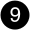
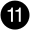

= Descripción general de añadir y sustituir módulos de E/S - AFX 2K
:allow-uri-read: 
:icons: font
:imagesdir: ../media/

[role="lead"]
El sistema de almacenamiento AFX 2K ofrece flexibilidad a la hora de ampliar o sustituir módulos de E/S para mejorar la conectividad de red y el rendimiento. Añadir o sustituir un módulo de E/S es fundamental a la hora de actualizar las capacidades de red o solucionar el fallo de un módulo.

Puedes sustituir un módulo de E/S averiado de tu sistema de almacenamiento AFX 2K por otro del mismo tipo o por uno diferente. También puedes añadir un módulo de E/S a un sistema con ranuras libres.

* link:io-module-add.html["Agregue un módulo de E/S."]
+
La adición de módulos adicionales puede mejorar la redundancia, lo que ayuda a garantizar que el sistema siga funcionando incluso si falla un módulo.

* link:io-module-replace.html["Sustituya un módulo de E/S."]
+
El reemplazo de un módulo de E/S que falla puede restaurar el sistema a su estado operativo óptimo.

.Numeración de ranuras de E/S.
Las ranuras de E/S del controlador AFX 2K están numeradas del 1 al 11, como se muestra en la siguiente ilustración.

image::../media/drw_afx_2k_rear_slots_ieops-2862.svg[Numeración de las ranuras en un controlador AFX 2K]

[cols="10%,23%,10%,24%,10%,23%"]
|===
| Número de ranura | Ranura de E/S | Número de ranura | Ranura de E/S | Número de ranura | Ranura de E/S 

 a| 
image::../media/icon_round_1.svg[Número de llamada 1]
| HA  a| 
image::../media/icon_round_4.svg[Número de llamada 4]

image::../media/icon_round_5.svg[Número de llamada 5]
| NVRAM12  a| 

| Red 

 a| 
image::../media/icon_round_2.svg[Número de llamada 2]
| Clúster  a| 
image::../media/icon_round_6.svg[Llamada número 6]

image::../media/icon_round_7.svg[Llamada número 7]
| NVRAM12-EX  a| 
image::../media/icon_round_10.svg[Llamada número 10]
| Reducida 

 a| 
image::../media/icon_round_3.svg[Número de llamada 3]
| Red  a| 
image::../media/icon_round_8.svg[Llamada número 8]
| Reducida  a| 

| (*Opcional*) Cuatro puertos SFP28 de 25GbE para conectividad de gestión adicional 
|===