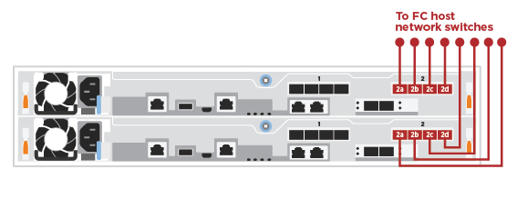

= Pasos detallados - ASA C250
:allow-uri-read: 
:icons: font
:imagesdir: ../media/

[role="lead"]
En esta sección se ofrecen instrucciones detalladas paso a paso para instalar un sistema ASA C250.

== Paso 1: Preparar la instalación

Para instalar su sistema AFF A250, debe crear una cuenta y registrar el sistema. También es necesario realizar el inventario del número y tipo de cables adecuados para el sistema y recopilar información específica de la red.

NOTE: Los clientes con requisitos de alimentación específicos deben comprobar la HWU para ver sus opciones de configuración.

.Antes de empezar
* Asegúrese de tener acceso al link:https://hwu.netapp.com["Hardware Universe de NetApp"^] (HWU) para obtener información sobre los requisitos del sitio.
* Asegúrese de tener acceso al link:http://mysupport.netapp.com/documentation/productlibrary/index.html?productID=62286["Notas de la versión de ONTAP"^] para obtener más información sobre este sistema.
* Debe proporcionar lo siguiente en el sitio:
+
** Espacio en rack para el sistema de almacenamiento
** Destornillador Phillips número 2
** Cables de red adicionales para conectar el sistema al conmutador de red y al portátil o a la consola con un navegador Web

.Pasos
. Extraiga el contenido de todas las cajas.
. Registre el número de serie del sistema de las controladoras.
+
image::../media/drw_ssn_label.png[Ejemplo del número de serie del sistema]

. Configure su cuenta:
+
.. Inicie sesión en su cuenta existente o cree una cuenta.
.. link:https://mysupport.netapp.com/eservice/registerSNoAction.do?moduleName=RegisterMyProduct["Regístrese"^] su sistema.

. Descargue e instale link:https://mysupport.netapp.com/site/tools/tool-eula/activeiq-configadvisor["Descargas de NetApp: Config Advisor"^] en el portátil.
. Realice un inventario y anote el número y los tipos de cables recibidos.
+
En la siguiente tabla se identifican los tipos de cables que pueden recibir. Si recibe un cable que no aparece en la tabla, consulte link:https://hwu.netapp.com["Hardware Universe de NetApp"^] para localizar el cable e identificar su uso.

+
[cols="1,2,1,2"]
|===
| Tipo de cable... | Número de pieza y longitud | Tipo de conector | Durante... 

 a| 
Cable de 25 GbE
 a| 
X66240A-05 (112-00595), 0,5 m;

X66240-2 (112-00573), 2 m
 a| 
image:../media/oie_cable100_gbe_qsfp28.png["Conector QSFP28 de 100 GbE"]
 a| 
La red de interconexión en clúster

 a| 
X66240A-2 (112-00598), 2 m;

X66240A-5 (112-00600), 5 m
 a| 
SQL Server

 a| 
Cable de 100 GbE
 a| 
X66211-2 (112-00574), 2 m;

X66211-5 (112-00576), 5 m
 a| 
Reducida

 a| 
RJ-45 (dependiente del pedido)
 a| 
No aplicable
 a| 
image:../media/oie_cable_rj45.png["Conector de cable RJ-45"]
 a| 
Red de gestión (BMC y puerto de llave inglesa) y datos Ethernet (e0a y e0b)

 a| 
Fibre Channel
 a| 
X66250-2 (112-00342) 2 m;

X66250-5 (112-00344) 5 m;

X66250-15 (112-00346) 15 m;

X66250-30 (112-00347) 30m
 a| 
image:../media/oie_cable_fc_optical.png["Cable óptico de canal de fibra de la OIE"]
 a| 

 a| 
Cable de consola Micro-USB
 a| 
No aplicable
 a| 
image:../media/oie_cable_micro_usb.png["Ilustración que muestra un conector micro USB"]
 a| 
Conexión de consola durante la configuración del software

 a| 
Cables de alimentación
 a| 
No aplicable
 a| 
image:../media/oie_cable_power.png["Cables de alimentación"]
 a| 
Encendido del sistema

|===
. Revise la link:https://library.netapp.com/ecm/ecm_download_file/ECMLP2862613["Guía de configuración de ONTAP"^] y recopilar la información necesaria que aparece en esa guía.

== Paso 2: Instale el hardware

Debe instalar el sistema en un rack de 4 parantes o armario del sistema de NetApp, según corresponda.

.Pasos
. Instale los kits de raíles, según sea necesario.
. Instale y asegure el sistema siguiendo las instrucciones incluidas con el kit de raíl.
+

NOTE: Debe ser consciente de los problemas de seguridad asociados con el peso del sistema.

+
image::../media/drw_affa250_weight_caution.png[Precaución de elevación para dos personas]

. Identifique y administre los cables porque este sistema no tiene un dispositivo de administración de cables.
. Coloque el panel frontal en la parte delantera del sistema.

== Paso 3: Conecte los cables de las controladoras al clúster

Conecte mediante cable las controladoras a un clúster mediante el método de clúster sin switches de dos nodos o mediante el método de red de interconexión de clúster.

[role="tabbed-block"]
====
.Opción 1: Clúster sin switches de dos nodos
--
Los puertos de red de gestión, Fibre Channel y datos o host de los módulos de la controladora se conectan a los switches. Los puertos de interconexión de clúster se cablean en ambos módulos de la controladora.

.Antes de empezar
* Póngase en contacto con el administrador de red para obtener información sobre la conexión del sistema a los switches.
* Asegúrese de comprobar que la flecha de la ilustración tenga la orientación correcta de la lengüeta de extracción del conector del cable.
+
image::../media/oie_cable_pull_tab_down.png[Conector de cable con lengüeta en la parte inferior]

+

NOTE: Al insertar el conector, debería sentir que hace clic en su lugar; si no cree que hace clic, quítelo, gírelo y vuelva a intentarlo.

.Acerca de esta tarea
Use la animación o los pasos tabulados para completar el cableado entre los controladores y los switches. Ejecute los pasos en cada controladora.

.Animación: Conecte mediante cable el clúster de dos nodos sin switches
video::beec3966-0a01-473c-a5de-ac68017fbf29[panopto]
.Pasos
. Use el cable de interconexión de clúster de 25GbE para conectar los puertos e0c a e0c y e0d a e0d.
+
image:../media/oie_cable_sfp_gbe_copper.png["Conector de cobre SFP GbE"]:

+
image:../media/drw_affa250_tnsc_cabling.png["Cableado de interconexión de clúster en un clúster sin switches de dos nodos"]

. Conecte los puertos de llave a los switches de red de gestión con los cables RJ45.
+
image::../media/drw_affa250_mgmt_cabling.png[Cableado de puertos de gestión]

IMPORTANT: NO enchufe los cables de alimentación en este momento.

--
.Opción 2: Clúster de switches
--
Todos los puertos de las controladoras están conectados a switches; interconexión de clúster, gestión, Fibre Channel y switches de red de datos o host.

.Antes de empezar
* Póngase en contacto con el administrador de red para obtener información sobre la conexión del sistema a los switches.
* Asegúrese de comprobar que la flecha de la ilustración tenga la orientación correcta de la lengüeta de extracción del conector del cable.
+
image::../media/oie_cable_pull_tab_down.png[Conector de cable con lengüeta en la parte inferior]

+

NOTE: Al insertar el conector, debería sentir que hace clic en su lugar; si no cree que hace clic, quítelo, gírelo y vuelva a intentarlo.

.Acerca de esta tarea
Use la animación o los pasos para completar el cableado entre las controladoras y los switches. Ejecute los pasos en cada controladora.

.Animación: Grupo de cables conmutados
video::bf6759dc-4cbf-488e-982e-ac68017fbef8[panopto]
.Pasos
. Conecte los puertos e0c y e0d de interconexión de clúster a los switches de 25 GbE de interconexión de clúster.
+
image:../media/drw_affa250_switched_clust_cabling.png["Cableado de interconexión del clúster"]

. Conecte los puertos de llave a los switches de red de gestión con los cables RJ45.
+
image::../media/drw_affa250_mgmt_cabling.png[Cableado de puertos de gestión]

--
====

== Paso 4: Cable a red host o almacenamiento (opcional)

Tiene un cableado opcional dependiente de la configuración a las redes host Fibre Channel o iSCSI, o al almacenamiento de conexión directa. Este cableado no es exclusivo; puede tener cableado para una red host y almacenamiento.

NOTE: link:https://hwu.netapp.com["Hardware Universe de NetApp"^] La prioridad de ranura para tarjetas de red host (Fibre Channel o 25GbE) es la ranura 2. Sin embargo, si tiene ambas tarjetas, la tarjeta de canal de fibra va en la ranura 2 y la tarjeta de 25GbE va en la ranura 1 (como se muestra en las opciones a continuación). Si dispone de una bandeja externa, la tarjeta de almacenamiento se coloca en la ranura 1, la única ranura compatible para las bandejas.

[role="tabbed-block"]
====
.Opción 1: Cable a red de host de Fibre Channel
--
Los puertos Fibre Channel de las controladoras están conectados a switches de red host Fibre Channel.

.Antes de empezar
* Póngase en contacto con el administrador de red para obtener información sobre la conexión del sistema a los switches.
* Asegúrese de comprobar que la flecha de la ilustración tenga la orientación correcta de la lengüeta de extracción del conector del cable.
+
image::../media/oie_cable_pull_tab_up.png[Conector de cable con lengüeta en la parte superior]

+

NOTE: Al insertar el conector, debe sentir que encaja en su lugar; si no lo siente, haga clic, retírelo, gírelo y vuelva a intentarlo.

.Acerca de esta tarea
Realice el siguiente paso en cada módulo del controlador.

.Pasos
. Conecte los puertos 2a a 2d a los switches host FC.
+

--
.Opción 2: Cable a datos 25GbE o red host
--
Los puertos de 25 GbE de las controladoras están conectados a datos de 25 GbE o a switches de red de host.

.Antes de empezar
* Póngase en contacto con el administrador de red para obtener información sobre la conexión del sistema a los switches.
* Asegúrese de comprobar que la flecha de la ilustración tenga la orientación correcta de la lengüeta de extracción del conector del cable.
+
image::../media/oie_cable_pull_tab_up.png[Conector de cable con lengüeta en la parte superior]

+

NOTE: Al insertar el conector, debería sentir que hace clic en su lugar; si no cree que hace clic, quítelo, gírelo y vuelva a intentarlo.

.Acerca de esta tarea
Realice el siguiente paso en cada módulo del controlador.

.Pasos
. Los puertos de cable e4a a e4d a los conmutadores de red host 10GbE.
+
image:../media/drw_affa250_25gbe_host_cabling.png["Cableado de 25 GbE"]

--
.Opción 3: Conecte las controladoras a bandeja de unidades única
--
Conecte cada controlador a los módulos NSM de la bandeja de unidades NS224.

.Antes de empezar
Asegúrese de comprobar que la flecha de la ilustración tenga la orientación correcta de la lengüeta de extracción del conector del cable.

image::../media/oie_cable_pull_tab_up.png[Conector de cable con lengüeta en la parte superior]

NOTE: Al insertar el conector, debería sentir que hace clic en su lugar; si no cree que hace clic, quítelo, gírelo y vuelva a intentarlo.

.Acerca de esta tarea
Use la animación o los pasos tabulados para completar el cableado entre las controladoras y la bandeja única. Realice los pasos en cada módulo del controlador.

.Animación - conectar los controladores a un solo NS224
video::3f92e625-a19c-4d10-9028-ac68017fbf57[panopto]
.Pasos
. Conecte el cable de la controladora A a la bandeja.
+
image:../media/drw_affa250_1shelf_cabling_a.png["Cableado de la controladora A."]

. Conecte el cable de la controladora B a la bandeja.
+
image:../media/drw_affa250_1shelf_cabling_b.png["Cableado de la controladora B."]

--
====

== Paso 5: Complete la configuración del sistema

Complete la instalación y la configuración del sistema mediante la detección de clústeres que solo tiene una conexión al switch y al portátil, o bien se puede conectar directamente a una controladora del sistema y, a continuación, conectarse al switch de gestión.

[role="tabbed-block"]
====
.Opción 1: Si la detección de red está activada
--
Si tiene la detección de red habilitada en el portátil, puede completar la configuración y la instalación del sistema mediante la detección automática del clúster.

.Pasos
. Enchufe los cables de alimentación a las fuentes de alimentación de la controladora y luego conéctelos a fuentes de alimentación de diferentes circuitos.
+
El sistema comienza a iniciarse. El arranque inicial puede tardar hasta ocho minutos.

. Asegúrese de que el ordenador portátil tiene activado el descubrimiento de red.
+
Consulte la ayuda en línea de su portátil para obtener más información.

. Utilice la animación para conectar el portátil al conmutador de administración:
+
.Animación: Conecte el portátil al conmutador de administración
video::d61f983e-f911-4b76-8b3a-ab1b0066909b[panopto]
. Seleccione un icono de ONTAP que aparece para detectar:
+
image::../media/drw_autodiscovery_controler_select.png[Seleccione un icono de ONTAP]

+
.. Abra el Explorador de archivos.
.. Haga clic en *Red* en el panel izquierdo.
.. Haga clic con el botón derecho del ratón y seleccione *Actualizar*.
.. Haga doble clic en el icono de ONTAP y acepte los certificados que aparecen en la pantalla.
+

NOTE: XXXXX es el número de serie del sistema para el nodo de destino.

+
Se abrirá System Manager.

. Utilice la configuración guiada de System Manager para configurar el sistema con los datos recogidos en el link:https://library.netapp.com/ecm/ecm_download_file/ECMLP2862613["Guía de configuración de ONTAP"^].
. Compruebe el estado del sistema ejecutando Config Advisor.
. Después de completar la configuración inicial, vaya a la link:https://www.netapp.com/data-management/oncommand-system-documentation/["Recursos de documentación de ONTAP  ONTAP System Manager"^] Página para obtener información sobre cómo configurar las funciones adicionales en ONTAP.

--
.Opción 2: Si la detección de red no está activada
--
Si el descubrimiento de red no está activado en el portátil, debe completar la configuración y la configuración mediante esta tarea.

.Pasos
. Conecte y configure el portátil o la consola:
+
.. Ajuste el puerto de la consola del portátil o de la consola en 115,200 baudios con N-8-1.
+

NOTE: Consulte la ayuda en línea del portátil o de la consola para saber cómo configurar el puerto de la consola.

.. Conecte el portátil o la consola al conmutador de la subred de administración.
+
image::../media/drw_console_client_mgmt_subnet_affa250.png[Conectándose a la subred de gestión]

.. Asigne una dirección TCP/IP al portátil o consola, utilizando una que esté en la subred de gestión.

. Enchufe los cables de alimentación a las fuentes de alimentación de la controladora y luego conéctelos a fuentes de alimentación de diferentes circuitos.
+
El sistema comienza a iniciarse. El arranque inicial puede tardar hasta ocho minutos.

. Asigne una dirección IP de gestión de nodos inicial a uno de los nodos.
+
[cols="1,2"]
|===
| Si la red de gestión tiene DHCP... | Realice lo siguiente... 

 a| 
Configurado
 a| 
Registre la dirección IP asignada a las nuevas controladoras.

 a| 
No configurado
 a| 
.. Abra una sesión de consola mediante PuTTY, un servidor terminal o el equivalente para su entorno.
+

NOTE: Si no sabe cómo configurar PuTTY, compruebe la ayuda en línea del ordenador portátil o de la consola.

.. Introduzca la dirección IP de administración cuando se lo solicite el script.

|===
. Mediante System Manager en el portátil o la consola, configure su clúster:
+
.. Dirija su navegador a la dirección IP de gestión de nodos.
+

NOTE: El formato de la dirección es +https://x.x.x.x+.

.. Configure el sistema con los datos recogidos en el link:https://library.netapp.com/ecm/ecm_download_file/ECMLP2862613["Guía de configuración de ONTAP"^].

. Compruebe el estado del sistema ejecutando Config Advisor.
. Después de completar la configuración inicial, vaya a la link:https://www.netapp.com/data-management/oncommand-system-documentation/["Recursos de documentación de ONTAP  ONTAP System Manager"^] Página para obtener información sobre cómo configurar las funciones adicionales en ONTAP.

--
====