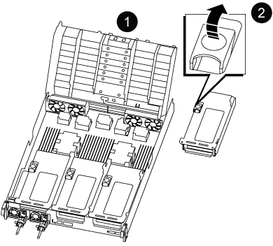
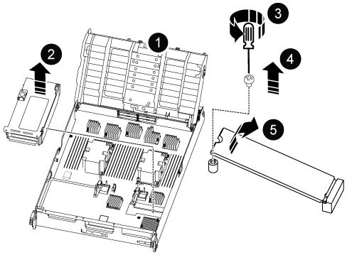

= Sustituya el hardware del módulo del controlador: ASA C800
:allow-uri-read: 
:icons: font
:imagesdir: ../media/

[role="lead"]
Reemplace el controlador en su sistema ASA C800 cuando una falla de hardware lo requiera. El proceso de reemplazo implica quitar el controlador dañado, mover los componentes al controlador de reemplazo, instalar el controlador de reemplazo y reiniciarlo.

== Paso 1: Extraiga el módulo del controlador

Debe quitar el módulo de la controladora del chasis cuando sustituya el módulo de la controladora o sustituya un componente dentro del módulo de la controladora.

.Pasos
. Si usted no está ya conectado a tierra, correctamente tierra usted mismo.
. Asegúrese de que todas las unidades del chasis estén firmemente asentadas contra el plano medio con los pulgares para empujar cada unidad hasta que sienta una parada positiva.
+
.Vídeo - Confirmar el asiento del conductor
video::2c46e4af-2c21-4f12-b065-b38b003d0ea2[panopto]
+
image::../media/drw_a800_drive_seated_IEOPS-960.svg[Asentar las unidades]

. Compruebe las unidades del controlador en función del estado del sistema:
+
.. En el controlador en buen estado, verifique si algún grupo RAID activo se encuentra en estado degradado, estado fallido o ambos:
+
[source, cli]
----
storage aggregate show -raidstatus !*normal*
----
+
*** Si el comando retorna `There are no entries matching your query.` continuar<<Check-missing-drives,Vaya al siguiente subpaso para verificar si faltan unidades>> .
*** Si el comando devuelve otros resultados, recopile los datos de AutoSupport de ambos controladores y comuníquese con el soporte de NetApp para obtener más ayuda.
+
[source, cli]
----
system node autosupport invoke -node * -type all -message '<message_name>'
----

.. [[Check-missing-drives]]Verifique si hay problemas de unidades faltantes tanto para el sistema de archivos como para las unidades de repuesto:
+
[source, cli]
----
event log show -severity * -node * -message-name *disk.missing*
----
+
*** Si el comando retorna `There are no entries matching your query.` continuar<<remove-power-cables,ir al siguiente paso>> .
*** Si el comando devuelve otros resultados, recopile los datos de AutoSupport de ambos controladores y comuníquese con el soporte de NetApp para obtener más ayuda.
+
[source, cli]
----
system node autosupport invoke -node * -type all -message '<message_name>'
----

. [[remove-power-cables]]Retire los retenedores del cable de alimentación y luego desenchufe los cables de las fuentes de alimentación.
. Afloje la correa de gancho y bucle del dispositivo de administración de cables.  Desconecte los cables del sistema y los módulos SFP/QSFP (si es necesario) del módulo controlador.  Tenga en cuenta la ubicación de cada cable.
+
Deje los cables en el dispositivo de administración de cables de manera que cuando vuelva a instalar el dispositivo de administración de cables, los cables estén organizados.

. Retire el dispositivo de administración de cables del módulo del controlador y colóquelo aparte.
. Presione los dos pestillos de bloqueo hacia abajo y, a continuación, gire ambos pestillos hacia abajo al mismo tiempo.
+
El módulo de la controladora se mueve ligeramente fuera del chasis.

+
image::../media/drw_a800_pcm_remove.png[Extracción del módulo del controlador]

+
[cols="1,4"]
|===

 a| 
image:../media/icon_round_1.png["Número de llamada 1"]
 a| 
Pestillo de bloqueo

 a| 
image:../media/icon_round_2.png["Número de llamada 2"]
 a| 
Pasador de bloqueo

|===
. Deslice el módulo del controlador para sacarlo del chasis y colóquelo sobre una superficie plana y estable.
+
Sostenga la parte inferior del módulo del controlador mientras lo desliza fuera del chasis.

== Paso 2: Mueva las fuentes de alimentación

Mueva las fuentes de alimentación al módulo controlador de reemplazo.

.Pasos
. Gire el mango de la leva de forma que pueda utilizarse para extraer la fuente de alimentación del módulo del controlador mientras presiona la lengüeta de bloqueo.
+

CAUTION: El suministro de alimentación es corto. Utilice siempre dos manos para apoyarlo cuando lo extraiga del módulo del controlador de modo que no se mueva repentinamente del módulo del controlador y le herir.

+
image::../media/drw_a800_replace_psu.svg[Retire o sustituya una fuente de alimentación]

+
[cols="1,4"]
|===

 a| 
image:../media/icon_round_1.png["Número de llamada 1"]
 a| 
Lengüeta azul de bloqueo de la fuente de alimentación

 a| 
image:../media/icon_round_2.png["Número de llamada 2"]
 a| 
Suministro de alimentación

|===
. Mueva la fuente de alimentación al nuevo módulo de controlador y, a continuación, instálela.
. Con ambas manos, sujete y alinee los bordes de la fuente de alimentación con la abertura del módulo del controlador y, a continuación, empuje suavemente la fuente de alimentación en el módulo del controlador hasta que la lengüeta de bloqueo encaje en su sitio.
+
Las fuentes de alimentación sólo se acoplarán correctamente al conector interno y se bloquearán de una manera.

+

NOTE: Para evitar dañar el conector interno, no ejerza demasiada fuerza al deslizar la fuente de alimentación hacia el sistema.

== Paso 3: Mueva los ventiladores

Mueva los módulos del ventilador al módulo controlador de reemplazo.

.Pasos
. Retire el módulo del ventilador pinzando las lengüetas de bloqueo del lado del módulo del ventilador y, a continuación, levante el módulo del ventilador para extraerlo del módulo del controlador.
+
image::../media/drw_a800_replace_fan.png[Retire el ventilador]

+
[cols="1,4"]
|===

 a| 
image:../media/icon_round_1.png["Número de llamada 1"]
 a| 
Lengüetas de bloqueo del ventilador

 a| 
image:../media/icon_round_2.png["Número de llamada 2"]
 a| 
Módulo de ventilador

|===
. Mueva el módulo de ventilador al módulo de controlador de repuesto y, a continuación, instale el módulo de ventilador alineando sus bordes con la abertura del módulo de controlador y, a continuación, deslice el módulo de ventilador hacia el módulo de controlador hasta que los pestillos de bloqueo encajen en su lugar.
. Repita estos pasos para los módulos de ventilador restantes.

== Paso 4: Mueva la batería NVDIMM

Mueva la batería NVDIMM al módulo controlador de reemplazo.

.Pasos
. Abra la cubierta del conducto de aire y localice la batería NVDIMM en la tarjeta vertical.
+
image::../media/drw_a800_nvdimm_battery_replace.png[Sustituya la batería NVDIMM]

+
[cols="1,4"]
|===

 a| 
image:../media/icon_round_1.png["Número de llamada 1"]
 a| 
Elevador del conducto de aire

 a| 
image:../media/icon_round_2.png["Número de llamada 2"]
 a| 
Enchufe de la batería NVDIMM

 a| 
image:../media/icon_round_3.png["Número de llamada 3"]
 a| 
Paquete de baterías NVDIMM

|===
+
*Atención:* el LED de la placa de control de la batería NVDIMM parpadea mientras se separa el contenido de la memoria flash cuando se detiene el sistema. Una vez finalizado el destete, el LED se apaga.

. Localice el enchufe de la batería y apriete el clip en la parte frontal del enchufe de la batería para liberar el enchufe de la toma y, a continuación, desenchufe el cable de la batería de la toma.
. Sujete la batería y extraiga la batería del conducto de aire y el módulo controlador.
. Mueva la batería al módulo de la controladora de repuesto y, a continuación, instálela en el conducto de aire NVDIMM:
+
.. Inserte la batería en la ranura y presione firmemente la batería para asegurarse de que está bloqueada en su lugar.
.. Enchufe la clavija de la batería a la toma de la tarjeta vertical y asegúrese de que el enchufe se bloquea en su lugar.

== Paso 5: Retire los elevadores PCIe

Retire los elevadores PCIe del módulo controlador dañado.

.Pasos
. Extraiga la tarjeta vertical PCIe del módulo de la controladora:
+
.. Quite todos los módulos SFP o QSFP que puedan estar en las tarjetas PCIe.
.. Gire el pestillo de bloqueo de la tarjeta vertical en el lado izquierdo de la tarjeta vertical hacia arriba y hacia los módulos de ventilador.
+
La tarjeta vertical se eleva ligeramente del módulo del controlador.

.. Levante la tarjeta vertical, colóquela hacia los ventiladores de forma que el borde de chapa metálica de la tarjeta vertical salga del borde del módulo de la controladora, levante la tarjeta vertical para extraerla del módulo de la controladora y, a continuación, colóquela en una superficie plana y estable.
+

+
[cols="1,4"]
|===

 a| 
image:../media/icon_round_1.png["Número de llamada 1"]
 a| 
Conducto de aire

 a| 
image:../media/icon_round_2.png["Número de llamada 2"]
 a| 
Pestillos de bloqueo de la tarjeta vertical 1 (tarjeta vertical izquierda), la tarjeta vertical 2 (tarjeta vertical media) y 3 (tarjeta vertical derecha)

|===

. Repita el paso anterior para los elevadores restantes del módulo del controlador dañado.
. Repita los pasos anteriores con los elevadores vacíos en la controladora de sustitución y póngelos.

== Paso 6: Mover los DIMM del sistema

Mueva los DIMM del sistema al módulo controlador de reemplazo.

.Pasos
. Tenga en cuenta la orientación del DIMM en el socket para poder insertar el DIMM en el módulo de controlador de reemplazo en la orientación adecuada.
. Extraiga el DIMM de su ranura empujando lentamente las dos lengüetas expulsoras del DIMM a ambos lados del DIMM y, a continuación, extraiga el DIMM de la ranura.
+

NOTE: Sujete con cuidado el módulo DIMM por los bordes para evitar la presión sobre los componentes de la placa de circuitos DIMM.

. Localice la ranura en la que está instalando el DIMM.
. Inserte el módulo DIMM directamente en la ranura.
+
El módulo DIMM encaja firmemente en la ranura, pero debe entrar fácilmente. Si no es así, realinee el DIMM con la ranura y vuelva a insertarlo.

+

NOTE: Inspeccione visualmente el módulo DIMM para comprobar que está alineado de forma uniforme y completamente insertado en la ranura.

. Empuje con cuidado, pero firmemente, en el borde superior del DIMM hasta que las lengüetas expulsoras encajen en su lugar sobre las muescas de los extremos del DIMM.
. Repita estos pasos para los módulos DIMM restantes.

== Paso 7: Mueva los NVDIMM

Mueva los NVDIMMS al módulo controlador de reemplazo.

.Pasos
. Localice los NVDIMM en el módulo del controlador.
+
image::../media/drw_a800_no_risers_nvdimm_move.svg[Mueva NVDIMM]

+
[cols="1,4"]
|===

 a| 
image:../media/icon_round_1.png["Número de llamada 1"]
 a| 
Conducto de aire

 a| 
image:../media/icon_round_2.png["Número de llamada 2"]
 a| 
NVDIMM

|===
. Tenga en cuenta la orientación del NVDIMM en el zócalo para que pueda insertar el NVDIMM en el módulo de la controladora de repuesto en la orientación adecuada.
. Extraiga el NVDIMM de su ranura empujando lentamente las dos lengüetas expulsoras NVDIMM de cada lado del NVDIMM y, a continuación, extraiga el NVDIMM de la toma y colóquelo a un lado.
+

NOTE: Sujete con cuidado el NVDIMM por los bordes para evitar la presión en los componentes de la placa de circuitos NVDIMM.

. Localice la ranura en la que va a instalar el NVDIMM.
. Inserte el NVDIMM directamente en la ranura.
+
El NVDIMM encaja firmemente en la ranura, pero debe entrar fácilmente. Si no es así, realinee el NVDIMM con la ranura y vuelva a insertarlo.

+

NOTE: Inspeccione visualmente el NVDIMM para comprobar que está alineado de forma uniforme y completamente insertado en la ranura.

. Empuje con cuidado, pero firmemente, en el borde superior del NVDIMM hasta que las lengüetas expulsoras encajen en su lugar sobre las muescas de los extremos del NVDIMM.
. Repita los pasos anteriores para mover el otro NVDIMM.

== Paso 8: Mueva el soporte de arranque

Mueva el medio de arranque al módulo controlador de reemplazo.

.Pasos
. Localice el medio de arranque en Riser 3.
+

+
[cols="1,4"]
|===

 a| 
image:../media/icon_round_1.png["Número de llamada 1"]
 a| 
Conducto de aire

 a| 
image:../media/icon_round_2.png["Número de llamada 2"]
 a| 
Elevador 3

 a| 
image:../media/icon_round_3.png["Número de llamada 3"]
 a| 
Destornillador Phillips número 1

 a| 
image:../media/icon_round_4.png["Número de llamada 4"]
 a| 
Tornillo del soporte del maletero

 a| 
image:../media/icon_round_5.png["Número de llamada 5"]
 a| 
Soporte de arranque

|===
. Extraiga el soporte de arranque del módulo del controlador:
+
.. Con un destornillador Phillips del número 1, retire el tornillo que sujeta el soporte del maletero y coloque el tornillo a un lado en un lugar seguro.
.. Sujetando los lados del soporte de arranque, gire suavemente el soporte de arranque hacia arriba, y luego tire del soporte de arranque directamente del zócalo y colóquelo a un lado.

. Mueva el soporte de arranque al nuevo módulo de la controladora e instálelo:
+
.. Alinee los bordes del soporte del maletero con el alojamiento del zócalo y, a continuación, empújelo suavemente en el zócalo.
.. Gire el soporte de arranque hacia abajo hacia la placa base.
.. Fije el soporte de arranque a la placa base mediante el tornillo de soporte de arranque.
+
No apriete en exceso el tornillo o podría dañar el soporte del maletero.

== Paso 9: Instalar los elevadores PCIe

Instale los elevadores en el módulo controlador de reemplazo.

.Pasos
. Instale la tarjeta vertical en el módulo de la controladora de reemplazo:
+
.. Alinee el reborde de la tarjeta vertical con la parte inferior de la chapa metálica del módulo del controlador.
.. Guíe la tarjeta vertical a lo largo de las patillas del módulo de la controladora y, a continuación, baje la tarjeta vertical al módulo de la controladora.
.. Gire el pestillo de bloqueo hacia abajo y haga clic en él hasta la posición de bloqueo.
+
Cuando está bloqueado, el pestillo de bloqueo está alineado con la parte superior de la tarjeta vertical y la tarjeta vertical se asienta directamente en el módulo del controlador.

.. Vuelva a insertar todos los módulos SFP o QSFP que se han extraído de las tarjetas PCIe.

. Repita el paso anterior para los elevadores PCIe restantes.

== Paso 10: Instale el módulo del controlador

Vuelva a instalar el módulo del controlador y reinícielo.

.Pasos
. Alinee el extremo del módulo del controlador con la abertura del chasis y, a continuación, empuje suavemente el módulo del controlador hasta la mitad del sistema.
+

NOTE: No inserte completamente el módulo de la controladora en el chasis hasta que se le indique hacerlo.

. Recuperar el sistema, según sea necesario.
+
Si ha quitado los convertidores de medios (QSFP o SFP), recuerde volver a instalarlos si está utilizando cables de fibra óptica.

. Complete la reinstalación del módulo del controlador:
+
.. Empuje firmemente el módulo de la controladora en el chasis hasta que se ajuste al plano medio y esté totalmente asentado.
+
Los pestillos de bloqueo se elevan cuando el módulo del controlador está completamente asentado.

+

NOTE: No ejerza una fuerza excesiva al deslizar el módulo del controlador hacia el chasis para evitar dañar los conectores.

.. Gire los pestillos de bloqueo hacia arriba, inclinándolos para que los pasadores de bloqueo se puedan separar y, a continuación, bajarlos hasta la posición de bloqueo.
.. Conecte los cables de alimentación a las fuentes de alimentación, vuelva a instalar el collar de bloqueo del cable de alimentación y, a continuación, conecte las fuentes de alimentación a la fuente de alimentación.
+
El módulo del controlador comienza a arrancar tan pronto como se restaura la alimentación. Esté preparado para interrumpir el proceso de arranque.

.. Si aún no lo ha hecho, vuelva a instalar el dispositivo de administración de cables.

. Devuelva la controladora afectada a su funcionamiento normal devolviendo su almacenamiento:
+
`storage failover giveback -ofnode _impaired_node_name_`.

. Si la devolución automática está desactivada, vuelva a habilitarla:
+
`storage failover modify -node local -auto-giveback true`.

. Si AutoSupport está habilitado, restaure o desactive la creación automática de casos:
+
`system node autosupport invoke -node * -type all -message MAINT=END`.

.El futuro
Después de haber reemplazado el controlador ASA C800 dañado, deberálink:controller-replace-system-config-restore-and-verify.html["restaure la configuración del sistema"]
