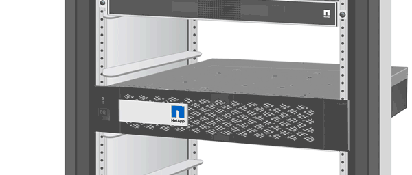

= Sustituya la unidad SSD o la unidad de disco duro - ASA C800
:allow-uri-read: 
:icons: font
:imagesdir: ../media/

[role="lead lead"]
Puede sustituir una unidad con error de forma no disruptiva mientras hay I/o en curso. El procedimiento para sustituir un SSD está destinado a unidades sin discos giratorios, y el procedimiento para sustituir un HDD está destinado a unidades giratorias.

Cuando falla una unidad, la plataforma registra un mensaje de advertencia en la consola del sistema que indica qué unidad ha fallado. Además, tanto el LED de fallo del panel de visualización del operador como el LED de fallo de la unidad averiada se iluminan.

.Antes de empezar
* Siga las prácticas recomendadas e instale la versión actual del paquete de cualificación de disco (DQP) antes de sustituir una unidad.
* Identifique la unidad con errores ejecutando `storage disk show -broken` el comando desde la consola del sistema.
+
La unidad con error se muestra en la lista de unidades con errores. Si no lo hace, debe esperar y volver a ejecutar el comando.

+

NOTE: Según el tipo y la capacidad, la unidad puede demorar hasta varias horas en aparecer en la lista de unidades con errores.

* Determine si la autenticación SED está habilitada.
+
La forma en que se reemplace la unidad depende de cómo se utilice la unidad. Si la autenticación SED está activada, debe utilizar las instrucciones de sustitución SED en https://docs.netapp.com/ontap-9/topic/com.netapp.doc.pow-nve/home.html["Guía completa de cifrado de NetApp para ONTAP 9"]. Estas instrucciones describen los pasos adicionales que debe realizar antes y después de reemplazar una SED.

* Asegúrese de que su plataforma admite la unidad de sustitución. Consulte https://hwu.netapp.com["Hardware Universe de NetApp"].
* Asegúrese de que todos los demás componentes del sistema funcionan correctamente; de lo contrario, debe ponerse en contacto con el soporte técnico.

.Acerca de esta tarea
* El firmware de la unidad se actualiza automáticamente (sin interrupciones) en las unidades nuevas con versiones de firmware no actuales.
* Al sustituir una unidad, se debe esperar un minuto entre la eliminación de la unidad con error y la inserción de la unidad de reemplazo para permitir que el sistema de almacenamiento reconozca la existencia de la unidad nueva.

[role="tabbed-block"]
====
.Opción 1: Sustituir SSD
--
.Pasos
. Si desea asignar manualmente la propiedad de la unidad para la unidad de reemplazo, deberá deshabilitar la asignación automática de unidad, si está habilitada.
+
.. Compruebe si la asignación automática de unidades está habilitada: `storage disk option show`
+
Puede introducir el comando en cualquier módulo de la controladora.

+
Si la asignación automática de unidades está activada, la salida muestra `on` En la columna "'asignación automática'" (para cada módulo de controlador).

.. Si la asignación automática de unidades está habilitada, deshabilítela: `storage disk option modify -node node_name -autoassign off`
+
Debe deshabilitar la asignación automática de unidades en ambos módulos de la controladora.

. Puesta a tierra apropiadamente usted mismo.
. Identifique físicamente la unidad con error.
+
Cuando falla una unidad, el sistema registra un mensaje de advertencia en la consola del sistema que indica qué unidad falló. Además, el LED de atención (ámbar) del panel de la pantalla del operador de la bandeja de unidades y la unidad con error se iluminan.

+

NOTE: El LED de actividad (verde) en una unidad con error puede estar iluminado (fijo), lo que indica que la unidad tiene alimentación, pero no debe parpadear, lo que indica actividad de I/O. Una unidad con error no tiene actividad de I/O.

. Quite la unidad con error:
+
.. Pulse el botón de liberación de la cara de la unidad para abrir la palanca de la leva.
.. Deslice la unidad para sacarla de la estantería con el mango de la leva y apoye la unidad con la otra mano.

. Espere al menos 70 segundos antes de insertar la unidad de reemplazo.
+
Esto permite al sistema reconocer que se ha quitado una unidad.

. Inserte la unidad de reemplazo:
+
.. Con la palanca de leva en posición abierta, utilice ambas manos para insertar el mando de sustitución.
.. Presione hasta que la unidad se detenga.
.. Cierre el asa de la leva para que la unidad quede completamente asentada en el plano medio y el asa encaje en su lugar.
+
Asegúrese de cerrar el mango de leva lentamente para que quede alineado correctamente con la cara de la transmisión.

. Verifique que el LED de actividad de la unidad (verde) esté iluminado.
+
Cuando el LED de actividad de la unidad está sólido, significa que la unidad tiene alimentación. Cuando el LED de actividad de la unidad parpadea, significa que la unidad tiene alimentación y I/o está en curso. Si el firmware de la unidad se actualiza automáticamente, el LED parpadea.

. Si está reemplazando otra unidad, repita los pasos 3 a 7.
. Si deshabilitó la asignación automática de unidades en el paso 1, asigne manualmente la propiedad de la unidad y vuelva a habilitar la asignación automática de unidades si es necesario.
+
.. Mostrar todas las unidades sin propietario:
+
`storage disk show -container-type unassigned`

+
Puede introducir el comando en cualquier módulo de la controladora.

.. Asigne cada unidad:
+
`storage disk assign -disk disk_name -owner node_name`

+
Puede introducir el comando en cualquier módulo de la controladora.

+
Puede usar el carácter comodín para asignar más de una unidad a la vez.

.. Vuelva a habilitar la asignación automática de unidades si es necesario:
+
`storage disk option modify -node node_name -autoassign on`

+
Debe volver a habilitar la asignación automática de unidades en ambos módulos de la controladora.

. Devuelva la pieza que ha fallado a NetApp, como se describe en las instrucciones de RMA que se suministran con el kit.
+
Contacto https://mysupport.netapp.com/site/global/dashboard["Soporte de NetApp"] si necesita el número RMA o ayuda adicional con el procedimiento de reemplazo.

--
.Opción 2: Sustituir HDD
--
. Si desea asignar manualmente la propiedad de la unidad en la unidad de reemplazo, debe deshabilitar la unidad de reemplazo de asignación automática de unidades, si se encuentra habilitada
+

NOTE: La propiedad de la unidad se asigna manualmente y, luego, se vuelve a habilitar la asignación automática de unidades más adelante en este procedimiento.

+
.. Compruebe si la asignación automática de unidades está habilitada: `storage disk option show`
+
Puede introducir el comando en cualquier módulo de la controladora.

+
Si la asignación automática de unidades está activada, la salida muestra `on` En la columna "'asignación automática'" (para cada módulo de controlador).

.. Si la asignación automática de unidades está habilitada, deshabilítela: `storage disk option modify -node node_name -autoassign off`
+
Debe deshabilitar la asignación automática de unidades en ambos módulos de la controladora.

. Puesta a tierra apropiadamente usted mismo.
. Retire con cuidado el bisel de la parte delantera de la plataforma.
. Identifique la unidad de disco con error desde el mensaje de advertencia de la consola del sistema y el LED de fallo iluminado en la unidad de disco
. Pulse el botón de liberación de la cara de la unidad de disco.
+
En función del sistema de almacenamiento, las unidades de disco tienen el botón de liberación situado en la parte superior o a la izquierda de la cara de la unidad de disco.

+
Por ejemplo, la siguiente ilustración muestra una unidad de disco con el botón de liberación situado en la parte superior de la cara de la unidad de disco:

+
image::../media/2240_removing_disk.gif[Retire una unidad con el botón de liberación en la parte superior]

+
El mango de leva de los muelles de accionamiento de disco se abre parcialmente y la unidad de disco se libera del plano medio.

. Tire de la palanca de leva hasta su posición totalmente abierta para desasentar la unidad de disco del plano medio.
+

. Deslice ligeramente la unidad de disco y deje que el disco se reduzca de forma segura, lo que puede tardar menos de un minuto. A continuación, retire la unidad con las dos manos de la bandeja de discos.
. Con la palanca de leva en la posición abierta, inserte la unidad de disco de repuesto en el compartimiento de la unidad, empujando firmemente hasta que la unidad de disco se detenga.
+

NOTE: Espere un mínimo de 10 segundos antes de insertar una nueva unidad de disco. Esto permite al sistema reconocer que se ha quitado una unidad de disco.

+

NOTE: Si las bahías de unidades de la plataforma no están totalmente cargadas con unidades, es importante colocar la unidad de reemplazo en la misma bahía de unidad desde la que se quitó la unidad con error.

+

NOTE: Utilice dos manos al insertar la unidad de disco, pero no coloque las manos en las placas de la unidad de disco expuestas en la parte inferior del portadiscos.

. Cierre el asa de leva para que la unidad de disco esté completamente asentada en el plano medio y el asa encaje en su lugar.
+
Asegúrese de cerrar lentamente el asa de leva para que quede alineado correctamente con la cara de la unidad de disco.

. Si va a sustituir otra unidad de disco, repita los pasos 4 a 9.
. Vuelva a instalar el bisel.
. Si ha desactivado la asignación de unidades automáticas en el paso 1, asigne manualmente la propiedad de unidades y vuelva a activar la asignación automática de unidades si es necesario.
+
.. Mostrar todas las unidades sin propietario: `storage disk show -container-type unassigned`
+
Puede introducir el comando en cualquier módulo de la controladora.

.. Asigne cada unidad: `storage disk assign -disk disk_name -owner owner_name`
+
Puede introducir el comando en cualquier módulo de la controladora.

+
Puede usar el carácter comodín para asignar más de una unidad a la vez.

.. Vuelva a habilitar la asignación automática de unidades si es necesario: `storage disk option modify -node node_name -autoassign on`
+
Debe volver a habilitar la asignación automática de unidades en ambos módulos de la controladora.

. Devuelva la pieza que ha fallado a NetApp, como se describe en las instrucciones de RMA que se suministran con el kit.
+
Póngase en contacto con el soporte técnico en https://mysupport.netapp.com/site/global/dashboard["Soporte de NetApp"], 888-463-8277 (Norteamérica), 00-800-44-638277 (Europa), o +800-800-80-800 (Asia/Pacífico) si necesita el número RMA o ayuda adicional con el procedimiento de reemplazo.

--
====