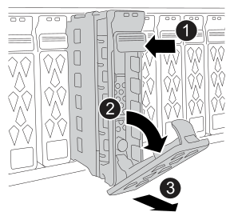

= Reemplazar una unidad - ASA C30
:allow-uri-read: 
:icons: font
:imagesdir: ../media/

[role="lead"]
Reemplace una unidad en su sistema de almacenamiento ASA C30 cuando una unidad falla o requiere una actualización. El proceso de sustitución implica identificar la unidad defectuosa, extraerla de forma segura e instalar una nueva unidad para garantizar un acceso continuo a los datos y el rendimiento del sistema.

Puede sustituir una unidad con error de forma no disruptiva mientras hay I/o en curso.

.Antes de empezar
* El sistema de almacenamiento debe admitir la unidad que está instalando.
+
https://hwu.netapp.com["Hardware Universe de NetApp"^]

* Si la autenticación de unidad de autocifrado (SED) está habilitada, debe usar las instrucciones de sustitución de SED en la documentación de ONTAP.
+
Las instrucciones de la documentación de ONTAP describen los pasos adicionales que debe realizar antes y después de reemplazar una SED.

+
https://docs.netapp.com/us-en/ontap/encryption-at-rest/index.html["Información general del cifrado de NetApp con la interfaz de línea de comandos"^]

* Todos los demás componentes del sistema de almacenamiento deben funcionar correctamente. De lo contrario, debe ponerse en contacto https://mysupport.netapp.com/site/global/dashboard["Soporte de NetApp"] antes de continuar con este procedimiento.
* Compruebe que la unidad que desea quitar tenga error.
+
Para verificar que la unidad presenta errores, ejecute el `storage disk show -broken` comando. La unidad con error se muestra en la lista de unidades con errores. Si no lo hace, debe esperar y volver a ejecutar el comando.

+

NOTE: Según el tipo y la capacidad de la unidad, la unidad puede tardar hasta varias horas en aparecer en la lista de unidades con errores.

.Acerca de esta tarea
* Al sustituir una unidad con error, debe esperar 70 segundos entre la retirada de la unidad y la inserción de la unidad de reemplazo para permitir que el sistema de almacenamiento reconozca que se ha quitado una unidad.
* La práctica recomendada es tener la versión actual del paquete de cualificación de discos (DQP) instalada antes de intercambiar en caliente una unidad.
+
Si tiene instalada la versión actual del DQP, el sistema podrá reconocer y utilizar unidades recién cualificadas. Esto evita mensajes de eventos del sistema sobre la información no actualizada de la unidad y la prevención de la partición de unidades, ya que no se reconocen las unidades. El DQP también notifica el firmware de la unidad no actual.

+
https://mysupport.netapp.com/site/downloads/firmware/disk-drive-firmware/download/DISKQUAL/ALL/qual_devices.zip["Descargas de NetApp: Paquete de cualificación de disco"^]

* La práctica recomendada es tener versiones actuales del firmware del módulo de bandeja NVMe (NSM) y del firmware de la unidad en el sistema antes de reemplazar los componentes de FRU.
+
https://mysupport.netapp.com/site/downloads/firmware/disk-shelf-firmware["Descargas de NetApp: Firmware de bandeja de discos"^]

+
https://mysupport.netapp.com/site/downloads/firmware/disk-drive-firmware["Descargas de NetApp: Firmware de la unidad de disco"^]

+
[NOTE]
====
No revierte el firmware a una versión que no admite la bandeja y sus componentes.

====
* El firmware de la unidad se actualiza automáticamente (sin interrupciones) en las unidades nuevas con versiones de firmware no actuales.
+

NOTE: Las comprobaciones del firmware de la unidad se realizan cada dos minutos.

* Si es necesario, puede encender los LED de ubicación del sistema de almacenamiento (azul) para ayudar a localizar físicamente el sistema de almacenamiento afectado. Inicie sesión en BMC mediante SSH e introduzca `system location-led _on_` el comando.
+
Un sistema de almacenamiento tiene tres LED de ubicación: Uno en el panel de visualización del operador y otro en cada controlador. Los LED de ubicación permanecen encendidos durante 30 minutos.

+
Puede desactivarlos introduciendo `system location-led _off_` el comando. Si no está seguro de si los LED están encendidos o apagados, puede comprobar su estado introduciendo `system location-led show` el comando.

.Pasos
. Puesta a tierra apropiadamente usted mismo.
. Quite el panel frontal de la parte delantera del sistema de almacenamiento.
. Identifique físicamente la unidad con error.
+
** Cuando falla una unidad, el sistema registra un mensaje de advertencia en la consola del sistema que indica qué unidad falló. Además, el LED de atención (ámbar) del panel de visualización del operador del estante y la unidad fallida se iluminan.
** El LED de actividad (verde) en una unidad con error puede estar iluminado (fijo), lo que indica que la unidad tiene alimentación, pero no debe parpadear, lo que indica actividad de I/O. Una unidad con error no tiene actividad de I/O.

. Quite la unidad con error:
+

+
[cols="1,4"]
|===

 a| 
image::../media/icon_round_1.png[Número de llamada 1]
 a| 
Pulse el botón de liberación de la cara de la unidad para abrir la palanca de la leva.

 a| 
image::../media/icon_round_2.png[Número de llamada 2]
 a| 
Gire la palanca de leva hacia abajo para desacoplar la transmisión del plano medio.

 a| 
image::../media/icon_round_3.png[Número de llamada 3]
 a| 
Deslice la unidad hacia fuera del compartimento de la unidad con el asa de leva y sujete la unidad con la otra mano.

Al extraer una unidad, utilice siempre dos manos para sostener su peso.

Dado que las unidades son frágiles, minimice su manipulación para evitar dañarlas.

|===
. Espere al menos 70 segundos antes de insertar la unidad de reemplazo.
+
Esto permite al sistema reconocer que se ha quitado una unidad.

. Inserte la unidad de reemplazo:
+
.. Con la palanca de leva en posición abierta, utilice ambas manos para insertar el mando de sustitución.
.. Empuje suavemente hasta que la unidad se detenga.
.. Cierre el asa de la leva para que la unidad quede completamente asentada en el plano medio y el asa encaje en su lugar.
+
Asegúrese de cerrar el mango de leva lentamente para que quede alineado correctamente con la cara de la transmisión.

. Verifique que el LED de actividad de la unidad (verde) esté iluminado.
+
Cuando el LED de actividad de la unidad está sólido, significa que la unidad tiene alimentación. Cuando el LED de actividad de la unidad parpadea, significa que la unidad tiene alimentación y I/o está en curso. Si el firmware de la unidad se actualiza automáticamente, el LED parpadea.

. Si está reemplazando otra unidad, repita los pasos 3 al 7.
. Vuelva a instalar el panel frontal en la parte frontal del sistema de almacenamiento.
. Devuelva la pieza que ha fallado a NetApp, como se describe en las instrucciones de RMA que se suministran con el kit.
+
Contactar con el soporte técnico https://mysupport.netapp.com/site/global/dashboard["Soporte de NetApp"] si necesita el número RMA o ayuda adicional con el procedimiento de reemplazo.

