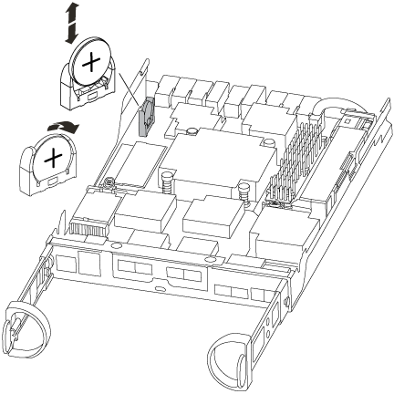

= Sustituya la batería del reloj en tiempo real - ASA A150
:allow-uri-read: 
:icons: font
:imagesdir: ../media/

[role="lead"]
Puede sustituir la batería del reloj en tiempo real (RTC) en el módulo del controlador de manera que los servicios y aplicaciones del sistema que dependen de la sincronización precisa del tiempo sigan funcionando.

* Puede utilizar este procedimiento con todas las versiones de ONTAP admitidas por el sistema
* Todos los demás componentes del sistema deben funcionar correctamente; si no es así, debe ponerse en contacto con el soporte técnico.

== Paso 1: Apague el controlador dañado

Para apagar el controlador dañado, debe determinar el estado del controlador y, si es necesario, tomar el control para que el controlador sano siga sirviendo datos del almacenamiento del controlador dañado.

.Acerca de esta tarea
* Si dispone de un sistema SAN, debe haber comprobado los mensajes de evento  `cluster kernel-service show`) para el blade SCSI de la controladora dañada.  `cluster kernel-service show`El comando (desde el modo avanzado priv) muestra el nombre del nodo, link:https://docs.netapp.com/us-en/ontap/system-admin/display-nodes-cluster-task.html["estado del quórum"] de ese nodo, el estado de disponibilidad de ese nodo y el estado operativo de ese nodo.
+
Cada proceso SCSI-blade debe quórum con los otros nodos del clúster. Todos los problemas deben resolverse antes de continuar con el reemplazo.

* Si tiene un clúster con más de dos nodos, debe estar en quórum. Si el clúster no tiene quórum o si una controladora en buen estado muestra falso según su condición, debe corregir el problema antes de apagar la controladora dañada; consulte link:https://docs.netapp.com/us-en/ontap/system-admin/synchronize-node-cluster-task.html?q=Quorum["Sincronice un nodo con el clúster"^].

.Pasos
. Si AutoSupport está habilitado, elimine la creación automática de casos invocando un mensaje de AutoSupport:
+
`system node autosupport invoke -node * -type all -message MAINT=<# of hours>h`

+
El siguiente mensaje de AutoSupport suprime la creación automática de casos durante dos horas:

+
`cluster1:> system node autosupport invoke -node * -type all -message MAINT=2h`

. Deshabilite la devolución automática de la consola de la controladora en buen estado:
+
`storage failover modify -node local -auto-giveback false`

+

NOTE: Cuando vea _do desea desactivar la devolución automática?_, introduzca `y`.

. Lleve la controladora dañada al aviso DEL CARGADOR:
+
[cols="1,2"]
|===
| Si el controlador dañado está mostrando... | Realice lo siguiente... 

 a| 
El aviso del CARGADOR
 a| 
Vaya al paso siguiente.

 a| 
Esperando devolución...
 a| 
Pulse Ctrl-C y, a continuación, responda `y` cuando se le solicite.

 a| 
Solicitud del sistema o solicitud de contraseña
 a| 
Retome o detenga el controlador dañado del controlador en buen estado:

`storage failover takeover -ofnode _impaired_node_name_ -halt _true_`

El parámetro _-halt true_ lleva al símbolo del sistema de Loader.

|===

== Paso 2: Extraiga el módulo de controlador

Para acceder a los componentes del interior del controlador, primero debe extraer el módulo del controlador del sistema y, a continuación, retirar la cubierta del módulo del controlador.

. Si usted no está ya conectado a tierra, correctamente tierra usted mismo.
. Afloje el gancho y la correa de bucle que sujetan los cables al dispositivo de administración de cables y, a continuación, desconecte los cables del sistema y los SFP (si fuera necesario) del módulo del controlador, manteniendo un seguimiento del lugar en el que estaban conectados los cables.
+
Deje los cables en el dispositivo de administración de cables de manera que cuando vuelva a instalar el dispositivo de administración de cables, los cables estén organizados.

. Retire y retire los dispositivos de administración de cables de los lados izquierdo y derecho del módulo del controlador.
+
image::../media/drw_25xx_cable_management_arm.png[Insertar o quitar el ARM de gestión de cables]

. Apriete el pestillo del mango de la leva hasta que se suelte, abra el mango de la leva completamente para liberar el módulo del controlador del plano medio y, a continuación, tire con dos manos del módulo del controlador para extraerlo del chasis.
+
image::../media/drw_2240_x_opening_cam_latch.png[Apertura del pestillo de la palanca de leva]

. Dé la vuelta al módulo del controlador y colóquelo sobre una superficie plana y estable.
. Abra la cubierta deslizando las pestañas azules para liberar la cubierta y, a continuación, gire la cubierta hacia arriba y abierta.
+
image::../media/drw_2600_opening_pcm_cover.png[Apertura o cierre del módulo del controlador]

== Paso 3: Sustituya la batería RTC

Para sustituir la batería RTC, búsquela dentro del controlador y siga la secuencia específica de pasos.

. Si usted no está ya conectado a tierra, correctamente tierra usted mismo.
. Localice la batería RTC.
+

. Tire suavemente de la batería para separarla del soporte, gírela del soporte y, a continuación, levántela para sacarla del soporte.
+

NOTE: Tenga en cuenta la polaridad de la batería mientras la retira del soporte. La batería está marcada con un signo más y debe colocarse en el soporte correctamente. Un signo más cerca del soporte le indica cómo debe colocarse la batería.

. Retire la batería de repuesto de la bolsa de transporte antiestática.
. Localice el soporte de la batería vacío en el módulo del controlador.
. Observe la polaridad de la batería RTC y, a continuación, insértela en el soporte inclinando la batería en un ángulo y empujando hacia abajo.
. Inspeccione visualmente la batería para asegurarse de que está completamente instalada en el soporte y de que la polaridad es correcta.

== Paso 4: Vuelva a instalar el módulo del controlador y establezca la fecha y hora después de sustituir la batería RTC

Después de sustituir un componente dentro del módulo del controlador, debe volver a instalar el módulo del controlador en el chasis del sistema, restablecer la fecha y la hora en el controlador y, a continuación, reiniciarlo.

. Si aún no lo ha hecho, cierre la cubierta del conducto de aire o del módulo del controlador.
. Alinee el extremo del módulo del controlador con la abertura del chasis y, a continuación, empuje suavemente el módulo del controlador hasta la mitad del sistema.
+
No inserte completamente el módulo de la controladora en el chasis hasta que se le indique hacerlo.

. Recuperar el sistema, según sea necesario.
+
Si ha quitado los convertidores de medios (QSFP o SFP), recuerde volver a instalarlos si está utilizando cables de fibra óptica.

. Si las fuentes de alimentación estaban desenchufadas, enchúfelas de nuevo y vuelva a instalar los retenedores del cable de alimentación.
. Complete la reinstalación del módulo del controlador:
+
.. Con la palanca de leva en la posición abierta, empuje firmemente el módulo del controlador hasta que se ajuste al plano medio y esté completamente asentado y, a continuación, cierre la palanca de leva a la posición de bloqueo.
+

NOTE: No ejerza una fuerza excesiva al deslizar el módulo del controlador hacia el chasis para evitar dañar los conectores.

.. Si aún no lo ha hecho, vuelva a instalar el dispositivo de administración de cables.
.. Conecte los cables al dispositivo de gestión de cables con la correa de gancho y lazo.
.. Vuelva a conectar los cables de alimentación a las fuentes de alimentación y a las fuentes de alimentación; a continuación, encienda la alimentación para iniciar el proceso de arranque.
.. Detenga la controladora en el aviso del CARGADOR.

. Restablezca la hora y la fecha en la controladora:
+
.. Compruebe la fecha y la hora en el controlador en buen estado con el `show date` comando.
.. En el aviso DEL CARGADOR en la controladora de destino, compruebe la hora y la fecha.
.. Si es necesario, modifique la fecha con el `set date mm/dd/yyyy` comando.
.. Si es necesario, ajuste la hora en GMT utilizando `set time hh:mm:ss` comando.
.. Confirme la fecha y la hora en la controladora de destino.

. En el aviso del CARGADOR, introduzca `bye` Para reiniciar las tarjetas PCIe y otros componentes y dejar que se reinicie la controladora.
. Devuelva el funcionamiento normal de la controladora y devuelva su almacenamiento: `storage failover giveback -ofnode _impaired_node_name_`
. Si la devolución automática está desactivada, vuelva a habilitarla: `storage failover modify -node local -auto-giveback true`

== Paso 5: Vuelva a cambiar los agregados en una configuración MetroCluster de dos nodos

Una vez que haya completado el reemplazo de FRU en una configuración de MetroCluster de dos nodos, podrá llevar a cabo la operación de conmutación de estado de MetroCluster. De este modo, la configuración vuelve a su estado operativo normal, con las máquinas virtuales de almacenamiento (SVM) sincronizada en el sitio anteriormente afectado que ahora están activas y sirviendo datos de los pools de discos locales.

Esta tarea solo se aplica a configuraciones MetroCluster de dos nodos.

.Pasos
. Compruebe que todos los nodos estén en el `enabled` provincia: `metrocluster node show`
+
[listing]
----
cluster_B::>  metrocluster node show

DR                           Configuration  DR
Group Cluster Node           State          Mirroring Mode
----- ------- -------------- -------------- --------- --------------------
1     cluster_A
              controller_A_1 configured     enabled   heal roots completed
      cluster_B
              controller_B_1 configured     enabled   waiting for switchback recovery
2 entries were displayed.
----
. Compruebe que la resincronización se haya completado en todas las SVM: `metrocluster vserver show`
. Compruebe que las migraciones LIF automáticas que realizan las operaciones de reparación se han completado correctamente: `metrocluster check lif show`
. Lleve a cabo la conmutación de estado mediante el `metrocluster switchback` comando desde cualquier nodo del clúster superviviente.
. Compruebe que la operación de conmutación de estado ha finalizado: `metrocluster show`
+
La operación de conmutación de estado ya está en ejecución cuando un clúster está en el `waiting-for-switchback` provincia:

+
[listing]
----
cluster_B::> metrocluster show
Cluster              Configuration State    Mode
--------------------	------------------- 	---------
 Local: cluster_B configured       	switchover
Remote: cluster_A configured       	waiting-for-switchback
----
+
La operación de conmutación de estado se completa cuando los clústeres están en el `normal` estado:

+
[listing]
----
cluster_B::> metrocluster show
Cluster              Configuration State    Mode
--------------------	------------------- 	---------
 Local: cluster_B configured      		normal
Remote: cluster_A configured      		normal
----
+
Si una conmutación de regreso tarda mucho tiempo en terminar, puede comprobar el estado de las líneas base en curso utilizando el `metrocluster config-replication resync-status show` comando.

. Restablecer cualquier configuración de SnapMirror o SnapVault.

== Paso 6: Devuelva la pieza que falló a NetApp

Devuelva la pieza que ha fallado a NetApp, como se describe en las instrucciones de RMA que se suministran con el kit. Consulte https://mysupport.netapp.com/site/info/rma["Devolución de piezas y sustituciones"] la página para obtener más información.
