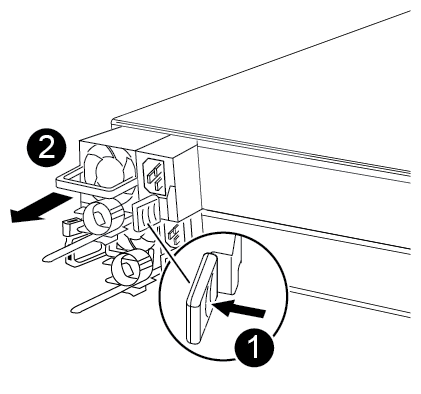

= Sustituya el controlador - ASA A250
:allow-uri-read: 
:icons: font
:imagesdir: ../media/

[role="lead"]
Para sustituir el hardware del módulo de la controladora, debe retirar la controladora dañada, mover los componentes de FRU al módulo de la controladora de reemplazo, instalar el módulo de la controladora de reemplazo en el chasis y, a continuación, arrancar el sistema en modo de mantenimiento.

== Paso 1: Extraiga el módulo del controlador

Debe quitar el módulo de la controladora del chasis cuando sustituya un componente dentro del módulo de la controladora.

Asegúrese de etiquetar los cables para saber de dónde proceden.

Utilice el siguiente vídeo o los pasos tabulados para reemplazar un módulo de controlador:

.Animación: Sustituya un módulo de controlador
video::ab0ebe6b-e891-489c-aab4-ac5b015c8f01[panopto]
. Si usted no está ya conectado a tierra, correctamente tierra usted mismo.
. Desconecte las fuentes de alimentación del módulo del controlador de la fuente.
. Suelte los retenes del cable de alimentación y, a continuación, desenchufe los cables de las fuentes de alimentación.
. Inserte el índice en el mecanismo de bloqueo de ambos lados del módulo del controlador, presione la palanca con el pulgar y tire suavemente del controlador a unas pocas pulgadas del chasis.
+

NOTE: Si tiene dificultades para extraer el módulo del controlador, coloque los dedos de índice a través de los orificios para los dedos desde el interior (cruzando los brazos).

+
image::../media/drw_a250_pcm_remove_install.png[Apertura del mecanismo de enclavamiento]

+
[cols="1,3"]
|===

 a| 
image:../media/icon_round_1.png["Número de llamada 1"]
| Palanca 

 a| 
image:../media/icon_round_2.png["Número de llamada 2"]
 a| 
Mecanismo de cierre

|===
. Con ambas manos, sujete los lados del módulo del controlador y extráigalo suavemente del chasis y configúrelo sobre una superficie plana y estable.
. Gire el tornillo de mano de la parte frontal del módulo del controlador hacia la izquierda y abra la cubierta del módulo del controlador.
+
image::../media/drw_a250_open_controller_module_cover.png[Apertura de la cubierta del módulo del controlador]

+
[cols="1,3"]
|===

 a| 
image:../media/icon_round_1.png["Número de llamada 1"]
| Tornillo de apriete manual 

 a| 
image:../media/icon_round_2.png["Número de llamada 2"]
 a| 
Cubierta del módulo del controlador.

|===
. Levantar la tapa del conducto de aire.
+
image::../media/drw_a250_remove_airduct_cover.png[Levantando la cubierta del conducto de aire]

== Paso 2: Mueva la fuente de alimentación

Debe mover la fuente de alimentación del módulo del controlador dañado al módulo del controlador de repuesto cuando sustituya un módulo del controlador.

. Desconecte la fuente de alimentación.
. Abra el retenedor del cable de alimentación y, a continuación, desconecte el cable de alimentación de la fuente de alimentación.
. Desconecte el cable de alimentación de la fuente de alimentación.
. Gire el mango de la leva de forma que pueda utilizarse para extraer la fuente de alimentación del módulo del controlador mientras presiona la lengüeta de bloqueo.
+

CAUTION: No ejerza una fuerza excesiva al deslizar el módulo del controlador hacia el chasis para evitar dañar los conectores.

+
El suministro de alimentación es corto. Utilice siempre dos manos para apoyarlo cuando lo extraiga del módulo del controlador de modo que no se mueva repentinamente del módulo del controlador y le herir.

+

+
[cols="1,3"]
|===

 a| 
image:../media/icon_round_1.png["Número de llamada 1"]
| Lengüeta azul de bloqueo de la fuente de alimentación 

 a| 
image:../media/icon_round_2.png["Número de llamada 2"]
 a| 
Suministro de alimentación

|===
. Mueva la fuente de alimentación al nuevo módulo de controlador y, a continuación, instálela.
. Con ambas manos, sujete y alinee los bordes de la fuente de alimentación con la abertura del módulo del controlador y, a continuación, empuje suavemente la fuente de alimentación en el módulo del controlador hasta que la lengüeta de bloqueo encaje en su sitio.
+
Las fuentes de alimentación sólo se acoplarán correctamente al conector interno y se bloquearán de una manera.

+

CAUTION: Para evitar dañar el conector interno, no ejerza demasiada fuerza al deslizar la fuente de alimentación hacia el sistema.

== Paso 3: Mueva los ventiladores

Debe mover los ventiladores del módulo de la controladora dañada al módulo de sustitución cuando sustituya un módulo de la controladora con fallos.

. Retire el módulo del ventilador pinzando el lado del módulo del ventilador y, a continuación, levante el módulo del ventilador para extraerlo del módulo del controlador.
+
image::../media/drw_a250_replace_fan.png[Extracción del módulo del ventilador]

+
[cols="1,3"]
|===

 a| 
image:../media/icon_round_1.png["Número de llamada 1"]
| Módulo de ventilador 
|===
. Mueva el módulo del ventilador al módulo del controlador de repuesto, alinee los bordes del módulo del ventilador con la abertura del módulo del controlador y, a continuación, deslice el módulo del ventilador hacia adentro.
. Repita estos pasos para los módulos de ventilador restantes.

== Paso 4: Mueva el soporte de arranque

Debe mover el dispositivo de soporte de arranque del módulo del controlador defectuoso al módulo del controlador de sustitución.

Necesita un destornillador Phillips magnético número 1 para quitar el tornillo que sujeta el soporte del maletero en su lugar. Debido a las limitaciones de espacio dentro del módulo del controlador, también debe tener un imán para transferir el tornillo a para que no se pierda.

. Localice y mueva el soporte del arranque desde el módulo de la controladora dañada hasta el módulo de la controladora de sustitución.
+
El soporte del maletero se encuentra debajo de la cubierta del conducto de aire que quitó anteriormente en este procedimiento.

+
image::../media/drw_a250_replace_boot_media.png[Sustituya el soporte de arranque]

+
[cols="1,3"]
|===

 a| 
image:../media/icon_round_1.png["Número de llamada 1"]
| Retire el tornillo que fija el soporte de arranque a la placa base en el módulo del controlador dañado. 

 a| 
image:../media/icon_round_2.png["Número de llamada 2"]
 a| 
Levante el soporte del maletero para extraerlo del módulo del controlador dañado.

|===
. Con el destornillador magnético número 1, retire el tornillo del soporte del maletero y colóquelo a un lado de forma segura en el imán.
. Levante suavemente el soporte del maletero directamente del zócalo y alinéelo en su lugar en el módulo de controlador de repuesto.
. Con el destornillador magnético número 1, inserte y apriete el tornillo del soporte de arranque.
+

NOTE: No aplique fuerza al apretar el tornillo en el soporte del maletero; puede que lo agriete.

== Paso 5: Mueva los DIMM

Para mover los módulos DIMM, búsquelos y muévalos del controlador dañado al controlador de recambio y siga la secuencia específica de pasos.

image::../media/drw_a250_dimm_replace.png[Sustitución de los DIMM]

NOTE: Instale cada módulo DIMM en la misma ranura que ocupa en el módulo de controlador dañado.

. Separe lentamente las lengüetas del eyector del DIMM a ambos lados del módulo DIMM y extraiga el módulo DIMM de la ranura.
+

NOTE: Sujete el módulo DIMM por los bordes para evitar la presión sobre los componentes de la placa de circuitos DIMM.

. Localice la ranura DIMM correspondiente en el módulo de la controladora de reemplazo.
. Asegúrese de que las lengüetas del expulsor DIMM del zócalo del DIMM están en posición abierta y, a continuación, inserte el DIMM directamente en el zócalo.
+
Los módulos DIMM se ajustan firmemente al zócalo. Si no es así, vuelva a insertar el DIMM para alinearlo con el zócalo.

. Inspeccione visualmente el módulo DIMM para comprobar que está alineado de forma uniforme y completamente insertado en el zócalo.
. Repita estos pasos para el DIMM restante.

== Paso 6: Mover una tarjeta mezzanine

Para mover una tarjeta mezzanine, debe quitar el cableado y cualquier QSFP e SFP de los puertos, mover la tarjeta mezzanine a la controladora de reemplazo, reinstalar cualquier QSFP y SFP en los puertos y cablear los puertos.

. Localice y mueva las tarjetas mezzanine del módulo de la controladora afectada.
+
image::../media/drw_a250_replace_mezz_card.png[Extracción de la tarjeta mezzanine]

+
[cols="1,3"]
|===

 a| 
image:../media/icon_round_1.png["Número de llamada 1"]
| Retire los tornillos de la cara del módulo del controlador. 

 a| 
image:../media/icon_round_2.png["Número de llamada 2"]
 a| 
Afloje el tornillo del módulo del controlador.

 a| 
image:../media/icon_round_3.png["Número de llamada 3"]
 a| 
Mueva la tarjeta mezzanine

|===
. Desconecte cualquier cableado asociado con la tarjeta mezzanine.
+
Asegúrese de etiquetar los cables para saber de dónde proceden.

+
.. Retire cualquier módulo SFP o QSFP que pueda estar en la tarjeta mezzanine y colóquelo aparte.
.. Con el destornillador magnético número 1, retire los tornillos de la cara del módulo del controlador dañado y de la tarjeta mezzanine y déjelos a un lado de forma segura en el imán.
.. Levante suavemente la tarjeta mezzanine para extraerla del zócalo y muévela a la misma posición en la controladora de reemplazo.
.. Alinee suavemente la tarjeta intermedia en su lugar en el controlador de repuesto.
.. Con el destornillador magnético número 1, inserte y apriete los tornillos de la cara del módulo del controlador de repuesto y de la tarjeta mezzanine.
+

NOTE: No aplique fuerza al apretar el tornillo de la tarjeta mezzanine, ya que puede romperlo.

. Repita estos pasos si hay otra tarjeta intermedia en el módulo de controlador dañado.
. Inserte los módulos SFP o QSFP que se han extraído en la tarjeta mezzanine.

== Paso 7: Mueva la batería NV

Al sustituir el módulo del controlador, debe mover la batería NV del módulo del controlador dañado al módulo del controlador de reemplazo.

. Localice y mueva la batería de NVMEM desde el módulo de la controladora con deficiencias al módulo de la controladora de reemplazo.
+
image::../media/drw_a250_replace_nvmem_batt.png[Quitando la batería de NVMEM]

+
[cols="1,3"]
|===

 a| 
image:../media/icon_round_1.png["Número de llamada 1"]
| Apriete la abrazadera de la cara del enchufe de la batería. 

 a| 
image:../media/icon_round_2.png["Número de llamada 2"]
 a| 
Desconecte el cable de la batería de la toma.

 a| 
image:../media/icon_round_3.png["Número de llamada 3"]
 a| 
Sujete la batería y presione LA lengüeta azul de bloqueo marcada CON LA TECLA.

 a| 
image:../media/icon_round_4.png["Número de llamada 4"]
 a| 
Levante la batería para extraerla del soporte y del módulo del controlador.

|===
. Localice el enchufe de la batería y apriete el clip en la parte frontal del enchufe de la batería para liberar el enchufe de la toma.
. Sujete la batería, presione LA lengüeta de bloqueo azul marcada Y, a continuación, levante la batería para sacarla del soporte y del módulo del controlador.
. Localice el soporte de la batería NV correspondiente en el módulo del controlador de repuesto y alinee la batería NV con el soporte de la batería.
. Inserte el enchufe de la batería NV en la toma.
. Deslice la batería hacia abajo a lo largo de la pared lateral de chapa metálica hasta que las lengüetas de soporte del gancho lateral de la pared entren en las ranuras de la batería y el pestillo de la batería se acople y haga clic en la abertura de la pared lateral.
. Presione firmemente la batería para asegurarse de que está bloqueada en su lugar.

== Paso 8: Instale el módulo del controlador

Una vez que todos los componentes se han movido del módulo de controlador dañado al módulo de controlador de repuesto, debe instalar el módulo de controlador de repuesto en el chasis y, a continuación, reiniciarlo en modo de mantenimiento.

Puede utilizar las siguientes ilustraciones o los pasos escritos para instalar el módulo de la controladora de reemplazo en el chasis.

. Si aún no lo ha hecho, instale el conducto de aire.
+
image::../media/drw_a250_install_airduct_cover.png[Instalación del conducto de aire]

. Cierre la cubierta del módulo del controlador y apriete el tornillo de mariposa.
+
image::../media/drw_a250_close_controller_module_cover.png[Cierre de la cubierta del módulo del controlador]

+
[cols="1,3"]
|===

 a| 
image:../media/icon_round_1.png["Número de llamada 1"]
| Cubierta del módulo del controlador 

 a| 
image:../media/icon_round_2.png["Número de llamada 2"]
 a| 
Tornillo de apriete manual

|===
. Alinee el extremo del módulo del controlador con la abertura del chasis y, a continuación, empuje suavemente el módulo del controlador hasta la mitad del sistema.
+

NOTE: No inserte completamente el módulo de la controladora en el chasis hasta que se le indique hacerlo.

. Cablee los puertos de gestión y consola de manera que pueda acceder al sistema para realizar las tareas en las secciones siguientes.
+

NOTE: Conectará el resto de los cables al módulo del controlador más adelante en este procedimiento.

. Inserte el módulo de la controladora en el chasis:
+
.. Asegúrese de que los brazos del mecanismo de bloqueo están bloqueados en la posición completamente extendida.
.. Con ambas manos, alinee y deslice suavemente el módulo del controlador en los brazos del mecanismo de bloqueo hasta que se detenga.
.. Coloque los dedos de índice a través de los orificios de los dedos desde el interior del mecanismo de bloqueo.
.. Presione los pulgares hacia abajo en las lengüetas naranjas situadas en la parte superior del mecanismo de bloqueo y empuje suavemente el módulo del controlador sobre el tope.
.. Suelte los pulgares de la parte superior de los mecanismos de bloqueo y siga presionando hasta que los mecanismos de bloqueo encajen en su lugar.
+
El módulo del controlador debe estar completamente insertado y alineado con los bordes del chasis.

.. Conecte los cables de alimentación a las fuentes de alimentación, vuelva a instalar el collar de bloqueo del cable de alimentación y, a continuación, conecte las fuentes de alimentación a la fuente de alimentación.
+
El módulo del controlador comienza a arrancar tan pronto como se restaura la alimentación. Esté preparado para interrumpir el proceso de arranque.

