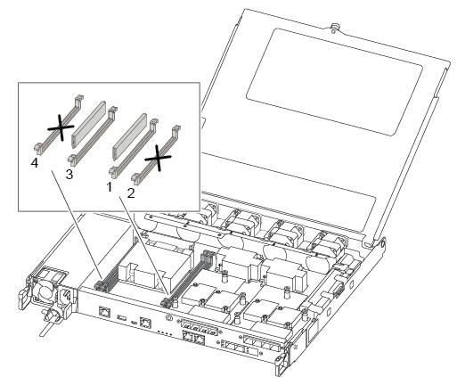

= Sustituya un módulo DIMM ASA A250
:allow-uri-read: 
:icons: font
:imagesdir: ../media/

[role="lead"]
Debe sustituir un DIMM en la controladora cuando el sistema de almacenamiento encuentra errores como, por ejemplo, errores excesivos de CECC (códigos de corrección de errores corregibles) basados en alertas de supervisión de estado o errores de ECC no corregibles, normalmente causados por un único fallo de DIMM que impide que el sistema de almacenamiento arranque ONTAP.

.Acerca de esta tarea
Todos los demás componentes del sistema deben funcionar correctamente; si no es así, debe ponerse en contacto con el soporte técnico.

Debe sustituir el componente con errores por un componente FRU de repuesto que haya recibido de su proveedor.

== Paso 1: Apague el controlador dañado

Para apagar el controlador dañado, debe determinar el estado del controlador y, si es necesario, tomar el control para que el controlador sano siga sirviendo datos del almacenamiento del controlador dañado.

.Acerca de esta tarea
* Si dispone de un sistema SAN, debe haber comprobado los mensajes de evento  `cluster kernel-service show`) para el blade SCSI de la controladora dañada.  `cluster kernel-service show`El comando (desde el modo avanzado priv) muestra el nombre del nodo, link:https://docs.netapp.com/us-en/ontap/system-admin/display-nodes-cluster-task.html["estado del quórum"] de ese nodo, el estado de disponibilidad de ese nodo y el estado operativo de ese nodo.
+
Cada proceso SCSI-blade debe quórum con los otros nodos del clúster. Todos los problemas deben resolverse antes de continuar con el reemplazo.

* Si tiene un clúster con más de dos nodos, debe estar en quórum. Si el clúster no tiene quórum o si una controladora en buen estado muestra falso según su condición, debe corregir el problema antes de apagar la controladora dañada; consulte link:https://docs.netapp.com/us-en/ontap/system-admin/synchronize-node-cluster-task.html?q=Quorum["Sincronice un nodo con el clúster"^].

.Pasos
. Si AutoSupport está habilitado, elimine la creación automática de casos invocando un mensaje de AutoSupport:
+
`system node autosupport invoke -node * -type all -message MAINT=<# of hours>h`

+
El siguiente mensaje de AutoSupport suprime la creación automática de casos durante dos horas:

+
`cluster1:> system node autosupport invoke -node * -type all -message MAINT=2h`

. Deshabilite la devolución automática de la consola de la controladora en buen estado:
+
`storage failover modify -node local -auto-giveback false`

+

NOTE: Cuando vea _do desea desactivar la devolución automática?_, introduzca `y`.

. Lleve la controladora dañada al aviso DEL CARGADOR:
+
[cols="1,2"]
|===
| Si el controlador dañado está mostrando... | Realice lo siguiente... 

 a| 
El aviso del CARGADOR
 a| 
Vaya al paso siguiente.

 a| 
Esperando devolución...
 a| 
Pulse Ctrl-C y, a continuación, responda `y` cuando se le solicite.

 a| 
Solicitud del sistema o solicitud de contraseña
 a| 
Retome o detenga el controlador dañado del controlador en buen estado:

`storage failover takeover -ofnode _impaired_node_name_ -halt _true_`

El parámetro _-halt true_ lleva al símbolo del sistema de Loader.

|===

== Paso 2: Extraiga el módulo del controlador

Debe quitar el módulo de la controladora del chasis cuando sustituya un componente dentro del módulo de la controladora.

Asegúrese de etiquetar los cables para saber de dónde proceden.

. Si usted no está ya conectado a tierra, correctamente tierra usted mismo.
. Desconecte las fuentes de alimentación del módulo del controlador de la fuente.
. Suelte los retenes del cable de alimentación y, a continuación, desenchufe los cables de las fuentes de alimentación.
. Inserte el índice en el mecanismo de bloqueo de ambos lados del módulo del controlador, presione la palanca con el pulgar y tire suavemente del controlador a unas pocas pulgadas del chasis.
+

NOTE: Si tiene dificultades para extraer el módulo del controlador, coloque los dedos de índice a través de los orificios para los dedos desde el interior (cruzando los brazos).

+
image::../media/drw_a250_pcm_remove_install.png[Apertura del mecanismo de enclavamiento]

+
[cols="1,3"]
|===

 a| 
image:../media/icon_round_1.png["Número de llamada 1"]
| Palanca 

 a| 
image:../media/icon_round_2.png["Número de llamada 2"]
 a| 
Mecanismo de cierre

|===
. Con ambas manos, sujete los lados del módulo del controlador y extráigalo suavemente del chasis y configúrelo sobre una superficie plana y estable.
. Gire el tornillo de mano de la parte frontal del módulo del controlador hacia la izquierda y abra la cubierta del módulo del controlador.
+
image::../media/drw_a250_open_controller_module_cover.png[Apertura de la cubierta del módulo del controlador]

+
[cols="1,3"]
|===

 a| 
image:../media/icon_round_1.png["Número de llamada 1"]
| Tornillo de apriete manual 

 a| 
image:../media/icon_round_2.png["Número de llamada 2"]
 a| 
Cubierta del módulo del controlador.

|===
. Levantar la tapa del conducto de aire.
+
image::../media/drw_a250_remove_airduct_cover.png[Levantando la cubierta del conducto de aire]

== Paso 3: Sustituya un DIMM

Para sustituir un módulo DIMM, debe localizarlo en el módulo del controlador mediante la etiqueta de mapa DIMM situada en la parte superior del conducto de aire y, a continuación, sustituirlo siguiendo la secuencia específica de pasos.

Utilice el siguiente vídeo o los pasos tabulados para reemplazar un DIMM:

.Animación - sustituya un DIMM
video::fa6b8107-86fb-4332-aa57-ac5b01605e52[panopto]
. Sustituya el DIMM dañado en el módulo de la controladora.
+
Los módulos DIMM están en la ranura 3 o 1 de la placa base. Las ranuras 2 y 4 se dejan vacías. No intente instalar DIMM en estas ranuras.

+

. Tenga en cuenta la orientación del módulo DIMM en el zócalo para que pueda insertar el módulo DIMM de repuesto en la orientación adecuada.
. Separe lentamente las lengüetas del eyector del DIMM a ambos lados del módulo DIMM y extraiga el módulo DIMM de la ranura.
. Dejar las lengüetas del expulsor DIMM en el conector en posición abierta.
. Retire el módulo DIMM de repuesto de la bolsa de transporte antiestática, sujete el módulo DIMM por las esquinas y alinéelo con la ranura.
+

NOTE: Sujete el módulo DIMM por los bordes para evitar la presión sobre los componentes de la placa de circuitos DIMM.

. Inserte el módulo DIMM de repuesto directamente en la ranura.
+
Los módulos DIMM se ajustan firmemente al zócalo. Si no es así, vuelva a insertar el DIMM para alinearlo con el zócalo.

. Inspeccione visualmente el módulo DIMM para comprobar que está alineado de forma uniforme y completamente insertado en el zócalo.

== Paso 4: Instale el módulo del controlador

Después de reemplazar el componente en el módulo de controlador, debe reinstalar el módulo de controlador en el chasis y, a continuación, arrancarlo.

Puede utilizar las siguientes ilustraciones o los pasos escritos para instalar el módulo de la controladora de reemplazo en el chasis.

. Si aún no lo ha hecho, instale el conducto de aire.
+
image::../media/drw_a250_install_airduct_cover.png[Instalación del conducto de aire]

. Cierre la cubierta del módulo del controlador y apriete el tornillo de mariposa.
+
image::../media/drw_a250_close_controller_module_cover.png[Cierre de la cubierta del módulo del controlador]

+
[cols="1,3"]
|===

 a| 
image:../media/icon_round_1.png["Número de llamada 1"]
| Cubierta del módulo del controlador 

 a| 
image:../media/icon_round_2.png["Número de llamada 2"]
 a| 
Tornillo de apriete manual

|===
. Inserte el módulo de la controladora en el chasis:
+
.. Asegúrese de que los brazos del mecanismo de bloqueo están bloqueados en la posición completamente extendida.
.. Con ambas manos, alinee y deslice suavemente el módulo del controlador en los brazos del mecanismo de bloqueo hasta que se detenga.
.. Coloque los dedos de índice a través de los orificios de los dedos desde el interior del mecanismo de bloqueo.
.. Presione los pulgares hacia abajo en las lengüetas naranjas situadas en la parte superior del mecanismo de bloqueo y empuje suavemente el módulo del controlador sobre el tope.
.. Suelte los pulgares de la parte superior de los mecanismos de bloqueo y siga presionando hasta que los mecanismos de bloqueo encajen en su lugar.
+
El módulo del controlador debe estar completamente insertado y alineado con los bordes del chasis.

. Conecte los cables de alimentación a las fuentes de alimentación, vuelva a instalar el collar de bloqueo del cable de alimentación y, a continuación, conecte las fuentes de alimentación a la fuente de alimentación.
+
El módulo del controlador comienza a arrancar tan pronto como se restaura la alimentación. Esté preparado para interrumpir el proceso de arranque.

. Recuperar el sistema, según sea necesario.
. Devuelva el funcionamiento normal de la controladora y devuelva su almacenamiento: `storage failover giveback -ofnode _impaired_node_name_`
. Si la devolución automática está desactivada, vuelva a habilitarla: `storage failover modify -node local -auto-giveback true`

== Paso 5: Devuelva la pieza que falló a NetApp

Devuelva la pieza que ha fallado a NetApp, como se describe en las instrucciones de RMA que se suministran con el kit. Consulte https://mysupport.netapp.com/site/info/rma["Devolución de piezas y sustituciones"] la página para obtener más información.
