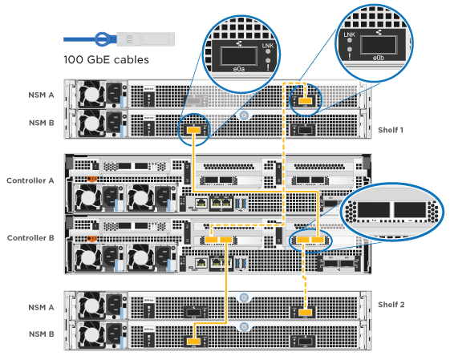

= Pasos detallados - ASA A800
:allow-uri-read: 
:icons: font
:imagesdir: ../media/

[role="lead"]
Esta página ofrece instrucciones detalladas paso a paso para instalar un sistema ASA A800.

== Paso 1: Preparar la instalación

Para instalar el sistema, debe crear una cuenta y registrar el sistema. También es necesario realizar el inventario del número y tipo de cables adecuados para el sistema y recopilar información específica de la red.

Debe tener acceso a link:https://hwu.netapp.com["Hardware Universe de NetApp"^] (HWU) para obtener información acerca de los requisitos del sitio, así como información adicional sobre el sistema configurado. Puede que también desee tener acceso a link:http://mysupport.netapp.com/documentation/productlibrary/index.html?productID=62286["Notas de la versión de ONTAP"^] para obtener más información sobre este sistema.

.Lo que necesita
Debe proporcionar lo siguiente en el sitio:

* Espacio en rack para el sistema de almacenamiento
* Destornillador Phillips número 2
* Cables de red adicionales para conectar el sistema al conmutador de red y al portátil o a la consola con un navegador Web
+
.. Extraiga el contenido de todas las cajas.
.. Registre el número de serie del sistema de las controladoras.
+
image::../media/drw_ssn_label.png[Ejemplo del número de serie del sistema donde se muestra la ubicación del número]

.Pasos
. Configure su cuenta:
+
.. Inicie sesión en su cuenta existente o cree una cuenta.
.. Registro (link:https://mysupport.netapp.com/eservice/registerSNoAction.do?moduleName=RegisterMyProduct["Registro de productos de NetApp"^]) su sistema.

. Descargue e instale link:https://mysupport.netapp.com/site/tools/tool-eula/activeiq-configadvisor["Descargas de NetApp: Config Advisor"^] en el portátil.
. Realice un inventario y anote el número y los tipos de cables recibidos.
+
En la siguiente tabla se identifican los tipos de cables que pueden recibir. Si recibe un cable que no aparece en la tabla, consulte link:https://hwu.netapp.com["Hardware Universe de NetApp"^] para localizar el cable e identificar su uso.

+
[cols="1,2,1,2"]
|===
| Tipo de conector | Número de pieza y longitud | Tipo de cable... | Durante... 

 a| 
Cable de 100 GbE
 a| 
X66211A-05 (112-00595), 0,5 m
 a| 
image:../media/oie_cable100_gbe_qsfp28.png["Conector QSFP28 de 100 GbE"]
 a| 
Interconexión de ALTA DISPONIBILIDAD

 a| 
X66211A-05 (112-00595), 0,5 m;

X66211-1 (112-00573), 1 m.
 a| 
La red de interconexión en clúster

 a| 
X66211-2 (112-00574), 2 m;

X66211-5 (112-00576), 5 m
 a| 
Datos, almacenamiento

 a| 
Cable de 10 GbE
 a| 
X6566B-3-R6 (112-00300), 3 m;

X6566B-5-R6 (112-00301), 5 m
 a| 
SQL Server

 a| 
Cable de 25 GbE
 a| 
X66240A-2 (112-00598), 2 m;

X66240A-5 (112-00600), 5 m
 a| 
SQL Server

 a| 
RJ-45 (dependiente del pedido)
 a| 
No aplicable
 a| 
image:../media/oie_cable_rj45.png["Conector de cable RJ-45"]
 a| 
Gestión

 a| 
Fibre Channel
 a| 
X66250-2 (112-00342) 2 m;

X66250-5 (112-00344) 5 m;

X66250-15 (112-00346) 15 m;

X66250-30 (112-00347) 30m
 a| 
image:../media/oie_cable_fc_optical.png["Cable óptico de canal de fibra de la OIE"]
 a| 

 a| 
Cable de consola Micro-USB
 a| 
No aplicable
 a| 
image:../media/oie_cable_micro_usb.png["Ilustración que muestra un conector micro USB"]
 a| 
Conexión de consola durante la configuración del software

 a| 
Cables de alimentación
 a| 
No aplicable
 a| 
image:../media/oie_cable_power.png["Cables de alimentación"]
 a| 
Encendido del sistema

|===
. Descargue y complete el link:https://library.netapp.com/ecm/ecm_download_file/ECMLP2839002["Hoja de datos para la configuración del clúster"^].

== Paso 2: Instale el hardware

Debe instalar el sistema en un rack de 4 parantes o armario del sistema de NetApp, según corresponda.

.Pasos
. Instale los kits de raíles, según sea necesario.
+
link:../platform-supplemental/superrail-install.html["Instalación de SuperRail en un rack de cuatro postes"]

. Instale y asegure el sistema siguiendo las instrucciones incluidas con el kit de raíl.
+

NOTE: Debe ser consciente de los problemas de seguridad asociados con el peso del sistema.

+
image::../media/drw_affa800_weight_caution.png[Precaución de elevación para cuatro personas]

. Conecte los dispositivos de administración de cables (como se muestra).
+
image::../media/drw_affa800_install_cable_mgmt.png[Conexión del dispositivo de gestión de cables]

. Coloque el panel frontal en la parte delantera del sistema.

== Paso 3: Controladores de cables

Se requiere un cableado para el clúster de la plataforma mediante el método de clúster sin switch de dos nodos o el método de red de interconexión de clúster. Existe un cableado opcional para las redes host Fibre Channel o iSCSI o almacenamiento de conexión directa. Este cableado no es exclusivo; puede tener cables para una red host y almacenamiento.

=== Cableado necesario: Conecte las controladoras a un clúster

Conecte los cables de las controladoras a un clúster mediante el método de clúster sin switch de dos nodos o mediante el uso de la red de interconexión de clúster.

==== Opción 1: Conecte el cable de un clúster sin switch de dos nodos

Los puertos de red de gestión de las controladoras están conectados a los switches. Los puertos de interconexión de clúster y de alta disponibilidad se cablean en ambas controladoras.

.Antes de empezar
Póngase en contacto con el administrador de red para obtener información sobre la conexión del sistema a los switches.

Asegúrese de comprobar que la flecha de la ilustración tenga la orientación correcta de la lengüeta de extracción del conector del cable.

image::../media/oie_cable_pull_tab_up.png[Conector de cable con lengüeta en la parte superior]

NOTE: Al insertar el conector, debería sentir que hace clic en su lugar; si no cree que hace clic, quítelo, gírelo y vuelva a intentarlo.

.Pasos
. Utilice la animación o los pasos tabulados para completar el cableado entre los controladores y los conmutadores:
+
.Animación: Conectar un clúster sin switch de dos nodos
video::edc42447-f721-4cbe-b080-ab0c0123a139[panopto]
+
[cols="10,90"]
|===
| Paso | Lleve a cabo cada módulo de la controladora 

 a| 

 a| 
Conecte los cables de los puertos de interconexión de alta disponibilidad:

** e0b a e0b
** e1b a e1b
image:../media/drw_affa800_ha_pair_cabling.png["Cableado de par de ALTA disponibilidad"]

 a| 

 a| 
Conecte los puertos de interconexión del clúster:

** e0a a e0a
** e1a a e1a
image:../media/drw_affa800_tnsc_clust_cabling.png["Cableado de interconexión de clúster en un clúster sin switches de dos nodos"]

 a| 
image:../media/oie_legend_icon_3_lp.png["Paso 3"]
 a| 
Conecte los puertos de gestión a los switches de red de gestión    image:../media/drw_affa800_mgmt_cabling.png["Ilustración que muestra la ubicación de los puertos de gestión en la parte posterior del sistema"]

 a| 
image:../media/oie_legend_icon_attn_symbol.png["Símbolo de atención"]
 a| 
NO enchufe los cables de alimentación en este momento.

|===
. Para realizar el cableado opcional, consulte:
+
** <<Opción 1: Cable a una red host Fibre Channel>>
** <<Opción 2: Cable a una red de host de 10 GbE>>
** <<Opción 3: Conecte las controladoras a una bandeja de unidades única>>
** <<Opción 4: Conecte las controladoras a dos bandejas de unidades>>

. Para completar la configuración del sistema, consulte link:install-detailed-guide.html#step-4-complete-system-setup-and-configuration["Paso 4: Pasos completos para la instalación y la configuración del sistema"].

==== Opción 2: Conectar un clúster de switches

Los puertos de red de interconexión de clústeres y de gestión de las controladoras están conectados a switches mientras que los puertos de interconexión de alta disponibilidad se cablean en ambas controladoras.

.Antes de empezar
Póngase en contacto con el administrador de red para obtener información sobre la conexión del sistema a los switches.

Asegúrese de comprobar que la flecha de la ilustración tenga la orientación correcta de la lengüeta de extracción del conector del cable.

image::../media/oie_cable_pull_tab_up.png[Conector de cable con lengüeta en la parte superior]

NOTE: Al insertar el conector, debería sentir que hace clic en su lugar; si no cree que hace clic, quítelo, gírelo y vuelva a intentarlo.

.Pasos
. Utilice la animación o los pasos tabulados para completar el cableado entre los controladores y los conmutadores:
+
.Animación - conectar un grupo conmutado
video::49e48140-4c5a-4395-a7d7-ab0c0123a10e[panopto]
+
[cols="10,90"]
|===
| Paso | Lleve a cabo cada módulo de la controladora 

 a| 

 a| 
Conecte los cables de los puertos de interconexión de alta disponibilidad:

** e0b a e0b
** e1b a e1b
image:../media/drw_affa800_ha_pair_cabling.png["Cableado de par de ALTA disponibilidad"]

 a| 

 a| 
Conecte los puertos de interconexión de clúster a los switches de interconexión de clúster de 100 GbE.
** e0a
** e1a
image:../media/drw_affa800_switched_clust_cabling.png["Cableado de interconexión del clúster"]

 a| 
image:../media/oie_legend_icon_3_lp.png["Paso 3"]
 a| 
Conecte los puertos de gestión a los switches de red de gestión    image:../media/drw_affa800_mgmt_cabling.png["Ilustración que muestra la ubicación de los puertos de gestión en la parte posterior del sistema"]

 a| 
image:../media/oie_legend_icon_attn_symbol.png["Símbolo de atención"]
 a| 
NO enchufe los cables de alimentación en este momento.

|===
. Para realizar el cableado opcional, consulte:
+
** <<Opción 1: Cable a una red host Fibre Channel>>
** <<Opción 2: Cable a una red de host de 10 GbE>>
** <<Opción 3: Conecte las controladoras a una bandeja de unidades única>>
** <<Opción 4: Conecte las controladoras a dos bandejas de unidades>>

. Para completar la configuración del sistema, consulte link:install-detailed-guide.html#step-4-complete-system-setup-and-configuration["Paso 4: Pasos completos para la instalación y la configuración del sistema"].

=== Cableado opcional: Opciones dependientes de la configuración del cable

Tiene un cableado opcional dependiente de la configuración a las redes host Fibre Channel o iSCSI, o al almacenamiento de conexión directa. Este cableado no es exclusivo; puede tener cableado para una red host y almacenamiento.

==== Opción 1: Cable a una red host Fibre Channel

Los puertos Fibre Channel de las controladoras están conectados a switches de red host Fibre Channel.

.Antes de empezar
Póngase en contacto con el administrador de red para obtener información sobre la conexión del sistema a los switches.

Asegúrese de comprobar que la flecha de la ilustración tenga la orientación correcta de la lengüeta de extracción del conector del cable.

image::../media/oie_cable_pull_tab_up.png[Conector de cable con lengüeta en la parte superior]

NOTE: Al insertar el conector, debería sentir que hace clic en su lugar; si no cree que hace clic, quítelo, gírelo y vuelva a intentarlo.

[cols="10,90"]
|===
| Paso | Lleve a cabo cada módulo de la controladora 

 a| 
1
 a| 
Conecte los puertos 2a a 2d a los switches host FC.image:../media/drw_affa800_fc_host_cabling.png["Cableado de red del host Fibre Channel"]

 a| 
2
 a| 
Para realizar otro cableado opcional, elija entre:

* <<Opción 3: Conecte las controladoras a una bandeja de unidades única>>
* <<Opción 4: Conecte las controladoras a dos bandejas de unidades>>

 a| 
3
 a| 
Para completar la configuración del sistema, consulte link:install-detailed-guide.html#step-4-complete-system-setup-and-configuration["Paso 4: Pasos completos para la instalación y la configuración del sistema"].

|===

==== Opción 2: Cable a una red de host de 10 GbE

Los puertos 10 GbE de las controladoras están conectados a switches de red de host de 10 GbE.

.Antes de empezar
Póngase en contacto con el administrador de red para obtener información sobre la conexión del sistema a los switches.

Asegúrese de comprobar que la flecha de la ilustración tenga la orientación correcta de la lengüeta de extracción del conector del cable.

image::../media/oie_cable_pull_tab_up.png[Conector de cable con lengüeta en la parte superior]

NOTE: Al insertar el conector, debería sentir que hace clic en su lugar; si no cree que hace clic, quítelo, gírelo y vuelva a intentarlo.

[cols="10,90"]
|===
| Paso | Lleve a cabo cada módulo de la controladora 

 a| 
1
 a| 
Los puertos de cable e4a a e4d a los conmutadores de red host 10GbE.image:../media/drw_affa800_10gbe_host_cabling.png["Cableado de red host"]

 a| 
2
 a| 
Para realizar otro cableado opcional, elija entre:

* <<Opción 3: Conecte las controladoras a una bandeja de unidades única>>
* <<Opción 4: Conecte las controladoras a dos bandejas de unidades>>

 a| 
3
 a| 
Para completar la configuración del sistema, consulte link:install-detailed-guide.html#step-4-complete-system-setup-and-configuration["Paso 4: Pasos completos para la instalación y la configuración del sistema"].

|===

==== Opción 3: Conecte las controladoras a una bandeja de unidades única

Debe cablear cada controladora a los módulos NSM de la bandeja de unidades NS224.

.Antes de empezar
Asegúrese de comprobar que la flecha de la ilustración tenga la orientación correcta de la lengüeta de extracción del conector del cable.

image::../media/oie_cable_pull_tab_up.png[Conector de cable con lengüeta en la parte superior]

NOTE: Al insertar el conector, debería sentir que hace clic en su lugar; si no cree que hace clic, quítelo, gírelo y vuelva a intentarlo.

Utilice la animación o los pasos tabulados para cablear las controladoras a una sola bandeja:

.Animación: Conecte con cables las controladoras a una sola bandeja de unidades
video::09dade4f-00bd-4d41-97d7-ab0c0123a0b4[panopto]
[cols="10,90"]
|===
| Paso | Lleve a cabo cada módulo de la controladora 

 a| 
image:../media/oie_legend_icon_1_mb.png["Número de llamada 1"]
 a| 
Conecte la controladora A a la bandeja:    image:../media/drw_affa800_1shelf_cabling_a.png["Cableado de las controladoras a una bandeja única"]

 a| 
image:../media/oie_legend_icon_2_lo.png["Número de llamada 2"]
 a| 
Conecte la controladora B a la bandeja:    image:../media/drw_affa800_1shelf_cabling_b.png["Cableado de la controladora B a una sola bandeja"]

|===
Para completar la configuración del sistema, consulte link:install-detailed-guide.html#step-4-complete-system-setup-and-configuration["Paso 4: Pasos completos para la instalación y la configuración del sistema"].

==== Opción 4: Conecte las controladoras a dos bandejas de unidades

Debe cablear cada controladora a los módulos NSM de ambas bandejas de unidades NS224.

.Antes de empezar
Asegúrese de comprobar que la flecha de la ilustración tenga la orientación correcta de la lengüeta de extracción del conector del cable.

image::../media/oie_cable_pull_tab_up.png[Conector de cable con lengüeta en la parte superior]

NOTE: Al insertar el conector, debería sentir que hace clic en su lugar; si no cree que hace clic, quítelo, gírelo y vuelva a intentarlo.

Utilice la animación o los pasos tabulados para cablear las controladoras a dos bandejas de unidades:

.Animación: Conectar los controladores a dos estantes de unidad
video::fe50ac38-9375-4e6b-85af-ab0c0123a0e0[panopto]
[cols="10,90"]
|===
| Paso | Lleve a cabo cada módulo de la controladora 

 a| 
image:../media/oie_legend_icon_1_mb.png["Número de llamada 1"]
 a| 
Conecte la controladora A a las bandejas:    image:../media/drw_affa800_2shelf_cabling_a.png["Cableado de la controladora A a dos bandejas"]

 a| 
image:../media/oie_legend_icon_2_lo.png["Número de llamada 2"]
 a| 
Conecte la controladora B a las bandejas:    

|===
Para completar la configuración del sistema, consulte link:install-detailed-guide.html#step-4-complete-system-setup-and-configuration["Paso 4: Pasos completos para la instalación y la configuración del sistema"].

== Paso 4: Pasos completos para la instalación y la configuración del sistema

Complete la instalación y la configuración del sistema mediante la detección de clústeres que solo tiene una conexión al switch y al portátil, o bien se puede conectar directamente a una controladora del sistema y, a continuación, conectarse al switch de gestión.

=== Opción 1: Completar la configuración y la instalación del sistema si la detección de red está activada

Si tiene la detección de red habilitada en el portátil, puede completar la configuración y la instalación del sistema mediante la detección automática del clúster.

.Pasos
. Enchufe los cables de alimentación a las fuentes de alimentación de la controladora y luego conéctelos a fuentes de alimentación de diferentes circuitos.
+
El sistema comienza a iniciarse. El arranque inicial puede tardar hasta ocho minutos.

. Asegúrese de que el ordenador portátil tiene activado el descubrimiento de red.
+
Consulte la ayuda en línea de su portátil para obtener más información.

. Utilice la animación para conectar el portátil al conmutador de administración:
+
.Animación: Conecte el portátil al conmutador de administración
video::d61f983e-f911-4b76-8b3a-ab1b0066909b[panopto]
. Seleccione un icono de ONTAP que aparece para detectar:
+
image::../media/drw_autodiscovery_controler_select.png[Seleccione un icono de ONTAP]

+
.. Abra el Explorador de archivos.
.. Haga clic en *Red* en el panel izquierdo.
.. Haga clic con el botón derecho del ratón y seleccione *Actualizar*.
.. Haga doble clic en el icono de ONTAP y acepte los certificados que aparecen en la pantalla.
+

NOTE: XXXXX es el número de serie del sistema para el nodo de destino.

+
Se abrirá System Manager.

. Utilice la configuración guiada de System Manager para configurar el sistema con los datos recogidos en el link:https://library.netapp.com/ecm/ecm_download_file/ECMLP2862613["Guía de configuración de ONTAP"^].
. Compruebe el estado del sistema ejecutando Config Advisor.
. Después de completar la configuración inicial, vaya a la link:https://www.netapp.com/data-management/oncommand-system-documentation/["Recursos de documentación de ONTAP  ONTAP System Manager"^] Página para obtener información sobre cómo configurar las funciones adicionales en ONTAP.

=== Opción 2: Completar la configuración y la instalación del sistema si la detección de red no está habilitada

Si el descubrimiento de red no está activado en el portátil, debe completar la configuración y la configuración mediante esta tarea.

.Pasos
. Conecte y configure el portátil o la consola:
+
.. Ajuste el puerto de la consola del portátil o de la consola en 115,200 baudios con N-8-1.
+

NOTE: Consulte la ayuda en línea del portátil o de la consola para saber cómo configurar el puerto de la consola.

.. Conecte el cable de la consola al portátil o a la consola y conecte el puerto de la consola del controlador mediante el cable de consola incluido con el sistema.
+
image::../media/drw_console_connect_affa800.png[Conectando al puerto de la consola]

.. Conecte el portátil o la consola al conmutador de la subred de administración.
+
image::../media/drw_client_mgmt_subnet_affa800.png[Conexión del portátil o la consola para activar la subred de administración]

.. Asigne una dirección TCP/IP al portátil o consola, utilizando una que esté en la subred de gestión.

. Enchufe los cables de alimentación a las fuentes de alimentación de la controladora y luego conéctelos a fuentes de alimentación de diferentes circuitos.
+
El sistema comienza a iniciarse. El arranque inicial puede tardar hasta ocho minutos.

. Asigne una dirección IP de gestión de nodos inicial a uno de los nodos.
+
[cols="1,2"]
|===
| Si la red de gestión tiene DHCP... | Realice lo siguiente... 

 a| 
Configurado
 a| 
Registre la dirección IP asignada a las nuevas controladoras.

 a| 
No configurado
 a| 
.. Abra una sesión de consola mediante PuTTY, un servidor terminal o el equivalente para su entorno.
+

NOTE: Si no sabe cómo configurar PuTTY, compruebe la ayuda en línea del ordenador portátil o de la consola.

.. Introduzca la dirección IP de administración cuando se lo solicite el script.

|===
. Mediante System Manager en el portátil o la consola, configure su clúster:
+
.. Dirija su navegador a la dirección IP de gestión de nodos.
+

NOTE: El formato de la dirección es +https://x.x.x.x+.

.. Configure el sistema con los datos recogidos en el link:https://library.netapp.com/ecm/ecm_download_file/ECMLP2862613["Guía de configuración de ONTAP"^].

. Compruebe el estado del sistema ejecutando Config Advisor.
. Después de completar la configuración inicial, vaya a la link:https://www.netapp.com/data-management/oncommand-system-documentation/["Recursos de documentación de ONTAP  ONTAP System Manager"^] Página para obtener información sobre cómo configurar las funciones adicionales en ONTAP.

