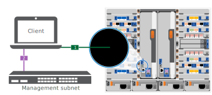

= Pasos detallados - ASA 900
:allow-uri-read: 
:icons: font
:imagesdir: ../media/

[role="lead"]
Esta página proporciona instrucciones detalladas paso a paso para instalar un sistema NetApp típico. Utilice este artículo si desea instrucciones de instalación más detalladas.

== Paso 1: Preparar la instalación

Para instalar el sistema, debe crear una cuenta en el sitio de soporte de NetApp, registrar el sistema y obtener claves de licencia. También es necesario realizar el inventario del número y tipo de cables adecuados para el sistema y recopilar información específica de la red.

Debe tener acceso a https://hwu.netapp.com["Hardware Universe de NetApp"^] para obtener información acerca de los requisitos del sitio así como información adicional sobre el sistema configurado.

.Lo que necesita
Puede que también desee tener acceso a http://mysupport.netapp.com/documentation/productlibrary/index.html?productID=62286["Notas de la versión de ONTAP 9"^] Para su versión de ONTAP para obtener más información sobre este sistema.

Debe proporcionar lo siguiente en el sitio:

* Espacio en rack para el sistema de almacenamiento
* Destornillador Phillips número 2
* Cables de red adicionales para conectar el sistema al conmutador de red y al portátil o a la consola con un navegador Web

.Pasos
. Extraiga el contenido de todas las cajas.
. Registre el número de serie del sistema de las controladoras.
+
image::../media/drw_ssn_label.svg[Ejemplo del número de serie del sistema donde se muestra la ubicación del número]

. Realice un inventario y anote el número y los tipos de cables recibidos.
+
En la siguiente tabla se identifican los tipos de cables que pueden recibir. Si recibe un cable no enumerado en la tabla, consulte la Hardware Universe para localizar el cable e identificar su uso.

+
https://hwu.netapp.com["Hardware Universe de NetApp"^]

+
[cols="1,2,2,2"]
|===
| Tipo de cable... | Número de pieza y longitud | Tipo de conector | Durante... 

 a| 
Cable de datos de 25 GbE
 a| 
X66240A-05 (112-00639), 0,5 m

X66240A-2 (112-00598), 2 m

X66240A-5 (112-00600), 5 m
 a| 
image::../media/oie_cable_sfp_gbe_copper.svg[cable de cobre gbe sfp de la oie]
 a| 
Cable de red

 a| 
FC de 32 GB (SFP+ Op)
 a| 
X66250-2 (112-00342), 2 m

X66250-5 (112-00344), 5 m

X66250-15 (112-00346), 15m
 a| 
image::../media/oie_cable_sfp_gbe_copper.svg[cable de cobre gbe sfp de la oie]
 a| 
Cable de red óptica FC

 a| 
Cable de red de 40 GbE
 a| 
X66100-1 (112-00542), 1 m.

X66100-3 (112-00543), 3 m.

X66100-5 (112-00544), 5 m
 a| 
image::../media/oie_cable100_gbe_qsfp28.svg[cable100 gbe qsfp28 de la oie]
 a| 
Datos Ethernet, red en clúster

 a| 
Cable de 100 GbE
 a| 
X66211B-1 (112-00573), 1 m.

X66211B-2 (112-00574), 2 m

X66211B-5 (112-00576), 5 m
 a| 
image::../media/oie_cable100_gbe_qsfp28.svg[cable100 gbe qsfp28 de la oie]
 a| 
Red,

Almacenamiento NVME,

Datos Ethernet,

red de clúster

 a| 
Cables ópticos
 a| 
X66031A (112-00436), 1 m.

X66032A (112-00437), 2 m

X66033A (112-00438), 3 m.
 a| 
image::../media/oie_cable_fiber_lc_connector.svg[conector lc de fibra de cable de la oie]
 a| 
Red óptica FC

 a| 
Cat 6, RJ-45 (según pedido)
 a| 
Números de referencia X6585-R6 (112-00291), 3m

X6562-R6 (112-00196), 5 m
 a| 
image::../media/oie_cable_rj45.svg[cable rj45 de la oie]
 a| 
Red de gestión y datos Ethernet

 a| 
Cable de consola Micro-USB
 a| 
No aplicable
 a| 
image::../media/oie_cable_micro_usb.svg[cable micro usb de la oie]
 a| 
Conexión de consola durante la configuración del software en un portátil/consola que no sea Windows o Mac

 a| 
Cables de alimentación
 a| 
No aplicable
 a| 
image::../media/oie_cable_power.svg[alimentación de cable de la oie]
 a| 
Encendido del sistema

|===
. Revise la https://library.netapp.com/ecm/ecm_download_file/ECMLP2862613["Guía de configuración de ONTAP"^] y recopilar la información necesaria que aparece en esa guía.

== Paso 2: Instale el hardware

Debe instalar el sistema en un rack de 4 parantes o armario del sistema de NetApp, según corresponda.

. Instale los kits de raíles, según sea necesario.
. Instale y asegure el sistema siguiendo las instrucciones incluidas con el kit de raíl.
+

NOTE: Debe ser consciente de los problemas de seguridad asociados con el peso del sistema.

+
image::../media/drw_9500_lifting_icon.svg[icono de elevación drw 9500]

. Conecte los dispositivos de administración de cables (como se muestra).
+
image::../media/drw_9500_cable_management_arms.svg[brazos de gestión de cables drw 9500]

. Coloque el panel frontal en la parte delantera del sistema.

El siguiente diagrama muestra una representación del aspecto típico de un sistema y dónde se encuentran los componentes principales en la parte trasera del sistema:

image::../media/drw_a900_controller_in _chassis_ID_IEOPS-856.svg[Configuración típica del clúster]

== Paso 3: Conecte los controladores a la red

Puede conectar las controladoras a la red mediante el método de clúster sin switch de dos nodos o mediante la red de interconexión de clúster.

[role="tabbed-block"]
====
.Opción 1: Clúster sin switches de dos nodos
--
Los puertos de red de gestión, red de datos y gestión de las controladoras se conectan a los switches. Los puertos de interconexión de clúster se cablean en ambas controladoras.

.Antes de empezar
Debe haberse puesto en contacto con el administrador de red para obtener información sobre la conexión del sistema a los switches.

Asegúrese de comprobar la dirección de las pestañas de contacto del cable al insertar los cables en los puertos. Las pestañas de cable están hacia arriba para todos los puertos del módulo de red.

image::../media/oie_cable_pull_tab_up.svg[dirección de la lengüeta de tracción del cable]

NOTE: Al insertar el conector, debería sentir que hace clic en su lugar; si no cree que hace clic, quítelo, gírelo y vuelva a intentarlo.

. Utilice la animación o la ilustración para completar el cableado entre las controladoras y los switches:
+
.Animación: Conectar un clúster sin switch de dos nodos
video::37419c37-f56f-48e5-8e6c-afa600095444[panopto]
+
image::../media/drw_a900_tnsc_network_cabling_IEOPS-933.svg[Cableado de red de dos nodos sin switches]

+
|===
| Paso | Ejecute cada controladora 

 a| 
image::../media/oie_legend_icon_1_lg.svg[leyenda de la oie icono 1 lg]
 a| 
Conectar puertos de interconexión de clúster:

** Ranura A4 y B4 (e4a)
** Ranura A8 y B8 (e8a)

image::../media/oie_cable100_gbe_qsfp28.svg[cable100 gbe qsfp28 de la oie]

 a| 
image::../media/oie_legend_icon_2_lp.svg[leyenda de la oie icono 2 lp]
 a| 
Conecte los cables de los puertos de gestión de las controladoras (llave inglesa).

image::../media/oie_cable_rj45.svg[cable rj45 de la oie]

 a| 
image::../media/oie_legend_icon_3_o.svg[leyenda de la oie icono 3 o]
 a| 
Cable de switches de red 25 GbE:

Puertos de las ranuras A3 y B3 (e3a y e3c) y A9 y B9 (e9a y e9c) a los switches de red de 25 GbE.

image::../media/oie_cable_sfp_gbe_copper.svg[cable de cobre gbe sfp de la oie]

Switches de red de host de 40 GbE:

Conecte los puertos b del host‐en las ranuras A4 y B4 (e4b) y la ranura A8 y B8 (e8b) al conmutador host.

image::../media/oie_cable100_gbe_qsfp28.svg[cable100 gbe qsfp28 de la oie]

 a| 
image::../media/oie_legend_icon_4_dr.svg[leyenda de la oie icono 4 dr]
 a| 
Cable de conexiones FC de 32 GB:

Conecte los puertos de la ranura A5 y B5 (5a, 5b, 5c y 5d) y la ranura A7 y B7 (7a, 7b, 7c y 7d) a los switches de red FC de 32 GB.

image::../media/oie_cable_sfp_gbe_copper.svg[cable de cobre gbe sfp de la oie]

 a| 
** Sujete los cables a los brazos organizadores de cables (no se muestran).
** Conecte los cables de alimentación a las PSU y conéctelos a distintas fuentes de alimentación (no se muestran). Los PSU 1 y 3 proporcionan alimentación a todos los componentes del lado A, mientras que PSU2 y PSU4 proporcionan alimentación a todos los componentes del lado B.

 a| 
image::../media/oie_cable_power.svg[alimentación de cable de la oie]

image::../media/drw_a900fas9500_power_source_icon_IEOPS-1142.svg[drw a900fas9500 icono de fuente de alimentación IEOPS 1142]

|===

--
.Opción 2: Clúster de switches
--
Los puertos de red de gestión, red de datos y gestión de las controladoras se conectan a los switches. Los puertos de interconexión de clúster y alta disponibilidad están conectados mediante cable al switch de clúster/alta disponibilidad.

.Antes de empezar
Debe haberse puesto en contacto con el administrador de red para obtener información sobre la conexión del sistema a los switches.

Asegúrese de comprobar la dirección de las pestañas de contacto del cable al insertar los cables en los puertos. Las pestañas de cable están hacia arriba para todos los puertos del módulo de red.

image::../media/oie_cable_pull_tab_up.svg[dirección de la lengüeta de tracción del cable]

NOTE: Al insertar el conector, debería sentir que hace clic en su lugar; si no cree que hace clic, quítelo, vuelva a convertirlo y vuelva a intentarlo.

. Utilice la animación o la ilustración para completar el cableado entre las controladoras y los switches:
+
.Animación - conectar un grupo conmutado
video::61ec11ec-aa30-474a-87a5-afa60008b52b[panopto]
+
image::../media/drw_a900_switched_network_cabling_IEOPS-934.svg[Cableado de red conmutada drw a900 IEPOPS 934]

+
|===
| Paso | Ejecute cada controladora 

 a| 
image::../media/oie_legend_icon_1_lg.svg[leyenda de la oie icono 1 lg]
 a| 
Conectar los puertos a de interconexión en clúster:

** Ranura A4 y B4 (e4a) en el conmutador de red del clúster.
** Coloque A8 y B8 (e8a) en el conmutador de red del clúster.

image::../media/oie_cable100_gbe_qsfp28.svg[cable100 gbe qsfp28 de la oie]

 a| 
image::../media/oie_legend_icon_2_lp.svg[leyenda de la oie icono 2 lp]
 a| 
Conecte los cables de los puertos de gestión de las controladoras (llave inglesa).

image::../media/oie_cable_rj45.svg[cable rj45 de la oie]

 a| 
image::../media/oie_legend_icon_3_o.svg[leyenda de la oie icono 3 o]
 a| 
Switches de red de 25 GbE de cable:

Puertos de las ranuras A3 y B3 (e3a y e3c) y A9 y B9 (e9a y e9c) a los switches de red de 25 GbE.

image::../media/oie_cable_sfp_gbe_copper.svg[cable de cobre gbe sfp de la oie]

Switches de red de host de 40 GbE:

Conecte los puertos b del host‐en las ranuras A4 y B4 (e4b) y la ranura A8 y B8 (e8b) al conmutador host.

image::../media/oie_cable100_gbe_qsfp28.svg[cable100 gbe qsfp28 de la oie]

 a| 
image::../media/oie_legend_icon_4_dr.svg[leyenda de la oie icono 4 dr]
 a| 
Cable de conexiones FC de 32 GB:

Conecte los puertos de la ranura A5 y B5 (5a, 5b, 5c y 5d) y la ranura A7 y B7 (7a, 7b, 7c y 7d) a los switches de red FC de 32 GB.

image::../media/oie_cable_sfp_gbe_copper.svg[cable de cobre gbe sfp de la oie]

 a| 
** Sujete los cables a los brazos organizadores de cables (no se muestran).
** Conecte los cables de alimentación a las PSU y conéctelos a distintas fuentes de alimentación (no se muestran). Los PSU 1 y 3 proporcionan alimentación a todos los componentes del lado A, mientras que PSU2 y PSU4 proporcionan alimentación a todos los componentes del lado B.

 a| 
image::../media/oie_cable_power.svg[alimentación de cable de la oie]

image::../media/drw_a900fas9500_power_source_icon_IEOPS-1142.svg[drw a900fas9500 icono de fuente de alimentación IEOPS 1142]

|===

--
====

== Paso 4: Conecte las controladoras a las bandejas de unidades

Conecte mediante el cable una única bandeja de unidades NS224 o dos bandejas de unidades NS224 a las controladoras.

[role="tabbed-block"]
====
.Opción 1: Conecte las controladoras a una única bandeja de unidades NS224
--
Debe cablear cada controladora a los módulos NSM de la bandeja de unidades NS224.

.Antes de empezar
* Asegúrese de comprobar que la flecha de la ilustración tenga la orientación correcta de la lengüeta de extracción del conector del cable. La pestaña desplegable del cable de los módulos de almacenamiento está hacia arriba, mientras que las pestañas de las bandejas están hacia abajo.

image::../media/oie_cable_pull_tab_up.svg[dirección de la lengüeta de tracción del cable]

image::../media/oie_cable_pull_tab_down.svg[lengüeta del cable de la oie hacia abajo]

NOTE: Al insertar el conector, debería sentir que hace clic en su lugar; si no cree que hace clic, quítelo, gírelo y vuelva a intentarlo.

. Utilice la animación o dibujos siguientes para conectar los controladores a una única bandeja de unidades NS224.
+
.Animación - conectar un solo estante NS224
video::8d8b45cd-bd8f-4fab-a4fa-afa5017e7b72[panopto]
+

+
|===
| Paso | Ejecute cada controladora 

 a| 
image::../media/oie_legend_icon_1_mb.svg[icono de leyenda de la oie 1 mb]
 a| 
** Conecte el puerto e2a De la controladora A al puerto e0a en NSM A de la bandeja.
** Conecte el puerto e10b de la controladora a al puerto e0b en NSM B de la bandeja.

image::../media/oie_cable100_gbe_qsfp28.svg[cable100 gbe qsfp28 de la oie]

Cable de 100 GbE

 a| 
image::../media/oie_legend_icon_2_lo.svg[icono de leyenda de la oie 2 lo]
 a| 
** Conecte el puerto e2a de la controladora B al puerto e0a en NSM B de la bandeja.
** Conecte el puerto e10b de la controladora B al puerto e0b en NSM A de la bandeja.

image::../media/oie_cable100_gbe_qsfp28.svg[cable100 gbe qsfp28 de la oie]

Cable de 100 GbE

|===

--
.Opción 2: Conecte las controladoras a dos bandejas de unidades NS224
--
Debe conectar cada controladora a los módulos NSM de las bandejas de unidades NS224.

.Antes de empezar
* Asegúrese de comprobar que la flecha de la ilustración tenga la orientación correcta de la lengüeta de extracción del conector del cable. La pestaña desplegable del cable de los módulos de almacenamiento está hacia arriba, mientras que las pestañas de las bandejas están hacia abajo.

image::../media/oie_cable_pull_tab_up.svg[dirección de la lengüeta de tracción del cable]

image::../media/oie_cable_pull_tab_down.svg[lengüeta del cable de la oie hacia abajo]

NOTE: Al insertar el conector, debería sentir que hace clic en su lugar; si no cree que hace clic, quítelo, gírelo y vuelva a intentarlo.

. Utilice la animación o diagrama siguiente para conectar las controladoras a dos bandejas de unidades NS224.
+
.Animación - cable de dos estantes NS224
video::ec143c32-9e4b-47e5-893e-afa5017da6b4[panopto]
+
image::../media/drw_a900_NS224_line_art_two shelf_cabling_IEOPS-1147.svg[drw A900 NS224 LINE ART cableado de dos estantes IEOPS 1147]

+
image::../media/drw_a900_NS224_two_shelf_cabling_IEOPS-938.svg[drw a900 NS224 cableado de dos estantes IEOPS 938]

+
|===
| Paso | Ejecute cada controladora 

 a| 
image::../media/oie_legend_icon_1_mb.svg[icono de leyenda de la oie 1 mb]
 a| 
** Conecte el puerto e2a de la controladora a NSM a e0a en la bandeja 1.
** Conecte el puerto e10b de la controladora a a NSM B e0b en la bandeja 1.
** Conecte el puerto e2b de la controladora a a NSM B e0b en la bandeja 2.
** Conecte el puerto e10a de la controladora A NSM a e0a en la bandeja 2.

image::../media/oie_cable100_gbe_qsfp28.svg[cable100 gbe qsfp28 de la oie]

Cable de 100 GbE

 a| 
image::../media/oie_legend_icon_2_lo.svg[icono de leyenda de la oie 2 lo]
 a| 
** Conecte el puerto e2a de la controladora B a NSM B e0a en la bandeja 1.
** Conecte el puerto e10b de la controladora B a NSM A e0b en la bandeja 1.
** Conecte el puerto e2b de la controladora a NSM A e0b en la bandeja 2.
** Conecte el puerto e10a del controlador B al NSM B e0a en la bandeja 2.

image::../media/oie_cable100_gbe_qsfp28.svg[cable100 gbe qsfp28 de la oie]

Cable de 100 GbE

|===

--
====

== Paso 5: Pasos completos para la instalación y la configuración del sistema

Puede completar la instalación y configuración del sistema mediante la detección de clústeres mediante una sola conexión al switch y el portátil, o bien conectarse directamente a una controladora del sistema y luego conectarse al switch de gestión.

[role="tabbed-block"]
====
.Opción 1: Si la detección de red está activada
--
Si tiene la detección de red habilitada en el portátil, puede completar la configuración y la instalación del sistema mediante la detección automática del clúster.

. Use la animación o el dibujo siguientes para establecer uno o varios ID de bandeja de unidades:
+
Las bandejas NS224 vienen preconfiguradas con los ID de bandeja 00 y 01. Si desea cambiar los ID de las bandejas, debe crear una herramienta para insertarla en el orificio donde se encuentra el botón. Consulte link:../ns224/change-shelf-id.html["Cambiar un ID de bandeja - bandejas NS224"] para obtener instrucciones detalladas.

+
.Animación: Configure los ID de bandeja de unidades NVMe
video::95a29da1-faa3-4ceb-8a0b-ac7600675aa6[panopto]
+
image::../media/drw_a900_oie_change_ns224_shelf_ID_IEOPS-836.svg[drw a900 oie cambio ns224 ID de estante IEOPS 836]

+
[cols="20%,80%"]
|===

 a| 
image::../media/legend_icon_01.svg[icono de leyenda 01]
 a| 
Tapa final de estante

 a| 
image::../media/legend_icon_02.svg[icono de leyenda 02]
 a| 
Placa frontal de la bandeja

 a| 
image::../media/legend_icon_03.svg[icono de leyenda 03]
 a| 
LED de ID de la bandeja

 a| 
image::../media/legend_icon_04.svg[icono de leyenda 04]
 a| 
El botón de configuración del ID de bandeja

|===
. Encienda los switches de alimentación de las fuentes de alimentación a ambos nodos.
+
.Animación: Active la alimentación de los controladores
video::a905e56e-c995-4704-9673-adfa0005a891[panopto]
+

+

NOTE: El arranque inicial puede tardar hasta ocho minutos.

. Asegúrese de que el ordenador portátil tiene activado el descubrimiento de red.
+
Consulte la ayuda en línea de su portátil para obtener más información.

. Utilice la siguiente animación para conectar el portátil al conmutador de administración.
+
.Animación: Conecte el portátil al conmutador de administración
video::d61f983e-f911-4b76-8b3a-ab1b0066909b[panopto]
+
image::../media/dwr_laptop_to_switch_only.svg[ordenador portátil dwr sólo para cambiar]

. Seleccione un icono de ONTAP que aparece para detectar:
+
image::../media/drw_autodiscovery_controler_select.svg[selección del controlador de detección automática drw]

+
.. Abra el Explorador de archivos.
.. Haga clic en red en el panel izquierdo.
.. Haga clic con el botón derecho del ratón y seleccione Actualizar.
.. Haga doble clic en el icono de ONTAP y acepte los certificados que aparecen en la pantalla.
+

NOTE: XXXXX es el número de serie del sistema para el nodo de destino.

+
Se abrirá System Manager.

. Utilice la configuración guiada de System Manager para configurar el sistema con los datos recogidos en el https://library.netapp.com/ecm/ecm_download_file/ECMLP2862613["Guía de configuración de ONTAP"^].
. Configure su cuenta y descargue Active IQ Config Advisor:
+
.. Inicie sesión en su cuenta existente o cree una cuenta.
+
https://mysupport.netapp.com/eservice/public/now.do["Registro de soporte de NetApp"^]

.. Registre su sistema.
+
https://mysupport.netapp.com/eservice/registerSNoAction.do?moduleName=RegisterMyProduct["Registro de productos de NetApp"^]

.. Descargue Active IQ Config Advisor.
+
https://mysupport.netapp.com/site/tools/tool-eula/activeiq-configadvisor["Descargas de NetApp: Config Advisor"^]

. Compruebe el estado del sistema ejecutando Config Advisor.
. Después de completar la configuración inicial, vaya a la https://www.netapp.com/data-management/oncommand-system-documentation/["Recursos de documentación de ONTAP  ONTAP System Manager"^] Página para obtener información sobre cómo configurar las funciones adicionales en ONTAP.

--
.Opción 2: Si la detección de red no está activada
--
Si no está utilizando un portátil o consola basados en Windows o Mac o si no está activado la detección automática, debe completar la configuración y la configuración con esta tarea.

. Conecte y configure el portátil o la consola:
+
.. Ajuste el puerto de la consola del portátil o de la consola en 115,200 baudios con N-8-1.
+

NOTE: Consulte la ayuda en línea del portátil o de la consola para saber cómo configurar el puerto de la consola.

.. Conecte el cable de consola al portátil o a la consola mediante el cable de consola incluido con el sistema y, a continuación, conecte el portátil al conmutador de administración de la subred de administración.
+

.. Asigne una dirección TCP/IP al portátil o consola, utilizando una que esté en la subred de gestión.

. Utilice la animación siguiente para establecer uno o varios ID de bandeja de unidades:
+
Las bandejas NS224 vienen preconfiguradas con los ID de bandeja 00 y 01. Si desea cambiar los ID de las bandejas, debe crear una herramienta para insertarla en el orificio donde se encuentra el botón. Consulte link:../ns224/change-shelf-id.html["Cambiar un ID de bandeja - bandejas NS224"] para obtener instrucciones detalladas.

+
.Animación: Configure los ID de bandeja de unidades NVMe
video::95a29da1-faa3-4ceb-8a0b-ac7600675aa6[panopto]
+
image::../media/drw_a900_oie_change_ns224_shelf_ID_IEOPS-836.svg[drw a900 oie cambio ns224 ID de estante IEOPS 836]

+
[cols="20%,80%"]
|===

 a| 
image::../media/legend_icon_01.svg[icono de leyenda 01]
 a| 
Tapa final de estante

 a| 
image::../media/legend_icon_02.svg[icono de leyenda 02]
 a| 
Placa frontal de la bandeja

 a| 
image::../media/legend_icon_03.svg[icono de leyenda 03]
 a| 
LED de ID de la bandeja

 a| 
image::../media/legend_icon_04.svg[icono de leyenda 04]
 a| 
El botón de configuración del ID de bandeja

|===
. Encienda los switches de alimentación de las fuentes de alimentación a ambos nodos.
+
.Animación: Active la alimentación de los controladores
video::bb04eb23-aa0c-4821-a87d-ab2300477f8b[panopto]
+

+

NOTE: El arranque inicial puede tardar hasta ocho minutos.

. Asigne una dirección IP de gestión de nodos inicial a uno de los nodos.
+
[cols="20%,80%"]
|===
| Si la red de gestión tiene DHCP... | Realice lo siguiente... 

 a| 
Configurado
 a| 
Registre la dirección IP asignada a las nuevas controladoras.

 a| 
No configurado
 a| 
.. Abra una sesión de consola mediante PuTTY, un servidor terminal o el equivalente para su entorno.
+

NOTE: Si no sabe cómo configurar PuTTY, compruebe la ayuda en línea del ordenador portátil o de la consola.

.. Introduzca la dirección IP de administración cuando se lo solicite el script.

|===
. Mediante System Manager en el portátil o la consola, configure su clúster:
+
.. Dirija su navegador a la dirección IP de gestión de nodos.
+

NOTE: El formato de la dirección es +https://x.x.x.x+.

.. Configure el sistema con los datos recogidos en el https://library.netapp.com/ecm/ecm_download_file/ECMLP2862613["Guía de configuración de ONTAP"^]

. Configure su cuenta y descargue Active IQ Config Advisor:
+
.. Inicie sesión en su cuenta existente o cree una cuenta.
+
https://mysupport.netapp.com/eservice/public/now.do["Registro de soporte de NetApp"^]

.. Registre su sistema.
+
https://mysupport.netapp.com/eservice/registerSNoAction.do?moduleName=RegisterMyProduct["Registro de productos de NetApp"^]

.. Descargue Active IQ Config Advisor.
+
https://mysupport.netapp.com/site/tools/tool-eula/activeiq-configadvisor["Descargas de NetApp: Config Advisor"^]

. Compruebe el estado del sistema ejecutando Config Advisor.
. Después de completar la configuración inicial, vaya a la https://www.netapp.com/data-management/oncommand-system-documentation/["Recursos de documentación de ONTAP  ONTAP System Manager"^] Página para obtener información sobre cómo configurar las funciones adicionales en ONTAP.

--
====