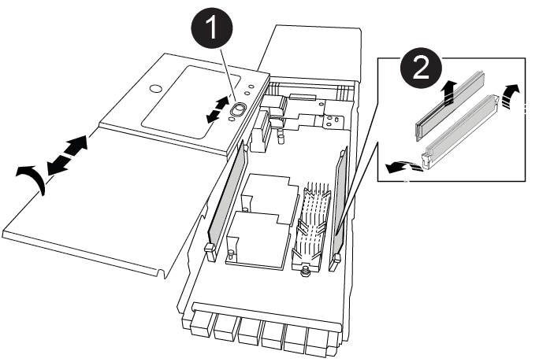

= Sustituya el módulo NVRAM y los DIMM de NVRAM - ASA A900
:allow-uri-read: 
:icons: font
:imagesdir: ../media/

[role="lead"]
El módulo NVRAM consta de NVRAM11 y DIMM. Puede sustituir un módulo NVRAM con fallos o los DIMM dentro del módulo NVRAM. Para sustituir un módulo NVRAM con fallos, debe quitarlo del chasis, mover los DIMM al módulo de reemplazo e instalar el módulo NVRAM de reemplazo en el chasis.

Para sustituir y el DIMM de NVRAM, debe extraer el módulo NVRAM del chasis, sustituir el DIMM con errores en el módulo y, a continuación, volver a instalar el módulo NVRAM.

.Acerca de esta tarea
Debido a que el ID del sistema se deriva del módulo NVRAM, si se reemplaza el módulo, los discos que pertenecen al sistema se reasignan a un nuevo ID del sistema.

.Antes de empezar
* Todas las bandejas de discos deben funcionar correctamente.
* Si su sistema está en un par de alta disponibilidad, la controladora del partner debe poder sustituir la controladora asociada con el módulo NVRAM.
* Este procedimiento usa la siguiente terminología:
+
** El controlador dañado es el controlador en el que realiza el mantenimiento.
** El controlador sano es el compañero de alta disponibilidad del controlador dañado.

* Este procedimiento incluye los pasos para volver a asignar automáticamente discos al módulo de la controladora asociado al nuevo módulo NVRAM. Debe reasignar los discos cuando se le indique en el procedimiento. Si se completa la reasignación del disco antes de la devolución, pueden producirse problemas.
* Debe sustituir el componente con errores por un componente FRU de repuesto que haya recibido de su proveedor.
* No puede cambiar ningún disco o bandeja de discos como parte de este procedimiento.

== Paso 1: Apague el controlador dañado

Apague o retome el controlador dañado utilizando una de las siguientes opciones.

[role="tabbed-block"]
====
.Opción 1: La mayoría de los sistemas
--
Para apagar el controlador dañado, debe determinar el estado del controlador y, si es necesario, tomar el control para que el controlador sano siga sirviendo datos del almacenamiento del controlador dañado.

.Acerca de esta tarea
* Si dispone de un sistema SAN, debe haber comprobado los mensajes de evento  `cluster kernel-service show`) para el blade SCSI de la controladora dañada.  `cluster kernel-service show`El comando (desde el modo avanzado priv) muestra el nombre del nodo, el estado del quórum de ese nodo, el estado de disponibilidad de ese nodo y el estado operativo de ese nodo.
+
Cada proceso SCSI-blade debe quórum con los otros nodos del clúster. Todos los problemas deben resolverse antes de continuar con el reemplazo.

* Si tiene un clúster con más de dos nodos, debe estar en quórum. Si el clúster no tiene quórum o si una controladora en buen estado muestra falso según su condición, debe corregir el problema antes de apagar la controladora dañada; consulte link:https://docs.netapp.com/us-en/ontap/system-admin/synchronize-node-cluster-task.html?q=Quorum["Sincronice un nodo con el clúster"^].

.Pasos
. Si AutoSupport está habilitado, suprima la creación automática de casos invocando un mensaje de AutoSupport: `system node autosupport invoke -node * -type all -message MAINT=<# of hours>h`
+
El siguiente mensaje de AutoSupport suprime la creación automática de casos durante dos horas: `cluster1:> system node autosupport invoke -node * -type all -message MAINT=2h`

. Deshabilite la devolución automática de la consola de la controladora en buen estado: `storage failover modify –node local -auto-giveback false`
+

NOTE: Cuando vea _do desea desactivar la devolución automática?_, introduzca `y`.

. Lleve la controladora dañada al aviso DEL CARGADOR:
+
[cols="1,2"]
|===
| Si el controlador dañado está mostrando... | Realice lo siguiente... 

 a| 
El aviso del CARGADOR
 a| 
Vaya al paso siguiente.

 a| 
Esperando devolución...
 a| 
Pulse Ctrl-C y, a continuación, responda `y` cuando se le solicite.

 a| 
Solicitud del sistema o solicitud de contraseña
 a| 
Retome o detenga el controlador dañado del controlador en buen estado: `storage failover takeover -ofnode _impaired_node_name_`

Cuando el controlador dañado muestre esperando devolución..., pulse Ctrl-C y, a continuación, responda `y`.

|===

--
.Opción 2: La controladora se encuentra en un MetroCluster
--

NOTE: No use este procedimiento si el sistema está en una configuración de MetroCluster de dos nodos.

Para apagar el controlador dañado, debe determinar el estado del controlador y, si es necesario, tomar el control para que el controlador sano siga sirviendo datos del almacenamiento del controlador dañado.

* Si tiene un clúster con más de dos nodos, debe estar en quórum. Si el clúster no tiene quórum o si una controladora en buen estado muestra falso según su condición, debe corregir el problema antes de apagar la controladora dañada; consulte link:https://docs.netapp.com/us-en/ontap/system-admin/synchronize-node-cluster-task.html?q=Quorum["Sincronice un nodo con el clúster"^].
* Si tiene una configuración MetroCluster, debe haber confirmado que el estado de configuración de MetroCluster está configurado y que los nodos están en estado normal y habilitado (`metrocluster node show`).

.Pasos
. Si AutoSupport está habilitado, elimine la creación automática de casos invocando un mensaje de AutoSupport: `system node autosupport invoke -node * -type all -message MAINT=number_of_hours_downh`
+
El siguiente mensaje de AutoSupport suprime la creación automática de casos durante dos horas: `cluster1:*> system node autosupport invoke -node * -type all -message MAINT=2h`

. Deshabilite la devolución automática de la consola de la controladora en buen estado: `storage failover modify –node local -auto-giveback false`
. Lleve la controladora dañada al aviso DEL CARGADOR:
+
[cols="1,2"]
|===
| Si el controlador dañado está mostrando... | Realice lo siguiente... 

 a| 
El aviso del CARGADOR
 a| 
Vaya al paso siguiente.

 a| 
Esperando devolución...
 a| 
Pulse Ctrl-C y, a continuación, responda `y` cuando se le solicite.

 a| 
Solicitud del sistema o solicitud de contraseña (introduzca la contraseña del sistema)
 a| 
Retome o detenga el controlador dañado del controlador en buen estado: `storage failover takeover -ofnode _impaired_node_name_`

Cuando el controlador dañado muestre esperando devolución..., pulse Ctrl-C y, a continuación, responda `y`.

|===

--
====

== Paso 2: Sustituya el módulo NVRAM

Para sustituir el módulo NVRAM, búsquelo en la ranura 6 del chasis y siga la secuencia específica de pasos.

. Si usted no está ya conectado a tierra, correctamente tierra usted mismo.
. Quite el módulo NVRAM de destino del chasis:
+
.. Pulse el botón de leva numerado y con letras.
+
El botón de leva se aleja del chasis.

.. Gire el pestillo de la leva hacia abajo hasta que esté en posición horizontal.
+
El módulo NVRAM se desconecta del chasis y se mueve hacia fuera unas pocas pulgadas.

.. Extraiga el módulo NVRAM del chasis tirando de las lengüetas de tiro situadas en los lados de la cara del módulo.
+
.Animación: Sustituya el módulo NVRAM
video::6eb2d864-9d35-4a23-b6c2-adf9016b359f[panopto]
+
image::../media/drw_a900_move-remove_NVRAM_module.png[Quite el módulo de NVRAM]

+
[cols="1,4"]
|===

 a| 
image:../media/icon_round_1.png["Número de llamada 1"]
 a| 
Pestillo de leva numerado y con letras

 a| 
image:../media/icon_round_2.png["Número de llamada 2"]
 a| 
Pestillo de leva completamente desbloqueado

|===
. Coloque el módulo NVRAM en una superficie estable y retire la cubierta del módulo NVRAM presionando el botón azul de bloqueo de la cubierta y, a continuación, mientras mantiene pulsado el botón azul, deslice la tapa fuera del módulo NVRAM.
+

+
[cols="1,4"]
|===

 a| 
image:../media/icon_round_1.png["Número de llamada 1"]
 a| 
Botón de bloqueo de la cubierta

 a| 
image:../media/icon_round_2.png["Número de llamada 2"]
 a| 
Lengüetas del expulsor de DIMM y DIMM

|===
. Extraiga los DIMM, de uno en uno, del módulo NVRAM antiguo e instálelos en el módulo NVRAM de repuesto.
. Cierre la cubierta del módulo.
. Instale el módulo NVRAM de repuesto en el chasis:
+
.. Alinee el módulo con los bordes de la abertura del chasis en la ranura 6.
.. Deslice suavemente el módulo dentro de la ranura hasta que el pestillo de leva con letras y números comience a acoplarse con el pasador de leva de E/S y, a continuación, empuje el pestillo de leva hasta que encaje el módulo en su sitio.

== Paso 3: Sustituya un DIMM de NVRAM

Para sustituir los DIMM de NVRAM en el módulo NVRAM, debe extraer el módulo NVRAM, abrir el módulo y, a continuación, sustituir el DIMM de destino.

. Si usted no está ya conectado a tierra, correctamente tierra usted mismo.
. Quite el módulo NVRAM de destino del chasis:
+
.. Pulse el botón de leva numerado y con letras.
+
El botón de leva se aleja del chasis.

.. Gire el pestillo de la leva hacia abajo hasta que esté en posición horizontal.
+
El módulo NVRAM se desconecta del chasis y se mueve hacia fuera unas pocas pulgadas.

.. Extraiga el módulo NVRAM del chasis tirando de las lengüetas de tiro situadas en los lados de la cara del módulo.
+
.Animación: Sustituya el DIMM de NVRAM
video::0ae4e603-c22b-4930-8070-adf2000e38b5[panopto]
+
image::../media/drw_a900_move-remove_NVRAM_module.png[Quite el módulo de NVRAM]

+
[cols="1,4"]
|===

 a| 
image:../media/icon_round_1.png["Número de llamada 1"]
 a| 
Pestillo de leva numerado y con letras

 a| 
image:../media/icon_round_2.png["Número de llamada 2"]
 a| 
pestillo de leva completamente desbloqueado

|===
. Coloque el módulo NVRAM en una superficie estable y retire la cubierta del módulo NVRAM presionando el botón azul de bloqueo de la cubierta y, a continuación, mientras mantiene pulsado el botón azul, deslice la tapa fuera del módulo NVRAM.
+

+
[cols="1,4"]
|===

 a| 
image:../media/icon_round_1.png["Número de llamada 1"]
 a| 
Botón de bloqueo de la cubierta

 a| 
image:../media/icon_round_2.png["Número de llamada 2"]
 a| 
Lengüetas del expulsor de DIMM y DIMM

|===
. Localice el DIMM que se va a sustituir dentro del módulo NVRAM y, a continuación, extráigalo presionando las lengüetas de bloqueo del DIMM y extráigalo del zócalo.
. Instale el módulo DIMM de repuesto alineando el módulo DIMM con el zócalo e empuje suavemente el módulo DIMM hacia el zócalo hasta que las lengüetas de bloqueo queden trabadas en su lugar.
. Cierre la cubierta del módulo.
. Instale el módulo NVRAM en el chasis:
+
.. Alinee el módulo con los bordes de la abertura del chasis en la ranura 6.
.. Deslice suavemente el módulo dentro de la ranura hasta que el pestillo de leva con letras y números comience a acoplarse con el pasador de leva de E/S y, a continuación, empuje el pestillo de leva hasta que encaje el módulo en su sitio.

== Paso 4: Reinicie el controlador

Después de sustituir el FRU, debe reiniciar el módulo de la controladora.

. Para arrancar ONTAP desde el aviso del CARGADOR, introduzca `bye`.

== Paso 5: Reasignar discos

Deberá confirmar el cambio de ID del sistema cuando arranque la controladora de reemplazo y, a continuación, compruebe que se ha implementado el cambio.

CAUTION: La reasignación de discos solo se necesita al sustituir el módulo NVRAM y no se aplica al reemplazo de DIMM de NVRAM.

.Pasos
. Si la controladora de reemplazo se encuentra en modo de mantenimiento (se muestra la `*>` Prompt), salga del modo de mantenimiento y vaya al símbolo del sistema del CARGADOR: `halt`
. Desde el aviso DEL CARGADOR en la controladora de reemplazo, arranque la controladora e introduzca y si se le solicita que anule el ID del sistema debido a un error de coincidencia de ID del sistema.
. Espere hasta que la devolución esté a la espera... El mensaje se muestra en la consola del controlador con el módulo de sustitución y, a continuación, en el controlador en buen estado, compruebe que el nuevo ID del sistema asociado se ha asignado automáticamente: `storage failover show`
+
En el resultado del comando, debería ver un mensaje donde se indica que el ID del sistema ha cambiado en la controladora dañada, con lo que se muestran los ID anteriores y los nuevos correctos. En el ejemplo siguiente, el nodo 2 debe ser sustituido y tiene un ID de sistema nuevo de 151759706.

+
[listing]
----
node1:> storage failover show
                                    Takeover
Node              Partner           Possible     State Description
------------      ------------      --------     -------------------------------------
node1             node2             false        System ID changed on partner (Old:
                                                  151759755, New: 151759706), In takeover
node2             node1             -            Waiting for giveback (HA mailboxes)
----
. Devolver la controladora:
+
.. Desde la controladora en buen estado, proporcione almacenamiento a la controladora que sustituyó: `storage failover giveback -ofnode replacement_node_name`
+
La controladora de reemplazo recupera su almacenamiento y completa el arranque.

+
Si se le solicita que anule el ID del sistema debido a una falta de coincidencia de ID del sistema, debe introducir `y`.

+

NOTE: Si el retorno se vetó, puede considerar la sustitución de los vetos.

+
Para obtener más información, consulte https://docs.netapp.com/us-en/ontap/high-availability/ha_manual_giveback.html#if-giveback-is-interrupted["Comandos de devolución manual"^] tema para anular el veto.

.. Una vez finalizada la devolución, confirme que el par de alta disponibilidad está en buen estado y que la toma de control es posible: `storage failover show`
+
La salida de `storage failover show` El comando no debe incluir el ID del sistema cambiado en el mensaje del partner.

. Compruebe que los discos se han asignado correctamente: `storage disk show -ownership`
+
Los discos que pertenecen al controlador de sustitución deben mostrar el nuevo ID del sistema. En el ejemplo siguiente, los discos propiedad del nodo 1 ahora muestran el nuevo ID del sistema, 151759706:

+
[listing]
----
node1:> storage disk show -ownership

Disk  Aggregate Home  Owner  DR Home  Home ID    Owner ID  DR Home ID Reserver  Pool
----- ------    ----- ------ -------- -------    -------    -------  ---------  ---
1.0.0  aggr0_1  node1 node1  -        151759706  151759706  -       151759706 Pool0
1.0.1  aggr0_1  node1 node1           151759706  151759706  -       151759706 Pool0
.
.
.
----
. Si el sistema está en una configuración MetroCluster, supervise el estado de la controladora: `metrocluster node show`
+
La configuración de MetroCluster tarda unos minutos después del reemplazo y vuelve a su estado normal, momento en el que cada controladora mostrará un estado configurado, con mirroring de DR habilitado y un modo normal. La `metrocluster node show -fields node-systemid` El resultado del comando muestra el ID del sistema antiguo hasta que la configuración de MetroCluster vuelve a ser un estado normal.

. Si la controladora está en una configuración MetroCluster, según el estado del MetroCluster, compruebe que el campo ID de inicio de recuperación ante desastres muestra el propietario original del disco si el propietario original es una controladora del sitio de recuperación ante desastres.
+
Esto es necesario si se cumplen las dos opciones siguientes:

+
** La configuración de MetroCluster está en estado de conmutación.
** La controladora de sustitución es el propietario actual de los discos del sitio de recuperación ante desastres.
+
Consulte https://docs.netapp.com/us-en/ontap-metrocluster/manage/concept_understanding_mcc_data_protection_and_disaster_recovery.html#disk-ownership-changes-during-ha-takeover-and-metrocluster-switchover-in-a-four-node-metrocluster-configuration["Cambios en la propiedad de disco durante la toma de control de alta disponibilidad y el cambio de MetroCluster en una configuración MetroCluster de cuatro nodos"] si quiere más información.

. Si su sistema está en una configuración MetroCluster, compruebe que cada controladora está configurada: `metrocluster node show - fields configuration-state`
+
[listing]
----
node1_siteA::> metrocluster node show -fields configuration-state

dr-group-id            cluster node           configuration-state
-----------            ---------------------- -------------- -------------------
1 node1_siteA          node1mcc-001           configured
1 node1_siteA          node1mcc-002           configured
1 node1_siteB          node1mcc-003           configured
1 node1_siteB          node1mcc-004           configured

4 entries were displayed.
----
. Compruebe que los volúmenes esperados estén presentes para cada controladora: `vol show -node node-name`
. Si el cifrado del almacenamiento está habilitado, debe restaurar la funcionalidad.
. Si deshabilitó la toma de control automática al reiniciar, habilite esa función desde la controladora en buen estado: `storage failover modify -node replacement-node-name -onreboot true`

== Paso 6: Devuelva la pieza que falló a NetApp

Devuelva la pieza que ha fallado a NetApp, como se describe en las instrucciones de RMA que se suministran con el kit. Consulte https://mysupport.netapp.com/site/info/rma["Devolución de piezas y sustituciones"] la página para obtener más información.
