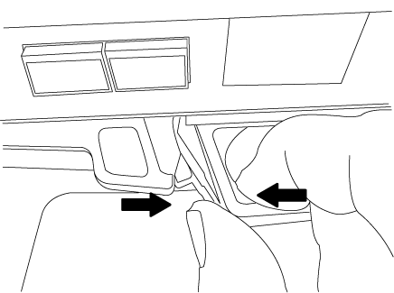

= Sustituya un DIMM - AFF C190
:allow-uri-read: 
:icons: font
:imagesdir: ../media/

[role="lead"]
Debe sustituir un DIMM en la controladora cuando el sistema de almacenamiento encuentra errores como, por ejemplo, errores excesivos de CECC (códigos de corrección de errores corregibles) basados en alertas de supervisión de estado o errores de ECC no corregibles, normalmente causados por un único fallo de DIMM que impide que el sistema de almacenamiento arranque ONTAP.

Todos los demás componentes del sistema deben funcionar correctamente; si no es así, debe ponerse en contacto con el soporte técnico.

Debe sustituir el componente con errores por un componente FRU de repuesto que haya recibido de su proveedor.

== Paso 1: Apague el controlador dañado

Para apagar el controlador dañado, debe determinar el estado del controlador y, si es necesario, tomar el control para que el controlador sano siga sirviendo datos del almacenamiento del controlador dañado.

Si tiene un clúster con más de dos nodos, debe estar en quórum. Si el clúster no tiene quórum o si una controladora en buen estado muestra falso según su condición, debe corregir el problema antes de apagar la controladora dañada; consulte link:https://docs.netapp.com/us-en/ontap/system-admin/synchronize-node-cluster-task.html?q=Quorum["Sincronice un nodo con el clúster"^].

.Pasos
. Si AutoSupport está habilitado, elimine la creación automática de casos invocando un mensaje de AutoSupport: `system node autosupport invoke -node * -type all -message MAINT=_number_of_hours_down_h`
+
El siguiente mensaje de AutoSupport suprime la creación automática de casos durante dos horas: `cluster1:*> system node autosupport invoke -node * -type all -message MAINT=2h`

. Si la controladora dañada forma parte de un par de alta disponibilidad, deshabilite la devolución automática de la consola de la controladora en buen estado: `storage failover modify -node local -auto-giveback false`
. Lleve la controladora dañada al aviso DEL CARGADOR:
+
[cols="1,2"]
|===
| Si el controlador dañado está mostrando... | Realice lo siguiente... 

 a| 
El aviso del CARGADOR
 a| 
Vaya a Quitar módulo de controlador.

 a| 
Esperando devolución...
 a| 
Pulse Ctrl-C y, a continuación, responda `y`.

 a| 
Solicitud del sistema o solicitud de contraseña (introduzca la contraseña del sistema)
 a| 
Retome o detenga el controlador dañado del controlador en buen estado: `storage failover takeover -ofnode _impaired_node_name_`

Cuando el controlador dañado muestre esperando devolución..., pulse Ctrl-C y, a continuación, responda `y`.

|===

== Paso 2: Extraiga el módulo de controlador

Para acceder a los componentes del módulo del controlador, primero debe extraer el módulo del controlador del sistema y, a continuación, retirar la cubierta del módulo del controlador.

. Si usted no está ya conectado a tierra, correctamente tierra usted mismo.
. Afloje el gancho y la correa de bucle que sujetan los cables al dispositivo de administración de cables y, a continuación, desconecte los cables del sistema y los SFP (si fuera necesario) del módulo del controlador, manteniendo un seguimiento del lugar en el que estaban conectados los cables.
+
Deje los cables en el dispositivo de administración de cables de manera que cuando vuelva a instalar el dispositivo de administración de cables, los cables estén organizados.

. Retire y retire los dispositivos de administración de cables de los lados izquierdo y derecho del módulo del controlador.
+
image::../media/drw_25xx_cable_management_arm.png[Insertar o quitar el ARM de gestión de cables]

. Apriete el pestillo del mango de la leva hasta que se suelte, abra el mango de la leva completamente para liberar el módulo del controlador del plano medio y, a continuación, tire con dos manos del módulo del controlador para extraerlo del chasis.
+

. Dé la vuelta al módulo del controlador y colóquelo sobre una superficie plana y estable.
. Abra la cubierta deslizando las pestañas azules para liberar la cubierta y, a continuación, gire la cubierta hacia arriba y abierta.
+
image::../media/drw_2600_opening_pcm_cover.png[Apertura o cierre del módulo del controlador]

== Paso 3: Sustituya los módulos DIMM

Para sustituir los módulos DIMM, es necesario localizarlos dentro del módulo del controlador y seguir la secuencia específica de pasos.

Si desea sustituir un DIMM, debe quitarlo después de haber desconectado la batería de NVMEM del módulo de la controladora.

. Compruebe el LED de NVMEM en el módulo de la controladora.
+
Debe realizar un apagado correcto del sistema antes de sustituir componentes del sistema para evitar perder datos no escritos en la memoria no volátil (NVMEM). El LED se encuentra en la parte posterior del módulo del controlador. Busque el siguiente icono:

+
image::../media/drw_hw_nvram_icon.png[LED NV]

. Si el LED de NVMEM no parpadea, no hay contenido en el NVMEM; puede omitir los pasos siguientes y continuar con la siguiente tarea de este procedimiento.
. Si el LED de NVMEM está parpadeando, hay datos en el NVMEM y debe desconectar la batería para borrar la memoria:
+
.. Localice la batería, presione el clip de la parte frontal del enchufe de la batería para liberar el clip de bloqueo de la toma del enchufe y, a continuación, desenchufe el cable de la batería de la toma.
+
image::../media/drw_2600_nvmem_battery_unplug.png[Reemplace la batería de NVMEM]

.. Confirme que el LED de NVMEM ya no está encendido.
.. Volver a conectar el conector de la batería.

. Volver a. <<Paso 3: Sustituya los módulos DIMM>> En este procedimiento para volver a comprobar el LED de NVMEM.
. Localice los DIMM en el módulo del controlador.
. Tenga en cuenta la orientación del módulo DIMM en el zócalo para que pueda insertar el módulo DIMM de repuesto en la orientación adecuada.
. Extraiga el DIMM de su ranura empujando lentamente las dos lengüetas expulsoras del DIMM a ambos lados del DIMM y, a continuación, extraiga el DIMM de la ranura.
+

NOTE: Sujete con cuidado el módulo DIMM por los bordes para evitar la presión sobre los componentes de la placa de circuitos DIMM.

+
El número y la colocación de los DIMM del sistema depende del modelo del sistema.

+
En la siguiente ilustración se muestra la ubicación de los DIMM del sistema:

+
image::../media/drw_2600_dimm_repl_animated_gif.png[Reemplazar un DIMM]

. Retire el módulo DIMM de repuesto de la bolsa de transporte antiestática, sujete el módulo DIMM por las esquinas y alinéelo con la ranura.
+
La muesca entre las patillas del DIMM debe alinearse con la lengüeta del zócalo.

. Asegúrese de que las lengüetas del expulsor DIMM del conector están en posición abierta y, a continuación, inserte el DIMM directamente en la ranura.
+
El módulo DIMM encaja firmemente en la ranura, pero debe entrar fácilmente. Si no es así, realinee el DIMM con la ranura y vuelva a insertarlo.

+

NOTE: Inspeccione visualmente el módulo DIMM para comprobar que está alineado de forma uniforme y completamente insertado en la ranura.

. Empuje con cuidado, pero firmemente, en el borde superior del DIMM hasta que las lengüetas expulsoras encajen en su lugar sobre las muescas de los extremos del DIMM.
. Localice el enchufe de la batería de NVMEM y, a continuación, apriete el clip de la parte frontal del enchufe del cable de la batería para insertarlo en el zócalo.
+
Asegúrese de que el tapón se bloquea en el módulo del controlador.

. Cierre la cubierta del módulo del controlador.

== Paso 4: Vuelva a instalar el módulo del controlador

Después de sustituir los componentes del módulo del controlador, debe volver a instalarlo en el chasis.

. Si aún no lo ha hecho, vuelva a colocar la cubierta del módulo del controlador.
. Alinee el extremo del módulo del controlador con la abertura del chasis y, a continuación, empuje suavemente el módulo del controlador hasta la mitad del sistema.
+

NOTE: No inserte completamente el módulo de la controladora en el chasis hasta que se le indique hacerlo.

. Recuperar el sistema, según sea necesario.
+
Si ha quitado los convertidores de medios (QSFP o SFP), recuerde volver a instalarlos si está utilizando cables de fibra óptica.

. Complete la reinstalación del módulo del controlador. El módulo de la controladora comienza a arrancar tan pronto como se asienta completamente en el chasis. Esté preparado para interrumpir el proceso de arranque.
+
.. Con la palanca de leva en la posición abierta, empuje firmemente el módulo del controlador hasta que se ajuste al plano medio y esté completamente asentado y, a continuación, cierre la palanca de leva a la posición de bloqueo.
+

NOTE: No ejerza una fuerza excesiva al deslizar el módulo del controlador hacia el chasis para evitar dañar los conectores.

+
La controladora comienza a arrancar tan pronto como se encuentra en el chasis.

.. Si aún no lo ha hecho, vuelva a instalar el dispositivo de administración de cables.
.. Conecte los cables al dispositivo de gestión de cables con la correa de gancho y lazo.

== Paso 5: Devuelva la pieza que falló a NetApp

Devuelva la pieza que ha fallado a NetApp, como se describe en las instrucciones de RMA que se suministran con el kit. Consulte https://mysupport.netapp.com/site/info/rma["Devolución de piezas y sustituciones"] la página para obtener más información.
