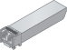
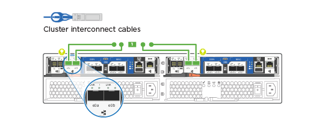
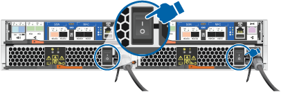

= Pasos detallados: AFF C190
:allow-uri-read: 
:icons: font
:imagesdir: ../media/

[role="lead"]
En esta sección se ofrecen instrucciones detalladas paso a paso para la instalación de un sistema AFF C190.

== Paso 1: Preparar la instalación

Para instalar su sistema AFF C190, cree una cuenta y registre el sistema. También es necesario realizar el inventario del número y tipo de cables adecuados para el sistema y recopilar información específica de la red.

.Antes de empezar
* Asegúrese de tener acceso a. link:https://hwu.netapp.com["Hardware Universe de NetApp"^] (HWU) para obtener información acerca de los requisitos del sitio, así como información adicional sobre el sistema configurado.
* Asegúrese de tener acceso al link:http://mysupport.netapp.com/documentation/productlibrary/index.html?productID=62286["Notas de la versión"^] Para su versión de ONTAP para obtener más información sobre este sistema.
* Asegúrese de tener los siguientes elementos en su centro:
+
** Espacio en rack para el sistema de almacenamiento
** Destornillador Phillips número 2
** Cables de red adicionales para conectar el sistema al conmutador de red y al portátil o a la consola con un navegador Web
** Un portátil o consola con una conexión RJ-45 y acceso a un explorador Web

.Pasos
. Extraiga el contenido de todas las cajas.
. Registre el número de serie del sistema de las controladoras.
+
image::../media/drw_ssn_label.png[Ejemplo del número de serie del sistema]

. Configure su cuenta:
+
.. Inicie sesión en su cuenta existente o cree una cuenta.
.. Registro (link:https://mysupport.netapp.com/eservice/registerSNoAction.do?moduleName=RegisterMyProduct["Registro de productos de NetApp"^]) su sistema.

. Descargue e instale link:https://mysupport.netapp.com/site/tools/tool-eula/activeiq-configadvisor["Descargas de NetApp: Config Advisor"^] en el portátil.
. Realice un inventario y anote el número y los tipos de cables recibidos.
+
En la siguiente tabla se identifican los tipos de cables que pueden recibir. Si recibe un cable que no aparece en la tabla, consulte link:https://hwu.netapp.com["Hardware Universe de NetApp"^] para localizar el cable e identificar su uso.

+
[cols="1,2,1,2"]
|===
| Tipo de cable... | Número de pieza y longitud | Tipo de conector | Durante... 

 a| 
Cable de 10 GbE (depende del pedido)
 a| 
X6566B-05-R6 (112-00297), 0,5 m

X6566B-2-R6 (112-00299), 2 m
 a| 
image:../media/oie_cable_sfp_gbe_copper.png["Conector de cobre SFP GbE"]
 a| 
La red de interconexión en clúster

 a| 
X6566B-2-R6 (112-00299), 2 m

X6566B-3-R6 (112-00300), 3 m.

X6566B-5-R6 (112-00301), 5 m
 a| 
SQL Server

 a| 
Cables de red óptica (dependiendo del pedido)
 a| 
X6553-R6 (112-00188), 2 m

X6536-R6 (112-00090), 5 m

X6554-R6 (112-00189), 15 m.
 a| 

image::../media/oie_cable_fiber_lc_connector.png[Cable LC de red Fibre Channel]
 a| 
Red host SFP + FC

 a| 
Cat 6, RJ-45 (según pedido)
 a| 
X6585-R6 (112-00291), 3 m

X6562-R6 (112-00196), 5 m
 a| 
image:../media/oie_cable_rj45.png["Conector de cable RJ-45"]
 a| 
Host Ethernet y red de gestión

 a| 
Cable de consola Micro-USB
 a| 
No aplicable
 a| 
image:../media/oie_cable_micro_usb.png["Conector micro USB"]
 a| 
Conexión de consola durante la configuración del software en un portátil/consola que no sea Windows o Mac

 a| 
Cables de alimentación
 a| 
No aplicable
 a| 
image:../media/oie_cable_power.png["Cables de alimentación"]
 a| 
Encendido del sistema

|===
. Descargue y complete el link:https://library.netapp.com/ecm/ecm_download_file/ECMLP2839002["Hoja de datos para la configuración del clúster"^].

== Paso 2: Instale el hardware

Instale el sistema en un rack de 4 parantes o armario de sistema de NetApp según corresponda.

.Pasos
. Instale los kits de raíles, según sea necesario.
. Instale y asegure el sistema siguiendo las instrucciones incluidas con el kit de raíl.
+

NOTE: Debe ser consciente de los problemas de seguridad asociados con el peso del sistema.

+
image::../media/drw_oie_fas2700_weight_caution.png[Precaución de elevación para dos personas]

. Conecte los dispositivos de administración de cables (como se muestra).
+
image::../media/drw_cable_management_arm_install.png[Conexión de dispositivos de gestión de cables]

. Coloque el panel frontal en la parte delantera del sistema.

== Paso 3: Conecte los controladores a la red

Conecte las controladoras a la red mediante el método de clúster sin switch de dos nodos o el método de red de interconexión del clúster.

En la siguiente tabla se identifica el tipo de cable con el número de llamada y el color del cable en las ilustraciones para el cableado de red de clústeres sin switch de dos nodos y el cableado de red de clústeres conmutados.

[cols="20%,80%"]
|===
| Cableado | Tipo de conexión 

 a| 
image::../media/icon_square_1_green.png[icono cuadrado 1 verde]
 a| 
Interconexión en clúster

 a| 
image::../media/icon_square_2_yellow.png[Número de llamada 2]
 a| 
Las controladoras a los switches de red de datos del host

 a| 
image::../media/icon_square_3_orange.png[Número de llamada 3]
 a| 
Las controladoras al switch de red de gestión

|===
[role="tabbed-block"]
====
.Opción 1: Clúster sin switches de dos nodos
--
Aprenda a conectar en cable un clúster sin switches de dos nodos.

.Antes de empezar
Póngase en contacto con el administrador de red para obtener información sobre la conexión del sistema a los switches.

Asegúrese de comprobar que la flecha de la ilustración tenga la orientación correcta de la lengüeta de extracción del conector del cable.

image::../media/oie_cable_pull_tab_down.png[Conector de cable con lengüeta en la parte inferior]

NOTE: Al insertar el conector, debería sentir que hace clic en su lugar; si no cree que hace clic, quítelo, gírelo y vuelva a intentarlo.

NOTE: Si se conecta a un switch óptico, inserte el SFP en el puerto de la controladora antes de establecer el cableado al puerto.

.Acerca de esta tarea
Consulte las siguientes ilustraciones de cableado cuando realice el cableado entre las controladoras y los switches.

Configuraciones de redes de datos de UTA2 GbE::
+
--
image::../media/drw_c190_tnsc_unified_network_cabling_animated_gif.png[Animación de cableado de red unificada de clúster sin switches de dos nodos]

--
Configuraciones de red Ethernet::
+
--
image::../media/drw_c190_tnsc_ethernet_network_cabling_animated_gif.png[Animación de cableado de red Eternet de clúster sin switch de dos nodos]

--

Realice los siguientes pasos en cada módulo del controlador.

.Pasos
. Conecte los puertos de interconexión de clúster e0a a e0a y e0b a e0b con el cable de interconexión del clúster.
 +
image:../media/drw_c190_u_tnsc_clust_cbling.png["Cableado de interconexión del clúster"]
. Conecte los cables de las controladoras a una red de datos UTA2 o Ethernet.
+
Configuraciones de redes de datos de UTA2 GbE:: Use uno de los siguientes tipos de cables para conectar los puertos de datos e0c/0C y e0d/0d o e0e/0E y e0f/0f a la red de host.
+
--

--
Configuraciones de red Ethernet:: Utilice el cable Cat 6 RJ45 para conectar los puertos e0c a e0f a la red host. en la siguiente ilustración.
+
--
image:../media/drw_c190_e_rj45_cbling.png["Cableado de red host"]

--

. Conecte los puertos e0M a los switches de red de gestión mediante los cables RJ45.
+
image:../media/drw_c190_u_mgmt_cabling.png["Cableado de puertos de gestión"]

IMPORTANT: NO enchufe los cables de alimentación en este momento.

--
.Opción 2: Clúster de switches
--
Aprenda a conectar mediante cable un clúster con switches.

.Antes de empezar
Póngase en contacto con el administrador de red para obtener información sobre la conexión del sistema a los switches.

Asegúrese de comprobar que la flecha de la ilustración tenga la orientación correcta de la lengüeta de extracción del conector del cable.

image::../media/oie_cable_pull_tab_down.png[Conector de cable con lengüeta en la parte inferior]

NOTE: Al insertar el conector, debería sentir que hace clic en su lugar; si no cree que hace clic, quítelo, gírelo y vuelva a intentarlo.

NOTE: Si se conecta a un switch óptico, inserte el SFP en el puerto de la controladora antes de establecer el cableado al puerto.

.Acerca de esta tarea
Consulte las siguientes ilustraciones de cableado cuando realice el cableado entre las controladoras y los switches.

Configuraciones de red unificadas::
+
--
image::../media/drw_c190_switched_unified_network_cabling_animated_gif.png[Animación de cableado de red unificada de clúster conmutado]

--
Configuraciones de red Ethernet::
+
--
image::../media/drw_c190_switched_ethernet_network_cabling_animated.png[Animación de cableado de red Ethernet de clúster conmutado]

--

Realice los siguientes pasos en cada módulo del controlador.

.Pasos
. Conecte los cables e0a y e0b a los switches de interconexión de clúster con el cable de interconexión de clúster.
+

. Conecte los cables de las controladoras a una red de datos UTA2 o Ethernet.
+
Configuraciones de redes de datos de UTA2 GbE:: Use uno de los siguientes tipos de cables para conectar los puertos de datos e0c/0C y e0d/0d o e0e/0E y e0f/0f a la red de host.
+
--

--
Configuraciones de red Ethernet:: Utilice el cable Cat 6 RJ45 para conectar los puertos e0c a e0f a la red host.
+
--
image:../media/drw_c190_e_rj45_cbling.png["Cableado de red host"]

--

. Conecte los puertos e0M a los switches de red de gestión mediante los cables RJ45.
+
image:../media/drw_c190_u_mgmt_cabling.png["Cableado de puertos de gestión"]

IMPORTANT: NO enchufe los cables de alimentación en este momento.

--
====

== Paso 4: Complete la configuración del sistema

Complete la instalación y la configuración del sistema mediante la detección de clústeres que solo tiene una conexión al switch y al portátil, o bien se puede conectar directamente a una controladora del sistema y, a continuación, conectarse al switch de gestión.

[role="tabbed-block"]
====
.Opción 1: Si la detección de red está activada
--
Aprenda a completar la configuración del sistema Si tiene habilitada la detección de red en su portátil.

.Pasos
. Enchufe los cables de alimentación a las fuentes de alimentación de la controladora y luego conéctelos a fuentes de alimentación de diferentes circuitos.
. Encienda los switches de alimentación en ambos nodos.
+

+

NOTE: El arranque inicial puede tardar hasta ocho minutos.

. Asegúrese de que el ordenador portátil tiene activado el descubrimiento de red.
+
Consulte la ayuda en línea de su portátil para obtener más información.

. Conecte el portátil al conmutador de gestión:

image::../media/dwr_laptop_to_switch_only.svg[ordenador portátil dwr sólo para cambiar]

. Seleccione un icono de ONTAP que aparece para detectar:
+
image::../media/drw_autodiscovery_controler_select.png[Seleccione un icono de ONTAP]

+
.. Abra el Explorador de archivos.
.. Haga clic en *Red* en el panel izquierdo.
.. Haga clic con el botón derecho del ratón y seleccione *Actualizar*.
.. Haga doble clic en el icono de ONTAP y acepte los certificados que aparecen en la pantalla.
+

NOTE: XXXXX es el número de serie del sistema para el nodo de destino.

+
Se abrirá System Manager.

. Utilice la configuración guiada de System Manager para configurar el sistema con los datos recogidos en el link:https://library.netapp.com/ecm/ecm_download_file/ECMLP2862613["Guía de configuración de ONTAP"^].
. Compruebe el estado del sistema ejecutando Config Advisor.
. Después de completar la configuración inicial, vaya a la link:https://docs.netapp.com/us-en/ontap-family/["Documentación de ONTAP"] Sitio para obtener información sobre la configuración de características adicionales en ONTAP.
+

NOTE: La configuración de puerto predeterminada para los sistemas de configuración unificada es el modo CNA; si se conecta a una red de host de FC, debe modificar los puertos para el modo FC.

--
.Opción 2: Si la detección de red no está activada
--
Aprenda a completar la configuración del sistema si la detección de red no está activada en el portátil.

.Pasos
. Conecte y configure el portátil o la consola:
+
.. Ajuste el puerto de la consola del portátil o de la consola en 115,200 baudios con N-8-1.
+

NOTE: Consulte la ayuda en línea del portátil o de la consola para saber cómo configurar el puerto de la consola.

.. Conecte el cable de la consola al portátil o a la consola y conecte el puerto de la consola del controlador mediante el cable de consola incluido con el sistema.
+
image::../media/drw_console_connect_fas2700_affa200.png[Conectando al puerto de la consola]

.. Conecte el portátil o la consola al conmutador de la subred de administración.
+
image::../media/drw_client_to_mgmt_subnet_fas2700_affa220.png[Conectándose a la subred de gestión]

.. Asigne una dirección TCP/IP al portátil o consola, utilizando una que esté en la subred de gestión.

. Enchufe los cables de alimentación a las fuentes de alimentación de la controladora y luego conéctelos a fuentes de alimentación de diferentes circuitos.
. Encienda los switches de alimentación en ambos nodos.
+

+

NOTE: El arranque inicial puede tardar hasta ocho minutos.

. Asigne una dirección IP de gestión de nodos inicial a uno de los nodos.
+
[cols="1,2"]
|===
| Si la red de gestión tiene DHCP... | Realice lo siguiente... 

 a| 
Configurado
 a| 
Registre la dirección IP asignada a las nuevas controladoras.

 a| 
No configurado
 a| 
.. Abra una sesión de consola mediante PuTTY, un servidor terminal o el equivalente para su entorno.
+

NOTE: Si no sabe cómo configurar PuTTY, compruebe la ayuda en línea del ordenador portátil o de la consola.

.. Introduzca la dirección IP de administración cuando se lo solicite el script.

|===
. Mediante System Manager en el portátil o la consola, configure su clúster:
+
.. Dirija su navegador a la dirección IP de gestión de nodos.
+

NOTE: El formato de la dirección es +https://x.x.x.x+.

.. Configure el sistema con los datos recogidos en el link:https://library.netapp.com/ecm/ecm_download_file/ECMLP2862613["Guía de configuración de ONTAP"^].

. Compruebe el estado del sistema ejecutando Config Advisor.
. Después de completar la configuración inicial, vaya a la link:https://docs.netapp.com/us-en/ontap-family/[" de ONTAP;ocumentación"] Sitio para obtener información sobre la configuración de características adicionales en ONTAP.
+

NOTE: La configuración de puerto predeterminada para los sistemas de configuración unificada es el modo CNA; si se conecta a una red de host de FC, debe modificar los puertos para el modo FC.

--
====