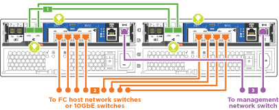

= Pasos detallados: AFF C190
:allow-uri-read: 
:icons: font
:imagesdir: ../media/

[role="lead"]
En esta sección se ofrecen instrucciones detalladas paso a paso para la instalación de un sistema AFF C190.

== Paso 1: Preparar la instalación

Para instalar su sistema C190 de AFF, tiene que crear una cuenta y registrar el sistema. También es necesario realizar el inventario del número y tipo de cables adecuados para el sistema y recopilar información específica de la red.

Debe tener acceso a link:https://hwu.netapp.com["Hardware Universe de NetApp"^] (HWU) para obtener información acerca de los requisitos del sitio, así como información adicional sobre el sistema configurado. Puede que también desee tener acceso a link:http://mysupport.netapp.com/documentation/productlibrary/index.html?productID=62286["Notas de la versión de ONTAP"^] para obtener más información sobre este sistema.

.Lo que necesita
Debe proporcionar lo siguiente en el sitio:

* Espacio en rack para el sistema de almacenamiento
* Destornillador Phillips número 2
* Cables de red adicionales para conectar el sistema al conmutador de red y al portátil o a la consola con un navegador Web
* Un portátil o consola con una conexión RJ-45 y acceso a un explorador Web

.Pasos
. Extraiga el contenido de todas las cajas.
. Registre el número de serie del sistema de las controladoras.
+
image::../media/drw_ssn_label.png[etiqueta ssn drw]

. Configure su cuenta:
+
.. Inicie sesión en su cuenta existente o cree una cuenta.
.. Registro (link:https://mysupport.netapp.com/eservice/registerSNoAction.do?moduleName=RegisterMyProduct["Registro de productos de NetApp"^]) su sistema.

. Descargue e instale link:https://mysupport.netapp.com/site/tools/tool-eula/activeiq-configadvisor["Descargas de NetApp: Config Advisor"^] en el portátil.
. Realice un inventario y anote el número y los tipos de cables recibidos.
+
En la siguiente tabla se identifican los tipos de cables que pueden recibir. Si recibe un cable que no aparece en la tabla, consulte link:https://hwu.netapp.com["Hardware Universe de NetApp"^] para localizar el cable e identificar su uso.

+
[cols="1,2,1,2"]
|===
| Tipo de cable... | Número de pieza y longitud | Tipo de conector | Durante... 

 a| 
Cable de 10 GbE (depende del pedido)
 a| 
X6566B-05-R6 (112-00297), 0,5 m

X6566B-2-R6 (112-00299), 2 m
 a| 
image:../media/oie_cable_sfp_gbe_copper.png[""]
 a| 
La red de interconexión en clúster

 a| 
X6566B-2-R6 (112-00299), 2 m

X6566B-3-R6 (112-00300), 3 m.

X6566B-5-R6 (112-00301), 5 m
 a| 
SQL Server

 a| 
Cables de red óptica (dependiendo del pedido)
 a| 
X6553-R6 (112-00188), 2 m

X6536-R6 (112-00090), 5 m

X6554-R6 (112-00189), 15 m.
 a| 
image:../media/oie_sfp_optical.png[""]

image::../media/oie_cable_fiber_lc_connector.png[conector lc de fibra de cable de la oie]
 a| 
Red host SFP + FC

 a| 
Cat 6, RJ-45 (según pedido)
 a| 
X6585-R6 (112-00291), 3 m

X6562-R6 (112-00196), 5 m
 a| 
image:../media/oie_cable_rj45.png[""]
 a| 
Host Ethernet y red de gestión

 a| 
Cable de consola Micro-USB
 a| 
No aplicable
 a| 
image:../media/oie_cable_micro_usb.png[""]
 a| 
Conexión de consola durante la configuración del software en un portátil/consola que no sea Windows o Mac

 a| 
Cables de alimentación
 a| 
No aplicable
 a| 
image:../media/oie_cable_power.png[""]
 a| 
Encendido del sistema

|===
. Descargue y complete el link:https://library.netapp.com/ecm/ecm_download_file/ECMLP2839002["Hoja de datos para la configuración del clúster"^].

== Paso 2: Instale el hardware

Debe instalar el sistema en un rack de 4 parantes o armario del sistema de NetApp, según corresponda.

.Pasos
. Instale los kits de raíles, según sea necesario.
. Instale y asegure el sistema siguiendo las instrucciones incluidas con el kit de raíl.
+

NOTE: Debe ser consciente de los problemas de seguridad asociados con el peso del sistema.

+
image::../media/drw_oie_fas2700_weight_caution.png[drw oie fas2700: precaución en el peso]

. Conecte los dispositivos de administración de cables (como se muestra).
+
image::../media/drw_cable_management_arm_install.png[instalación de ARM de gestión de cables drw]

. Coloque el panel frontal en la parte delantera del sistema.

== Paso 3: Conecte los controladores a la red

Puede conectar las controladoras a la red mediante el método de clúster sin switch de dos nodos o mediante la red de interconexión de clúster.

=== Opción 1: Cable de un clúster sin switch de dos nodos, configuración unificada

Los puertos UTA2 y los puertos de gestión de los módulos de la controladora están conectados a los switches. Los puertos de interconexión de clúster se cablean en ambos módulos de la controladora.

.Antes de empezar
Póngase en contacto con el administrador de red para obtener información sobre la conexión del sistema a los switches.

Asegúrese de comprobar que la flecha de la ilustración tenga la orientación correcta de la lengüeta de extracción del conector del cable.

image::../media/oie_cable_pull_tab_down.png[lengüeta del cable de la oie hacia abajo]

NOTE: Al insertar el conector, debería sentir que hace clic en su lugar; si no cree que hace clic, quítelo, gírelo y vuelva a intentarlo.

NOTE: Si se conecta a un switch óptico, inserte el SFP en el puerto de la controladora antes de establecer el cableado al puerto.

.Pasos
. Utilice la ilustración o las instrucciones paso a paso para completar el cableado entre las controladoras y los switches:
+
image::../media/drw_c190_tnsc_unified_network_cabling_animated_gif.png[gif animados del cableado de red unificado drw c190 tnsc]

+
[cols="10,90"]
|===
| Paso | Ejecute cada controladora 

 a| 
image:../media/oie_legend_icon_1_lg.png[""]
 a| 
Conecte los puertos de interconexión del clúster entre sí mediante el cable de interconexión del clúster:

** e0a a e0a
** e0b a e0bimage:../media/drw_c190_u_tnsc_clust_cbling.png[""]

 a| 
image:../media/oie_legend_icon_2_o.png[""]
 a| 
Utilice uno de los siguientes tipos de cables para conectar los puertos de datos e0c/0c y e0d/0d *o* e0e/0e y e0f/0f a la red host:

image:../media/drw_c190_u_fc_10gbe_cbling.png[""]

 a| 
image:../media/oie_legend_icon_3_lp.png[""]
 a| 
Conecte los puertos e0M a los switches de red de gestión mediante los cables RJ45:

image:../media/drw_c190_u_mgmt_cbling.png[""]

 a| 
image:../media/oie_legend_icon_attn_symbol.png[""]
 a| 
NO enchufe los cables de alimentación en este momento.

|===
. Para completar la configuración del sistema, consulte link:install-detailed-guide.html#step-4-complete-system-setup-and-configuration["Paso 4: Pasos completos para la instalación y la configuración del sistema"].

=== Opción 2: Clúster con switches por cable, configuración unificada

Los puertos UTA2 y los puertos de gestión de los módulos de la controladora están conectados a los switches. Los puertos de interconexión de clúster se cablean a los switches de interconexión de clúster.

.Antes de empezar
Póngase en contacto con el administrador de red para obtener información sobre la conexión del sistema a los switches.

Asegúrese de comprobar que la flecha de la ilustración tenga la orientación correcta de la lengüeta de extracción del conector del cable.

image::../media/oie_cable_pull_tab_down.png[lengüeta del cable de la oie hacia abajo]

NOTE: Al insertar el conector, debería sentir que hace clic en su lugar; si no cree que hace clic, quítelo, gírelo y vuelva a intentarlo.

NOTE: Si se conecta a un switch óptico, inserte el SFP en el puerto de la controladora antes de establecer el cableado al puerto.

.Pasos
. Utilice la ilustración o las instrucciones paso a paso para completar el cableado entre las controladoras y los switches:
+
image::../media/drw_c190_switched_unified_network_cabling_animated_gif.png[gif animados de cableado de red unificado conmutado de drw c190]

+
[cols="10,90"]
|===
| Paso | Lleve a cabo cada módulo de la controladora 

 a| 
image:../media/oie_legend_icon_1_lg.png[""]
 a| 
Cable e0a y e0b a los switches de interconexión del clúster con el cable de interconexión del clúster:

image:../media/drw_c190_u_switched_clust_cbling.png[""]

 a| 
image:../media/oie_legend_icon_2_o.png[""]
 a| 
Utilice uno de los siguientes tipos de cables para conectar los puertos de datos e0c/0c y e0d/0d *o* e0e/0e y e0f/0f a la red host:

image:../media/drw_c190_u_fc_10gbe_cbling.png[""]

 a| 
image:../media/oie_legend_icon_3_lp.png[""]
 a| 
Conecte los puertos e0M a los switches de red de gestión mediante los cables RJ45:

image:../media/drw_c190_u_mgmt_cbling.png[""]

 a| 
image:../media/oie_legend_icon_attn_symbol.png[""]
 a| 
NO enchufe los cables de alimentación en este momento.

|===
. Para completar la configuración del sistema, consulte link:install-detailed-guide.html#step-4-complete-system-setup-and-configuration["Paso 4: Pasos completos para la instalación y la configuración del sistema"].

=== Opción 3: Cable de un clúster sin switch de dos nodos, configuración Ethernet

Los puertos RJ45 y los puertos de gestión de los módulos de la controladora están conectados a los switches. Los puertos de interconexión de clúster se cablean en ambos módulos de la controladora.

.Antes de empezar
Póngase en contacto con el administrador de red para obtener información sobre la conexión del sistema a los switches.

Asegúrese de comprobar que la flecha de la ilustración tenga la orientación correcta de la lengüeta de extracción del conector del cable.

image::../media/oie_cable_pull_tab_down.png[lengüeta del cable de la oie hacia abajo]

NOTE: Al insertar el conector, debería sentir que hace clic en su lugar; si no cree que hace clic, quítelo, gírelo y vuelva a intentarlo.

.Pasos
. Utilice la ilustración o las instrucciones paso a paso para completar el cableado entre las controladoras y los switches:
+

+
[cols="10,90"]
|===
| Paso | Ejecute cada controladora 

 a| 
image:../media/oie_legend_icon_1_lg.png[""]
 a| 
Conecte los puertos de interconexión del clúster entre sí mediante el cable de interconexión del clúster image:../media/oie_cable_sfp_gbe_copper.png[""]:

** e0a a e0a
** e0b a e0bimage:../media/drw_c190_e_tnsc_clust_cbling.png[""]

 a| 
image:../media/oie_legend_icon_2_o.png[""]
 a| 
Utilice el cable RJ45 Cat 6 para conectar los puertos e0c a través de e0f a la red host:

image:../media/drw_c190_e_rj45_cbling.png[""]

 a| 
image:../media/oie_legend_icon_3_lp.png[""]
 a| 
Conecte los puertos e0M a los switches de red de gestión mediante los cables RJ45 image:../media/oie_cable_rj45.png[""].

image:../media/drw_c190_e_mgmt_cbling.png[""]

 a| 
image:../media/oie_legend_icon_attn_symbol.png[""]
 a| 
NO enchufe los cables de alimentación en este momento.

|===
. Para completar la configuración del sistema, consulte link:install-detailed-guide.html#step-4-complete-system-setup-and-configuration["Paso 4: Pasos completos para la instalación y la configuración del sistema"].

=== Opción 4: Cableado de un clúster conmutado, configuración Ethernet

Los puertos RJ45 y los puertos de gestión de los módulos de la controladora están conectados a los switches. Los puertos de interconexión de clúster se cablean a los switches de interconexión de clúster.

.Antes de empezar
Póngase en contacto con el administrador de red para obtener información sobre la conexión del sistema a los switches.

Asegúrese de comprobar que la flecha de la ilustración tenga la orientación correcta de la lengüeta de extracción del conector del cable.

image::../media/oie_cable_pull_tab_down.png[lengüeta del cable de la oie hacia abajo]

NOTE: Al insertar el conector, debería sentir que hace clic en su lugar; si no cree que hace clic, quítelo, gírelo y vuelva a intentarlo.

.Pasos
. Utilice la ilustración o las instrucciones paso a paso para completar el cableado entre las controladoras y los switches:
+
image::../media/drw_c190_switched_ethernet_network_cabling_animated.png[cableado animado de red ethernet conmutada drw c190]

+
[cols="10,90"]
|===
| Paso | Lleve a cabo cada módulo de la controladora 

 a| 
image:../media/oie_legend_icon_1_lg.png[""]
 a| 
Cable e0a y e0b a los switches de interconexión del clúster con el cable de interconexión del clúster:

image:../media/drw_c190_e_switched_clust_cbling.png[""]

 a| 
image:../media/oie_legend_icon_2_o.png[""]
 a| 
Utilice el cable RJ45 Cat 6 para conectar los puertos e0c a través de e0f a la red host:

image:../media/drw_c190_e_rj45_cbling.png[""]

 a| 
image:../media/oie_legend_icon_3_lp.png[""]
 a| 
Conecte los puertos e0M a los switches de red de gestión mediante los cables RJ45:

image:../media/drw_c190_e_mgmt_cbling.png[""]

 a| 
image:../media/oie_legend_icon_attn_symbol.png[""]
 a| 
NO enchufe los cables de alimentación en este momento.

|===
. Para completar la configuración del sistema, consulte link:install-detailed-guide.html#step-4-complete-system-setup-and-configuration["Paso 4: Pasos completos para la instalación y la configuración del sistema"].

== Paso 4: Pasos completos para la instalación y la configuración del sistema

Complete la instalación y la configuración del sistema mediante la detección de clústeres que solo tiene una conexión al switch y al portátil, o bien se puede conectar directamente a una controladora del sistema y, a continuación, conectarse al switch de gestión.

=== Opción 1: Completar la configuración y la instalación del sistema si la detección de red está activada

Si tiene la detección de red habilitada en el portátil, puede completar la configuración y la instalación del sistema mediante la detección automática del clúster.

.Pasos
. Enchufe los cables de alimentación a las fuentes de alimentación de la controladora y luego conéctelos a fuentes de alimentación de diferentes circuitos.
. Encienda los switches de alimentación en ambos nodos.
+
image::../media/drw_turn_on_power_switches_to_psus.png[drw enciende los interruptores de alimentación a las psu]

+

NOTE: El arranque inicial puede tardar hasta ocho minutos.

. Asegúrese de que el ordenador portátil tiene activado el descubrimiento de red.
+
Consulte la ayuda en línea de su portátil para obtener más información.

. Utilice la animación para conectar el portátil al conmutador de administración:
+
.Animación: Conecte el portátil al conmutador de administración
video::d61f983e-f911-4b76-8b3a-ab1b0066909b[panopto]
. Seleccione un icono de ONTAP que aparece para detectar:
+
image::../media/drw_autodiscovery_controler_select.png[selección del controlador de detección automática drw]

+
.. Abra el Explorador de archivos.
.. Haga clic en *Red* en el panel izquierdo.
.. Haga clic con el botón derecho del ratón y seleccione *Actualizar*.
.. Haga doble clic en el icono de ONTAP y acepte los certificados que aparecen en la pantalla.
+

NOTE: XXXXX es el número de serie del sistema para el nodo de destino.

+
Se abrirá System Manager.

. Utilice la configuración guiada de System Manager para configurar el sistema con los datos recogidos en el link:https://library.netapp.com/ecm/ecm_download_file/ECMLP2862613["Guía de configuración de ONTAP"^].
. Compruebe el estado del sistema ejecutando Config Advisor.
. Después de completar la configuración inicial, vaya a la link:https://www.netapp.com/data-management/oncommand-system-documentation/["Recursos de documentación de ONTAP  ONTAP System Manager"^] Página para obtener información sobre cómo configurar las funciones adicionales en ONTAP.
+

NOTE: La configuración de puerto predeterminada para los sistemas de configuración unificada es el modo CNA; si se conecta a una red de host de FC, debe modificar los puertos para el modo FC.

=== Opción 2: Completar la configuración y la instalación del sistema si la detección de red no está habilitada

Si el descubrimiento de red no está activado en el portátil, debe completar la configuración y la configuración mediante esta tarea.

. Conecte y configure el portátil o la consola:
+
.. Ajuste el puerto de la consola del portátil o de la consola en 115,200 baudios con N-8-1.
+

NOTE: Consulte la ayuda en línea del portátil o de la consola para saber cómo configurar el puerto de la consola.

.. Conecte el cable de la consola al portátil o a la consola y conecte el puerto de la consola del controlador mediante el cable de consola incluido con el sistema.
+
image::../media/drw_console_connect_fas2700_affa200.png[conexión de la consola drw fas2700 affa200]

.. Conecte el portátil o la consola al conmutador de la subred de administración.
+
image::../media/drw_client_to_mgmt_subnet_fas2700_affa220.png[cliente drw para la subred fas2700 affa220]

.. Asigne una dirección TCP/IP al portátil o consola, utilizando una que esté en la subred de gestión.

. Enchufe los cables de alimentación a las fuentes de alimentación de la controladora y luego conéctelos a fuentes de alimentación de diferentes circuitos.
. Encienda los switches de alimentación en ambos nodos.
+
image::../media/drw_turn_on_power_switches_to_psus.png[drw enciende los interruptores de alimentación a las psu]

+

NOTE: El arranque inicial puede tardar hasta ocho minutos.

. Asigne una dirección IP de gestión de nodos inicial a uno de los nodos.
+
[cols="1,2"]
|===
| Si la red de gestión tiene DHCP... | Realice lo siguiente... 

 a| 
Configurado
 a| 
Registre la dirección IP asignada a las nuevas controladoras.

 a| 
No configurado
 a| 
.. Abra una sesión de consola mediante PuTTY, un servidor terminal o el equivalente para su entorno.
+

NOTE: Si no sabe cómo configurar PuTTY, compruebe la ayuda en línea del ordenador portátil o de la consola.

.. Introduzca la dirección IP de administración cuando se lo solicite el script.

|===
. Mediante System Manager en el portátil o la consola, configure su clúster:
+
.. Dirija su navegador a la dirección IP de gestión de nodos.
+

NOTE: El formato de la dirección es +https://x.x.x.x+.

.. Configure el sistema con los datos recogidos en el link:https://library.netapp.com/ecm/ecm_download_file/ECMLP2862613["Guía de configuración de ONTAP"^].

. Compruebe el estado del sistema ejecutando Config Advisor.
. Después de completar la configuración inicial, vaya a la link:https://www.netapp.com/data-management/oncommand-system-documentation/["Recursos de documentación de ONTAP  ONTAP System Manager"^] Página para obtener información sobre cómo configurar las funciones adicionales en ONTAP.
+

NOTE: La configuración de puerto predeterminada para los sistemas de configuración unificada es el modo CNA; si se conecta a una red de host de FC, debe modificar los puertos para el modo FC.

