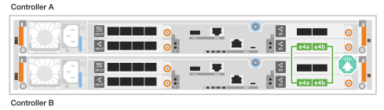

= Conecte los cables de los componentes: AFF C30 y AFF C60
:allow-uri-read: 
:icons: font
:imagesdir: ../media/

[role="lead"]
Después de instalar el hardware del sistema de almacenamiento AFF C30 o AFF C60, conecte los cables de las controladoras a la red y las bandejas.

.Antes de empezar
Póngase en contacto con el administrador de red para obtener información sobre cómo conectar el sistema de almacenamiento a los switches de red.

.Acerca de esta tarea
* Los gráficos de cableado tienen iconos de flecha que muestran la orientación correcta (hacia arriba o hacia abajo) de la lengüeta extraíble del conector de cable al insertar un conector en un puerto.
+
Al insertar el conector, debería sentir que hace clic en su lugar; si no cree que hace clic, quítelo, vuelva a convertirlo y vuelva a intentarlo.

+
image:../media/drw_cable_pull_tab_direction_ieops-1699.svg["Dirección de la lengüeta de tracción del cable"]

* Si el cableado va a un conmutador óptico, inserte el transceptor óptico en el puerto del controlador antes de realizar el cableado en el puerto del switch.

== Paso 1: Conecte los cables de las conexiones del clúster/alta disponibilidad

Cree las conexiones del clúster de ONTAP. En el caso de clústeres sin switch, conecte las controladoras entre sí. En el caso de los clústeres con switches, conecte las controladoras a los switches de red de clúster.

[NOTE]
====
Los ejemplos de cableado de clúster/HA muestran configuraciones comunes.

Si no se muestra aquí la configuración, vaya a link:https://hwu.netapp.com["Hardware Universe de NetApp"^] para obtener información completa de prioridad de ranura y configuración para cablear el sistema de almacenamiento.

====
[role="tabbed-block"]
====
.Cableado de clúster sin switches
--
.AFF C30 o AFF C60 con dos módulos de I/O de 40/100 GbE con 2 puertos
[%collapsible]
=====
.Pasos
. Conectar las conexiones de interconexión de clúster/alta disponibilidad:
+

NOTE: El tráfico de interconexión del clúster y el tráfico de alta disponibilidad comparten los mismos puertos físicos (en los módulos de I/O en las ranuras 2 y 4). Los puertos son 40/100 GbE.

+
.. Conecte el cable del controlador A del puerto E2A al puerto E2A de la controladora B.
.. Conecte el cable del controlador A del puerto E4A al puerto E4A de la controladora B.
+

NOTE: Los puertos E2B y e4b de los módulos de I/O no se utilizan y están disponibles para la conectividad de red del host.

+
*100 GbE Cluster/cables de interconexión HA*

+
image::../media/oie_cable100_gbe_qsfp28.png[Cable de alta disponibilidad de 100 GbE del clúster]

+
image::../media/drw_isi_a30-50_switchless_2p_100gbe_2card_cabling_ieops-2011.svg[diagrama de cableado de clúster sin switch de a30 y a60 mediante dos módulos de 100gbe io]

=====
.AFF C30 o AFF C60 con un módulo de I/O de 40/100 GbE de 2 puertos
[%collapsible]
=====
.Pasos
. Conectar las conexiones de interconexión de clúster/alta disponibilidad:
+

NOTE: El tráfico de interconexión del clúster y el tráfico de alta disponibilidad comparten los mismos puertos físicos (en el módulo de I/O de la ranura 4). Los puertos son 40/100 GbE.

+
.. Conecte el cable del controlador A del puerto E4A al puerto E4A de la controladora B.
.. Conecte el cable del controlador A del puerto e4b al puerto e4b de la controladora B.
+
*100 GbE Cluster/cables de interconexión HA*

+
image::../media/oie_cable100_gbe_qsfp28.png[Cable de alta disponibilidad de 100 GbE del clúster]

+

=====
--
.Cableado de clúster conmutado
--
.AFF C30 o AFF C60 con dos módulos de I/O de 40/100 GbE con 2 puertos
[%collapsible]
=====
.Pasos
. Conectar las conexiones de interconexión de clúster/alta disponibilidad:
+

NOTE: El tráfico de interconexión del clúster y el tráfico de alta disponibilidad comparten los mismos puertos físicos (en los módulos de I/O en las ranuras 2 y 4). Los puertos son 40/100 GbE.

+
.. Conecte el cable De la controladora A al puerto E4A al switch de red de clúster A.
.. Conecte el cable de la controladora A al puerto E2A al switch de red de clúster B.
.. Conecte el cable del puerto B E4A al switch de red de clúster A.
.. Conecte el cable del controlador B del puerto E2A al switch de red de clúster B.
+

NOTE: Los puertos E2B y e4b de los módulos de I/O no se utilizan y están disponibles para la conectividad de red del host.

+
*40/100 GbE Cluster/cables de interconexión HA*

+
image::../media/oie_cable100_gbe_qsfp28.png[Cable de alta disponibilidad de 40/100 GbE del clúster]

+
image::../media/drw_isi_a30-50_switched_2p_100gbe_2card_cabling_ieops-2013.svg[diagrama de cableado de clústeres con switches a30 y a60 mediante dos módulos de 100gbe io]

=====
.AFF C30 o AFF C60 con un módulo de I/O de 40/100 GbE de 2 puertos
[%collapsible]
=====
.Pasos
. Conecte los cables de las controladoras a los switches de red de clúster:
+

NOTE: El tráfico de interconexión del clúster y el tráfico de alta disponibilidad comparten los mismos puertos físicos (en el módulo de I/O de la ranura 4). Los puertos son 40/100 GbE.

+
.. Conecte el cable De la controladora A al puerto E4A al switch de red de clúster A.
.. Conecte el cable de la controladora A al puerto e4b al switch de red de clúster B.
.. Conecte el cable del puerto B E4A al switch de red de clúster A.
.. Conecte el cable del controlador B del puerto e4b al switch de red de clúster B.
+
*40/100 GbE Cluster/cables de interconexión HA*

+
image::../media/oie_cable100_gbe_qsfp28.png[Cable de alta disponibilidad de 40/100 GbE del clúster]

+
image::../media/drw_isi_a30-50_2p_100gbe_1card_switched_cabling_ieops-1926.svg[Cablear las conexiones del clúster a la red del clúster]

=====
--
====

== Paso 2: Conecte los cables de las conexiones de red host

Conecte las controladoras a la red host Ethernet o FC.

[NOTE]
====
Los ejemplos de cableado de red host muestran configuraciones comunes.

Si no se muestra aquí la configuración, vaya a link:https://hwu.netapp.com["Hardware Universe de NetApp"^] para obtener información completa de prioridad de ranura y configuración para cablear el sistema de almacenamiento.

====
[role="tabbed-block"]
====
.Cableado del host Ethernet
--
.AFF C30 o AFF C60 con dos módulos de I/O de 40/100 GbE con 2 puertos
[%collapsible]
=====
.Pasos
. En cada controladora, conecte los puertos E2B y e4b a los switches de red host Ethernet.
+

NOTE: Los puertos en los módulos de I/O de la ranura 2 y 4 son de 40/100 GbE (la conectividad de host es de 40/100 GbE).

+
* Cables de 40/100 GbE*

+
image::../media/oie_cable_sfp_gbe_copper.png[Cable de 40/100 GB]

+
image::../media/drw_isi_a30-50_host_2p_40-100gbe_2card_cabling_ieops-2014.svg[Cable a switches de red host ethernet 40/100GbE]

=====
.AFF C30 o AFF C60 con un módulo de I/O de 10/25 GbE de 4 puertos
[%collapsible]
=====
.Pasos
. En cada controladora, conecte los puertos E2A, E2B, E2C y e2d a los switches de red host Ethernet.
+
* Cables de 10/25 GbE*

+
image:../media/oie_cable_sfp_gbe_copper.png["Conector de cobre SFP GbE"]

+
image::../media/drw_isi_a30-50_host_2p_40-100gbe_1card_cabling_ieops-1923.svg[Cable a switches de red host ethernet 40/100GbE]

=====
--
.Cableado del host FC
--
.AFF C30 o AFF C60 con un módulo de I/O FC de 64 Gb/s con 4 puertos
[%collapsible]
=====
.Pasos
. En cada controladora, conecte los puertos 1a, 1b, 1c y 1d a los switches de red host FC.
+
*64 Gb/s cables FC*

+
image:../media/oie_cable_sfp_gbe_copper.png["Cable fc de 64 GB, ancho = 100px cm"]

+
image::../media/drw_isi_a30-50_4p_64gb_fc_1card_cabling_ieops-1924.svg[Cable a switches de red host de 64GB fc]

=====
--
====

== Paso 3: Conecte los cables de las conexiones de red de gestión

Conecte las controladoras a la red de gestión.

. Conecte los puertos de gestión (llave inglesa) de cada controladora a los switches de red de gestión.
+
* 1000BASE-T CABLES RJ-45*

+
image::../media/oie_cable_rj45.png[Cables RJ-45]

+
image::../media/drw_isi_g_wrench_cabling_ieops-1928.svg[Conéctese a su red de gestión]

IMPORTANT: No enchufe los cables de alimentación todavía.

== Paso 4: Conecte los cables de las conexiones de la bandeja

Este procedimiento muestra cómo conectar los cables de las controladoras a una bandeja NS224.

.Acerca de esta tarea
* Para conocer el número máximo de bandejas compatibles con el sistema de almacenamiento y todas las opciones de cableado, como ópticas y conectadas por switch, consulte link:https://hwu.netapp.com["Hardware Universe de NetApp"^].
* El procedimiento de cableado de la estantería NS224 muestra módulos NSM100B en lugar de módulos NSM100. El cableado es el mismo independientemente del tipo de módulo NSM utilizado; solo varían los nombres de los puertos:
+
** Los módulos NSM100B utilizan los puertos e1a y e1b en un módulo de E/S en la ranura 1.
** Los módulos NSM100 utilizan puertos integrados (integrados) e0a y e0b.

* Conecte cada controlador a cada módulo NSM en el estante NS224 utilizando los cables de almacenamiento que vienen con su sistema de almacenamiento, que pueden ser del siguiente tipo de cable:
+
*100 GbE QSFP28 cables de cobre*

+
image::../media/oie_cable100_gbe_qsfp28.png[Cable de cobre QSFP28 de 100 GbE]

* El gráfico muestra el cableado de la controladora A en azul y el cableado de la controladora B en amarillo.

.Pasos
. Conecte la controladora A a la bandeja:
+
.. Conecte mediante cable el puerto A de la controladora E3A al puerto NSM A e1a.
.. Conecte los cables del puerto A E3b al puerto NSM B e1b.
+
image:../media/drw_isi_g_1_ns224_controller_a_cabling_ieops-1945.svg["La controladora A dispone de los puertos E3A y E3b cableados a una bandeja NS224"]

. Conecte la controladora B a la bandeja:
+
.. Conecte el cable del puerto B E3A al puerto NSM B e1a.
.. Conecte mediante cable el puerto E3b de la controladora B al puerto NSM A e1b.
+
image:../media/drw_isi_g_1_ns224_controller_b_cabling_ieops-1946.svg["Controladora B con los puertos E3A y E3b cableados a una bandeja NS224"]

.El futuro
Después de cablear el hardware del sistema de almacenamiento,link:install-power-hardware.html["encienda el sistema de almacenamiento"]
