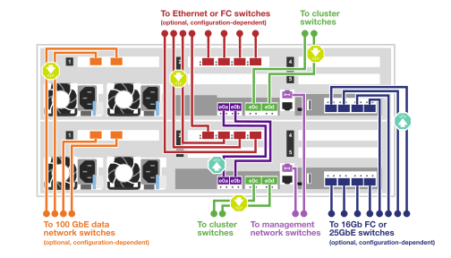
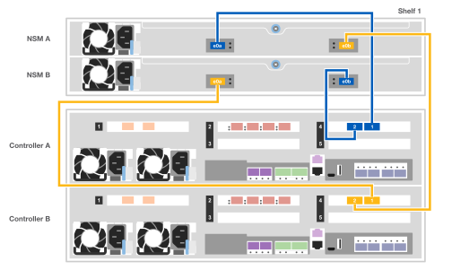
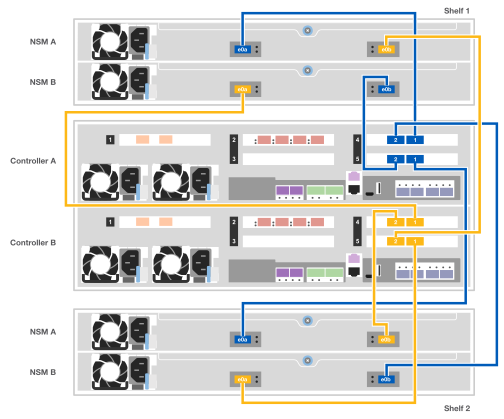

= Guía detallada - AFF C400
:allow-uri-read: 
:icons: font
:imagesdir: ../media/

[role="lead"]
Esta guía ofrece instrucciones detalladas paso a paso para la instalación de un sistema típico de NetApp. Utilice esta guía si desea instrucciones de instalación más detalladas.

Si dispone de una configuración MetroCluster, utilice el contenido de instalación de MetroCluster.

https://docs.netapp.com/us-en/ontap-metrocluster/index.html["Documentación de MetroCluster"^]

== Paso 1: Preparar la instalación

Para instalar el sistema, necesita crear una cuenta, registrar el sistema y obtener claves de licencia. También es necesario realizar el inventario del número y tipo de cables adecuados para el sistema y recopilar información específica de la red.

.Antes de empezar
* Es necesario tener acceso a Hardware Universe para obtener información sobre los requisitos del sitio, así como información adicional sobre el sistema configurado. También es posible que desee tener acceso a las notas de la versión de ONTAP para obtener más información sobre este sistema.
+
https://hwu.netapp.com["Hardware Universe de NetApp"]

+
http://mysupport.netapp.com/documentation/productlibrary/index.html?productID=62286["Busque las notas de la versión de ONTAP 9"]

* Debe proporcionar lo siguiente en el sitio:
+
** Espacio en rack para el sistema de almacenamiento
** Destornillador Phillips número 2
** Cables de red adicionales para conectar el sistema al conmutador de red y al portátil o a la consola con un navegador Web

.Pasos
. Extraiga el contenido de todas las cajas.
. Registre el número de serie del sistema de las controladoras.
+
image::../media/drw_ssn_label.png[Ejemplo del número de serie del sistema]

. Realice un inventario y anote el número y los tipos de cables recibidos.
+
En la siguiente tabla se identifican los tipos de cables que pueden recibir. Si recibe un cable no enumerado en la tabla, consulte la Hardware Universe para localizar el cable e identificar su uso.

+
https://hwu.netapp.com["Hardware Universe de NetApp"]

+
[cols="1,2,1,2"]
|===
| Tipo de cable... | Número de pieza y longitud | Tipo de conector | Durante... 

 a| 
Cable de 100 GbE (QSFP28)
 a| 
X66211A-05 (112-00595), 0,5 m

X66211A-1 (112-00573), 1 m.

X66211A-2 (112-00574), 2 m

X66211A-5 (112-00574), 5 m
 a| 
image:../media/oie_cable100_gbe_qsfp28.png["Conector QSFP28 de 100 GbE"]
 a| 
Datos de almacenamiento, interconexión del clúster/alta disponibilidad y Ethernet (dependiendo del pedido)

 a| 
Cable de 25 GbE (SFP28)
 a| 
X66240-2 (112-00598), 2 m

X66240-5 (112-00639), 5 m
 a| 
image:../media/oie_cable_sfp_gbe_copper.png["Conector de cobre SFP GbE"]
 a| 
Conexión de red GbE (depende del pedido)

 a| 
FC de 32 GB (SFP+ Op)
 a| 
X66250-2 (112-00342), 2 m

X66250-5 (112-00344), 5 m

X66250-15 (112-00346), 15m
 a| 
image:../media/oie_cable_sfp_gbe_copper.png["Conector de cobre SFP GbE"]
 a| 
Conexión de red FC

 a| 
Cables ópticos
 a| 
X66250-2-N-C (112-00342)
 a| 
image:../media/oie_cable_fiber_lc_connector.png["Ilustración que muestra un conector LC de fibra óptica"]
 a| 
Cables FC de 16 GB o 25 GbE para tarjetas mezzanine (dependiendo del pedido)

 a| 
RJ-45 (dependiente del pedido)
 a| 
X6585-R6 (112-00291), 3 m

X6562-R6 (112-00196), 5 m
 a| 
image:../media/oie_cable_rj45.png["Conector de cable RJ-45"]
 a| 
Red de gestión

 a| 
Cable de consola Micro-USB
 a| 
No aplicable
 a| 
image:../media/oie_cable_micro_usb.png["Ilustración que muestra un conector micro USB"]
 a| 
Conexión de consola utilizada durante la configuración del software si el portátil o la consola no admite el descubrimiento de red.

 a| 
Cables de alimentación
 a| 
No aplicable
 a| 
image:../media/oie_cable_power.png["Cables de alimentación"]
 a| 
Encendido del sistema

|===
. Consulte la _Guía de configuración de ONTAP de NetApp_ y recopile la información necesaria que se indica en esta guía.
+
https://library.netapp.com/ecm/ecm_download_file/ECMLP2862613["Guía de configuración de ONTAP"]

== Paso 2: Instale el hardware

Debe instalar el sistema en un rack de 4 parantes o armario del sistema de NetApp, según corresponda.

. Instale los kits de raíles, según sea necesario.
. Instale y asegure el sistema siguiendo las instrucciones incluidas con el kit de raíl.
+

NOTE: Debe ser consciente de los problemas de seguridad asociados con el peso del sistema.

+
image::../media/drw_katana_lifting_restriction_icon.png[Precaución de elevación para dos personas]

. Conecte los dispositivos de gestión de cables a la parte posterior de las controladoras (como se muestra).
+
image::../media/drw_c400_cable_tray_IEOPS-1208.svg[Bandeja de cables drw C400 IEOPS 1208]

. Coloque el panel frontal en la parte delantera del sistema.

== Paso 3: Conecte los controladores a la red

Puede conectar las controladoras a la red mediante el método de clúster sin switch de dos nodos o mediante el método de clúster con switches.

.Acerca de esta tarea
* Si las etiquetas de los puertos de la tarjeta no son visibles, puede identificar los puertos consultando la orientación de instalación de la tarjeta (en el caso de C400, el conector hembra PCIe se encuentra en el lado izquierdo de la ranura para tarjeta) y, a continuación, buscar la tarjeta según el número de pieza en Hardware Universe de NetApp, en la que se muestra un gráfico del bisel con las etiquetas de puerto. Puede encontrar el número de pieza de la tarjeta mediante el comando sysconfig -a o en la lista de empaquetado del sistema.
* Si va a cablear una configuración IP de MetroCluster, los puertos e0a/e0b están disponibles para alojar LIF de datos (normalmente en el espacio IP predeterminado).

[role="tabbed-block"]
====
.Opción 1: Conecte el cable de un clúster sin switch de dos nodos
--
La interconexión de clúster y los puertos de alta disponibilidad de un módulo de controlador se cablean a su módulo de controladora asociado. Los puertos de datos opcionales, las tarjetas NIC opcionales y los puertos de gestión de los módulos de la controladora se conectan a los switches.

.Antes de empezar
Debe haberse puesto en contacto con el administrador de red para obtener información sobre la conexión del sistema a los switches.

.Acerca de esta tarea
Asegúrese de comprobar la dirección de las pestañas de contacto del cable al insertar los cables en los puertos. Las pestañas tipo cable están hacia arriba para todos los puertos internos y hacia abajo para las tarjetas de expansión (NIC).

image::../media/oie_cable_pull_tab_up.png[Conector de cable con lengüeta en la parte superior]

image::../media/oie_cable_pull_tab_down.png[Conector de cable con lengüeta en la parte inferior]

NOTE: Al insertar el conector, debería sentir que hace clic en su lugar; si no cree que hace clic, quítelo, gírelo y vuelva a intentarlo.

.Pasos
. Use la ilustración para completar el cableado entre las controladoras y los switches:
+
image::../media/drw_c400_TNSC-networking-cabling_IEOPS-1189.svg[Cableado de red drw C400 TNSC IEOPS 1189]

. Vaya a. <<Paso 4: Conecte las controladoras a las bandejas de unidades>> para obtener instrucciones sobre el cableado de la bandeja de unidades.

--
.Opción 2: Conectar un clúster de switches
--
La interconexión de clúster del módulo de controladora y los puertos de alta disponibilidad se cablean al clúster/switch de alta disponibilidad. Los puertos de datos opcionales, las tarjetas NIC opcionales, las tarjetas mezzanine y los puertos de gestión están conectados a switches.

.Antes de empezar
Debe haberse puesto en contacto con el administrador de red para obtener información sobre la conexión del sistema a los switches.

.Acerca de esta tarea
Asegúrese de comprobar la dirección de las pestañas de contacto del cable al insertar los cables en los puertos. Las pestañas tipo cable están hacia arriba para todos los puertos internos y hacia abajo para las tarjetas de expansión (NIC).

image::../media/oie_cable_pull_tab_up.png[Conector de cable con lengüeta en la parte superior]

image::../media/oie_cable_pull_tab_down.png[Conector de cable con lengüeta en la parte inferior]

NOTE: Al insertar el conector, debería sentir que hace clic en su lugar; si no cree que hace clic, quítelo, gírelo y vuelva a intentarlo.

.Pasos
. Use la ilustración para completar el cableado entre las controladoras y los switches:
+

. Vaya a. <<Paso 4: Conecte las controladoras a las bandejas de unidades>> para obtener instrucciones sobre el cableado de la bandeja de unidades.

--
====

== Paso 4: Conecte las controladoras a las bandejas de unidades

Las siguientes opciones le muestran cómo conectar una o dos bandejas de unidades NS224 al sistema.

=== Opción 1: Conecte las controladoras a una bandeja de unidades única

Debe cablear cada controladora a los módulos NSM de la bandeja de unidades NS224.

.Acerca de esta tarea
Asegúrese de comprobar que la flecha de la ilustración tenga la orientación correcta de la lengüeta de extracción del conector del cable. La lengüeta de extracción del cable para el modelo NS224 está hacia arriba.

image::../media/oie_cable_pull_tab_up.png[Conector de cable con lengüeta en la parte superior]

NOTE: Al insertar el conector, debería sentir que hace clic en su lugar; si no cree que hace clic, quítelo, gírelo y vuelva a intentarlo.

.Pasos
. Utilice la siguiente ilustración para conectar los cables de las controladoras a una única bandeja de unidades.
+

. Vaya a. <<Paso 5: Pasos completos para la instalación y la configuración del sistema>> para completar los procesos de instalación y configuración del sistema.

=== Opción 2: Conecte las controladoras a dos bandejas de unidades

Debe cablear cada controladora a los módulos NSM de ambas bandejas de unidades NS224.

.Acerca de esta tarea
Asegúrese de comprobar que la flecha de la ilustración tenga la orientación correcta de la lengüeta de extracción del conector del cable. La lengüeta de extracción del cable para el modelo NS224 está hacia arriba.

image::../media/oie_cable_pull_tab_up.png[Conector de cable con lengüeta en la parte superior]

NOTE: Al insertar el conector, debería sentir que hace clic en su lugar; si no cree que hace clic, quítelo, gírelo y vuelva a intentarlo.

.Pasos
. Use la siguiente ilustración para conectar las controladoras a dos bandejas de unidades.
+

. Vaya a. <<Paso 5: Pasos completos para la instalación y la configuración del sistema>> para completar los procesos de instalación y configuración del sistema.

== Paso 5: Pasos completos para la instalación y la configuración del sistema

Puede completar la instalación y configuración del sistema mediante la detección de clústeres mediante una sola conexión al switch y el portátil, o bien conectarse directamente a una controladora del sistema y luego conectarse al switch de gestión.

=== Opción 1: Completar la configuración y la configuración del sistema si la detección de redes está activada

Si tiene la detección de red habilitada en el portátil, puede completar la configuración y la instalación del sistema mediante la detección automática del clúster.

. Use la animación siguiente para encender y establecer los ID de bandeja de una o varias bandejas de unidades:
+
Para bandejas de unidades NS224, los ID de bandeja están preconfigurados en 00 y 01. Si desea cambiar los ID de la bandeja, utilice el extremo enderezado de un clip de papel o el lápiz de punto de bola con punta estrecha para acceder al botón de ID de la bandeja situado detrás de la placa frontal.

+
.Animación: Configure los identificadores de las bandejas de unidades
video::c500e747-30f8-4763-9065-afbf00008e7f[panopto]
. Enchufe los cables de alimentación a las fuentes de alimentación de la controladora y luego conéctelos a fuentes de alimentación de diferentes circuitos.
. Asegúrese de que el ordenador portátil tiene activado el descubrimiento de red.
+
Consulte la ayuda en línea de su portátil para obtener más información.

. Conecte el portátil al conmutador de administración.

image::../media/dwr_laptop_to_switch_only.svg[ordenador portátil dwr sólo para cambiar]

. Seleccione un icono de ONTAP que aparece para detectar:
+
image::../media/drw_autodiscovery_controler_select.png[Seleccione un icono de ONTAP]

+
.. Abra el Explorador de archivos.
.. Haga clic en red en el panel izquierdo.
.. Haga clic con el botón derecho del ratón y seleccione Actualizar.
.. Haga doble clic en el icono de ONTAP y acepte los certificados que aparecen en la pantalla.
+

NOTE: XXXXX es el número de serie del sistema para el nodo de destino.

+
Se abrirá System Manager.

. Utilice la configuración guiada de System Manager para configurar el sistema con los datos recogidos en la _Guía de configuración de ONTAP_ de NetApp.
+
https://library.netapp.com/ecm/ecm_download_file/ECMLP2862613["Guía de configuración de ONTAP"]

. Configure su cuenta y descargue Active IQ Config Advisor:
+
.. Inicie sesión en su cuenta existente o cree una cuenta.
+
https://mysupport.netapp.com/site/user/registration["Registro de soporte de NetApp"]

.. Registre su sistema.
+
https://mysupport.netapp.com/site/systems/register["Registro de productos de NetApp"]

.. Descargue Active IQ Config Advisor.
+
https://mysupport.netapp.com/site/tools["Descargas de NetApp: Config Advisor"]

. Compruebe el estado del sistema ejecutando Config Advisor.
. Después de completar la configuración inicial, vaya a la https://www.netapp.com/data-management/oncommand-system-documentation/["Recursos de documentación de ONTAP  ONTAP System Manager"] Página para obtener información sobre cómo configurar las funciones adicionales en ONTAP.

=== Opción 2: Completar la configuración y la configuración del sistema si la detección de red no está activada

Si el descubrimiento de red no está activado en el portátil, debe completar la configuración y la configuración mediante esta tarea.

. Conecte y configure el portátil o la consola:
+
.. Ajuste el puerto de la consola del portátil o de la consola en 115,200 baudios con N-8-1.
+

NOTE: Consulte la ayuda en línea del portátil o de la consola para saber cómo configurar el puerto de la consola.

.. Conecte el cable de consola al portátil o a la consola mediante el cable de consola incluido con el sistema y, a continuación, conecte el portátil al conmutador de administración de la subred de administración .
.. Asigne una dirección TCP/IP al portátil o consola, utilizando una que esté en la subred de gestión.

. Use la animación siguiente para encender y establecer los ID de bandeja de una o varias bandejas de unidades:
+
Para bandejas de unidades NS224, los ID de bandeja están preconfigurados en 00 y 01. Si desea cambiar los ID de la bandeja, utilice el extremo enderezado de un clip de papel o el lápiz de punto de bola con punta estrecha para acceder al botón de ID de la bandeja situado detrás de la placa frontal.

+
.Animación: Configure los identificadores de las bandejas de unidades
video::c500e747-30f8-4763-9065-afbf00008e7f[panopto]
. Enchufe los cables de alimentación a las fuentes de alimentación de la controladora y luego conéctelos a fuentes de alimentación de diferentes circuitos.
+

NOTE: El arranque inicial puede tardar hasta ocho minutos.

. Asigne una dirección IP de gestión de nodos inicial a uno de los nodos.
+
[cols="1,2"]
|===
| Si la red de gestión tiene DHCP... | Realice lo siguiente... 

 a| 
Configurado
 a| 
Registre la dirección IP asignada a las nuevas controladoras.

 a| 
No configurado
 a| 
.. Abra una sesión de consola mediante PuTTY, un servidor terminal o el equivalente para su entorno.
+

NOTE: Si no sabe cómo configurar PuTTY, compruebe la ayuda en línea del ordenador portátil o de la consola.

.. Introduzca la dirección IP de administración cuando se lo solicite el script.

|===
. Mediante System Manager en el portátil o la consola, configure su clúster:
+
.. Dirija su navegador a la dirección IP de gestión de nodos.
+

NOTE: El formato de la dirección es +https://x.x.x.x.+

.. Configure el sistema con los datos recogidos en la _Guía de configuración de ONTAP_ de NetApp.
+
https://library.netapp.com/ecm/ecm_download_file/ECMLP2862613["Guía de configuración de ONTAP"]

. Configure su cuenta y descargue Active IQ Config Advisor:
+
.. Inicie sesión en su cuenta existente o cree una cuenta.
+
https://mysupport.netapp.com/site/user/registration["Registro de soporte de NetApp"]

.. Registre su sistema.
+
https://mysupport.netapp.com/site/systems/register["Registro de productos de NetApp"]

.. Descargue Active IQ Config Advisor.
+
https://mysupport.netapp.com/site/tools["Descargas de NetApp: Config Advisor"]

. Compruebe el estado del sistema ejecutando Config Advisor.
. Después de completar la configuración inicial, vaya a la https://www.netapp.com/data-management/oncommand-system-documentation/["Recursos de documentación de ONTAP  ONTAP System Manager"] Página para obtener información sobre cómo configurar las funciones adicionales en ONTAP.

