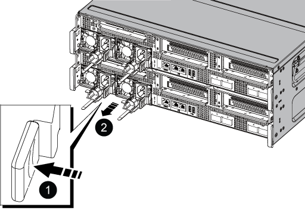

= Sustituya una fuente de alimentación - AFF C800
:allow-uri-read: 
:icons: font
:imagesdir: ../media/

[role="lead"]
Para sustituir una fuente de alimentación (PSU) es necesario desconectar la fuente de alimentación de destino de la fuente de alimentación, desconectar el cable de alimentación, quitar la fuente de alimentación antigua e instalar la fuente de alimentación de reemplazo y, a continuación, volver a conectarla a la fuente de alimentación.

* Las PSU son redundantes e intercambiables en caliente.
* Este procedimiento se escribe para sustituir una fuente de alimentación por vez.
+

NOTE: Se recomienda sustituir la fuente de alimentación en un plazo de dos minutos tras retirarla del chasis. El sistema sigue funcionando, pero ONTAP envía mensajes a la consola sobre la PSU degradada hasta que sustituye la PSU.

* Las PSU son de rango automático.
+

IMPORTANT: No mezcle las PSU con diferentes niveles de eficiencia. Sustituya siempre como por ejemplo.

Utilice el procedimiento adecuado para su tipo de PSU: CA o CC.

[role="tabbed-block"]
====
.Opción 1: Sustituya una fuente de alimentación de CA
--
Utilice el siguiente vídeo o los pasos para sustituir la fuente de alimentación:

. Si usted no está ya conectado a tierra, correctamente tierra usted mismo.
. Identifique la fuente de alimentación que desea sustituir, basándose en los mensajes de error de la consola o a través del LED rojo de fallo de la fuente de alimentación.
. Desconecte la fuente de alimentación:
+
.. Abra el retenedor del cable de alimentación y, a continuación, desconecte el cable de alimentación de la fuente de alimentación.
.. Desconecte el cable de alimentación de la fuente de alimentación.

. Gire el asa de la leva de forma que pueda utilizarse para extraer la PSU del módulo del controlador mientras presiona la lengüeta de bloqueo.
+

CAUTION: La fuente de alimentación es corta. Utilice siempre dos manos para apoyarlo cuando lo extraiga del módulo del controlador de modo que no se mueva repentinamente del módulo del controlador y le herir.

+

+
|===

 a| 
image:../media/legend_icon_01.png[""]
| Lengüeta azul de bloqueo de la fuente de alimentación 

 a| 
image:../media/legend_icon_02.png[""]
 a| 
Suministro de alimentación

|===
. Con ambas manos, apoye y alinee los bordes de la PSU con la abertura del módulo del controlador y, a continuación, empuje suavemente la PSU en el módulo del controlador hasta que la lengüeta de bloqueo encaje en su lugar.
+
Las fuentes de alimentación sólo se acoplarán correctamente con el conector interno y se bloquearán de una forma.

+

NOTE: Para evitar dañar el conector interno, no ejerza demasiada fuerza al deslizar la fuente de alimentación hacia el sistema.

. Vuelva a conectar el cableado de la PSU:
+
.. Vuelva a conectar el cable de alimentación a la fuente de alimentación y a la fuente de alimentación.
.. Fije el cable de alimentación a la fuente de alimentación con el retenedor del cable de alimentación.

+
Una vez restaurada la alimentación de la fuente de alimentación, el LED de estado debería ser verde.

. Devuelva la pieza que ha fallado a NetApp, como se describe en las instrucciones de RMA que se suministran con el kit. Consulte https://["Retorno de artículo  sustituciones"^] para obtener más información.

--
.Opción 2: Sustituya una fuente de alimentación de CC
--
Para sustituir una fuente de alimentación de CC, lleve a cabo los siguientes pasos.

. Si usted no está ya conectado a tierra, correctamente tierra usted mismo.
. Identifique la fuente de alimentación que desea sustituir, basándose en los mensajes de error de la consola o a través del LED rojo de fallo de la fuente de alimentación.
. Desconecte la fuente de alimentación:
+
.. Desenrosque los dos tornillos de mariposa del conector del cable de alimentación de CC D-SUB.
+
La ilustración y la tabla del paso 4 muestran los dos tornillos de mariposa (elemento n.o 1) y el conector del cable de alimentación de CC D-SUB (elemento n.o 2).

.. Desenchufe el conector del cable de alimentación de CC D-SUB de la PSU y déjelo a un lado.

. Retire la PSU:
+
.. Gire el asa hacia arriba, a su posición horizontal y, a continuación, sujételo.
.. Con el pulgar, presione la lengüeta azul para liberar el mecanismo de bloqueo.
.. Extraiga la PSU del módulo de controlador mientras usa la otra mano para soportar su peso.
+

NOTE: La fuente de alimentación es corta. Utilice siempre dos manos para apoyarlo al extraerlo del módulo del controlador de modo que no se salga del módulo del controlador y le cause lesiones.

+
image::../media/drw_dcpsu_remove-replace-generic_IEOPS-788.svg[drw dcpsu Remove sustituye al IEPOPS genérico 788]

+
[cols="1,3"]
|===

 a| 
image:../media/legend_icon_01.svg["anchura=10px"]
 a| 
Tornillos de mariposa

 a| 
image:../media/legend_icon_02.svg["anchura=10px"]
 a| 
Conector del cable de alimentación de CC D-SUB

 a| 
image:../media/legend_icon_03.svg["anchura=10px"]
 a| 
Asa de PSU

 a| 
image:../media/legend_icon_04.svg["anchura=10px"]
 a| 
Lengüeta azul de bloqueo de la PSU

|===

. Instale la fuente de alimentación de repuesto:
+
.. Con ambas manos, sujete y alinee los bordes de la PSU con la abertura del módulo del controlador.
.. Empuje suavemente la PSU en el módulo del controlador hasta que el mecanismo de bloqueo encaje en su sitio.
+
Una fuente de alimentación debe acoplarse correctamente con el conector interno y el mecanismo de bloqueo. Repita este paso si considera que la fuente de alimentación no está correctamente colocada.

+

NOTE: No ejerza una fuerza excesiva o podría dañar el conector interno.

.. Gire el asa hacia abajo, de manera que quede fuera del camino de las operaciones normales.

. Vuelva a conectar el cable de alimentación D-SUB DC:
+
Una vez restaurada la alimentación de la fuente de alimentación, el LED de estado debería ser verde.

+
.. Conecte el conector del cable de alimentación de CC D-SUB a la PSU.
.. Apriete los dos tornillos de mariposa para fijar el conector del cable de alimentación de CC D-SUB a la PSU.

. Devuelva la pieza que ha fallado a NetApp, como se describe en las instrucciones de RMA que se suministran con el kit. Consulte https://["Retorno de artículo  sustituciones"^] para obtener más información.

--
====