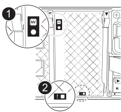

= Sustituya el controlador - FAS70 y FAS90
:allow-uri-read: 
:icons: font
:imagesdir: ../media/

[role="lead"]
Reemplace la controladora en el sistema FAS70 o FAS90 cuando un error de hardware lo requiera. El proceso de reemplazo implica retirar la controladora dañada, mover los componentes a la controladora de reemplazo, instalar la controladora de reemplazo y reiniciarla.

== Paso 1: Extraiga el módulo del controlador

Cuando sustituya el módulo de controlador o sustituya uno de los componentes del módulo de controlador, debe quitar el módulo de controlador del compartimento.

.Pasos
. Compruebe el LED de estado de NVRAM ubicado en la ranura 4/5 del sistema. También hay un LED NVRAM en el panel frontal del módulo de controladora. Busque el icono NV:
+

+
[cols="1,4"]
|===

 a| 
image:../media/icon_round_1.png["Número de llamada 1"]
 a| 
LED de estado de NVRAM

 a| 
image:../media/icon_round_2.png["Número de llamada 2"]
 a| 
LED de alerta de NVRAM

|===
+
** Si el LED NV está apagado, vaya al siguiente paso.
** Si el LED NV parpadea, espere a que el parpadeo se detenga. Si el parpadeo continúa durante más de 5 minutos, póngase en contacto con el servicio de asistencia técnica para obtener ayuda.

. Si usted no está ya conectado a tierra, correctamente tierra usted mismo.
. En la parte delantera de la unidad, enganche los dedos en los orificios de las levas de bloqueo, apriete las lengüetas de las palancas de leva y gire suavemente, pero firmemente, ambos pestillos hacia usted al mismo tiempo.
+
El módulo del controlador se mueve ligeramente fuera del compartimento.

+
image::../media/drw_a1k_pcm_remove_replace_ieops-1375.svg[Gráfico de extracción del controlador]

+
[cols="1,4"]
|===

 a| 
image:../media/icon_round_1.png["Número de llamada 1"]
| Pestillos de leva de bloqueo 
|===
. Deslice el módulo del controlador fuera de la carcasa y colóquelo sobre una superficie plana y estable.
+
Asegúrese de que apoya la parte inferior del módulo del controlador mientras lo desliza fuera de la carcasa.

== Paso 2: Mueva los ventiladores

Debe retirar los cinco módulos de ventilador del módulo de controlador defectuoso al módulo de controlador de repuesto.

.Pasos
. Si usted no está ya conectado a tierra, correctamente tierra usted mismo.
. Retire el bisel (si es necesario) con dos manos, sujetando las aberturas de cada lado del bisel y tirando de él hacia usted hasta que el bisel se suelte de los espárragos de bolas del bastidor del chasis.
. Pulse el botón de bloqueo gris del módulo de ventiladores y tire del módulo de ventiladores hacia fuera del chasis, asegurándose de que lo apoya con la mano libre.
+

NOTE: Los módulos del ventilador son cortos. Apoye siempre la parte inferior del módulo de ventilador con la mano libre para que no se caiga repentinamente del chasis y le haga daño.

+
image::../media/drw_a1k_fan_remove_replace_ieops-1376.svg[Ventilador quite AFF A1K]

+
[cols="1,4"]
|===

 a| 
image::../media/icon_round_1.png[Número de llamada 1]
 a| 
Botón de bloqueo negro

|===
. Instale el ventilador en el módulo de controlador de sustitución:
+
.. Alinee los bordes del alojamiento del ventilador con la abertura en la parte delantera del módulo de controlador de reemplazo.
.. Deslice suavemente el módulo del ventilador por completo en el módulo del controlador de repuesto hasta que encaje en su sitio.

. Repita los pasos anteriores para los módulos de ventilador restantes.

== Paso 3: Mueva la batería de NV

Mueva la batería NV al controlador de reemplazo.

.Pasos
. Abra la cubierta del conducto de aire de la batería NV y localice la batería NV.
+
image::../media/drw_a1k_remove_replace_nvmembat_ieops-1379.svg[Batería NV RETIRE AFF A1K]

+
[cols="1,4"]
|===

 a| 
image::../media/icon_round_1.png[Número de llamada 1]
| Cubierta del conducto de aire de la batería NV 

 a| 
image::../media/icon_round_2.png[Número de llamada 2]
 a| 
Enchufe de la batería de NV

 a| 
image::../media/icon_round_3.png[Número de llamada 3]
 a| 
Paquete de baterías NV

|===
. Levante la batería para acceder al enchufe de la batería.
. Apriete el clip de la cara del enchufe de la batería para liberarlo de la toma y, a continuación, desenchufe el cable de la batería de la toma.
. Levante la batería del conducto de aire y del módulo del controlador.
. Mueva la batería al módulo de controlador de repuesto y luego instálelo en el conducto de aire de la batería NV:
+
.. Abra el conducto de aire de la batería NV en el módulo de controlador de reemplazo.
.. Enchufe la clavija de la batería a la toma y asegúrese de que la clavija se bloquea en su lugar.
.. Inserte la batería en la ranura y presione firmemente la batería para asegurarse de que está bloqueada en su lugar.
.. Cierre la cubierta del conducto de aire.

== Paso 4: Mover los DIMM del sistema

Mueva los módulos DIMM al módulo de controlador de reemplazo.

.Pasos
. Abra el conducto de aire de la placa base y localice los módulos DIMM.
+
image::../media/drw_a1k_dimms_ieops-1512.svg[DIMM elimina AFF A1K]

+
[cols="1,4"]
|===

 a| 
image::../media/icon_round_1.png[Número de llamada 1]
 a| 
DIMM del sistema

|===
. Tenga en cuenta la orientación del DIMM en el socket para poder insertar el DIMM en el módulo de controlador de reemplazo en la orientación adecuada.
. Extraiga el DIMM de su ranura empujando lentamente las dos lengüetas expulsoras del DIMM a ambos lados del DIMM y, a continuación, extraiga el DIMM de la ranura.
+

NOTE: Sujete con cuidado el módulo DIMM por los bordes para evitar la presión sobre los componentes de la placa de circuitos DIMM.

. Localice la ranura donde está instalando el módulo DIMM en el módulo de controlador de reemplazo.
. Inserte el módulo DIMM directamente en la ranura.
+
El módulo DIMM encaja firmemente en la ranura, pero debe entrar fácilmente. Si no es así, realinee el DIMM con la ranura y vuelva a insertarlo.

+

NOTE: Inspeccione visualmente el módulo DIMM para comprobar que está alineado de forma uniforme y completamente insertado en la ranura.

. Empuje con cuidado, pero firmemente, en el borde superior del DIMM hasta que las lengüetas expulsoras encajen en su lugar sobre las muescas de los extremos del DIMM.
. Repita estos pasos para los módulos DIMM restantes. Cierre el conducto de aire de la placa base.

== Paso 5: Instale el módulo del controlador

Vuelva a instalar el módulo del controlador y arranque.

. Asegúrese de que el conducto de aire esté completamente cerrado girándolo hacia abajo hasta el tope.
+
Debe quedar a ras de la chapa metálica del módulo del controlador.

. Alinee el extremo del módulo del controlador con la abertura en la carcasa y deslice el módulo del controlador en el chasis con las palancas giradas hacia fuera de la parte delantera del sistema.
. Una vez que el módulo del controlador le impide deslizarlo más, gire las asas de la leva hacia dentro hasta que queden atrapadas debajo de los ventiladores
+

NOTE: No ejerza demasiada fuerza al deslizar el módulo del controlador en la carcasa para evitar dañar los conectores.

+

NOTE: La controladora arranca en el símbolo del sistema DE Loader tan pronto como está completamente asentada.

. Desde el aviso de Loader, introduzca `show date` para mostrar la fecha y la hora de la controladora de reemplazo. La fecha y la hora están en GMT.
+

NOTE: La hora mostrada es la hora local no siempre GMT y se muestra en modo 24hr.

. Establezca la hora actual en GMT con `set time hh:mm:ss` el comando. Puede obtener el GMT actual del nodo socio el comando `date -u`command.
. Vuelva a conectar el sistema de almacenamiento, según sea necesario.
+
Si ha quitado los transceptores (QSFP o SFP), recuerde reinstalarlos si utiliza cables de fibra óptica.

.El futuro
Después de reemplazar el controlador FAS70 o FAS90 dañado, debe hacerlolink:controller-replace-system-config-restore-and-verify.html["restaure la configuración del sistema"].
