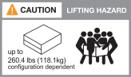

= Requisitos de instalación - FAS70 y FAS90
:allow-uri-read: 
:icons: font
:imagesdir: ../media/

[role="lead"]
Revise el equipo necesario y las precauciones de elevación para el sistema de almacenamiento FAS70 o FAS90 y las bandejas de almacenamiento.

== Equipo necesario para la instalación

Para instalar su sistema de almacenamiento FAS70 o FAS90, necesita los siguientes equipos y herramientas.

* Acceso a un explorador web para configurar el sistema de almacenamiento
* Correa de descarga electrostática (ESD)
* Linterna
* Portátil o consola con conexión USB/serie
* Clip de papel o bolígrafo con punta estrecha para fijar NS224 ID de estante de almacenamiento
* Destornillador Phillips número 2

== Precauciones de elevación

Los sistemas de almacenamiento FAS70 y FAS90, las bandejas de almacenamiento NS224 y las bandejas de almacenamiento DS460C son de gran peso. Tenga cuidado al levantar y mover estos elementos.

=== Sistemas de almacenamiento FAS70 y FAS90

Un sistema de almacenamiento FAS70 o FAS90 puede pesar hasta 28,5 kg (62,83 lbs). Para levantar el sistema, se necesitan dos personas o un elevador hidráulico.

image::../media/drw_a1k_weight_caution_ieops-1698.svg[FAS70 y FAS90 Icono de precaución de elevación]

=== Bandeja NS224

Un estante de almacenamiento NS224 puede pesar hasta 66,78 lbs (30,29 kg). Para levantar el estante de almacenamiento, se necesitan dos personas o un elevador hidráulico. Conserve todos los componentes en la bandeja de almacenamiento (tanto delantera como trasera) para evitar que se desequilibre el peso de bandeja.

image::../media/drw_ns224_lifting_weight_ieops-1716.svg[NS224 Cuidado de elevación]

=== Bandeja DS460C

Un estante DS460C puede pesar hasta 260,4 lbs (118,1 kg). Para levantar el estante de almacenamiento, es posible que necesite hasta cinco personas o un elevador hidráulico. Conserve todos los componentes en la bandeja de almacenamiento (tanto delantera como trasera) para evitar que se desequilibre el peso de bandeja.

.Información relacionada
* https://library.netapp.com/ecm/ecm_download_file/ECMP12475945["Información sobre seguridad y avisos normativos"^]
* https://hwu.netapp.com["Hardware Universe de NetApp"^]

.El futuro
Después de haber revisado los requisitos de hardware, usted link:install-prepare.html["Prepárese para instalar el sistema de almacenamiento FAS70 o FAS90"].
