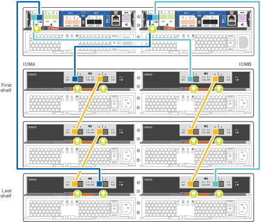

= Guía detallada - FAS2700
:allow-uri-read: 
:icons: font
:imagesdir: ../media/

[role="lead"]
Esta página ofrece instrucciones detalladas paso a paso para instalar un sistema NetApp típico. Utilice esta guía si desea instrucciones de instalación más detalladas.

== Paso 1: Preparar la instalación

Para instalar el sistema FAS2700, tiene que crear una cuenta en el sitio de soporte de NetApp, registrar el sistema y obtener las claves de licencia. También es necesario realizar el inventario del número y tipo de cables adecuados para el sistema y recopilar información específica de la red.

Es necesario tener acceso a Hardware Universe para obtener información sobre los requisitos del sitio, así como información adicional sobre el sistema configurado. También es posible que desee tener acceso a las notas de la versión de ONTAP para obtener más información sobre este sistema.

https://hwu.netapp.com["Hardware Universe de NetApp"]

http://mysupport.netapp.com/documentation/productlibrary/index.html?productID=62286["Busque las notas de la versión de ONTAP 9"]

Debe proporcionar lo siguiente en el sitio:

* Espacio en rack para el sistema de almacenamiento
* Destornillador Phillips número 2
* Cables de red adicionales para conectar el sistema al conmutador de red y al portátil o a la consola con un navegador Web
* Un portátil o consola con una conexión RJ-45 y acceso a un explorador Web

.Pasos
. Extraiga el contenido de todas las cajas.
. Registre el número de serie del sistema de las controladoras.
+
image::../media/drw_ssn_label.png[Ejemplo del número de serie del sistema]

. Configure su cuenta:
+
.. Inicie sesión en su cuenta existente o cree una cuenta.
.. Registre su sistema.
+
https://mysupport.netapp.com/eservice/registerSNoAction.do?moduleName=RegisterMyProduct["Registro de productos de NetApp"]

. Descargue e instale Config Advisor en su portátil.
+
https://mysupport.netapp.com/site/tools/tool-eula/activeiq-configadvisor["Descargas de NetApp: Config Advisor"]

. Realice un inventario y anote el número y los tipos de cables recibidos.
+
En la siguiente tabla se identifican los tipos de cables que pueden recibir. Si recibe un cable no enumerado en la tabla, consulte la Hardware Universe para localizar el cable e identificar su uso.

+
https://hwu.netapp.com["Hardware Universe de NetApp"]

+
[cols="1,2,1,2"]
|===
| Tipo de cable... | Número de pieza y longitud | Tipo de conector | Durante... 

 a| 
Cable de 10 GbE (depende del pedido)
 a| 
X6566B-05-R6 (112-00297), 0,5 m

X6566B-2-R6 (112-00299), 2 m
 a| 
image:../media/oie_cable_sfp_gbe_copper.png["Conector de cobre SFP GbE"]
 a| 
La red de interconexión en clúster

 a| 
Cable de 10 GbE (depende del pedido)
 a| 
Número de pieza X6566B-2-R6 (112-00299), 2 m

O X6566B-3-R6 (112-00300), 3 m.

X6566B-5-R6 (112-00301), 5 m
 a| 
image:../media/oie_cable_sfp_gbe_copper.png["Conector de cobre SFP GbE"]
 a| 
SQL Server

 a| 
Cables de red óptica (dependiendo del pedido)
 a| 
X6553-R6 (112-00188), 2 m

X6536-R6 (112-00090), 5 m

X6554-R6 (112-00189), 15 m.
 a| 
image:../media/oie_cable_fiber_lc_connector.png["Conector de fibra LC"]
 a| 
Red host FC

 a| 
Cat 6, RJ-45 (según pedido)
 a| 
Números de referencia X6585-R6 (112-00291), 3m

X6562-R6 (112-00196), 5 m
 a| 
image:../media/oie_cable_rj45.png["Conector de cable RJ-45"]
 a| 
Red de gestión y datos Ethernet

 a| 
Almacenamiento (depende del pedido)
 a| 
Número de pieza X66030A (112-00435), 0,5 m

X66031A (112-00436), 1 m.

X66032A (112-00437), 2 m

X66033A (112-00438), 3 m.
 a| 
image:../media/oie_cable_mini_sas_hd_to_mini_sas_hd.png["Conector mini-SAS a mini-SAS"]
 a| 
Reducida

 a| 
Cable de consola Micro-USB
 a| 
No aplicable
 a| 
image:../media/oie_cable_micro_usb.png["Conector micro USB"]
 a| 
Conexión de consola durante la configuración del software en un portátil/consola que no sea Windows o Mac

 a| 
Cables de alimentación
 a| 
No aplicable
 a| 
image:../media/oie_cable_power.png["Cables de alimentación"]
 a| 
Encendido del sistema

|===
. Descargue y rellene la _Cluster Configuration Worksheet_.
+
https://library.netapp.com/ecm/ecm_download_file/ECMLP2839002["Hoja de datos para la configuración del clúster"]

== Paso 2: Instale el hardware

Debe instalar el sistema en un rack de 4 parantes o armario del sistema de NetApp, según corresponda.

.Pasos
. Instale los kits de raíles, según sea necesario.
. Instale y asegure el sistema siguiendo las instrucciones incluidas con el kit de raíl.
+

NOTE: Debe ser consciente de los problemas de seguridad asociados con el peso del sistema.

+
image::../media/drw_oie_fas2700_weight_caution.png[Precaución de elevación para dos personas]

. Conecte los dispositivos de administración de cables (como se muestra).
+
image::../media/drw_cable_management_arm_install.png[Conexión de dispositivos de gestión de cables]

. Coloque el panel frontal en la parte delantera del sistema.

== Paso 3: Conecte los controladores a la red

Puede conectar las controladoras a la red mediante el método de clúster sin switch de dos nodos o mediante la red de interconexión de clúster.

=== Opción 1: Cable de un clúster sin switch de dos nodos, configuración de red unificada

La red de gestión, la red de datos UTA2 y los puertos de gestión de las controladoras están conectados a los switches. Los puertos de interconexión de clúster se cablean en ambas controladoras.

Debe haberse puesto en contacto con el administrador de red para obtener información sobre la conexión del sistema a los switches.

Asegúrese de comprobar que la flecha de la ilustración tenga la orientación correcta de la lengüeta de extracción del conector del cable.

image::../media/oie_cable_pull_tab_down.png[Conector de cable con lengüeta en la parte inferior]

NOTE: Al insertar el conector, debería sentir que hace clic en su lugar; si no cree que hace clic, quítelo, gírelo y vuelva a intentarlo.

.Pasos
. Puede utilizar el gráfico o las instrucciones paso a paso para completar el cableado entre las controladoras y los switches:
+
image::../media/drw_2700_tnsc_unified_network_cabling_animated_gif.png[Cableado de clúster de dos nodos sin switches en una configuración de red unificada]

+
[cols="1,3"]
|===
| Paso | Ejecute cada controladora 

 a| 
image:../media/icon_square_1_green.png["Paso 1"]
 a| 
Conecte los puertos de interconexión del clúster entre sí mediante el cable de interconexión del clúster:

** e0a a e0a
** e0b a e0b
image:../media/drw_c190_u_tnsc_clust_cbling.png["Cableado de interconexión del clúster"]

 a| 
image:../media/icon_square_2_orange.png["Paso 2"]
 a| 
Utilice uno de los siguientes tipos de cables para conectar los puertos de datos UTA2 a la red host:

Un host FC

** 0c y 0d
** *O* 0e y 0f a 10 GbE
** e0c y e0d
** *o* e0e y e0f

NOTE: Puede conectar un par de puertos como CNA y un par de puertos como FC, o puede conectar ambas parejas de puertos como CNA o ambas parejas de puertos como FC.

image:../media/drw_c190_u_fc_10gbe_cabling.png["Conexiones de puertos de datos"]

 a| 
image:../media/icon_square_3_purple.png["Paso 3"]
 a| 
Conecte los puertos e0M a los switches de red de gestión mediante los cables RJ45:

image:../media/drw_c190_u_mgmt_cabling.png["Cableado de puertos de gestión"]

 a| 
image:../media/oie_legend_icon_attn_symbol.png["Símbolo de atención"]
 a| 
NO enchufe los cables de alimentación en este momento.

|===
. Para cablear el almacenamiento, consulte <<Paso 4: Conecte las controladoras a las bandejas de unidades>>

=== Opción 2: Conecte un clúster con switches o una configuración de red unificada

La red de gestión, la red de datos UTA2 y los puertos de gestión de las controladoras están conectados a los switches. Los puertos de interconexión de clúster se cablean a los switches de interconexión de clúster.

Debe haberse puesto en contacto con el administrador de red para obtener información sobre la conexión del sistema a los switches.

Asegúrese de comprobar que la flecha de la ilustración tenga la orientación correcta de la lengüeta de extracción del conector del cable.

image::../media/oie_cable_pull_tab_down.png[Conector de cable con lengüeta en la parte inferior]

NOTE: Al insertar el conector, debería sentir que hace clic en su lugar; si no cree que hace clic, quítelo, gírelo y vuelva a intentarlo.

.Pasos
. Puede utilizar el gráfico o las instrucciones paso a paso para completar el cableado entre las controladoras y los switches:
+
image::../media/drw_2700_switched_unified_network_cabling_animated_gif.png[Cableado de red unificada con lustre conmutado]

+
[cols="1,3"]
|===
| Paso | Lleve a cabo cada módulo de la controladora 

 a| 
image:../media/icon_square_1_green.png["Paso 1"]
 a| 
Cable e0a y e0b a los switches de interconexión del clúster con el cable de interconexión del clúster:

image:../media/drw_c190_u_switched_clust_cbling.png["Cableado de Clusterinterconnect"]

 a| 
image:../media/icon_square_2_orange.png["Paso 2"]
 a| 
Utilice uno de los siguientes tipos de cables para conectar los puertos de datos UTA2 a la red host:

Un host FC

** 0c y 0d
** **o** 0e y 0f

Una 10 GbE

** e0c y e0d
** **o** e0e y e0f

NOTE: Puede conectar un par de puertos como CNA y un par de puertos como FC, o puede conectar ambas parejas de puertos como CNA o ambas parejas de puertos como FC.

image:../media/drw_c190_u_fc_10gbe_cabling.png["Conexiones de puertos de datos"]

 a| 
image:../media/icon_square_3_purple.png["Paso 3"]
 a| 
Conecte los puertos e0M a los switches de red de gestión mediante los cables RJ45:

image:../media/drw_c190_u_mgmt_cabling.png["Cableado de puertos de gestión"]

 a| 
image:../media/oie_legend_icon_attn_symbol.png["Símbolo de atención"]
 a| 
NO enchufe los cables de alimentación en este momento.

|===
. Para cablear el almacenamiento, consulte <<Paso 4: Conecte las controladoras a las bandejas de unidades>>

=== Opción 3: Cable de un clúster sin switch de dos nodos, configuración de red Ethernet

La red de gestión, la red de datos Ethernet y los puertos de gestión de las controladoras están conectados a los switches. Los puertos de interconexión de clúster se cablean en ambas controladoras.

Debe haberse puesto en contacto con el administrador de red para obtener información sobre la conexión del sistema a los switches.

Asegúrese de comprobar que la flecha de la ilustración tenga la orientación correcta de la lengüeta de extracción del conector del cable.

image::../media/oie_cable_pull_tab_down.png[Conector de cable con lengüeta en la parte inferior]

NOTE: Al insertar el conector, debería sentir que hace clic en su lugar; si no cree que hace clic, quítelo, gírelo y vuelva a intentarlo.

.Pasos
. Puede utilizar el gráfico o las instrucciones paso a paso para completar el cableado entre las controladoras y los switches:
+
image::../media/drw_2700_tnsc_ethernet_network_cabling_animated_gif.png[Cableado de red de dos nodos sin switches]

+
[cols="1,3"]
|===
| Paso | Ejecute cada controladora 

 a| 
image:../media/icon_square_1_green.png["Paso 1"]
 a| 
Conecte los puertos de interconexión del clúster entre sí mediante el cable de interconexión del clúster:

** e0a a e0a
** e0b a e0b image:../media/drw_c190_e_tnsc_clust_cbling.png["Interconexiones de clúster entre los puertos de la parte posterior de las controladoras"]

 a| 
image:../media/icon_square_2_orange.png["Paso 2"]
 a| 
Utilice el cable RJ45 Cat 6 para conectar los puertos e0c a través de e0f a la red host:

image:../media/drw_c190_e_rj45_cbling.png["Cableado de red host"]

 a| 
image:../media/icon_square_3_purple.png["Paso 3"]
 a| 
Conecte los puertos e0M a los switches de red de gestión mediante los cables RJ45:

image:../media/drw_c190_e_mgmt_cbling.png["Cableado de puertos de gestión"]

 a| 
image:../media/oie_legend_icon_attn_symbol.png["Símbolo de atención"]
 a| 
NO enchufe los cables de alimentación en este momento.

|===
. Para cablear el almacenamiento, consulte <<Paso 4: Conecte las controladoras a las bandejas de unidades>>

=== Opción 4: Cableado de un clúster conmutado, configuración de red Ethernet

La red de gestión, la red de datos Ethernet y los puertos de gestión de las controladoras están conectados a los switches. Los puertos de interconexión de clúster se cablean a los switches de interconexión de clúster.

Debe haberse puesto en contacto con el administrador de red para obtener información sobre la conexión del sistema a los switches.

Asegúrese de comprobar que la flecha de la ilustración tenga la orientación correcta de la lengüeta de extracción del conector del cable.

image::../media/oie_cable_pull_tab_down.png[Conector de cable con lengüeta en la parte inferior]

NOTE: Al insertar el conector, debería sentir que hace clic en su lugar; si no cree que hace clic, quítelo, gírelo y vuelva a intentarlo.

.Pasos
. Puede utilizar el gráfico o las instrucciones paso a paso para completar el cableado entre las controladoras y los switches:
+
image::../media/drw_2700_switched_ethernet_network_cabling_animated_gif.png[Cableado Ethernet conmutado]

+
[cols="1,2"]
|===
| Paso | Lleve a cabo cada módulo de la controladora 

 a| 
image:../media/icon_square_1_green.png["Paso 1"]
 a| 
Cable e0a y e0b a los switches de interconexión del clúster con el cable de interconexión del clúster:

image:../media/drw_c190_e_switched_clust_cbling.png["Cableado de interconexión del clúster"]

 a| 
image:../media/icon_square_2_orange.png["Paso 2"]
 a| 
Utilice el cable RJ45 Cat 6 para conectar los puertos e0c a través de e0f a la red host:

image:../media/drw_c190_e_rj45_cbling.png["Cableado de red host"]

 a| 
image:../media/icon_square_3_purple.png["Paso 3"]
 a| 
Conecte los puertos e0M a los switches de red de gestión mediante los cables RJ45:

image:../media/drw_c190_e_mgmt_cbling.png["Cableado de puertos de gestión"]

 a| 
image:../media/oie_legend_icon_attn_symbol.png["Símbolo de atención"]
 a| 
NO enchufe los cables de alimentación en este momento.

|===
. Para cablear el almacenamiento, consulte <<Paso 4: Conecte las controladoras a las bandejas de unidades>>

== Paso 4: Conecte las controladoras a las bandejas de unidades

Debe cablear las controladoras a las bandejas con los puertos de almacenamiento internos. NetApp recomienda el cableado MP-ha para sistemas con almacenamiento externo. Si tiene una unidad de cinta SAS, puede utilizar el cableado de una sola ruta. Si no dispone de bandejas externas, el cableado MP-ha a las unidades internas es opcional (no se muestra) si los cables SAS se solicitan con el sistema.

.Antes de empezar
* Debe cablear las conexiones de bandeja a bandeja y luego conectar ambas controladoras a las bandejas de unidades.
* Asegúrese de comprobar que la flecha de la ilustración tenga la orientación correcta de la lengüeta de extracción del conector del cable.

image::../media/oie_cable_pull_tab_down.png[Conector de cable con lengüeta en la parte inferior]

.Pasos
. Conecte el cable de la pareja de alta disponibilidad con bandejas de unidades externas:
+

NOTE: En el ejemplo se utiliza DS224C. El cableado es similar con otras bandejas de unidades compatibles.

+

+
[cols="1,3"]
|===
| Paso | Ejecute cada controladora 

 a| 
image:../media/icon_square_1_blue.png["Número de llamada 1"]
 a| 
Cablee los puertos de la bandeja a bandeja.

** Puerto 3 de IOM a al puerto 1 del IOM A en la bandeja que se encuentra directamente debajo.
** Puerto 3 de IOM B al puerto 1 del IOM B en la bandeja directamente inferior.
+
image:../media/oie_cable_mini_sas_hd_to_mini_sas_hd.png["Conector mini-SAS a mini-SAS"]     Cables HD Mini-SAS a mini-SAS HD

 a| 
image:../media/icon_square_2_yellow.png["Paso 2"]
 a| 
Conecte cada nodo a IOM A en la pila.

** Controladora 1 Puerto 0b a IOM a puerto 3 en la última bandeja de unidades de la pila.
** Puerto 0a de controladora 2 a puerto IOM a 1 en la primera bandeja de unidades en la pila.
+
image:../media/oie_cable_mini_sas_hd_to_mini_sas_hd.png["Conector mini-SAS a mini-SAS"]     Cables HD Mini-SAS a mini-SAS HD

 a| 
image:../media/icon_square_3_tourquoise.png["Paso 3"]
 a| 
Conecte cada nodo a IOM B en la pila

** Controladora 1: Puerto 0a a puerto IOM B 1 en la primera bandeja de unidades en la pila.
** Controladora 2: Puerto 0b al puerto IOM B 3 en la última bandeja de unidades de la pila.

image:../media/oie_cable_mini_sas_hd_to_mini_sas_hd.png["Conector mini-SAS a mini-SAS"]     Cables HD Mini-SAS a mini-SAS HD

|===

NOTE: Para obtener más información sobre el cableado SAS y hojas de cálculo, consulte link:../sas3/overview-cabling-rules-examples.html["Información general sobre las reglas, hojas de trabajo y ejemplos de cableado SAS: Bandejas con módulos IOM12"]

. Para completar la configuración del sistema, consulte <<Paso 5: Pasos completos para la instalación y la configuración del sistema>>

== Paso 5: Pasos completos para la instalación y la configuración del sistema

Puede completar la instalación y configuración del sistema mediante la detección de clústeres mediante una sola conexión al switch y el portátil, o bien conectarse directamente a una controladora del sistema y luego conectarse al switch de gestión.

=== Opción 1: Completar la configuración del sistema si la detección de red está activada

Si tiene la detección de red habilitada en el portátil, puede completar la configuración y la instalación del sistema mediante la detección automática del clúster.

.Pasos
. Use la animación siguiente para establecer uno o varios ID de bandeja de unidades
+
.Animación: Configure los identificadores de las bandejas de unidades
video::c600f366-4d30-481a-89d9-ab1b0066589b[panopto]
. Enchufe los cables de alimentación a las fuentes de alimentación de la controladora y luego conéctelos a fuentes de alimentación de diferentes circuitos.
. Encienda los switches de alimentación en ambos nodos.
+
image::../media/drw_turn_on_power_switches_to_psus.png[Encendido]

+

NOTE: El arranque inicial puede tardar hasta ocho minutos.

. Asegúrese de que el ordenador portátil tiene activado el descubrimiento de red.
+
Consulte la ayuda en línea de su portátil para obtener más información.

. Utilice la siguiente animación para conectar el portátil al conmutador de administración.
+
.Animación: Conecte el portátil al conmutador de administración
video::d61f983e-f911-4b76-8b3a-ab1b0066909b[panopto]
. Seleccione un icono de ONTAP que aparece para detectar:
+
drw_autodiscovery_controler_select_ieops-1849.svg[Seleccione un icono de ONTAP]

+
.. Abra el Explorador de archivos.
.. Haga clic en *Red* en el panel izquierdo y haga clic con el botón derecho y seleccione *actualizar*.
.. Haga doble clic en el icono de ONTAP y acepte los certificados que aparecen en la pantalla.
+

NOTE: XXXXX es el número de serie del sistema para el nodo de destino.

+
Se abrirá System Manager.

. Utilice la configuración guiada de System Manager para configurar el sistema con los datos recogidos en la _Guía de configuración de ONTAP_ de NetApp.
+
https://library.netapp.com/ecm/ecm_download_file/ECMLP2862613["Guía de configuración de ONTAP"]

. Compruebe el estado del sistema ejecutando Config Advisor.
. Una vez completada la configuración inicial, vaya a https://docs.netapp.com/us-en/ontap/index.html["Documentación de ONTAP 9"^] para obtener información acerca de cómo configurar funciones adicionales en ONTAP.

=== Opción 2: Completar la configuración y la configuración del sistema si la detección de red no está activada

Si el descubrimiento de red no está activado en el portátil, debe completar la configuración y la configuración mediante esta tarea.

.Pasos
. Conecte y configure el portátil o la consola:
+
.. Ajuste el puerto de la consola del portátil o de la consola en 115,200 baudios con N-8-1.
+

NOTE: Consulte la ayuda en línea del portátil o de la consola para saber cómo configurar el puerto de la consola.

.. Conecte el cable de la consola al portátil o a la consola y conecte el puerto de la consola del controlador mediante el cable de consola incluido con el sistema.
+
image::../media/drw_console_connect_fas2700_affa200.png[Conectando al puerto de la consola]

.. Conecte el portátil o la consola al conmutador de la subred de administración.
+
image::../media/drw_client_to_mgmt_subnet_fas2700_affa220.png[Conectándose a la subred de gestión]

.. Asigne una dirección TCP/IP al portátil o consola, utilizando una que esté en la subred de gestión.

. Utilice la animación siguiente para establecer uno o varios ID de bandeja de unidades:
+
.Animación: Configure los identificadores de las bandejas de unidades
video::c600f366-4d30-481a-89d9-ab1b0066589b[panopto]
. Enchufe los cables de alimentación a las fuentes de alimentación de la controladora y luego conéctelos a fuentes de alimentación de diferentes circuitos.
. Encienda los switches de alimentación en ambos nodos.
+
image::../media/drw_turn_on_power_switches_to_psus.png[Encendido]

+

NOTE: El arranque inicial puede tardar hasta ocho minutos.

. Asigne una dirección IP de gestión de nodos inicial a uno de los nodos.
+
[cols="1-3"]
|===
| Si la red de gestión tiene DHCP... | Realice lo siguiente... 

 a| 
Configurado
 a| 
Registre la dirección IP asignada a las nuevas controladoras.

 a| 
No configurado
 a| 
.. Abra una sesión de consola mediante PuTTY, un servidor terminal o el equivalente para su entorno.
+

NOTE: Si no sabe cómo configurar PuTTY, compruebe la ayuda en línea del ordenador portátil o de la consola.

.. Introduzca la dirección IP de administración cuando se lo solicite el script.

|===
. Mediante System Manager en el portátil o la consola, configure su clúster:
+
.. Dirija su navegador a la dirección IP de gestión de nodos.
+

NOTE: El formato de la dirección es +https://x.x.x.x.+

.. Configure el sistema con los datos recogidos en la _Guía de configuración de ONTAP_ de NetApp.
+
https://library.netapp.com/ecm/ecm_download_file/ECMLP2862613["Guía de configuración de ONTAP"]

. Compruebe el estado del sistema ejecutando Config Advisor.
. Una vez completada la configuración inicial, vaya a https://docs.netapp.com/us-en/ontap/index.html["Documentación de ONTAP 9"^] para obtener información acerca de cómo configurar funciones adicionales en ONTAP.

