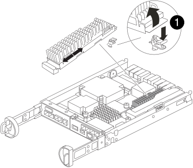

= Sustituya el módulo de almacenamiento en caché - FAS2820
:allow-uri-read: 
:icons: font
:imagesdir: ../media/

[role="lead"]
Debe sustituir el módulo de almacenamiento en caché en el módulo de la controladora cuando el sistema registre un único mensaje de AutoSupport (ASUP) que el módulo se haya desconectado; de lo contrario, el rendimiento se degradará.

* Debe sustituir el componente con errores por un componente FRU de repuesto que haya recibido de su proveedor.

== Paso 1: Apague el controlador dañado

Para apagar el controlador dañado, debe determinar el estado del controlador y, si es necesario, tomar el control para que el controlador sano siga sirviendo datos del almacenamiento del controlador dañado.

.Acerca de esta tarea
Si tiene un clúster con más de dos nodos, debe estar en quórum. Si el clúster no tiene quórum o si una controladora en buen estado muestra FALSE para tener derecho a recibir y ser el estado, es necesario corregir el problema antes de apagar la controladora con deterioro.

http://docs.netapp.com/ontap-9/topic/com.netapp.doc.dot-cm-sag/home.html["Referencia de administración del sistema de ONTAP 9"^]

Tal vez desee borrar el contenido del módulo de almacenamiento en caché antes de reemplazarlo.

.Pasos
. Aunque los datos del módulo de almacenamiento en caché están cifrados, es posible que desee borrar los datos del módulo de almacenamiento en caché dañado y verificar que el módulo de almacenamiento en caché no tiene datos:
+
.. Borre los datos del módulo de almacenamiento en caché: `system controller flash-cache secure-erase run -node _node name_ localhost -device-id _device_number_`
+

NOTE: Ejecute `system controller flash-cache show` el comando si no conoce el identificador de dispositivo de Flash Cache.

.. Compruebe que los datos se han borrado del módulo de almacenamiento en caché: `system controller flash-cache secure-erase show`
+
El resultado debería mostrar el estado del módulo de almacenamiento en caché como borrado.

. Si AutoSupport está habilitado, elimine la creación automática de casos invocando un mensaje de AutoSupport: `system node autosupport invoke -node * -type all -message MAINT=number_of_hours_downh`
+
El siguiente mensaje de AutoSupport suprime la creación automática de casos durante dos horas: `cluster1:*> system node autosupport invoke -node * -type all -message MAINT=2h`

. Si la controladora dañada forma parte de un par de alta disponibilidad, deshabilite la devolución automática de la consola de la controladora en buen estado: `storage failover modify -node local -auto-giveback false`
. Lleve la controladora dañada al aviso DEL CARGADOR:
+
[cols="1,2"]
|===
| Si el controlador dañado está mostrando... | Realice lo siguiente... 

 a| 
El aviso del CARGADOR
 a| 
Vaya al paso siguiente.

 a| 
Esperando devolución...
 a| 
Pulse Ctrl-C y, a continuación, responda `y` cuando se le solicite.

 a| 
Solicitud del sistema o solicitud de contraseña (introduzca la contraseña del sistema)
 a| 
Retome o detenga el controlador dañado:

** Para un par de alta disponibilidad, tome el control dañado del controlador sano: `storage failover takeover -ofnode _impaired_node_name_`
+
Cuando el controlador dañado muestre esperando devolución..., pulse Ctrl-C y, a continuación, responda `y`.

** Para un sistema independiente: `system node halt _impaired_node_name_`

|===

== Paso 2: Extraiga el módulo de controlador

Retire el módulo del controlador del sistema y, a continuación, retire la cubierta del módulo del controlador.

.Pasos
. Si usted no está ya conectado a tierra, correctamente tierra usted mismo.
. Afloje el gancho y la correa de bucle que sujetan los cables al dispositivo de administración de cables y, a continuación, desconecte los cables del sistema y los SFP (si fuera necesario) del módulo del controlador, manteniendo un seguimiento del lugar en el que estaban conectados los cables.
+
Deje los cables en el dispositivo de administración de cables de manera que cuando vuelva a instalar el dispositivo de administración de cables, los cables estén organizados.

. Retire y retire los dispositivos de administración de cables de los lados izquierdo y derecho del módulo del controlador.
. Apriete el pestillo del mango de la leva hasta que se suelte, abra el mango de la leva completamente para liberar el módulo del controlador del plano medio y, a continuación, tire con dos manos del módulo del controlador para extraerlo del chasis.
+
image::../media/drw_2240_x_opening_cam_latch.svg[pestillo de leva de apertura drw 2240 x]

. Dé la vuelta al módulo del controlador y colóquelo sobre una superficie plana y estable.
. Abra la cubierta pulsando los botones azules de los laterales del módulo del controlador para liberar la cubierta y, a continuación, gire la cubierta hacia arriba y hacia fuera del módulo del controlador.
+
image::../media/drw_2850_open_controller_module_cover_IEOPS-695.svg[Cubierta del módulo de controlador abierto drw 2850 IEOPS 695]

[cols="1,3"]
|===

 a| 
image::../media/icon_round_1.png[Número de llamada 1]
 a| 
Botón de liberación de la cubierta del módulo del controlador

|===

== Paso 3: Sustituya un módulo de almacenamiento en caché

Localice el módulo de almacenamiento en caché dentro del controlador, elimine el módulo de almacenamiento en caché que ha fallado y sustitúyalo.

.Animación - reemplace el módulo de caché
video::12b339c5-640a-4be8-a5fc-af47017276fd[panopto]
Su sistema de almacenamiento debe cumplir ciertos criterios según su situación:

* Debe tener el sistema operativo adecuado para el módulo de almacenamiento en caché que está instalando.
* Debe admitir la capacidad de almacenamiento en caché.
* Todos los demás componentes del sistema de almacenamiento deben funcionar correctamente; de lo contrario, debe comunicarse con el soporte técnico.

.Pasos
. Si usted no está ya conectado a tierra, correctamente tierra usted mismo.
. Localice el módulo de almacenamiento en caché con errores cerca de la parte posterior del módulo de controlador y elimínelo.
+
.. Pulse el botón de liberación azul y gire el módulo de almacenamiento en caché hacia arriba.
.. Tire suavemente del módulo de almacenamiento en caché hacia fuera de la carcasa.
+

+
[cols="1,3"]
|===

 a| 
image::../media/icon_round_1.png[Número de llamada 1]
 a| 
Botón de liberación del módulo de almacenamiento en caché

|===

. Alinee los bordes del módulo de almacenamiento en caché de repuesto con el zócalo de la carcasa y, a continuación, empújelo suavemente en el zócalo.
. Compruebe que el módulo de almacenamiento en caché está asentado completamente en el zócalo.
+
Si es necesario, extraiga el módulo de caché y vuelva a colocarlo en el zócalo.

. Presione el botón de bloqueo azul, gire el módulo de almacenamiento en caché completamente hacia abajo y, a continuación, suelte el botón de bloqueo para bloquear el módulo de almacenamiento en caché en su lugar.
. Vuelva a instalar la cubierta del módulo del controlador y bloquéela en su lugar.

== Paso 4: Vuelva a instalar el módulo del controlador

Vuelva a instalar el módulo del controlador en el chasis.

.Pasos
. Si usted no está ya conectado a tierra, correctamente tierra usted mismo.
. Si aún no lo ha hecho, vuelva a colocar la cubierta del módulo del controlador.
. Gire el módulo del controlador y alinee el extremo con la abertura del chasis.
. Empuje suavemente el módulo del controlador hasta la mitad del sistema.
+

NOTE: No inserte completamente el módulo de la controladora en el chasis hasta que se le indique hacerlo.

. Recuperar el sistema, según sea necesario.
+
Si ha quitado los convertidores de medios (QSFP o SFP), recuerde volver a instalarlos si está utilizando cables de fibra óptica.

. Complete la reinstalación del módulo del controlador:
+
.. Con la palanca de leva en la posición abierta, empuje firmemente el módulo del controlador hasta que se ajuste al plano medio y esté completamente asentado y, a continuación, cierre la palanca de leva a la posición de bloqueo.
+

NOTE: No ejerza una fuerza excesiva al deslizar el módulo del controlador hacia el chasis para evitar dañar los conectores.

+
El controlador comienza a arrancar tan pronto como está completamente asentado en el chasis.

.. Si aún no lo ha hecho, vuelva a instalar el dispositivo de administración de cables.
.. Conecte los cables al dispositivo de gestión de cables con la correa de gancho y lazo.

== Paso 5: Restaurar el retorno automático y AutoSupport

Restaure la devolución automática del control y el AutoSupport si se han desactivado.

. Restaure la devolución automática del control mediante el `storage failover modify -node local -auto-giveback true` comando.
. Si se activó una ventana de mantenimiento de AutoSupport, finalice mediante el `system node autosupport invoke -node * -type all -message MAINT=END`

== Paso 6: Devuelva la pieza que falló a NetApp

Devuelva la pieza que ha fallado a NetApp, como se describe en las instrucciones de RMA que se suministran con el kit. Consulte https://mysupport.netapp.com/site/info/rma["Devolución de piezas y sustituciones"] la página para obtener más información.
