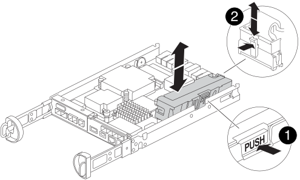
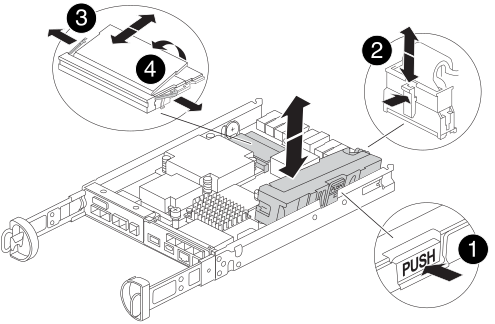

= Sustituya el hardware del módulo del controlador - FAS2820
:allow-uri-read: 
:icons: font
:imagesdir: ../media/

[role="lead"]
Sustituya el hardware del módulo del controlador dañado quitando el controlador dañado, moviendo los componentes FRU al módulo del controlador de reemplazo, instalando el módulo del controlador de reemplazo en el chasis y luego arrancando el módulo del controlador de reemplazo.

.Animación: Sustituya un módulo de controlador
video::c83a3301-3161-4d65-86e8-af540147576a[panopto]

== Paso 1: Retire el módulo de controlador

Retire el módulo del controlador defectuoso del chasis.

. Si usted no está ya conectado a tierra, correctamente tierra usted mismo.
. Afloje el gancho y la correa de bucle que sujetan los cables al dispositivo de administración de cables y, a continuación, desconecte los cables del sistema y los SFP (si fuera necesario) del módulo del controlador, manteniendo un seguimiento del lugar en el que estaban conectados los cables.
+
Deje los cables en el dispositivo de administración de cables de manera que cuando vuelva a instalar el dispositivo de administración de cables, los cables estén organizados.

. Retire y retire los dispositivos de administración de cables de los lados izquierdo y derecho del módulo del controlador.
. Si dejó los módulos SFP en el sistema después de quitar los cables, muévalos al módulo de controladora de reemplazo.
. Apriete el pestillo del mango de la leva hasta que se suelte, abra el mango de la leva completamente para liberar el módulo del controlador del plano medio y, a continuación, tire con dos manos del módulo del controlador para extraerlo del chasis.
+
image::../media/drw_2240_x_opening_cam_latch.svg[pestillo de leva de apertura drw 2240 x]

. Dé la vuelta al módulo del controlador y colóquelo sobre una superficie plana y estable.
. Abra la cubierta pulsando los botones azules de los laterales del módulo del controlador para liberar la cubierta y, a continuación, gire la cubierta hacia arriba y hacia fuera del módulo del controlador.
+
image::../media/drw_2850_open_controller_module_cover_IEOPS-695.svg[Cubierta del módulo de controlador abierto drw 2850 IEOPS 695]

[cols="1,3"]
|===

 a| 
image::../media/icon_round_1.png[Número de llamada 1]
 a| 
Botón de liberación de la cubierta del módulo del controlador

|===

== Paso 2: Mueva la batería de NVMEM

Retire la batería de NVMEM del módulo de controlador dañado e instálela en el módulo de controlador de reemplazo.

NOTE: No enchufe la batería de NVMEM hasta que se lo indique.

[cols="1,3"]
|===

 a| 
image::../media/icon_round_1.png[Número de llamada 1]
 a| 
Botón de liberación de la batería de NVMEM

 a| 
image::../media/icon_round_2.png[Número de llamada 2]
 a| 
Enchufe de la batería de NVMEM

|===
. Extraiga la batería del módulo del controlador:
+
.. Pulse el botón azul del lateral del módulo del controlador.
.. Deslice la batería hacia arriba hasta que se separe de los soportes de sujeción y, a continuación, extraiga la batería del módulo del controlador.
.. Desenchufe el enchufe de la batería apretando el clip de la cara del enchufe de la batería para liberarlo de la toma y, a continuación, desenchufe el cable de la batería de la toma.

. Mueva la batería al módulo de controlador de repuesto e instálelo:
+
.. Alinee la batería con los soportes de sujeción de la pared lateral de chapa metálica.
.. Deslice la batería hacia abajo hasta que el pestillo de la batería se acople y haga clic en la abertura de la pared lateral.
+

NOTE: No enchufe la batería todavía.  Lo conectará una vez que el resto de los componentes se muevan al módulo de controlador de reemplazo.

== Paso 3: Retire la tarjeta mezzanine

Retire la placa de E/S y la tarjeta intermedia PCIe del módulo del controlador defectuoso.

image::../media/drw_2850_replace_HIC_IEOPS-700.svg[drw 2850 Sustituya HIC IEOPS 700]

[cols="1,3"]
|===

 a| 
image::../media/icon_round_1.png[Número de llamada 1]
 a| 
Placa de E/S.

 a| 
image::../media/icon_round_2.png[Número de llamada 2]
 a| 
Tarjeta mezzanine PCIe

|===
. Retire la placa de E/S deslizándola directamente hacia fuera del módulo del controlador.
. Afloje los tornillos de la tarjeta mezzanine.
+

NOTE: Puede aflojar los tornillos con los dedos o con un destornillador.

. Levante la tarjeta mezzanine y colóquela a un lado sobre una superficie antiestática.

== Paso 4: Mueva el soporte de arranque

Retire el soporte de arranque del módulo del controlador defectuoso e instálelo en el módulo del controlador de repuesto.

. Después de extraer la tarjeta intermedia, localice el soporte de arranque mediante la siguiente ilustración o el mapa de FRU en el módulo del controlador:
+
image::../media/drw_2850_replace_boot_media_IEOPS-696.svg[drw 2850 sustituya el soporte de arranque IEOPS 696]

+
[cols="1,3"]
|===

 a| 
image::../media/icon_round_1.png[Número de llamada 1]
 a| 
Botón de liberación del soporte de arranque

|===
. Retire el soporte de arranque:
+
.. Pulse el botón azul de la carcasa del soporte de arranque para liberar el soporte de arranque de su carcasa.
.. Gire el soporte de arranque hacia arriba y, a continuación, tire suavemente de él hacia fuera de la toma de soporte de arranque.
+

NOTE: No gire ni tire del soporte de arranque en línea recta, ya que podría dañar la toma o el soporte de arranque.

. Instale el soporte de arranque en el módulo del controlador de sustitución:
+
.. Alinee los bordes del soporte de arranque de repuesto con el zócalo del soporte de arranque y, a continuación, empújelo suavemente en el zócalo.
.. Compruebe el soporte del maletero para asegurarse de que está asentado completamente en la toma.
+
Si es necesario, extraiga el soporte de arranque y vuelva a colocarlo en la toma.

.. Pulse el botón de bloqueo azul de la carcasa del soporte de arranque, gire el soporte de arranque completamente hacia abajo y, a continuación, suelte el botón de bloqueo para bloquear el soporte de arranque en su lugar.

== Paso 5: Instale la tarjeta mezzanine en el controlador de reemplazo

Instale la tarjeta mezzanine en el módulo del controlador de reemplazo.

. Vuelva a instalar la tarjeta mezzanine:
+
.. Alinee la tarjeta mezzanine con la toma de la placa base.
.. Presione suavemente la tarjeta hacia abajo para colocarla en la toma.
.. Apriete los tres tornillos de apriete manual de la tarjeta mezzanine.

. Vuelva a instalar la placa IO.

== Paso 6: Mueva los DIMM

Retire los módulos DIMM del módulo del controlador defectuoso e instálelos en el módulo del controlador de repuesto.

[cols="1,3"]
|===

 a| 
image::../media/icon_round_1.png[Número de llamada 1]
 a| 
Pestillos de bloqueo DIMM

 a| 
image::../media/icon_round_2.png[Número de llamada 2]
 a| 
DIMM

|===
. Localice los DIMM en el módulo del controlador
+

NOTE: Observe la ubicación del módulo DIMM en los conectores hembra para poder insertar el módulo DIMM en la misma ubicación en el módulo de controlador de sustitución y con la orientación adecuada.

. Retire los módulos DIMM del módulo del controlador defectuoso:
+
.. Extraiga el módulo DIMM de su ranura empujando lentamente las dos lengüetas del expulsor DIMM situadas a cada lado del módulo DIMM.
+
El módulo DIMM girará un poco hacia arriba.

.. Gire el módulo DIMM hasta el tope y, a continuación, deslice el módulo DIMM para extraerlo del socket.
+

NOTE: Sujete con cuidado el módulo DIMM por los bordes para evitar la presión sobre los componentes de la placa de circuitos DIMM.

. Verifique que la batería de NVMEM no esté conectada al módulo de controlador de reemplazo.
. Instale los DIMM en la controladora de reemplazo en el mismo lugar donde se encontraban en la controladora afectada:
+
.. Empuje con cuidado, pero firmemente, en el borde superior del DIMM hasta que las lengüetas expulsoras encajen en su lugar sobre las muescas de los extremos del DIMM.
+
El módulo DIMM encaja firmemente en la ranura, pero debe entrar fácilmente. Si no es así, realinee el DIMM con la ranura y vuelva a insertarlo.

+

NOTE: Inspeccione visualmente el módulo DIMM para comprobar que está alineado de forma uniforme y completamente insertado en la ranura.

. Repita estos pasos para el otro DIMM.

== Paso 7: Mover un módulo de almacenamiento en caché

Retire el módulo de almacenamiento en caché del módulo de controlador defectuoso. Instálelo en el módulo de controlador de sustitución.

image::../media/drw_2850_replace_caching module_IEOPS-697.svg[drw 2850 Sustituya el módulo de caché IEOPS 697]

[cols="1,3"]
|===

 a| 
image::../media/icon_round_1.png[Número de llamada 1]
 a| 
Botón de bloqueo del módulo de almacenamiento en caché

|===
. Localice el módulo de almacenamiento en caché cerca de la parte posterior del módulo del controlador y elimínelo:
+
.. Pulse el botón de bloqueo azul y gire el módulo de almacenamiento en caché hacia arriba.
.. Tire suavemente del módulo de almacenamiento en caché hacia fuera de la carcasa.

. Instale el módulo de almacenamiento en caché en el módulo de controlador de reemplazo:
+
.. Alinee los bordes del módulo de almacenamiento en caché con el zócalo del alojamiento y, a continuación, empújelo suavemente en el zócalo.
.. Compruebe que el módulo de almacenamiento en caché está asentado completamente en el zócalo.
+
Si es necesario, extraiga el módulo de caché y vuelva a colocarlo en el zócalo.

.. Presione el botón de bloqueo azul, gire el módulo de almacenamiento en caché completamente hacia abajo y, a continuación, suelte el botón de bloqueo para bloquear el módulo de almacenamiento en caché en su lugar.

. Conecte la batería de NVMEM.
+
Asegúrese de que el enchufe se bloquea en la toma de corriente de la batería de la placa base.

+

NOTE: Si es difícil enchufar la batería, retire la batería del módulo del controlador, conéctela y vuelva a instalarla en el módulo del controlador.

. Vuelva a instalar la cubierta del módulo del controlador.

== Paso 8: Instale la batería NV

Instale la batería NV en el módulo de controlador de repuesto.

. Vuelva a enchufar la clavija de la batería en la toma del módulo del controlador.
+
Asegúrese de que el enchufe se bloquea en la toma de la batería de la placa base.

. Alinee la batería con los soportes de sujeción de la pared lateral de chapa metálica.
. Deslice la batería hacia abajo hasta que el pestillo de la batería se acople y haga clic en la abertura de la pared lateral.
. Vuelva a instalar la cubierta del módulo del controlador y bloquéela en su lugar.

== Paso 9: Instale el controlador

Instale el módulo del controlador de reemplazo en el chasis del sistema y arranque el ONTAP.

NOTE: El sistema puede actualizar el firmware del sistema cuando arranca. No cancele este proceso. El procedimiento le obliga a interrumpir el proceso de arranque, que normalmente puede hacer en cualquier momento después de que se le solicite que lo haga. Sin embargo, si el sistema actualiza el firmware del sistema cuando arranca, debe esperar hasta que se haya completado la actualización antes de interrumpir el proceso de arranque.

. Si usted no está ya conectado a tierra, correctamente tierra usted mismo.
. Si aún no lo ha hecho, vuelva a colocar la cubierta del módulo del controlador.
. Gire el módulo del controlador.
. Alinee el extremo del módulo del controlador con la abertura del chasis y, a continuación, empuje suavemente el módulo del controlador hasta la mitad del sistema.
+

NOTE: No inserte completamente el módulo de la controladora en el chasis hasta que se le indique hacerlo.

. Complete la reinstalación del módulo del controlador:
+
.. Con la palanca de leva en la posición abierta, empuje firmemente el módulo del controlador hasta que se ajuste al plano medio y esté completamente asentado y, a continuación, cierre la palanca de leva a la posición de bloqueo.
+

NOTE: No ejerza una fuerza excesiva al deslizar el módulo del controlador hacia el chasis para evitar dañar los conectores.

+
La controladora comienza a arrancar tan pronto como se encuentra en el chasis.

.. Si aún no lo ha hecho, vuelva a instalar el dispositivo de administración de cables.
.. Conecte los cables al dispositivo de gestión de cables con la correa de gancho y lazo.
+

NOTE: Debe buscar un mensaje de la consola de actualización automática del firmware. Si aparece el mensaje de actualización, no pulse `Ctrl-C` para interrumpir el proceso de arranque hasta que aparezca un mensaje confirmando que la actualización ha finalizado. Si se cancela la actualización del firmware, el proceso de arranque sale al símbolo del sistema del CARGADOR. Debe ejecutar el `update_flash` y, a continuación, introduzca `bye -g` para reiniciar el sistema.

*Importante:* durante el proceso de inicio, es posible que vea las siguientes indicaciones:

* Una advertencia de aviso de que el ID del sistema no coincide y que solicita que se anule el ID del sistema. Responda `y` a esta petición de datos.
* Una advertencia de que al entrar en modo de mantenimiento en una configuración de alta disponibilidad, debe asegurarse de que la controladora en buen estado permanezca inactiva. Responda `y` a esta petición de datos.

