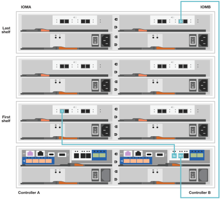

= Pasos detallados - FAS2800
:allow-uri-read: 
:icons: font
:imagesdir: ../media/

[role="lead"]
Esta guía ofrece instrucciones detalladas paso a paso para la instalación de un sistema típico de NetApp. Utilice esta guía si desea instrucciones de instalación más detalladas.

== Paso 1: Preparar la instalación

Para instalar el sistema FAS2800, tiene que crear una cuenta en el sitio de soporte de NetApp, registrar el sistema y obtener las claves de licencia. También es necesario realizar el inventario del número y tipo de cables adecuados para el sistema y recopilar información específica de la red.

Debe tener acceso a https://hwu.netapp.com["Hardware Universe de NetApp"] para obtener información acerca de los requisitos del sitio así como información adicional sobre el sistema configurado. Puede que también desee tener acceso a http://mysupport.netapp.com/documentation/productlibrary/index.html?productID=62286["Notas de la versión de ONTAP 9"] Para su versión de ONTAP para obtener más información sobre este sistema.

Debe proporcionar lo siguiente en el sitio:

* Espacio en rack para el sistema de almacenamiento
* Destornillador Phillips número 2
* Cables de red adicionales para conectar el sistema al conmutador de red y al portátil o a la consola con un navegador Web
* Un portátil o consola con una conexión RJ-45 y acceso a un explorador Web

.Pasos
. Extraiga el contenido de todas las cajas.
. Registre el número de serie del sistema de las controladoras.
+
image::../media/drw_ssn_label.svg[etiqueta ssn drw]

. Configure su cuenta:
+
.. Inicie sesión en su cuenta existente o cree una cuenta.
.. Registre su sistema a través de  https://mysupport.netapp.com/eservice/registerSNoAction.do?moduleName=RegisterMyProduct["Registro de productos de NetApp"]

. Descargue e instale https://mysupport.netapp.com/site/tools/tool-eula/activeiq-configadvisor["Config Advisor"] en el portátil.
. Realice un inventario y anote el número y los tipos de cables recibidos.
+
En la siguiente tabla se identifican los tipos de cables que pueden recibir. Si recibe un cable que no aparece en la tabla, consulte https://hwu.netapp.com["Hardware Universe de NetApp"] para localizar el cable e identificar su uso.

+
[cols="1,2,1,2"]
|===
| Tipo de cable... | Número de pieza y longitud | Tipo de conector | Durante... 

 a| 
10 GbE, cable de SFP28 m (según el pedido)
 a| 
X6566B-05-R6, 5,

X6566B-2-R6, 2m
 a| 
image::../media/oie_cable_sfp_gbe_copper.svg[cable de cobre gbe sfp de la oie]
 a| 
Cable de red

 a| 
Ethernet de 25GB Gb, SFP28 GbE
 a| 
X66240A-05, 5m

X66240-2, 2m

X66240A-5, 5m
 a| 
image::../media/oie_cable_25Gb_Ethernet_SFP28_IEOPS-1069.svg[Cable oie 25GB Ethernet SFP28 IEOPS 1069]
 a| 
Cable de red

 a| 
Canal de fibra de 32GB Gb,
SFP+ (destino/iniciador)
 a| 
X66250-2, 2m

X66250-5, 5m

X66250-15, 15m
 a| 
image::../media/oie_cable_sfp_gbe_copper.svg[cable de cobre gbe sfp de la oie]
 a| 
Red FC

 a| 
Cat 6, RJ-45 (según pedido)
 a| 
X6561-R6

X6562-R6
 a| 
image::../media/oie_cable_rj45.svg[cable rj45 de la oie]
 a| 
Red de gestión y datos Ethernet

 a| 
Reducida
 a| 
X66030A, 0,5m

X66031A, 1m

X66032A, 2m
 a| 
image::../media/oie_cable_mini_sas_hd_to_mini_sas_hd.svg[cable de la oie mini sas hd a mini sas hd]
 a| 
Reducida

 a| 
Cable de consola USB-C.
 a| 
No aplicable
 a| 
image::../media/oie_cable_micro_usb.svg[cable micro usb de la oie]
 a| 
Conexión de consola durante la configuración del software en un portátil/consola que no sea Windows o Mac

 a| 
Cables de alimentación
 a| 
No aplicable
 a| 

 a| 
Encendido del sistema

 a| 
Cable FC opcional
 a| 
Cable FC opcional
 a| 
image::../media/oie_cable_fiber_lc_connector.svg[conector lc de fibra de cable de la oie]
 a| 
Cable de red FC adicional

|===
. Descargue y complete las hojas de trabajo que se encuentran en  https://docs.netapp.com/us-en/ontap/software_setup/concept_set_up_the_cluster.html#cluster-setup-worksheets["Configure el clúster con la CLI de ONTAP"^].

== Paso 2: Instale el hardware

Debe instalar el sistema en un rack de 4 parantes o armario del sistema de NetApp, según corresponda.

.Pasos
. Instale los kits de raíles, según sea necesario.
. Instale y asegure el sistema siguiendo las instrucciones incluidas con el kit de raíl.
+

NOTE: Debe ser consciente de los problemas de seguridad asociados con el peso del sistema.

+
image::../media/oie_fas2800_weight_caution_IEOPS-1070.svg[oie fas2800 PESO PRECAUCIÓN IEOPS 1070]

. Conecte los dispositivos de administración de cables (como se muestra).
+

. Coloque el panel frontal en la parte delantera del sistema.

== Paso 3: Conecte los controladores a la red

Conecte mediante cable las controladoras a la red mediante el método de clúster sin switches de dos nodos o mediante el método de red de interconexión de clúster.

En la siguiente tabla se identifica el tipo de cable con el número de llamada y el color del cable en las ilustraciones para el cableado de red de clústeres sin switch de dos nodos y el cableado de red de clústeres conmutados.

[cols="20%,80%"]
|===
| Cableado | Tipo de conexión 

 a| 
image::../media/oie_legend_icon_1_lg.svg[leyenda de la oie icono 1 lg]
 a| 
Interconexión en clúster

 a| 
image::../media/oie_legend_icon_2_lp.svg[leyenda de la oie icono 2 lp]
 a| 
Switch de red de gestión

 a| 
image::../media/oie_legend_icon_3_o.svg[leyenda de la oie icono 3 o]
 a| 
Switches de red host

|===
[role="tabbed-block"]
====
.Opción 1: Conecte el cable de un clúster sin switch de dos nodos
--
Conecte mediante cable las conexiones de red y los puertos de interconexión de clúster para un clúster sin switches de dos nodos.

.Antes de empezar
Póngase en contacto con el administrador de red para obtener información sobre la conexión del sistema a los switches.

Asegúrese de comprobar que la flecha de la ilustración tenga la orientación correcta de la lengüeta de extracción del conector del cable.

image::../media/oie_cable_pull_tab_down.svg[lengüeta del cable de la oie hacia abajo]

NOTE: Al insertar el conector, debe sentir que encaja en su sitio; si no siente que hace clic, quítelo, gire el cabezal del cable y vuelva a intentarlo.

NOTE: Si se conecta a un switch óptico, inserte el SFP en el puerto de la controladora antes de establecer el cableado al puerto.

.Acerca de esta tarea
Puede utilizar el gráfico o las instrucciones paso a paso para completar el cableado entre las controladoras y los switches.

.Animación: Cableado de clústeres sin switches de dos nodos
video::90577508-fa79-46cf-b18a-afe8016325af[panopto]
.Pasos
. Conecte mediante cable los puertos de interconexión del clúster e0a a e0a y e0b a e0b con el cable de interconexión del clúster:
+
image::../media/oie_cable_25Gb_Ethernet_SFP28_IEOPS-1069.svg[Cable oie 25GB Ethernet SFP28 IEOPS 1069]

+
* Cables de interconexión de clúster*

+
image::../media/drw_2800_tnsc_cluster_cabling_IEOPS-892.svg[Cableado de cluster tnsc drw 2800 IEOPS 892]

. Conecte los puertos e0M a los switches de red de gestión mediante los cables RJ45:
+
image::../media/oie_cable_rj45.svg[cable rj45 de la oie]

+
*RJ45 cables*

+
image::../media/drw_2800_management_connection_IEOPS-1077.svg[Conexión de gestión drw 2800 IEOPS 1077]

. Conecte los puertos de la tarjeta mezzanine a la red host.
+
image::../media/drw_2800_network_cabling_IEOPS-894.svg[Cableado de red drw 2800 IEOPS 894]

+
.. Si tiene una red de datos Ethernet de 4 puertos, conecte los puertos e1a a e1d a la red de datos Ethernet.
+
*** 4 puertos, Ethernet 10/25GB, SFP28
+
image::../media/oie_cable_sfp_gbe_copper.svg[cable de cobre gbe sfp de la oie]

+
image::../media/oie_cable_25Gb_Ethernet_SFP28_IEOPS-1069.svg[Cable oie 25GB Ethernet SFP28 IEOPS 1069]

*** 4 PUERTOS, 10GBASE-T, RJ45
+
image::../media/oie_cable_rj45.svg[cable rj45 de la oie]

.. Si tiene una red de datos Fibre Channel de 4 puertos, conecte los puertos de 1a a 1d para la red FC.
+
*** 4 puertos, Fibre Channel de 32GB Gb, SFP+ (solo destino)
+
image::../media/oie_cable_sfp_gbe_copper.svg[cable de cobre gbe sfp de la oie]

*** 4 puertos, Fibre Channel 32GB Gb, SFP+ (iniciador/destino)
+
image::../media/oie_cable_sfp_gbe_copper.svg[cable de cobre gbe sfp de la oie]

.. Si tiene una tarjeta 2+2 (2 puertos con conexiones Ethernet y 2 puertos con conexiones Fibre Channel), los puertos de cable e1a y e1b a la red de datos FC y los puertos e1c y e1d a la red de datos Ethernet.
+
*** 2 puertos, Ethernet de 10/25GB (SFP28) + FC de 32GB Gb con 2 puertos (SFP+)
+
image::../media/oie_cable_sfp_gbe_copper.svg[cable de cobre gbe sfp de la oie]

+
image::../media/oie_cable_sfp_gbe_copper.svg[cable de cobre gbe sfp de la oie]

IMPORTANT: NO enchufe los cables de alimentación.

--
.Opción 2: Conectar un clúster de switches
--
Conecte mediante cable las conexiones de red y los puertos de interconexión de clúster para un clúster conmutado.

NOTE: Debe haberse puesto en contacto con el administrador de red para obtener información sobre la conexión del sistema a los switches.

Asegúrese de comprobar que la flecha de la ilustración tenga la orientación correcta de la lengüeta de extracción del conector del cable.

image::../media/oie_cable_pull_tab_down.svg[lengüeta del cable de la oie hacia abajo]

NOTE: Al insertar el conector, debe sentir que encaja en su lugar; si no siente que hace clic, quítelo, gire el cabezal del cable y vuelva a intentarlo.

.Acerca de esta tarea
Puede utilizar el gráfico o las instrucciones paso a paso para completar el cableado entre las controladoras y los switches.

.Animación: Cableado de clúster conmutado
video::6553a3db-57dd-4247-b34a-afe8016315d4[panopto]
.Pasos
. Conecte mediante cable los puertos de interconexión del clúster e0a a e0a y e0b a e0b con el cable de interconexión del clúster:
+
image::../media/oie_cable_25Gb_Ethernet_SFP28_IEOPS-1069.svg[Cable oie 25GB Ethernet SFP28 IEOPS 1069]

+
image::../media/drw_2800_tnsc_cluster_cabling_IEOPS-892.svg[Cableado de cluster tnsc drw 2800 IEOPS 892]

. Conecte los puertos e0M a los switches de red de gestión mediante los cables RJ45:
+
image::../media/oie_cable_rj45.svg[cable rj45 de la oie]

+
image::../media/drw_2800_management_connection_IEOPS-1077.svg[Conexión de gestión drw 2800 IEOPS 1077]

. Conecte los puertos de la tarjeta mezzanine a la red host.
+
image::../media/drw_2800_network_cabling_IEOPS-894.svg[Cableado de red drw 2800 IEOPS 894]

+
.. Si tiene una red de datos Ethernet de 4 puertos, conecte los puertos e1a a e1d a la red de datos Ethernet.
+
*** 4 puertos, Ethernet 10/25GB, SFP28
+
image::../media/oie_cable_sfp_gbe_copper.svg[cable de cobre gbe sfp de la oie]

+
image::../media/oie_cable_25Gb_Ethernet_SFP28_IEOPS-1069.svg[Cable oie 25GB Ethernet SFP28 IEOPS 1069]

*** 4 PUERTOS, 10GBASE-T, RJ45
+
image::../media/oie_cable_rj45.svg[cable rj45 de la oie]

.. Si tiene una red de datos Fibre Channel de 4 puertos, conecte los puertos de 1a a 1d para la red FC.
+
*** 4 puertos, Fibre Channel de 32GB Gb, SFP+ (solo destino)
+
image::../media/oie_cable_sfp_gbe_copper.svg[cable de cobre gbe sfp de la oie]

*** 4 puertos, Fibre Channel 32GB Gb, SFP+ (iniciador/destino)
+
image::../media/oie_cable_sfp_gbe_copper.svg[cable de cobre gbe sfp de la oie]

.. Si tiene una tarjeta 2+2 (2 puertos con conexiones Ethernet y 2 puertos con conexiones Fibre Channel), los puertos de cable e1a y e1b a la red de datos FC y los puertos e1c y e1d a la red de datos Ethernet.
+
*** 2 puertos, Ethernet de 10/25GB (SFP28) + FC de 32GB Gb con 2 puertos (SFP+)
+
image::../media/oie_cable_sfp_gbe_copper.svg[cable de cobre gbe sfp de la oie]

+
image::../media/oie_cable_sfp_gbe_copper.svg[cable de cobre gbe sfp de la oie]

IMPORTANT: NO enchufe los cables de alimentación.

--
====

== Paso 4: Conecte las controladoras a las bandejas de unidades

Conecte los cables de los controladores al almacenamiento externo.

NOTE: En el ejemplo se utiliza DS224C. El cableado es similar con otras bandejas de unidades compatibles.

Asegúrese de comprobar que la flecha de la ilustración tenga la orientación correcta de la lengüeta de extracción del conector del cable.

image::../media/oie_cable_pull_tab_down.svg[lengüeta del cable de la oie hacia abajo]

.Acerca de esta tarea
Se pueden utilizar el gráfico o las instrucciones paso a paso para completar el cableado entre las controladoras y las bandejas de unidades.

.Animación: Cableado de la bandeja de unidades
video::b2a7549d-8141-47dc-9e20-afe8016f4386[panopto]

NOTE: No utilice el puerto 0b2 en un FAS2800. Este puerto SAS no es utilizado por ONTAP y siempre está deshabilitado. Consulte https://docs.netapp.com/us-en/ontap-systems/sas3/install-new-system.html["Instale una bandeja en un sistema de almacenamiento nuevo"^] si quiere más información.

En la siguiente tabla se identifica el tipo de cable con el número de llamada y el color del cable en las ilustraciones para el cableado de red de clústeres sin switch de dos nodos y el cableado de red de clústeres conmutados.

[cols="20%,80%"]
|===
| Cableado | Tipo de conexión 

 a| 
image::../media/oie_legend_icon_1_lo.svg[icono de leyenda de la oie 1 lo]
 a| 
Interconexión en clúster

 a| 
image::../media/oie_legend_icon_2_mb.svg[icono de leyenda de la oie 2 mb]
 a| 
Switch de red de gestión

 a| 
image::../media/oie_legend_icon_3_t.svg[icono de leyenda de la oie 3 t]
 a| 
Switches de red host

|===
.Pasos
. Cablee los puertos de la bandeja a bandeja.
+
.. El puerto 1 de IOM A al puerto 3 del IOM A en la bandeja directamente debajo.
.. El puerto 1 de IOM B al puerto 3 del IOM B de la bandeja directamente debajo.
+
image::../media/oie_cable_mini_sas_hd_to_mini_sas_hd.svg[cable de la oie mini sas hd a mini sas hd]

+
* MINI-SAS HD a mini-SAS HD cables *

+
image::../media/drw_2800_shelf-to-shelf_cabling_IEOPS-895.svg[Cableado de bandeja a bandeja drw 2800 IEOPS 895]

. Conecte el cable de la controladora A a las bandejas de unidades.
+
.. Controladora A del puerto 0A al puerto IOM B 1 en la primera bandeja de unidades de la pila.
.. Controladora A puerto 0b1 a IOM A puerto 3 en la última bandeja de unidades de la pila.
+
image::../media/oie_cable_mini_sas_hd_to_mini_sas_hd.svg[cable de la oie mini sas hd a mini sas hd]

+
* MINI-SAS HD a mini-SAS HD cables *

+
image::../media/dwr-2800_controller1-to shelves_IEOPS-896.svg[dwr 2800 controller1 a las bandejas IEOPS 896]

. Conecte la controladora B a las bandejas de unidades.
+
.. De la controladora B, el puerto 0A al IOM A 1 en la primera bandeja de unidades de la pila.
.. Controladora B puerto 0b1 a puerto IOM B 3 en la última bandeja de unidades de la pila.
+
image::../media/oie_cable_mini_sas_hd_to_mini_sas_hd.svg[cable de la oie mini sas hd a mini sas hd]

+
* MINI-SAS HD a mini-SAS HD cables *

+

== Paso 5: Pasos completos para la instalación y la configuración del sistema

Puede completar la instalación y configuración del sistema mediante la detección de clústeres mediante una sola conexión al switch y el portátil, o bien conectarse directamente a una controladora del sistema y luego conectarse al switch de gestión.

[role="tabbed-block"]
====
.Opción 1: Si la detección de red está activada
--
Si la detección de red está activada en el portátil, complete la configuración y configuración del sistema mediante la detección automática de clústeres.

.Pasos
. Use la animación siguiente para establecer uno o varios ID de bandeja de unidades
+
.Animación: Configure los identificadores de las bandejas de unidades
video::c600f366-4d30-481a-89d9-ab1b0066589b[panopto]
. Enchufe los cables de alimentación a las fuentes de alimentación de la controladora y luego conéctelos a fuentes de alimentación de diferentes circuitos.
. Encienda los switches de alimentación en ambos nodos.
+
image::../media/dwr_2800_turn_on_power_IEOPS-898.svg[dwr 2800 Encienda el IEOPS 898 de alimentación]

+

NOTE: El arranque inicial puede tardar hasta ocho minutos.

. Asegúrese de que el ordenador portátil tiene activado el descubrimiento de red.
+
Consulte la ayuda en línea de su portátil para obtener más información.

. Utilice la siguiente animación para conectar el portátil al conmutador de administración.
+
.Animación: Conecte el portátil al conmutador de administración
video::d61f983e-f911-4b76-8b3a-ab1b0066909b[panopto]
. Seleccione un icono de ONTAP que aparece para detectar:
+
image::../media/drw_autodiscovery_controler_select.svg[selección del controlador de detección automática drw]

+
.. Abra el Explorador de archivos.
.. Haga clic en red en el panel izquierdo.
.. Haga clic con el botón derecho del ratón y seleccione Actualizar.
.. Haga doble clic en el icono de ONTAP y acepte los certificados que aparecen en la pantalla.
+

NOTE: XXXXX es el número de serie del sistema para el nodo de destino.

+
Se abrirá System Manager.

. Utilice la configuración guiada de System Manager para configurar el sistema con los datos recogidos en el https://library.netapp.com/ecm/ecm_download_file/ECMLP2862613["Guía de configuración de ONTAP"]
. Compruebe el estado del sistema ejecutando Config Advisor.
. Después de completar la configuración inicial, vaya a la https://www.netapp.com/data-management/oncommand-system-documentation/["Recursos de documentación de ONTAP  ONTAP System Manager"] Página para obtener información sobre cómo configurar las funciones adicionales en ONTAP.

--
.Opción 2: Si la detección de red no está activada
--
Si la detección de red no está activada en el portátil, complete manualmente la configuración y la configuración.

.Pasos
. Conecte y configure el portátil o la consola:
+
.. Ajuste el puerto de la consola del portátil o de la consola en 115,200 baudios con N-8-1.
+

NOTE: Consulte la ayuda en línea del portátil o de la consola para saber cómo configurar el puerto de la consola.

.. Conecte el cable de la consola al portátil o a la consola, y conecte el puerto de la consola del controlador mediante el cable de la consola incluido con el sistema y, a continuación, conecte el portátil o la consola al switch de la subred de administración.
+
image::../media/drw_2800_laptop_to_switch_to_controller_IEOPS-1084.svg[Portátil drw 2800 para cambiar al controlador IEOPS 1084]

.. Asigne una dirección TCP/IP al portátil o consola, utilizando una que esté en la subred de gestión.

. Utilice la animación siguiente para establecer uno o varios ID de bandeja de unidades:
+
.Animación: Configure los identificadores de las bandejas de unidades
video::c600f366-4d30-481a-89d9-ab1b0066589b[panopto]
. Enchufe los cables de alimentación a las fuentes de alimentación de la controladora y luego conéctelos a fuentes de alimentación de diferentes circuitos.
. Encienda los switches de alimentación en ambos nodos.
+
image::../media/dwr_2800_turn_on_power_IEOPS-898.svg[dwr 2800 Encienda el IEOPS 898 de alimentación]

NOTE: El arranque inicial puede tardar hasta ocho minutos.

. Asigne una dirección IP de gestión de nodos inicial a uno de los nodos.
+
[cols="20%,80%"]
|===
| Si la red de gestión tiene DHCP... | Realice lo siguiente... 

 a| 
Configurado
 a| 
Registre la dirección IP asignada a las nuevas controladoras.

 a| 
No configurado
 a| 
.. Abra una sesión de consola mediante PuTTY, un servidor terminal o el equivalente para su entorno.
+

NOTE: Si no sabe cómo configurar PuTTY, compruebe la ayuda en línea del ordenador portátil o de la consola.

.. Introduzca la dirección IP de administración cuando se lo solicite el script.

|===
. Mediante System Manager en el portátil o la consola, configure su clúster:
+
.. Dirija su navegador a la dirección IP de gestión de nodos.
+

NOTE: El formato de la dirección es https://x.x.x.x[].

.. Configure el sistema con los datos recogidos en el https://library.netapp.com/ecm/ecm_download_file/ECMLP2862613["Guía de configuración de ONTAP"].

. Compruebe el estado del sistema ejecutando Config Advisor.
. Cuando haya completado la configuración inicial, vaya a.  https://www.netapp.com/data-management/oncommand-system-documentation/["Recursos de documentación de ONTAP  ONTAP System Manager"] Para obtener información sobre cómo configurar funciones adicionales en ONTAP.

--
====