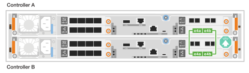
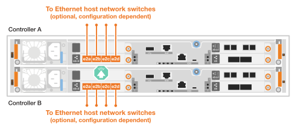

= Conecte el cable de la tornillería - FAS50
:allow-uri-read: 
:icons: font
:imagesdir: ../media/

[role="lead"]
Después de instalar el hardware del sistema de almacenamiento FAS50, conecte los cables de las controladoras a la red y a las bandejas.

.Antes de empezar
Póngase en contacto con el administrador de red para obtener información sobre cómo conectar el sistema de almacenamiento a los switches de red.

.Acerca de esta tarea
* Los procedimientos de cableado de red clúster/alta disponibilidad y host muestran configuraciones comunes. Tenga en cuenta que el cableado específico depende de los componentes solicitados para su sistema de almacenamiento. Para obtener información completa sobre la configuración y la prioridad de las ranuras, consulte link:https://hwu.netapp.com["Hardware Universe de NetApp"^].
* Los gráficos de cableado tienen iconos de flecha que muestran la orientación correcta (hacia arriba o hacia abajo) de la lengüeta extraíble del conector de cable al insertar un conector en un puerto.
+
Al insertar el conector, debería sentir que hace clic en su lugar; si no cree que hace clic, quítelo, vuelva a convertirlo y vuelva a intentarlo.

+
image:../media/drw_cable_pull_tab_direction_ieops-1699.svg["Dirección de la lengüeta de tracción del cable"]

* Si el cableado va a un conmutador óptico, inserte el transceptor óptico en el puerto del controlador antes de realizar el cableado en el puerto del switch.

== Paso 1: Conecte los cables de las conexiones del clúster/alta disponibilidad

Conecte los cables de las controladoras para crear las conexiones del clúster ONTAP.

[role="tabbed-block"]
====
.Cableado de clúster sin switches
--
.FAS50 con un módulo I/O de 40/100 GbE con 2 puertos
[%collapsible]
=====
.Pasos
. Conectar las conexiones de interconexión de clúster/alta disponibilidad:
+

NOTE: El tráfico de interconexión del clúster y el tráfico de alta disponibilidad comparten los mismos puertos físicos (en el módulo de I/O de la ranura 4). Los puertos son 40/100 GbE.

+
.. Conecte el cable del controlador A del puerto E4A al puerto E4A de la controladora B.
.. Conecte el cable del controlador A del puerto e4b al puerto e4b de la controladora B.
+
*100 GbE Cluster/cables de interconexión HA*

+
image::../media/oie_cable100_gbe_qsfp28.png[Cable de alta disponibilidad de 100 GbE del clúster]

+

=====
--
.Cableado de clúster conmutado
--
.FAS50 con un módulo I/O de 40/100 GbE con 2 puertos
[%collapsible]
=====
. Conecte los cables de las controladoras a los switches de red de clúster:
+

NOTE: El tráfico de interconexión del clúster y el tráfico de alta disponibilidad comparten los mismos puertos físicos (en el módulo de I/O de la ranura 4). Los puertos son 40/100 GbE.

+
.. Conecte el cable De la controladora A al puerto E4A al switch de red de clúster A.
.. Conecte el cable de la controladora A al puerto e4b al switch de red de clúster B.
.. Conecte el cable del puerto B E4A al switch de red de clúster A.
.. Conecte el cable del controlador B del puerto e4b al switch de red de clúster B.
+
*40/100 GbE Cluster/cables de interconexión HA*

+
image::../media/oie_cable100_gbe_qsfp28.png[Cable de alta disponibilidad de 40/100 GbE del clúster]

+
image:../media/drw_isi_fas50_2p_100gbe_switched_cluster_cabling_ieops-1936.svg["fas50 diagrama de cableado de clúster conmutado con un módulo de 100gbe io"]

=====
--
====

== Paso 2: Conecte los cables de las conexiones de red host

Conecte las controladoras a la red host Ethernet o FC.

[role="tabbed-block"]
====
.Cableado del host Ethernet
--
.FAS50 con un módulo I/O de 10/25 GbE con 4 puertos
[%collapsible]
=====
.Pasos
. En cada controladora, conecte los puertos E2A, E2B, E2C y e2d a los switches de red host Ethernet.
+
* Cables de 10/25 GbE*

+
image:../media/oie_cable_sfp_gbe_copper.png["Conector de cobre SFP GbE, width=100px"]

+

=====
--
.Cableado del host FC
--
.FAS50 con un módulo de I/O FC de 4 puertos de 64 Gb/s.
[%collapsible]
=====
.Pasos
. En cada controladora, conecte los puertos 1a, 1b, 1c y 1d a los switches de red host FC.
+
*64 Gb/s cables FC*

+
image:../media/oie_cable_sfp_gbe_copper.png["Cable fc de 64 GB, ancho = 100px cm"]

+
image::../media/drw_isi_fas50_4p_64gb_fc_optional_cabling_ieops-1935.svg[Cable a switches de red host de 64GB fc]

=====
--
====

== Paso 3: Conecte los cables de las conexiones de red de gestión

Conecte las controladoras a la red de gestión.

. Conecte los puertos de gestión (llave inglesa) de cada controladora a los switches de red de gestión.
+
* 1000BASE-T CABLES RJ-45*

+
image::../media/oie_cable_rj45.png[Cables RJ-45]

+
image::../media/drw_isi_fas50_wrench_cabling_ieops-1938.svg[Conéctese a su red de gestión]

IMPORTANT: No enchufe los cables de alimentación todavía.

== Paso 4: Conecte los cables de las conexiones de la bandeja

Los siguientes procedimientos muestran cómo cablear las controladoras a una o dos bandejas DS460C.

.Acerca de esta tarea
* Los ejemplos de cableado muestran bandejas DS460C; sin embargo, se admiten bandejas SAS adicionales, consulte link:https://hwu.netapp.com["Hardware Universe de NetApp"^].
+
El cableado de otras bandejas SAS compatibles es similar. Consulte link:../sas3/install-new-system.html["Instale y conecte los estantes de cables para una nueva instalación del sistema"^]. También puede consultar link:../sas3/overview-cabling-rules-examples.html["Guías de cableado SAS, hojas de trabajo y ejemplos de descripción general"^].

* Para obtener el número máximo de bandejas compatibles con el sistema de almacenamiento y todas las opciones de cableado, como ópticas y conectadas por switch, consulte link:https://hwu.netapp.com["Hardware Universe de NetApp"^].
* El gráfico muestra el cableado de la controladora A en azul y el cableado de la controladora B en amarillo.
* Utilice los cables de almacenamiento incluidos con el sistema de almacenamiento, que pueden ser el siguiente tipo de cable:
+
* Cable mini-SAS HD*

+
image::../media/oie_cable_mini_sas_hd_to_mini_sas_hd.svg[Cable HD Mini-SAS]

[role="tabbed-block"]
====
.Opción 1: Una bandeja DS460C
--
Conecte mediante cable cada controladora a cada módulo de IOM12 de la bandeja DS460C.

.Pasos
. Conecte la controladora A a la bandeja:
+
.. Conecte el cable del controlador A del puerto 3a al puerto IOMA 1.
.. Cable del controlador del puerto A 3D al puerto IOMB 3.
+
image:../media/drw_isi_fas50_1_ds460c_controller_a_cabling_ieops-2167.svg["La controladora A dispone de los puertos 3a y 3D cableados a una bandeja DS460C"]

. Conecte la controladora B a la bandeja:
+
.. Conecte el cable del puerto B del controlador 3a al puerto IOMB 1.
.. Conecte el cable del puerto B del controlador 3D al puerto IOMA 3.
+
image:../media/drw_isi_fas50_1_ds460c_controller_b_cabling_ieops-2169.svg["Controladora B con los puertos 3a y 3D cableados a una bandeja DS460C"]

--
.Opción 2: Dos bandejas DS460C
--
Conecte cada controladora a los módulos IOM12 en ambas bandejas DS460C.

. Conecte el cable de las conexiones de bandeja a bandeja:
+
.. Bandeja de cables 1 Puerto IOMA 3 a Bandeja 2 Puerto IOMA 1.
.. Bandeja de cables 1 Puerto IOMB 3 a Bandeja 2 Puerto IOMB 1.
+
image:../media/drw_isi_fas50_2_ds460c_shelf_to_shelf_ieops-2172.svg["conecte el cable entre la bandeja y la bandeja"]

. Conecte la controladora A a las bandejas:
+
.. Conecte por cable el puerto A 3a a el puerto IOMA 1 de la bandeja 1.
.. Conecte el cable del controlador A del puerto 3D al puerto 3 de IOMB de la bandeja 2.
+
image:../media/drw_isi_fas50_2_ds460c_controller_a_cabling_ieops-2170.svg["De la controladora A, los puertos 3a y 3D, cableados a dos bandejas DS460C"]

. Conecte la controladora B a las bandejas:
+
.. Conecte el cable del controlador B del puerto 3a al puerto 1 de IOMB de la bandeja 1.
.. Conecte el cable del controlador B, puerto 3D a la bandeja 2, puerto IOMA 3.
+
image:../media/drw_isi_fas50_2_ds460c_controller_b_cabling_ieops-2171.svg["Los puertos 3a y 3D de la controladora B cableados a dos bandejas DS460C"]

--
====
.El futuro
Después de cablear el hardware del sistema de almacenamiento,link:install-power-hardware.html["encienda el sistema de almacenamiento"]
