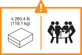

= Revisa los requisitos para instalar tu sistema de almacenamiento FAS50
:allow-uri-read: 
:icons: font
:imagesdir: ../media/

[role="lead"]
Revise los requisitos del sistema de almacenamiento FAS50.

[[equipment-needed-for-install]]
== Equipo necesario para la instalación

Para instalar el sistema de almacenamiento, necesita los siguientes equipos y herramientas.

* Acceso a un explorador web para configurar el sistema de almacenamiento
* Correa de descarga electrostática (ESD)
* Linterna
* Portátil o consola con conexión USB/serie
* Destornillador Phillips número 2

[[lifting-precautions]]
== Precauciones de elevación

Los sistemas de almacenamiento y las bandejas son pesados. Tenga cuidado al levantar y mover estos elementos.

[[storage-system-weight]]
=== Peso del sistema de almacenamiento

Tome las precauciones necesarias al mover o levantar su sistema de almacenamiento.

El sistema de almacenamiento puede pesar hasta 24,4 kg (53,8 lb). Para levantar el sistema de almacenamiento, se necesitan dos personas o un elevador hidráulico.

image::../media/drw_g_lifting_weight_ieops-1831.svg[FAS50 icono de advertencia de peso]

[[shelf-weight]]
=== Peso del estante

Tome las precauciones necesarias al mover o levantar su estante.

Un estante DS460C puede pesar hasta 260,4 libras (118,1 kg). Para levantar el estante, podrías necesitar hasta cinco personas o un elevador hidráulico. Mantén todos los componentes en el estante (tanto en la parte delantera como en la trasera) para evitar que el peso del estante quede desequilibrado.

.Información relacionada
* https://library.netapp.com/ecm/ecm_download_file/ECMP12475945["Información sobre seguridad y avisos normativos"^]

.El futuro
Después de haber revisado los requisitos de instalación y las consideraciones de su sistema de almacenamiento,link:install-prepare.html["prepare la instalación"]
