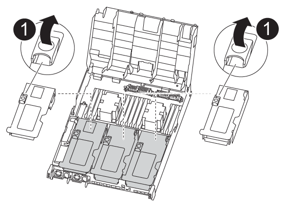

= Sustituya el hardware del módulo de la controladora - FAS8300 y FAS8700
:allow-uri-read: 
:icons: font
:imagesdir: ../media/

[role="lead"]
Para sustituir el hardware del módulo de la controladora, debe retirar la controladora dañada, mover los componentes de FRU al módulo de la controladora de reemplazo, instalar el módulo de la controladora de reemplazo en el chasis y, a continuación, arrancar el sistema en modo de mantenimiento.

== Paso 1: Extraiga el módulo del controlador

Para acceder a los componentes internos del módulo de controlador, debe extraer el módulo de controlador del chasis.

Puede utilizar la animación, la ilustración o los pasos escritos siguientes para quitar el módulo del controlador del chasis.

.Animación: Extraiga el módulo del controlador
video::75b6fa91-96b9-4323-b156-aae10007c9a5[panopto]
. Si usted no está ya conectado a tierra, correctamente tierra usted mismo.
. Suelte los retenes del cable de alimentación y, a continuación, desenchufe los cables de las fuentes de alimentación.
. Afloje el gancho y la correa de bucle que sujetan los cables al dispositivo de administración de cables y, a continuación, desconecte los cables del sistema y los SFP (si fuera necesario) del módulo del controlador, manteniendo un seguimiento del lugar en el que estaban conectados los cables.
+
Deje los cables en el dispositivo de administración de cables de manera que cuando vuelva a instalar el dispositivo de administración de cables, los cables estén organizados.

. Retire el dispositivo de administración de cables del módulo del controlador y colóquelo aparte.
. Presione los dos pestillos de bloqueo hacia abajo y, a continuación, gire ambos pestillos hacia abajo al mismo tiempo.
+
image::../media/drw_A400_Remove_controller.png[drw A400 retire el controlador]

+
El módulo de la controladora se mueve ligeramente fuera del chasis.

. Deslice el módulo de la controladora para sacarlo del chasis.
+
Asegúrese de que admite la parte inferior del módulo de la controladora cuando la deslice para sacarlo del chasis.

. Coloque el módulo del controlador sobre una superficie plana y estable.
. En el módulo del controlador de sustitución, abra el conducto de aire y retire los elevadores vacíos del módulo del controlador mediante la animación, la ilustración o los pasos escritos:
+
https://netapp.hosted.panopto.com/Panopto/Pages/Viewer.aspx?id=49053752-e813-4c15-a917-ab190147fa6e["Extracción de los elevadores vacíos del módulo del controlador de recambio"]

. Presione las lengüetas de bloqueo de los lados del conducto de aire hacia el centro del módulo del controlador.
. Deslice el conducto de aire hacia la parte posterior del módulo del controlador y gírelo hacia arriba hasta su posición completamente abierta.
. Gire el pestillo de bloqueo del elevador en el lado izquierdo del elevador 1 hacia arriba y hacia el conducto de aire, levante el elevador y colóquelo a un lado.
. Repita el paso anterior para los elevadores restantes.

== Paso 2: Mueva las fuentes de alimentación

Debe mover la fuente de alimentación del módulo del controlador dañado al módulo del controlador de repuesto cuando sustituya un módulo del controlador.

Puede utilizar la animación, ilustración o los pasos escritos siguientes para mover las fuentes de alimentación al módulo de controlador de reemplazo.

.Animación: Mueva las fuentes de alimentación
video::92060115-1967-475b-b517-aad9012f130c[panopto]
image::../media/drw_A400_psu.png[fuente de alimentación drw A400]

. Retire la fuente de alimentación:
+
.. Gire el asa de la leva para que pueda utilizarse para extraer la fuente de alimentación del chasis.
.. Pulse la lengüeta de bloqueo azul para liberar la fuente de alimentación del chasis.
.. Con ambas manos, extraiga la fuente de alimentación del chasis y, a continuación, déjela a un lado.

. Mueva la fuente de alimentación al nuevo módulo de controlador y, a continuación, instálela.
. Con ambas manos, sujete y alinee los bordes de la fuente de alimentación con la abertura del módulo del controlador y, a continuación, empuje suavemente la fuente de alimentación en el módulo del controlador hasta que la lengüeta de bloqueo encaje en su sitio.
+
Las fuentes de alimentación sólo se acoplarán correctamente al conector interno y se bloquearán de una manera.

+

NOTE: Para evitar dañar el conector interno, no ejerza demasiada fuerza al deslizar la fuente de alimentación hacia el sistema.

. Repita los pasos anteriores con todos los suministros de alimentación restantes.

== Paso 3: Mueva la batería NVDIMM

Para mover la batería NVDIMM del módulo de controlador dañado al módulo de controlador de repuesto, debe realizar una secuencia específica de pasos.

Puede utilizar la animación, ilustración o los pasos escritos siguientes para mover la batería NVDIMM del módulo de controlador dañado al módulo de controlador de reemplazo.

.Animación: Mueva la batería NVDIMM
video::94d115b2-b02a-4234-805c-aad9012f204c[panopto]
. Abra el conducto de aire:
+
.. Presione las lengüetas de bloqueo de los lados del conducto de aire hacia el centro del módulo del controlador.
.. Deslice el conducto de aire hacia la parte posterior del módulo del controlador y gírelo hacia arriba hasta su posición completamente abierta.

. Localice la batería NVDIMM en el módulo de la controladora.

image::../media/drw_A400_nvdimm-batt.png[drw A400 nvdimm batt]

. Localice el enchufe de la batería y apriete el clip en la parte frontal del enchufe de la batería para liberar el enchufe de la toma y, a continuación, desenchufe el cable de la batería de la toma.
. Sujete la batería, presione LA lengüeta de bloqueo azul marcada Y, a continuación, levante la batería para sacarla del soporte y del módulo del controlador.
. Mueva la batería al módulo del controlador de repuesto.
. Alinee el módulo de la batería con la abertura de la batería y, a continuación, empuje suavemente la batería hasta que encaje en su sitio.
+

NOTE: No vuelva a enchufar el cable de la batería a la placa base hasta que se le indique hacerlo.

== Paso 4: Mueva el soporte de arranque

Debe localizar el soporte de arranque y, a continuación, seguir las instrucciones para retirarlo del módulo de controlador dañado e insertarlo en el módulo de controlador de sustitución.

Puede utilizar la animación, ilustración o los pasos escritos siguientes para mover el soporte de arranque desde el módulo del controlador dañado al módulo del controlador de reemplazo.

.Animación: Mueve el soporte de arranque
video::2a14099c-85de-4a84-867c-aad9012efac8[panopto]
image::../media/drw_A400_Replace-boot_media.png[drw A400 reemplace el soporte de arranque]

. Localice y retire el soporte de arranque del módulo de la controladora:
+
.. Pulse el botón azul al final del soporte de arranque hasta que el labio del soporte de arranque desaparezca el botón azul.
.. Gire el soporte del maletero hacia arriba y tire con cuidado del soporte del maletero para sacarlo del zócalo.

. Mueva el soporte del maletero al nuevo módulo del controlador, alinee los bordes del soporte del maletero con el alojamiento del zócalo y, a continuación, empújelo suavemente en el zócalo.
. Compruebe el soporte del maletero para asegurarse de que está asentado completamente en la toma.
+
Si es necesario, extraiga el soporte de arranque y vuelva a colocarlo en la toma.

. Bloquee el soporte de arranque en su sitio:
+
.. Gire el soporte de arranque hacia abajo hacia la placa base.
.. Pulse el botón de bloqueo azul para que esté en la posición abierta.
.. Coloque los dedos en el extremo del soporte del maletero mediante el botón azul, presione firmemente el extremo del soporte del maletero para activar el botón de bloqueo azul.

== Paso 5: Mover los elevadores PCIe y la tarjeta mezzanine

Como parte del proceso de sustitución de la controladora, debe mover los elevadores PCIe y la tarjeta mezzanine del módulo de controladora dañado al módulo de controladora de reemplazo.

Puede utilizar las animaciones e ilustraciones siguientes. O los pasos escritos para mover los elevadores PCIe y la tarjeta intermedia del módulo de la controladora dañada al módulo de la controladora de reemplazo.

Movimiento de la tarjeta vertical PCIe 1 y 2 (elevadores izquierdo y medio):

.Animación - mover elevadores PCI 1 y 2
video::f4ee1d4d-6029-4fe6-a063-aad9012f170b[panopto]
image::../media/drw_A400_Replace-PCIe-cards.png[drw A400 sustituya las tarjetas PCIe]

Desplazamiento de la tarjeta mezzanine y la tarjeta vertical 3 (tarjeta vertical derecha):

.Animación: Mover la tarjeta mezzanine y la tarjeta vertical 3
video::b0c3b575-3434-4e00-a421-aad9012f2e9e[panopto]
image::../media/drw_A400_Replace-mezz-card.png[drw A400 reemplace la tarjeta mezz]

. Mueva los elevadores PCIe uno y dos del módulo del controlador dañado al módulo del controlador de sustitución:
+
.. Quite todos los módulos SFP o QSFP que puedan estar en las tarjetas PCIe.
.. Gire el pestillo de bloqueo del elevador en el lado izquierdo del elevador hacia arriba y hacia el conducto de aire.
+
La tarjeta vertical se eleva ligeramente del módulo del controlador.

.. Levante la tarjeta vertical y, a continuación, muérela al módulo de la controladora de reemplazo.
.. Alinee la tarjeta vertical con las patillas del lado de la toma de la tarjeta vertical, baje la tarjeta vertical de los pasadores, empuje la tarjeta vertical directamente hacia la toma de la placa base y, a continuación, gire el pestillo hacia abajo al ras con la chapa metálica de la tarjeta vertical.
.. Repita este paso para la tarjeta vertical número 2.

. Extraiga la tarjeta vertical número 3, extraiga la tarjeta intermedia e instálela en el módulo de la controladora de sustitución:
+
.. Quite todos los módulos SFP o QSFP que puedan estar en las tarjetas PCIe.
.. Gire el pestillo de bloqueo del elevador en el lado izquierdo del elevador hacia arriba y hacia el conducto de aire.
+
La tarjeta vertical se eleva ligeramente del módulo del controlador.

.. Levante la tarjeta vertical y déjela a un lado en una superficie plana y estable.
.. Afloje los tornillos de ajuste manual de la tarjeta intermedia y levante suavemente la tarjeta directamente del zócalo y, a continuación, muévela al módulo de controlador de repuesto.
.. Instale el entresuelo en el controlador de repuesto y fíjelo con los tornillos de apriete manual.
.. Instale la tercera tarjeta vertical en el módulo de la controladora de reemplazo.

== Paso 6: Mover módulos de almacenamiento en caché

Al sustituir un módulo de controlador, debe mover los módulos de almacenamiento en caché de los módulos de controlador con deterioro al módulo de controlador de sustitución.

Puede utilizar la animación, ilustración o los pasos escritos siguientes para mover módulos de almacenamiento en caché al nuevo módulo de controlador.

.Animación: Permite mover los módulos de almacenamiento en caché
video::d6a43902-0e78-40c3-a2bd-aad9012f5b94[panopto]

. Si usted no está ya conectado a tierra, correctamente tierra usted mismo.
. Mueva los módulos de almacenamiento en caché del módulo de controlador dañado al módulo de controlador de sustitución:
+
.. Presione la pestaña azul de liberación situada al final del módulo de caché, gire el módulo hacia arriba y, a continuación, extraiga el módulo del zócalo.
.. Mueva el módulo de almacenamiento en caché al mismo socket del módulo de controladora de reemplazo.
.. Alinee los bordes del módulo de almacenamiento en caché con el zócalo e inserte suavemente el módulo hasta el zócalo.
.. Gire el módulo de almacenamiento en caché hacia abajo hacia la placa base.
.. Coloque el dedo en el extremo del módulo de almacenamiento en caché con el botón azul, presione firmemente el extremo del módulo de almacenamiento en caché y, a continuación, levante el botón de bloqueo para bloquear el módulo de almacenamiento en caché en su lugar.

== Paso 7: Mueva los DIMM

Debe localizar los módulos DIMM y, a continuación, moverlos desde el módulo del controlador dañado hasta el módulo del controlador de reemplazo.

Debe tener preparado el nuevo módulo de controlador para poder mover los DIMM directamente desde el módulo de controlador dañado a las ranuras correspondientes del módulo de controlador de reemplazo.

Puede utilizar la animación, ilustración o los pasos escritos siguientes para mover los DIMM del módulo de controlador dañado al módulo de controlador de reemplazo.

.Animación: Mueva los DIMM
video::717b52fa-f236-4f3d-b07d-aad9012f51a3[panopto]
image::../media/drw_A400_Replace-NVDIMM-DIMM.png[drw A400 sustituya el módulo DIMM NVDIMM]

. Localice los DIMM en el módulo del controlador.
. Tenga en cuenta la orientación del DIMM en el socket para poder insertar el DIMM en el módulo de controlador de reemplazo en la orientación adecuada.
. Compruebe que la batería NVDIMM no está conectada al nuevo módulo de controlador.
. Mueva los DIMM del módulo del controlador dañado al módulo del controlador de sustitución:
+

NOTE: Asegúrese de instalar cada DIMM en la misma ranura que ocupa en el módulo de controlador dañado.

+
.. Extraiga el DIMM de su ranura empujando lentamente las lengüetas expulsoras del DIMM a ambos lados del DIMM y, a continuación, extraiga el DIMM de la ranura.
+

NOTE: Sujete con cuidado el módulo DIMM por los bordes para evitar la presión sobre los componentes de la placa de circuitos DIMM.

.. Localice la ranura DIMM correspondiente en el módulo de la controladora de reemplazo.
.. Asegúrese de que las lengüetas del expulsor DIMM del zócalo del DIMM están en posición abierta y, a continuación, inserte el DIMM directamente en el zócalo.
+
Los módulos DIMM se ajustan firmemente en el zócalo, pero deben entrar fácilmente. Si no es así, realinee el DIMM con el zócalo y vuelva a insertarlo.

.. Inspeccione visualmente el módulo DIMM para comprobar que está alineado de forma uniforme y completamente insertado en el zócalo.
.. Repita estos subpasos para los módulos DIMM restantes.

. Conecte la batería NVDIMM a la placa base.
+
Asegúrese de que el tapón se bloquea en el módulo del controlador.

== Paso 8: Instale el módulo del controlador

Una vez que todos los componentes se han movido del módulo de controlador dañado al módulo de controlador de repuesto, debe instalar el módulo de controlador de repuesto en el chasis y, a continuación, reiniciarlo en modo de mantenimiento.

Puede utilizar la animación, la ilustración o los pasos escritos siguientes para instalar el módulo de la controladora de reemplazo en el chasis.

.Animación: Instale el módulo del controlador
video::9249fdb8-1522-437d-9280-aae10007c97b[panopto]
image::../media/drw_A400_Install_controller_source.png[drw A400 instale la fuente del controlador]

. Si aún no lo ha hecho, cierre el conducto de aire.
. Alinee el extremo del módulo del controlador con la abertura del chasis y, a continuación, empuje suavemente el módulo del controlador hasta la mitad del sistema.
+

NOTE: No inserte completamente el módulo de la controladora en el chasis hasta que se le indique hacerlo.

. Cablee los puertos de gestión y consola de manera que pueda acceder al sistema para realizar las tareas en las secciones siguientes.
+

NOTE: Conectará el resto de los cables al módulo del controlador más adelante en este procedimiento.

. Complete la instalación del módulo del controlador:
+
.. Conecte el cable de alimentación a la fuente de alimentación, vuelva a instalar el collar de bloqueo del cable de alimentación y, a continuación, conecte la fuente de alimentación.
.. Con los pestillos de bloqueo, empuje firmemente el módulo del controlador en el chasis hasta que los pestillos de bloqueo empiecen a elevarse.
+

NOTE: No ejerza una fuerza excesiva al deslizar el módulo del controlador hacia el chasis para evitar dañar los conectores.

.. Coloque completamente el módulo del controlador en el chasis girando los pestillos de bloqueo hacia arriba, inclinándolos de manera que borren los pasadores de bloqueo, empuje suavemente el controlador hasta que encaje y, a continuación, baje los pestillos de bloqueo a la posición de bloqueo.
+
El módulo de la controladora comienza a arrancar tan pronto como se asienta completamente en el chasis. Esté preparado para interrumpir el proceso de arranque.

.. Si aún no lo ha hecho, vuelva a instalar el dispositivo de administración de cables.
.. Interrumpa el proceso de arranque normal y arranque en EL CARGADOR pulsando `Ctrl-C`.
+

NOTE: Si el sistema se detiene en el menú de inicio, seleccione la opción para arrancar EN EL CARGADOR.

.. En el aviso del CARGADOR, introduzca `bye` Para reiniciar las tarjetas PCIe y otros componentes.
.. Interrumpa el proceso de arranque y arranque en el símbolo del sistema del CARGADOR pulsando `Ctrl-C`.
+
Si el sistema se detiene en el menú de inicio, seleccione la opción para arrancar EN EL CARGADOR.

