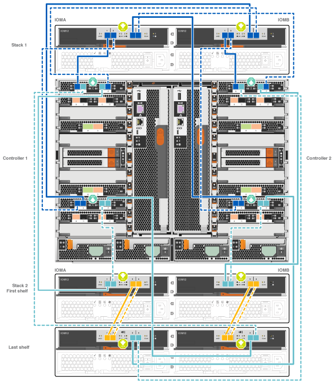
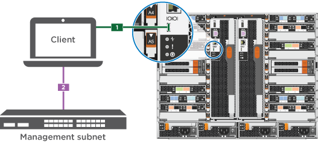

= Guía detallada: A700 y FAS9000 de AFF
:allow-uri-read: 
:icons: font
:imagesdir: ../media/

[role="lead"]
Esta guía ofrece instrucciones detalladas paso a paso para la instalación de un sistema típico de NetApp. Utilice esta guía si desea instrucciones de instalación más detalladas.

== Paso 1: Preparar la instalación

Para instalar el sistema, debe crear una cuenta en el sitio de soporte de NetApp, registrar el sistema y obtener claves de licencia. También es necesario realizar el inventario del número y tipo de cables adecuados para el sistema y recopilar información específica de la red.

.Antes de empezar
Es necesario tener acceso a Hardware Universe para obtener información sobre los requisitos del sitio, así como información adicional sobre el sistema configurado. También es posible que desee tener acceso a las notas de la versión de ONTAP para obtener más información sobre este sistema.

https://hwu.netapp.com["Hardware Universe de NetApp"]

http://mysupport.netapp.com/documentation/productlibrary/index.html?productID=62286["Busque las notas de la versión de ONTAP 9"]

Debe proporcionar lo siguiente en el sitio:

* Espacio en rack para el sistema de almacenamiento
* Destornillador Phillips número 2
* Cables de red adicionales para conectar el sistema al conmutador de red y al portátil o a la consola con un navegador Web

.Pasos
. Extraiga el contenido de todas las cajas.
. Registre el número de serie del sistema de las controladoras.
+
image::../media/drw_ssn_label.png[etiqueta ssn drw]

. Realice un inventario y anote el número y los tipos de cables recibidos.
+
En la siguiente tabla se identifican los tipos de cables que pueden recibir. Si recibe un cable no enumerado en la tabla, consulte la Hardware Universe para localizar el cable e identificar su uso.

+
https://hwu.netapp.com["Hardware Universe de NetApp"]

+
[cols="1,2,1,2"]
|===
| Tipo de cable... | Número de pieza y longitud | Tipo de conector | Durante... 

 a| 
Cable de red de 10 GbE
 a| 
X6566B-2-R6, (112-00299), 2 m

X6566B-3-R6, 112-00300, 3 m.

X6566B-5-R6, 112-00301, 5 m
 a| 
image:../media/oie_cable_sfp_gbe_copper.png[""]
 a| 
Cable de red

 a| 
Cable de red de 40 GbE

Interconexión en clúster de 40 GbE
 a| 
X66100-1,112-00542, 1 m.

X66100-3,112-00543, 3 m.
 a| 
image:../media/oie_cable100_gbe_qsfp28.png[""]
 a| 
Red 40 GbE

Interconexión en clúster

 a| 
Cable de red de 100 GbE

Cable de almacenamiento de 100 GbE
 a| 
X66211A-05 (112-00595), 0,5 m

X66211A-1 (112-00573), 1 m.

X66211A-2 (112-00574), 2 m

X66211A-5 (112-00574), 5 m
 a| 
image:../media/oie_cable100_gbe_qsfp28.png[""]
 a| 
Cable de red

Cable de almacenamiento

NOTE: Este cable sólo se aplica a AFF A700.

 a| 
Cables de red óptica (dependiendo del pedido)
 a| 
X6553-R6 (112-00188), 2 m

X6536-R6 (112-00090), 5 m
 a| 
image:../media/oie_cable_fiber_lc_connector.png[""]
 a| 
Red host FC

 a| 
Cat 6, RJ-45 (según pedido)
 a| 
Números de referencia X6585-R6 (112-00291), 3m

X6562-R6 (112-00196), 5 m
 a| 
image:../media/oie_cable_rj45.png[""]
 a| 
Red de gestión y datos Ethernet

 a| 
Reducida
 a| 
X66031A (112-00436), 1 m.

X66032A (112-00437), 2 m

X66033A (112-00438), 3 m.
 a| 
image:../media/oie_cable_mini_sas_hd_to_mini_sas_hd.png[""]
 a| 
Reducida

 a| 
Cable de consola Micro-USB
 a| 
No aplicable
 a| 
image:../media/oie_cable_micro_usb.png[""]
 a| 
Conexión de consola durante la configuración del software en un portátil/consola que no sea Windows o Mac

 a| 
Cables de alimentación
 a| 
No aplicable
 a| 
image:../media/oie_cable_power.png[""]
 a| 
Encendido del sistema

|===
. Consulte la _Guía de saturación de ONTAP de NetApp_ y recopile la información necesaria que aparece en la guía.
+
https://library.netapp.com/ecm/ecm_download_file/ECMLP2862613["Guía de configuración de ONTAP"]

== Paso 2: Instale el hardware

Debe instalar el sistema en un rack de 4 parantes o armario del sistema de NetApp, según corresponda.

.Pasos
. Instale los kits de raíles, según sea necesario.
. Instale y asegure el sistema siguiendo las instrucciones incluidas con el kit de raíl.
+

NOTE: Debe ser consciente de los problemas de seguridad asociados con el peso del sistema.

+
image::../media/drw_9000_lifting_icon.png[icono de elevación drw 9000]

NOTE: La etiqueta de la izquierda indica un chasis vacío, mientras que la etiqueta de la derecha indica un sistema completamente cargado.

. Conecte los dispositivos de administración de cables (como se muestra).
+
image::../media/drw_9000_cable_management_arms.png[brazos de gestión de cables drw 9000]

. Coloque el panel frontal en la parte delantera del sistema.

== Paso 3: Conecte los controladores a la red

Puede conectar las controladoras a la red mediante el método de clúster sin switch de dos nodos o mediante la red de interconexión de clúster.

=== Opción 1: Clúster sin switches de dos nodos

Los puertos de red de gestión, red de datos y gestión de las controladoras se conectan a los switches. Los puertos de interconexión de clúster se cablean en ambas controladoras.

Debe haberse puesto en contacto con el administrador de red para obtener información sobre la conexión del sistema a los switches.

Asegúrese de comprobar la dirección de las pestañas de contacto del cable al insertar los cables en los puertos. Las pestañas de cable están hacia arriba para todos los puertos del módulo de red.

image::../media/oie_cable_pull_tab_up.png[lengüeta para tirar del cable de la oie]

NOTE: Al insertar el conector, debería sentir que hace clic en su lugar; si no cree que hace clic, quítelo, gírelo y vuelva a intentarlo.

.Pasos
. Utilice la animación o la ilustración para completar el cableado entre las controladoras y los switches:
+
.Animación: Conectar un clúster sin switch de dos nodos
video::7a55b98a-e8b8-41d5-821f-ac5b0032ead0[panopto]

image::../media/drw_9000_TNSC_composite_cabling.png[Cableado compuesto drw 9000 TNSC]

. Vaya a. <<Paso 4: Conecte las controladoras a las bandejas de unidades>> para obtener instrucciones sobre el cableado de la bandeja de unidades.

=== Opción 2: Clúster de switches

Los puertos de red de gestión, red de datos y gestión de las controladoras se conectan a los switches. Los puertos de interconexión de clúster y alta disponibilidad están conectados mediante cable al switch de clúster/alta disponibilidad.

Debe haberse puesto en contacto con el administrador de red para obtener información sobre la conexión del sistema a los switches.

Asegúrese de comprobar la dirección de las pestañas de contacto del cable al insertar los cables en los puertos. Las pestañas de cable están hacia arriba para todos los puertos del módulo de red.

image::../media/oie_cable_pull_tab_up.png[lengüeta para tirar del cable de la oie]

NOTE: Al insertar el conector, debería sentir que hace clic en su lugar; si no cree que hace clic, quítelo, gírelo y vuelva a intentarlo.

.Pasos
. Utilice la animación o la ilustración para completar el cableado entre las controladoras y los switches:
+
.Animación: Cableado de clúster conmutado
video::6381b3f1-4ce5-4805-bd0a-ac5b0032f51d[panopto]

image:../media/drw_9000_switched_cluster_cabling.png[""]

. Vaya a. <<Paso 4: Conecte las controladoras a las bandejas de unidades>> para obtener instrucciones sobre el cableado de la bandeja de unidades.

== Paso 4: Conecte las controladoras a las bandejas de unidades

Puede cablear el nuevo sistema a las bandejas DS212C, DS224C o NS224, según sea un sistema AFF o FAS.

=== Opción 1: Conecte los cables de las controladoras a las bandejas de unidades DS212C o DS224C

Se deben cablear las conexiones de bandeja a bandeja y luego conectar ambas controladoras a las bandejas de unidades DS212C o DS224C.

Los cables se insertan en la bandeja de unidades con las pestañas tirar hacia abajo, mientras que el otro extremo del cable se inserta en los módulos de almacenamiento de la controladora con las pestañas hacia arriba.

image::../media/oie_cable_pull_tab_down.png[lengüeta del cable de la oie hacia abajo]

image::../media/oie_cable_pull_tab_up.png[lengüeta para tirar del cable de la oie]

.Pasos
. Utilice las animaciones o ilustraciones siguientes para cablear las bandejas de unidades a sus controladoras.
+

NOTE: Los ejemplos utilizan bandejas DS224C. El cableado es similar con otras bandejas de unidades SAS compatibles.

+
** Cableado de bandejas SAS en FAS9000, AFF A700 y ASA AFF A700, ONTAP 9.7 y versiones anteriores:

+
.Animación - almacenamiento SAS por cable - ONTAP 9.7 y anteriores
video::a312e09e-df56-47b3-9b5e-ab2300477f67[panopto]
+
image:../media/SAS_storage_ONTAP_9.7_and_earlier.png[""]

+
** Cableado de bandejas SAS en FAS9000, AFF A700 y ASA AFF A700, ONTAP 9.8 y posteriores:

+
.Animación - almacenamiento SAS por cable - ONTAP 9.8 y posterior
video::61d23302-9526-4a2b-9335-ac5b0032eafd[panopto]
+
image:../media/SAS_storage_ONTAP_9.8_and_later.png[""]

+

NOTE: Si posee más de un paquete de bandeja de unidades, consulte _Guía de instalación y cableado_ para el tipo de bandeja de unidades.

+
https://docs.netapp.com/us-en/ontap-systems/sas3/install-new-system.html["Instalación y cableado de las bandejas para una instalación nueva del sistema - bandejas con módulos IOM12"]

+

. Vaya a. <<Paso 5: Pasos completos para la instalación y la configuración del sistema>> para completar los procesos de instalación y configuración del sistema.

=== Opción 2: Conecte las controladoras a una única bandeja de unidades NS224 en sistemas A700 de AFF y ASA AFF A700 que solo ejecuten ONTAP 9.8 y versiones posteriores

Debe conectar cada controladora a los módulos NSM de la bandeja de unidades NS224 en un sistema A700 o ASA AFF A700 de AFF que ejecute ONTAP 9.8 o posterior.

* Esta tarea se aplica solo a A700 de AFF y A700 de ASA AFF que ejecuten ONTAP 9.8 o posterior.
* Los sistemas deben tener al menos un módulo X91148A instalado en las ranuras 3 y/o 7 para cada controlador. La animación o las ilustraciones muestran este módulo instalado en las ranuras 3 y 7.
* Asegúrese de comprobar que la flecha de la ilustración tenga la orientación correcta de la lengüeta de extracción del conector del cable. La pestaña desplegable del cable de los módulos de almacenamiento está hacia arriba, mientras que las pestañas de las bandejas están hacia abajo.
+
image::../media/oie_cable_pull_tab_up.png[lengüeta para tirar del cable de la oie]

+
image::../media/oie_cable_pull_tab_down.png[lengüeta del cable de la oie hacia abajo]

+

NOTE: Al insertar el conector, debería sentir que hace clic en su lugar; si no cree que hace clic, quítelo, gírelo y vuelva a intentarlo.

.Pasos
. Utilice las siguientes animaciones o ilustraciones para conectar los controladores con dos módulos de almacenamiento X91148A a una única bandeja de unidades NS224 o utilice el diagrama para conectar los controladores con un módulo de almacenamiento X91148A a una única bandeja de unidades NS224.
+
.Animación - conectar un solo estante NS224 - ONTAP 9.8 y posterior
video::6520eb01-87b3-4520-9109-ac5b0032ea4e[panopto]
+
image::../media/drw_ns224_a700_1shelf.png[drw ns224 a700 1estantería]

+
image::../media/single_NS224_shelf.png[Una única bandeja NS224]

. Vaya a. <<Paso 5: Pasos completos para la instalación y la configuración del sistema>> para completar los procesos de instalación y configuración del sistema.

=== Opción 3: Conecte los cables de las controladoras a dos bandejas de unidades NS224 en sistemas A700 de AFF y A700 de ASA AFF que ejecuten solo ONTAP 9.8 y versiones posteriores

Debe conectar cada controladora a los módulos NSM de las bandejas de unidades NS224 en un sistema A700 o ASA AFF A700 de AFF que ejecute ONTAP 9.8 o posterior.

* Esta tarea se aplica solo a A700 de AFF y A700 de ASA AFF que ejecuten ONTAP 9.8 o posterior.
* Los sistemas deben tener dos módulos X91148A, por controlador, instalados en las ranuras 3 y 7.
* Asegúrese de comprobar que la flecha de la ilustración tenga la orientación correcta de la lengüeta de extracción del conector del cable. La pestaña desplegable del cable de los módulos de almacenamiento está hacia arriba, mientras que las pestañas de las bandejas están hacia abajo.
+
image::../media/oie_cable_pull_tab_up.png[lengüeta para tirar del cable de la oie]

+
image::../media/oie_cable_pull_tab_down.png[lengüeta del cable de la oie hacia abajo]

+

NOTE: Al insertar el conector, debería sentir que hace clic en su lugar; si no cree que hace clic, quítelo, gírelo y vuelva a intentarlo.

.Pasos
. Utilice las siguientes animaciones o ilustraciones para conectar los controladores a dos bandejas de unidades NS224.
+
.Animación - cable de dos estantes NS224 - ONTAP 9.8 y posterior
video::34098e39-73ad-45de-9af7-ac5b0032ea9a[panopto]
+
image::../media/drw_ns224_a700_2shelves.png[drw ns224 a700 2 estantes]

+
image::../media/two_NS224_shelves.png[Dos bandejas NS224]

. Vaya a. <<Paso 5: Pasos completos para la instalación y la configuración del sistema>> para completar los procesos de instalación y configuración del sistema.

== Paso 5: Pasos completos para la instalación y la configuración del sistema

Puede completar la instalación y configuración del sistema mediante la detección de clústeres mediante una sola conexión al switch y el portátil, o bien conectarse directamente a una controladora del sistema y luego conectarse al switch de gestión.

=== Opción 1: Completar la configuración y la configuración del sistema si la detección de redes está activada

Si tiene la detección de red habilitada en el portátil, puede completar la configuración y la instalación del sistema mediante la detección automática del clúster.

.Pasos
. Utilice la animación siguiente para establecer uno o varios ID de bandeja de unidades:
+
Si el sistema tiene bandejas de unidades NS224, las bandejas se preconfigurados a los ID de bandeja 00 y 01. Si desea cambiar los ID de las bandejas, debe crear una herramienta para insertarla en el taladro donde se encuentra el botón.

+
.Animación: Configure los ID de bandeja de unidades SAS o NVMe
video::95a29da1-faa3-4ceb-8a0b-ac7600675aa6[panopto]
. Enchufe los cables de alimentación a las fuentes de alimentación de la controladora y luego conéctelos a fuentes de alimentación de diferentes circuitos.
. Encienda los switches de alimentación en ambos nodos.
+
.Animación: Active la alimentación de los controladores
video::bb04eb23-aa0c-4821-a87d-ab2300477f8b[panopto]
+

NOTE: El arranque inicial puede tardar hasta ocho minutos.

. Asegúrese de que el ordenador portátil tiene activado el descubrimiento de red.
+
Consulte la ayuda en línea de su portátil para obtener más información.

. Utilice la siguiente animación para conectar el portátil al conmutador de administración.
+
.Animación: Conecte el portátil al conmutador de administración
video::d61f983e-f911-4b76-8b3a-ab1b0066909b[panopto]
. Seleccione un icono de ONTAP que aparece para detectar:
+
image::../media/drw_autodiscovery_controler_select.png[selección del controlador de detección automática drw]

+
.. Abra el Explorador de archivos.
.. Haga clic en red en el panel izquierdo.
.. Haga clic con el botón derecho del ratón y seleccione Actualizar.
.. Haga doble clic en el icono de ONTAP y acepte los certificados que aparecen en la pantalla.
+

NOTE: XXXXX es el número de serie del sistema para el nodo de destino.

+
Se abrirá System Manager.

. Utilice la configuración guiada de System Manager para configurar el sistema con los datos recogidos en la _Guía de configuración de ONTAP_ de NetApp.
+
https://library.netapp.com/ecm/ecm_download_file/ECMLP2862613["Guía de configuración de ONTAP"]

. Configure su cuenta y descargue Active IQ Config Advisor:
+
.. Inicie sesión en su cuenta existente o cree una cuenta.
+
https://mysupport.netapp.com/eservice/public/now.do["Registro de soporte de NetApp"]

.. Registre su sistema.
+
https://mysupport.netapp.com/eservice/registerSNoAction.do?moduleName=RegisterMyProduct["Registro de productos de NetApp"]

.. Descargue Active IQ Config Advisor.
+
https://mysupport.netapp.com/site/tools/tool-eula/activeiq-configadvisor["Descargas de NetApp: Config Advisor"]

. Compruebe el estado del sistema ejecutando Config Advisor.
. Después de completar la configuración inicial, vaya a la https://www.netapp.com/data-management/oncommand-system-documentation/["Recursos de documentación de ONTAP  ONTAP System Manager"] Página para obtener información sobre cómo configurar las funciones adicionales en ONTAP.

=== Opción 2: Completar la configuración y la configuración del sistema si la detección de red no está activada

Si el descubrimiento de red no está activado en el portátil, debe completar la configuración y la configuración mediante esta tarea.

.Pasos
. Conecte y configure el portátil o la consola:
+
.. Ajuste el puerto de la consola del portátil o de la consola en 115,200 baudios con N-8-1.
+

NOTE: Consulte la ayuda en línea del portátil o de la consola para saber cómo configurar el puerto de la consola.

.. Conecte el cable de consola al portátil o a la consola mediante el cable de consola incluido con el sistema y, a continuación, conecte el portátil al conmutador de administración de la subred de administración .
+

.. Asigne una dirección TCP/IP al portátil o consola, utilizando una que esté en la subred de gestión.

. Utilice la animación siguiente para establecer uno o varios ID de bandeja de unidades:
+
Si el sistema tiene bandejas de unidades NS224, las bandejas se preconfigurados a los ID de bandeja 00 y 01. Si desea cambiar los ID de las bandejas, debe crear una herramienta para insertarla en el taladro donde se encuentra el botón.

+
.Animación: Configure los ID de bandeja de unidades SAS o NVMe
video::95a29da1-faa3-4ceb-8a0b-ac7600675aa6[panopto]
. Enchufe los cables de alimentación a las fuentes de alimentación de la controladora y luego conéctelos a fuentes de alimentación de diferentes circuitos.
. Encienda los switches de alimentación en ambos nodos.
+
.Animación: Active la alimentación de los controladores
video::bb04eb23-aa0c-4821-a87d-ab2300477f8b[panopto]
+

NOTE: El arranque inicial puede tardar hasta ocho minutos.

. Asigne una dirección IP de gestión de nodos inicial a uno de los nodos.
+
[cols="1,3"]
|===
| Si la red de gestión tiene DHCP... | Realice lo siguiente... 

 a| 
Configurado
 a| 
Registre la dirección IP asignada a las nuevas controladoras.

 a| 
No configurado
 a| 
.. Abra una sesión de consola mediante PuTTY, un servidor terminal o el equivalente para su entorno.
+

NOTE: Si no sabe cómo configurar PuTTY, compruebe la ayuda en línea del ordenador portátil o de la consola.

.. Introduzca la dirección IP de administración cuando se lo solicite el script.

|===
. Mediante System Manager en el portátil o la consola, configure su clúster:
+
.. Dirija su navegador a la dirección IP de gestión de nodos.
+

NOTE: El formato de la dirección es +https://x.x.x.x.+

.. Configure el sistema con los datos recogidos en la _Guía de configuración de ONTAP_ de NetApp.
+
https://library.netapp.com/ecm/ecm_download_file/ECMLP2862613["Guía de configuración de ONTAP"]

. Configure su cuenta y descargue Active IQ Config Advisor:
+
.. Inicie sesión en su cuenta existente o cree una cuenta.
+
https://mysupport.netapp.com/eservice/public/now.do["Registro de soporte de NetApp"]

.. Registre su sistema.
+
https://mysupport.netapp.com/eservice/registerSNoAction.do?moduleName=RegisterMyProduct["Registro de productos de NetApp"]

.. Descargue Active IQ Config Advisor.
+
https://mysupport.netapp.com/site/tools/tool-eula/activeiq-configadvisor["Descargas de NetApp: Config Advisor"]

. Compruebe el estado del sistema ejecutando Config Advisor.
. Después de completar la configuración inicial, vaya a la https://www.netapp.com/data-management/oncommand-system-documentation/["Recursos de documentación de ONTAP  ONTAP System Manager"] Página para obtener información sobre cómo configurar las funciones adicionales en ONTAP.

