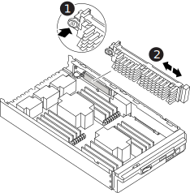

= Retire la controladora, sustituya el soporte de arranque y transfiera la imagen de arranque - FAS9500
:allow-uri-read: 

[role="lead"]
Debe quitar y abrir el módulo de la controladora, localizar y sustituir los medios de arranque en la controladora y, a continuación, transferir la imagen al medio de arranque de reemplazo.

== Paso 1: Extraiga el módulo del controlador

Para acceder a los componentes del interior del controlador, primero debe extraer el módulo del controlador del sistema y, a continuación, retirar la cubierta del módulo del controlador.

.Pasos
. Si usted no está ya conectado a tierra, correctamente tierra usted mismo.
. Desenchufe los cables del módulo del controlador dañado y haga un seguimiento de dónde se conectaron los cables.
. Deslice el botón terra cotta del asa de la leva hacia abajo hasta que se desbloquee.
+
.Animación: Retire el módulo del controlador
video::5e029a19-8acc-4fa1-be5d-ae78004b365a[panopto]
+
image::../media/drw_9500_remove_PCM_source.svg[Quite la controladora]

+
[cols="1,2"]
|===

 a| 
image::../media/icon_round_1.png[Número de llamada 1]
 a| 
Botón de liberación de la palanca de leva

 a| 
image::../media/icon_round_2.png[Número de llamada 2]
 a| 
Mango de leva

|===
. Gire el asa de leva para que desacople completamente el módulo del controlador del chasis y, a continuación, deslice el módulo del controlador para sacarlo del chasis.
+
Asegúrese de que admite la parte inferior del módulo de la controladora cuando la deslice para sacarlo del chasis.

. Coloque el lado de la tapa del módulo del controlador hacia arriba sobre una superficie plana y estable, pulse el botón azul de la cubierta, deslice la cubierta hacia la parte posterior del módulo del controlador y, a continuación, gire la cubierta hacia arriba y levántela fuera del módulo del controlador.
+
image::../media/drw_9500_PCM_open_source.svg[Quite la controladora]

[cols="1,2"]
|===

 a| 
image::../media/icon_round_1.png[Número de llamada 1]
 a| 
Botón de bloqueo de la cubierta del módulo del controlador

|===

== Paso 2: Sustituya el soporte de arranque

Debe localizar el soporte de arranque en la controladora y seguir las instrucciones para su reemplazo.

.Pasos
. Levante el conducto de aire negro situado en la parte posterior del módulo del controlador y, a continuación, localice el soporte del maletero mediante la siguiente ilustración o el mapa de FRU en el módulo del controlador:
+
.Animación: Reemplace el soporte de arranque
video::16df490c-f94f-498d-bb04-ae78004b3781[panopto]
+

+
[cols="1,2"]
|===

 a| 
image:../media/icon_round_1.png["Número de llamada 1"]
 a| 
Presione la lengüeta de liberación

 a| 
image:../media/icon_round_2.png["Número de llamada 2"]
 a| 
Soporte de arranque

|===
. Pulse el botón azul de la carcasa del soporte de arranque para liberar el soporte de arranque de su carcasa y, a continuación, tire suavemente de él hacia fuera del zócalo del soporte de arranque.
+

NOTE: No gire ni tire del soporte de arranque en línea recta, ya que podría dañar la toma o el soporte de arranque.

. Alinee los bordes del soporte de arranque de repuesto con el zócalo del soporte de arranque y, a continuación, empújelo suavemente en el zócalo.
. Compruebe el soporte del maletero para asegurarse de que está asentado completamente en la toma.
+
Si es necesario, extraiga el soporte de arranque y vuelva a colocarlo en la toma.

. Empuje el soporte del maletero hacia abajo para activar el botón de bloqueo en la carcasa del soporte del maletero.
. Vuelva a instalar la tapa del módulo del controlador alineando los pasadores de la tapa con las ranuras del soporte de la placa base y, a continuación, deslice la tapa en su lugar.

== Paso 3: Transfiera la imagen de arranque al soporte de arranque

Puede instalar la imagen del sistema en el soporte de arranque de repuesto mediante una unidad flash USB con la imagen instalada en ella. Sin embargo, debe restaurar el `var` sistema de archivos durante este procedimiento.

.Antes de empezar
* Debe tener una unidad flash USB, formateada con FAT32, con una capacidad mínima de 4 GB.
* Una copia de la misma versión de imagen de ONTAP que la controladora dañada en funcionamiento. Puede descargar la imagen adecuada en la sección Descargas del sitio de soporte de NetApp
+
** Si NVE está habilitado, descargue la imagen con el cifrado de volúmenes de NetApp, como se indica en el botón de descarga.
** Si el cifrado de volúmenes de NetApp no está habilitado, descargue la imagen sin el cifrado de volúmenes de NetApp, como se indica en el botón de descarga.

* Si el sistema es independiente, no necesita una conexión de red, pero debe realizar un reinicio adicional al restaurar el sistema de archivos var.

.Pasos
. Alinee el extremo del módulo del controlador con la abertura del chasis y, a continuación, empuje suavemente el módulo del controlador hasta la mitad del sistema.
. Recuperar el módulo del controlador, según sea necesario.
. Inserte la unidad flash USB en la ranura USB del módulo de controlador.
+
Asegúrese de instalar la unidad flash USB en la ranura indicada para dispositivos USB, y no en el puerto de consola USB.

. Empuje completamente el módulo del controlador en el sistema, asegurándose de que el mango de la leva borra la unidad flash USB, empuje firmemente el asa de la leva para terminar de sentarse el módulo del controlador y, a continuación, empuje el asa de la leva hasta la posición cerrada.
+
El nodo empieza a arrancar en cuanto se instala por completo en el chasis.

. Interrumpa el proceso de arranque para que se detenga en el símbolo del SISTEMA DEL CARGADOR pulsando Ctrl-C cuando vea iniciando AUTOBOOT, pulse Ctrl-C para cancelar....
+
Si pierde este mensaje, pulse Ctrl-C, seleccione la opción de arrancar en modo de mantenimiento y, a continuación, detenga el nodo para arrancar en EL CARGADOR.

. Aunque se conservan las variables de entorno y los bootargs, debe comprobar que todas las variables de entorno de arranque y los bootargs necesarios están correctamente definidos para el tipo de sistema y la configuración mediante el `printenv bootarg name` comando y corrija los errores mediante el `setenv variable-name <value>` comando.
+
.. Compruebe las variables de entorno de arranque:
+
*** bootarg.init.boot_clustered
*** partner-sysid
*** bootarg.init.flash_optimized para AFF
*** bootarg.init.san_optimized para AFF
*** bootarg.init.switchless_cluster.enable

.. Si el Administrador de claves externo está activado, compruebe los valores de bootarg que aparecen en la `kenv` Salida de ASUP:
+
*** bootarg.storageencryption.support <value>
*** bootarg.keymanager.support <value>
*** kmip.init.interface <value>
*** kmip.init.ipaddr <value>
*** kmip.init.netmask <value>
*** kmip.init.gateway <value>

.. Si Onboard Key Manager está habilitado, compruebe los valores de bootarg que se muestran en la `kenv` Salida de ASUP:
+
*** bootarg.storageencryption.support <value>
*** bootarg.keymanager.support <value>
*** bootarg.onboard_keymanager <value>

.. Guarde las variables de entorno modificadas con el `savenv` comando
.. Confirme los cambios mediante el `printenv variable-name` comando.

. Si la controladora está en una MetroCluster con ampliación o conexión a la estructura, debe restaurar la configuración del adaptador de FC:
+
.. Arranque en modo de mantenimiento: `boot_ontap maint`
.. Establezca los puertos MetroCluster como iniciadores: `ucadmin modify -m fc -t iniitator adapter_name`
.. Detener para volver al modo de mantenimiento: `halt`

+
Los cambios se implementarán al arrancar el sistema.

