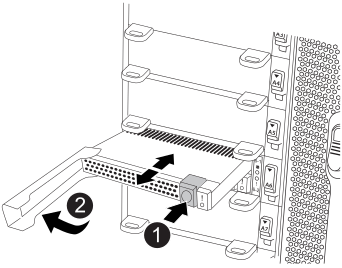

= Módulo de almacenamiento en caché de intercambio en caliente: FAS9500
:allow-uri-read: 
:icons: font
:imagesdir: ../media/

[role="lead"]
Los módulos Flash Cache de SSD de NVMe (Flash Cache o módulos de almacenamiento en caché) se encuentran en la parte delantera del módulo NVRAM11, en la ranura 6 de sistemas FAS9500. Puede intercambiar en caliente el módulo de almacenamiento en caché de la misma capacidad desde el mismo proveedor o desde el mismo proveedor compatible.

NOTE: Si necesita o desea intercambiar en frío el módulo Flash Cache, siga los procedimientos para sustituir un módulo de I/O.

.Antes de empezar
Su sistema de almacenamiento debe cumplir ciertos criterios según su situación:

* Debe tener el sistema operativo adecuado para el módulo de almacenamiento en caché que está instalando.
* El módulo de almacenamiento en caché debe estar funcionando lo suficientemente bien como para que el sistema lo vea. Si el módulo de almacenamiento en caché no funciona desde el último arranque, no podrá utilizar este procedimiento y deberá utilizar el procedimiento de intercambio en frío.
* Debe admitir la capacidad de almacenamiento en caché.
* El módulo de almacenamiento en caché de reemplazo debe tener la misma capacidad que el módulo de almacenamiento en caché con fallos, pero puede ser de un proveedor compatible diferente.
* Todos los demás componentes del sistema de almacenamiento deben funcionar correctamente; de lo contrario, debe comunicarse con el soporte técnico.

.Pasos
. Si usted no está ya conectado a tierra, correctamente tierra usted mismo.
. Localice el módulo de almacenamiento en caché que ha fallado, en la ranura 6, mediante el LED de atención ámbar iluminado en la parte frontal del módulo de almacenamiento en caché.
. Prepare la ranura del módulo de almacenamiento en caché para su sustitución de la siguiente manera:
+
.. Registre la capacidad, el número de pieza y el número de serie del módulo de almacenamiento en caché en el nodo de destino: `system node run local sysconfig -av 6`
.. En el nivel de privilegios de administrador, prepare la ranura NVMe de destino para su eliminación y responda `y` cuando se le pregunte si desea continuar: `system controller slot module remove -node node_name -slot slot_number` El siguiente comando prepara la ranura 6-1 en el nodo 1 para su extracción y muestra un mensaje que es seguro quitar:
+
[listing]
----
::> system controller slot module remove -node node1 -slot 6-1

Warning: SSD module in slot 6-1 of the node node1 will be powered off for removal.
Do you want to continue? (y|n): `y`

The module has been successfully removed from service and powered off. It can now be safely removed.
----
.. Muestra el estado de la ranura con `system controller slot module show` comando.
+
Se muestra el estado de la ranura NVMe `powered-off` en la pantalla de salida para el módulo de caché que necesita reemplazar.

+

NOTE: Consulte https://docs.netapp.com/us-en/ontap-cli-9121/["Páginas manuales de comandos"^] Para su versión de ONTAP para obtener más información.

. Retire el módulo de almacenamiento en caché:
+

+
[cols="20%,80%"]
|===

 a| 
image::../media/legend_icon_01.svg[icono de leyenda 01]
 a| 
Botón de liberación de Terra cotta.

 a| 
image::../media/legend_icon_02.svg[icono de leyenda 02]
 a| 
Asa de leva del módulo de almacenamiento en caché.

|===
+
.. Pulse el botón de liberación terracota en la parte frontal del módulo de caché.
+

NOTE: No utilice el pestillo de leva de E/S numerado y con letras para expulsar el módulo de caché. El pestillo de leva de E/S numerado y con letras expulsa todo el módulo NVRAM11 y no el módulo de caché.

.. Gire el identificador de leva hasta que el módulo de almacenamiento en caché comience a deslizarse fuera del módulo NVRAM11.
.. Tire suavemente del mango de leva hacia usted para retirar el módulo de almacenamiento en caché del módulo NVRAM11.
+
Asegúrese de admitir el módulo de almacenamiento en caché cuando lo quite del módulo NVRAM11.

. Instale el módulo de almacenamiento en caché:
+
.. Alinee los bordes del módulo de almacenamiento en caché con la abertura del módulo NVRAM11.
.. Empuje suavemente el módulo de almacenamiento en caché en el compartimento hasta que el mango de la leva se acople.
.. Gire el mango de la leva hasta que encaje en su sitio.

. Utilice el para conectar el módulo de almacenamiento en caché de sustitución `system controller slot module insert` comando de la siguiente manera:
+
El siguiente comando prepara la ranura 6-1 del nodo 1 para el encendido y muestra un mensaje que indica que está encendida:

+
[listing]
----
::> system controller slot module insert -node node1 -slot 6-1

Warning: NVMe module in slot 6-1 of the node localhost will be powered on and initialized.
Do you want to continue? (y|n): `y`

The module has been successfully powered on, initialized and placed into service.
----
. Compruebe el estado de la ranura mediante `system controller slot module show` comando.
+
Asegúrese de que el resultado del comando informa el estado de la como `powered-on` y listo para el funcionamiento.

. Compruebe que el módulo de almacenamiento en caché de sustitución está conectado y reconocido y, a continuación, compruebe visualmente que el LED de atención ámbar no está encendido: `sysconfig -av slot_number`
+

NOTE: Si sustituye el módulo de almacenamiento en caché por un módulo de almacenamiento en caché de otro proveedor, el nombre del nuevo proveedor se muestra en el resultado del comando.

. Devuelva la pieza que ha fallado a NetApp, como se describe en las instrucciones de RMA que se suministran con el kit. Consulte https://mysupport.netapp.com/site/info/rma["Retorno de artículo  sustituciones"^] para obtener más información.

