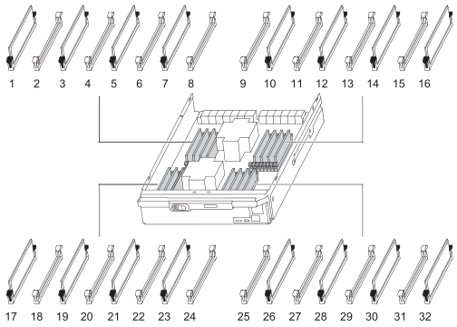

= Sustituya un módulo DIMM - FAS9500
:allow-uri-read: 
:icons: font
:imagesdir: ../media/

[role="lead"]
Debe sustituir un DIMM en la controladora cuando el sistema de almacenamiento encuentra errores como, por ejemplo, errores excesivos de CECC (códigos de corrección de errores corregibles) basados en alertas de supervisión de estado o errores de ECC no corregibles, normalmente causados por un único fallo de DIMM que impide que el sistema de almacenamiento arranque ONTAP.

.Antes de empezar
Todos los demás componentes del sistema deben funcionar correctamente; si no es así, debe ponerse en contacto con el soporte técnico.

Debe sustituir el componente con errores por un componente FRU de repuesto que haya recibido de su proveedor.

== Paso 1: Apague el nodo dañado

Para apagar el controlador dañado, debe determinar el estado del controlador y, si es necesario, tomar el control para que el controlador sano siga sirviendo datos del almacenamiento del controlador dañado.

.Acerca de esta tarea
* Si dispone de un sistema SAN, debe haber comprobado los mensajes de evento  `cluster kernel-service show`) para el blade SCSI de la controladora dañada.  `cluster kernel-service show`El comando (desde el modo avanzado priv) muestra el nombre del nodo, link:https://docs.netapp.com/us-en/ontap/system-admin/display-nodes-cluster-task.html["estado del quórum"] de ese nodo, el estado de disponibilidad de ese nodo y el estado operativo de ese nodo.
+
Cada proceso SCSI-blade debe quórum con los otros nodos del clúster. Todos los problemas deben resolverse antes de continuar con el reemplazo.

* Si tiene un clúster con más de dos nodos, debe estar en quórum. Si el clúster no tiene quórum o si una controladora en buen estado muestra falso según su condición, debe corregir el problema antes de apagar la controladora dañada; consulte link:https://docs.netapp.com/us-en/ontap/system-admin/synchronize-node-cluster-task.html?q=Quorum["Sincronice un nodo con el clúster"^].

.Pasos
. Si AutoSupport está habilitado, elimine la creación automática de casos invocando un mensaje de AutoSupport:
+
`system node autosupport invoke -node * -type all -message MAINT=<# of hours>h`

+
El siguiente mensaje de AutoSupport suprime la creación automática de casos durante dos horas:

+
`cluster1:> system node autosupport invoke -node * -type all -message MAINT=2h`

. Desactivar devolución automática:
+
.. Ingrese el siguiente comando desde la consola del controlador en buen estado:
+
`storage failover modify -node local -auto-giveback false`

.. Ingresar `y` cuando vea el mensaje "¿Desea desactivar la devolución automática?"

. Lleve la controladora dañada al aviso DEL CARGADOR:
+
[cols="1,2"]
|===
| Si el controlador dañado está mostrando... | Realice lo siguiente... 

 a| 
El aviso del CARGADOR
 a| 
Vaya al paso siguiente.

 a| 
Esperando devolución...
 a| 
Pulse Ctrl-C y, a continuación, responda `y` cuando se le solicite.

 a| 
Solicitud del sistema o solicitud de contraseña
 a| 
Retome o detenga el controlador dañado del controlador en buen estado:

`storage failover takeover -ofnode _impaired_node_name_ -halt _true_`

El parámetro _-halt true_ lleva al símbolo del sistema de Loader.

|===

== Paso 2: Extraiga el módulo del controlador

Para acceder a los componentes del interior del controlador, primero debe extraer el módulo del controlador del sistema y, a continuación, retirar la cubierta del módulo del controlador.

.Pasos
. Si usted no está ya conectado a tierra, correctamente tierra usted mismo.
. Desenchufe los cables del módulo del controlador dañado y haga un seguimiento de dónde se conectaron los cables.
. Deslice el botón terra cotta del asa de la leva hacia abajo hasta que se desbloquee.
+
.Animación: Retire el controlador
video::5e029a19-8acc-4fa1-be5d-ae78004b365a[panopto]
+
image::../media/drw_9500_remove_PCM.svg[Quite la controladora]

+
[cols="20%,80%"]
|===

 a| 
image::../media/icon_round_1.png[Número de llamada 1]
 a| 
Botón de liberación de la palanca de leva

 a| 
image::../media/icon_round_2.png[Número de llamada 2]
 a| 
Mango de leva

|===
. Gire el asa de leva para que desacople completamente el módulo del controlador del chasis y, a continuación, deslice el módulo del controlador para sacarlo del chasis.
+
Asegúrese de que admite la parte inferior del módulo de la controladora cuando la deslice para sacarlo del chasis.

. Coloque el lado de la tapa del módulo del controlador hacia arriba sobre una superficie plana y estable, pulse el botón azul de la cubierta, deslice la cubierta hacia la parte posterior del módulo del controlador y, a continuación, gire la cubierta hacia arriba y levántela fuera del módulo del controlador.
+
image::../media/drw_9500_PCM_open.svg[Abra la controladora]

+
[cols="20%,80%"]
|===

 a| 
image::../media/icon_round_1.png[Número de llamada 1]
 a| 
Botón de bloqueo de la cubierta del módulo del controlador

|===

== Paso 3: Sustituya los módulos DIMM

Para sustituir los DIMM, búsquelos dentro del controlador y siga la secuencia específica de pasos.

NOTE: El controlador ver2 tiene menos sockets DIMM. No hay reducción en el número de módulos DIMM admitidos ni cambio en la numeración del socket DIMM. Al mover los módulos DIMM al nuevo módulo del controlador, instale los módulos DIMM en el mismo número/ubicación de socket que el módulo del controlador dañado.  Consulte el diagrama de asignación de FRU en el módulo de la controladora ver2 para ver la ubicación de los sockets DIMM.

.Pasos
. Si usted no está ya conectado a tierra, correctamente tierra usted mismo.
. Localice los DIMM en el módulo del controlador.
+

. Extraiga el DIMM de su ranura empujando lentamente las dos lengüetas expulsoras del DIMM a ambos lados del DIMM y, a continuación, extraiga el DIMM de la ranura.
+

IMPORTANT: Sujete con cuidado el módulo DIMM por los bordes para evitar la presión sobre los componentes de la placa de circuitos DIMM.

+
.Animación - Sustitución de módulos DIMM
video::d62a4c7c-8296-4d60-9981-ae78004b36f7[panopto]
+
image::../media/drw_9500_replace_PCM_dimms.svg[Reemplace los DIMM]

+
[cols="20%,80%"]
|===

 a| 
image::../media/icon_round_1.png[Número de llamada 1]
 a| 
Lengüetas del expulsor de DIMM

 a| 
image::../media/icon_round_2.png[Número de llamada 2]
 a| 
DIMM

|===
. Retire el módulo DIMM de repuesto de la bolsa de transporte antiestática, sujete el módulo DIMM por las esquinas y alinéelo con la ranura.
+
La muesca entre las patillas del DIMM debe alinearse con la lengüeta del zócalo.

. Asegúrese de que las lengüetas del expulsor DIMM del conector están en posición abierta y, a continuación, inserte el DIMM directamente en la ranura.
+
El módulo DIMM encaja firmemente en la ranura, pero debe entrar fácilmente. Si no es así, realinee el DIMM con la ranura y vuelva a insertarlo.

+

IMPORTANT: Inspeccione visualmente el módulo DIMM para comprobar que está alineado de forma uniforme y completamente insertado en la ranura.

. Empuje con cuidado, pero firmemente, en el borde superior del DIMM hasta que las lengüetas expulsoras encajen en su lugar sobre las muescas de los extremos del DIMM.
. Cierre la cubierta del módulo del controlador.

== Paso 4: Instale la controladora

Después de instalar los componentes en el módulo del controlador, debe volver a instalar el módulo del controlador en el chasis del sistema e iniciar el sistema operativo.

Para los pares de alta disponibilidad con dos módulos de controladora en el mismo chasis, la secuencia en la que se instala el módulo de controladora es especialmente importante porque intenta reiniciarse tan pronto como lo coloca por completo en el chasis.

.Pasos
. Si usted no está ya conectado a tierra, correctamente tierra usted mismo.
. Si aún no lo ha hecho, vuelva a colocar la cubierta del módulo del controlador.
+
image::../media/drw_9500_PCM_open.svg[Cerrar el controlador]

+
[cols="20%,80%"]
|===

 a| 
image::../media/icon_round_1.png[Número de llamada 1]
 a| 
Botón de bloqueo de la cubierta del módulo del controlador

|===
. Alinee el extremo del módulo del controlador con la abertura del chasis y, a continuación, empuje suavemente el módulo del controlador hasta la mitad del sistema.
+
.Animación: Instalar el controlador
video::f2aa14b4-0d95-4109-b410-ae78004b35c9[panopto]
+
image::../media/drw_9500_remove_PCM.svg[Quitar o instalar el controlador]

+
[cols="20%,80%"]
|===

 a| 
image::../media/icon_round_1.png[Número de llamada 1]
 a| 
Botón de liberación de la palanca de leva

 a| 
image::../media/icon_round_2.png[Número de llamada 2]
 a| 
Mango de leva

|===
+

NOTE: No inserte completamente el módulo de la controladora en el chasis hasta que se le indique hacerlo.

. Cablee los puertos de gestión y consola de manera que pueda acceder al sistema para realizar las tareas en las secciones siguientes.
+

NOTE: Conectará el resto de los cables al módulo del controlador más adelante en este procedimiento.

. Complete la reinstalación del módulo del controlador:
+
.. Si aún no lo ha hecho, vuelva a instalar el dispositivo de administración de cables.
.. Empuje firmemente el módulo de la controladora en el chasis hasta que se ajuste al plano medio y esté totalmente asentado.
+
Los pestillos de bloqueo se elevan cuando el módulo del controlador está completamente asentado.

+

IMPORTANT: No ejerza una fuerza excesiva al deslizar el módulo del controlador hacia el chasis para evitar dañar los conectores.

+
El módulo de la controladora comienza a arrancar tan pronto como se asienta completamente en el chasis.

.. Gire los pestillos de bloqueo hacia arriba, inclinándolos para que los pasadores de bloqueo se puedan separar y, a continuación, bajarlos hasta la posición de bloqueo.

== Paso 5: Devuelva la pieza que falló a NetApp

Devuelva la pieza que ha fallado a NetApp, como se describe en las instrucciones de RMA que se suministran con el kit. Consulte https://mysupport.netapp.com/site/info/rma["Devolución de piezas y sustituciones"] la página para obtener más información.
